## A3.7 Parallel Axis Theorem

In Fig. A3.2 let $I_y$
be the moment of inertia of the area referred to
the centroidal axis y-y, and let the moment of
inertia about axis $y_1 y_1$ be required. $y_1 y_1$ is
parallel to yy. Consider the elementary area dA
with distance x + d trom $y_1 y_1$.

Then, $I_{y_1} = \int (d + x)^2 dA =  \int x^2 dA + 2d \int x dA + d^2 \int dA$

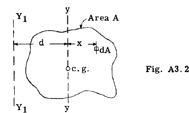

The first term, $\int x^2 dA$, represents the moment of inertia of the body about its centroidal 
axis y-y and will be given the symbol $\bar{I}$. The second term is zero because $\int x dA$ is zero since yy is the centroidal axis of the body. The 
last term, $d^2 \int dA = Ad^2$ or, area of body times 
the square of the distance between axes yy and $y_1 y_1$.

Thus in general,
$$
I = \bar{I} + Ad^2
$$

This expression states that the amount of
inertia of an area With respect to any axis in 
the plane of the area is equal to the moment of 
inertia of the area with respect to a parallel
centroidal axis plus the product of the area and 
the square of the distance between the two axes. 

### Parallel Axis Theorem For Masses. 

If instead of area 
area the mass of the body is considered, the
parallel axis can be written:

$$
I = \bar{I} + Md^2, \text{where M refers to the mass of the body}
$$

## A3.7a Mass Moments of Inertia

The product of
the mass of a particle and the square of its
distance from a line or plane is referred to as
the moment of inertia of the mass of the particle With respect to the line or plane. Hence,
$I = \sum Mr^2$. 

If the summation can be expressed by a definite integral, the expression may be
written $I = \int r^2 dM$

### Moments of Inertia of Airplanes. 

In both flying
and landing conditions the airplane may be subjected to angUlar accelerations. To determine
the magnitude of the accelerations as well as
the distribution and magnitude of the mass inertia resisting forces, the moment of inertia of
the airplane about the three coordinate axes is
generally required in making a stress analysis
of a particular airplane.
The mass moments of inertia of the airplane
about the coordinate X, Y and Z axes through the
center of gravity of the airplane can be expressed as follows:

$$
\begin{align*}
I_Z \sum wy^2 + \sum wz^2 + \sum \Delta I_x\\
I_y \sum wx^2 + \sum wz^2 + \sum \Delta I_y\\
I_z \sum wx^2 + \sum wy^2 + \sum \Delta I_z\\
\end{align*} 
$$

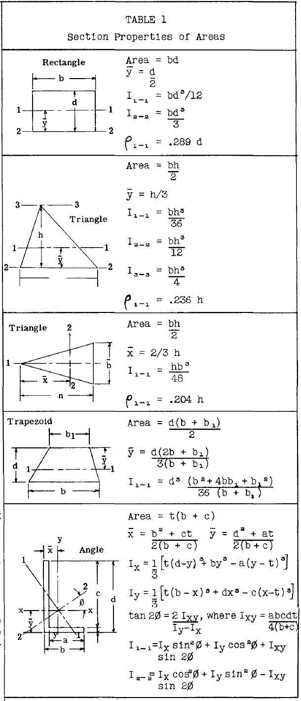

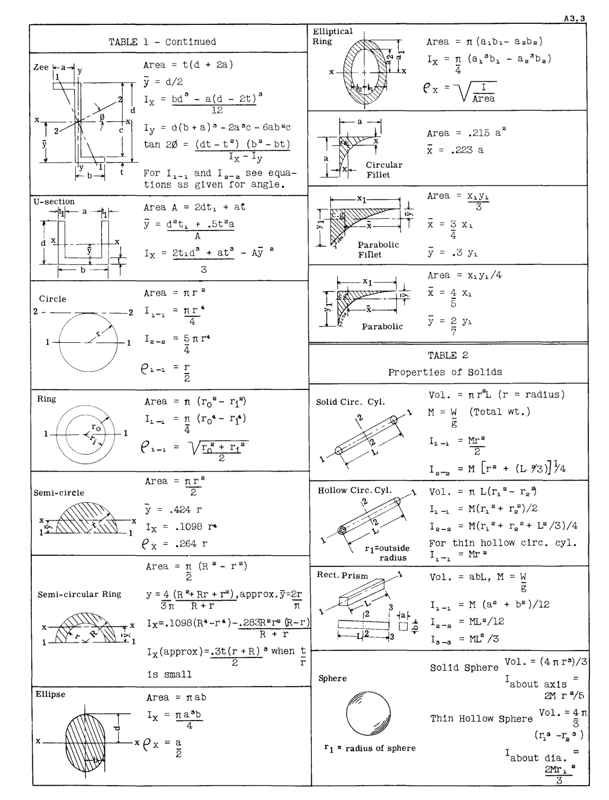

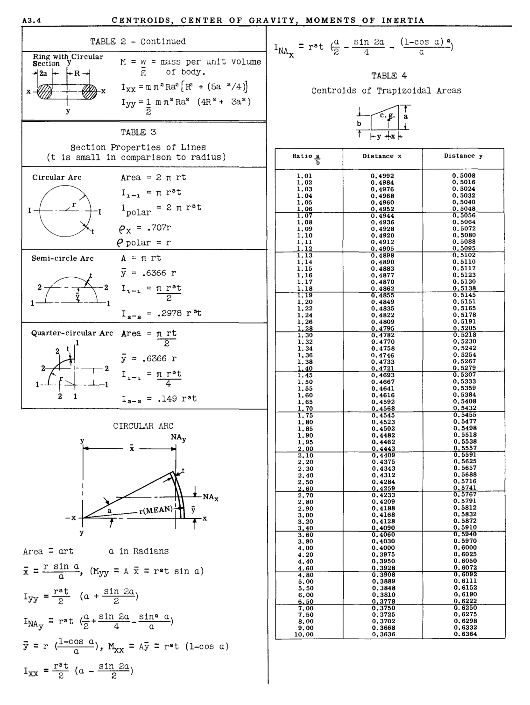

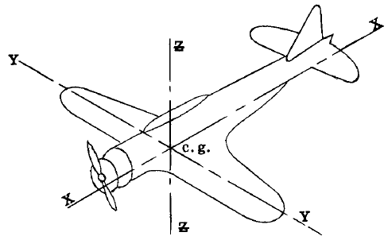

where $I_x, I_y$, and $I_z$ are generally referred to
as the rolling, pitching and yawing moments of
inertia of the airplane.

w = weight of the items in the airplane

x, y and z equal the distances from the
axes thru the center of gravity of the airplane
and the weights w. The last term in each equation is the summation of the moments of inertia
of the various items about their own X, Y and Z
centroidal axes.

If w is expressed in pounds and the distances in inches, the moment of inertia is expressed in units of pound-inches squared, which can
be converted into slug feet squared by multiplying by $1/32.16 \times 144$.

### Example Problem 1. 
Determine the gross weight
center of gravity of the airplane shown in Fig.
A3.3. The airplane weight has been broken down
into the 10 items or weight groups, with their
individual e.g. locations denoted by the symbol
+.

#### Solution. 
The airplane center of gravity will be
located with respect to two rectangular axes. In
this example, a vertical axis thru the centerline of the propeller will be selected as a reference axis for horizontal distances, and the
thrust line as a reference axis for vertical distances. The general expressions to be solved
are:-

$$
\begin{align*}
\bar{x} = \frac{\sum wx}{\sum w} = \text{distance to airplane e.g. from ref. axis Z-Z}\\
\bar{y} = \frac{\sum wy}{\sum w} =  \text{distance to airplane e.g. from ref. axis X-X}\\
\end{align*} 
$$

Table 4 gives the necessary calculations,
whenee

$$
\begin{align*}
\bar{x} = 417180/3150 = 133.3"  \text{aft of CL propeller}\\
\bar{y}= 5480/3150 = -1.74" \text{(below thrust line)}
\end{align*} 
$$

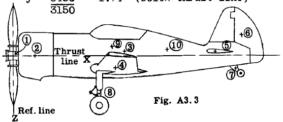

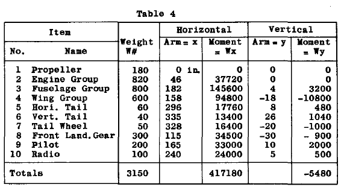

### Example Problem 2. 
Determine the moment of inertia about the horizontal centroidal axis for the
area shown in Fig. A3.4

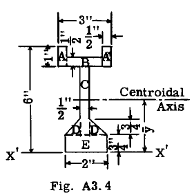

#### Solution. 
We first find the moment of inertia
about a horizontal reference axis. In this solution, this arbitrary axis has been taken as
axis x'x' thru the base as shown. Having this
moment of inertia, a transfer to the centroidal
axis can be made. Table 5 gives the detailed
calculations for the moment of inertia about
axis x'x'. For simplicity, the cross-section
has been divided into the five parts, namely, A,
B,C,D, and E.
$I_{cx}$ is moment of inertia about centroidal
x axis of the particular part being considered.
Distance from axis x'x' to centroidal horizontal
axis $= y = \frac{\sum Av}{\sum A} = \frac{17.97}{6.182} = 2.91"$

By parallel axis theorem, we transfer the
moment of inertia from axis x'x' to centroidal
axis xx.

$$
I_{xx} = I_{x'x'} - A\bar{y}^2= 79.47 - 6.18 \times 2.91^2 = 27.2 \text{ in.}
$$

Radius of Gyration, $P_{xx} = \sqrt{\frac{I_{xx}}{A}} = \sqrt{\frac{27.2}{6.18}} = 2.1"$

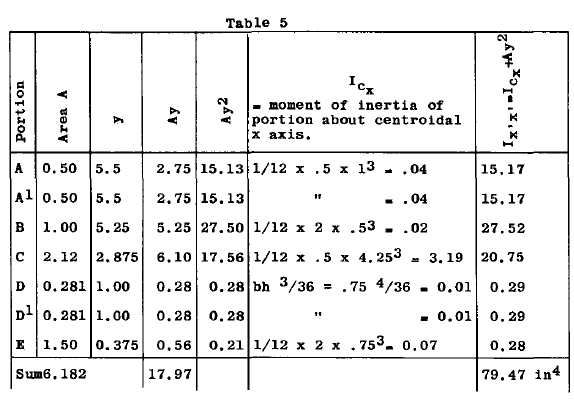

### Exampre Problem #3.

Determine the moment of inertia of the stringer cross seotion shown in
Fig. A3.5 about the horizontal centroidal axis.

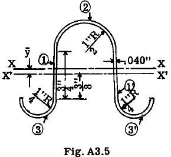

#### Solution.
A horizontal reference axis x'x' is
assumed as shown. The moment of inertia is
first calculated about this axis and then
transferred to the centroidal axis xx. See
Table 6.

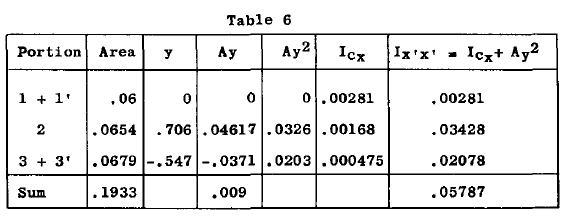

$$
\begin{align*}
\bar{y} = \frac{\sum Av}{\sum A} = \frac{.009}{.1933} = .0465"\\
I_{XX} = I_{X'X'} - A\bar{y}^2 = .05787 - .1933 \times (.0465)^2 = .05745 \text{ in.}\\
\text{Radius of gyration } \rho_{X-X} = \sqrt{\frac{.05745}{.1933}} = .55"\\
\end{align*} 
$$

Detailed explanation of Table 6:-

Portion 1 + 1'

$$
I_{cx} = \frac{1}{12} bd^3 = \frac{.04 \times \bar{.75}^3}{12} \times 2 = .00271 \text{ in.}
$$

Portion 2 (ref. table 1)

$$
y = .375 + \frac{4}{3 \pi} \frac{R^2 + Rr + r^2}{R+r} =  .375 + \frac{4}{3 \pi} \frac{\bar{.5}^2 + .5 \times .54 + .54^2}{.5+.54} = .375 + .331 = .706"
$$

By approx. method see Table 1.

$$
y = .375 + \frac{2}{\pi} r_1 = .375 + \frac{2}{\pi} \times (.52) = .706"
$$

$$
I_{CX} = .1098 \times (R^2 + r^2) t (R + r) - \frac{.283 R^2 + r^2 t}{R+r} = .1098(.2916+ .25) \times .04 \times 1.04- \frac{.283 \times .2916 \times .25 \times .04}{1.04} = .002475- .000793= .001682 \text{ in.}
$$

Approx. 

$$
I_{CX} = .3tr_1^3 = .3 \times .04 \times \bar{.52}^3 = .001688 \text{ in.}
$$

Portion 3 + 3' (ref. Table 1)

$$
y= .375+ \frac{4}{3 \pi} \times \frac{(.0841+ .0725 + .0625)}{.54} = .375 + .172 = .547"
$$

approx. 

$$
y= .375 + 2/\pi r_1 = .375 + .172=547"
$$

$$
I_{CX} = [.1098(.0841+ .0625) + .04 \times .54 - \frac{.283 \times .0841 \times .0625 \times .04}{.54}] = .002375
$$

approx. 

$$
I_{CX} = .3 \times .04 \times \bar{.27}^3 = .002365  \text{ in.}
$$

### Problem #4. 

Determine the moment of inertia of
the flywheel in Fig. A3.5a about axis of rotation.
The material is aluminum alloy casting (weight =
.1 lb. per cu. inch.)

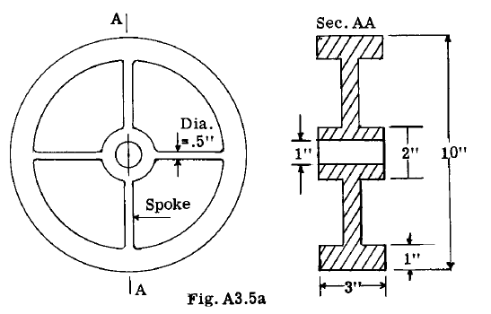

#### Solution: 

The spokes may be treated as slender
round rods and the rim and hub as hollow cylinders. (Refer to Table 2)

##### Rim,

$$
\begin{align*}
weight W = \pi(R^2 - r^2) \times 3 \times .1 = \pi(5^2-4^2) .3=8.48 \text{ lb.}\\
I = .5W(R^2+r^2)=.5 \times 8.48 (5^2+4^2) =
173.7 \text{ lb. }in.^2
\end{align*} 
$$

##### Hub,
$$
\begin{align*}
W = \pi(1^2 - .5^2) \times  3 \times .1 = .707 \\#\\
I = .5 \times .707 (1^2 + .5^2) = .44 \text{ lb.} in.^2
\end{align*} 
$$

##### Spokes,

$$
\begin{align*}
\text{Length of spoke} = 3"\\
\text{Weight of spoke} = 3 \times \pi \times .25^2 \times .1 = .588 \\#\\
I \text{ of one spoke } = WL^2/12 + W\bar{r}^2 = .588 \times 2.5^2 = 4.10 \text{ lb.} in^2\\
I \text{ for 4 spokes } = 4 \times 4.10 = 16.40
\end{align*} 
$$

Total I of wheel $= 16.40 + .44 + 173.7 = 190.54$
lb. $in^2$

$I = 190.54/32.16 \times 144 = .0411$ slug $ft.^2$

### Example Problem #5.

Moment of Inertia of an
Airplane.

To calculate the moment of inertia of an
airplane about the coordinate axes through the
gross weight center of gravity, a break down of
the airplane weight and its distribution is

4 R"+Rr+r"
3n R'l-r

(.5"+.5x.54+.54") =
(.5 + .54)

By approx. method see Table 1.

y = .375 + § r1 = .375 + §x (.52) = .706"

n n

lcx= .1098x (R"+r") t (R+r)   - .283 R"+r"t

R + r

.:: .1098(.2916+ .25) x .04x1.04

.283 x .2916 x .25 x .04
1.04

= .002475- .000793= .001682 in~.
_3
Approx. lcx = .3tr13 = .3x .04x.52 = .00l688in [6 ] 

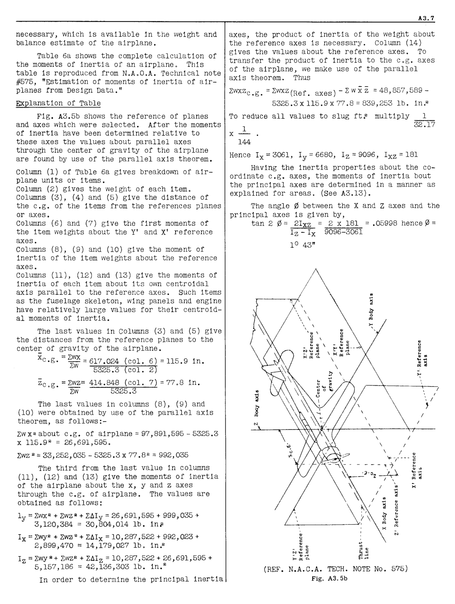

necessary, which is available in the weight and
balance estimate of the airplane.

Table 6a shows the complete calculation of
the moments of inertia of an airplaneo This
table is reproduced from N.AoO.A. Technical note
#575, "Estimation of moments of inertia of airplanes from Design Data."

Explanation of Table

Fig. A3.5b shows the reference of planes
and axes which were selected. After the moments
of inertia have been determined relative to
these axes the values &bout parallel axes
through the center of gravity of the airplane
are found by use of the parallel axis theorem.

Column (1) of Table 6a gives breakdown of airplane units or items.
Column (2) gives the weight of each itemo
Columns (3), (4) and (5) give the distance of
the c.g. of the items from the references planes

or axes.
Columns (6) and (7) give the first moments of
the item weights about the Y' and X' reference

axes.
Columns (8), (9) and (10) give the moment of
inertia of the item weights about the reference

axes.
Columns (11), (12) and (13) give the moments of
inertia of each item about its own centroidal
axis parallel to the reference axes. Such items
as the fuselage skeleton, wing panels and engine
have relatively large values for their centroidal moments of inertia.

The last values in Columns (3) and (5) give
the distances from the reference planes to the
center of gravity of the airplane.

x = Zwx
c.g. -=617.024 (col. 6) =115.9 in.

Zw 5325.3 (col. 2)

Zc og. = Zwz= 414.848 (col. 7) = 7708 in.

ZW 5325.3

The last values in columns (8), (9) and
(10) were obtained by use of the parallel axis
theorem, as follows:
zwx [2] about c.g. of airplane =97,891,595-5325.3
x 115.9 [2 ] = 26,691,5950

Zwz 2= 33,252,035 - 5325 .3 x 77.8 [2 ] = 992, 035

The third from the last value in columns
(11), (12) and (13) give the moments of inertia
of the airplane about the x, y and z axes
through the c.g o of airplane. The values are
obtained as follows:

ly = Zwx [2] + Zwz [2] + Z~Iy = 26,691,595 + 999,035 +
3,120,384 = 30,804,014 lb. in~

Ix = Zwy2 + ZW\32 + Z~Ix = 10,287,522 + 992,023 +
2,899,470 = 14,179,027 Ib o in. [2]

Iz = Zwy 2 + Zwz" + Z~Iz = 10,287,522 + 26,691,595 +
5,157,186 = 42,136,303 lb. in. [2]

In order to determine the principal inertia

A3.7

axes, the product of inertia of the weight about
the reference axes is necessary. Column (14)
gives the values about the reference axes. To
transfer the product of inertia to the cog. axes
of the airplane, we make use of the parallel
axis theorem. Thus

zwxz c .g. =ZWXZ(Ref. axes) -Zwxz =48,857,5895325.3x1l5.9x77.8=839,253 lb. in. [2]

To reduce all values to slug ft~ mUltiply

1
x
144

1

32.17

Hence Ix = 3061, Iy = 6680, I z = 9096, I xz = 181

Having the inertia properties about the coordinate c.g. axes, the moments of inertia bout
the principal axes are determined in a manner as
explained for areas. (See A3.13).
The angle 0 between the X and Z axes and the
principal axes is given by,
tan 2 0 = 2I xz = 2 x 181 =.05998 hence lO =
Iz - Ix 9096-3061

1 [0] 43"

\

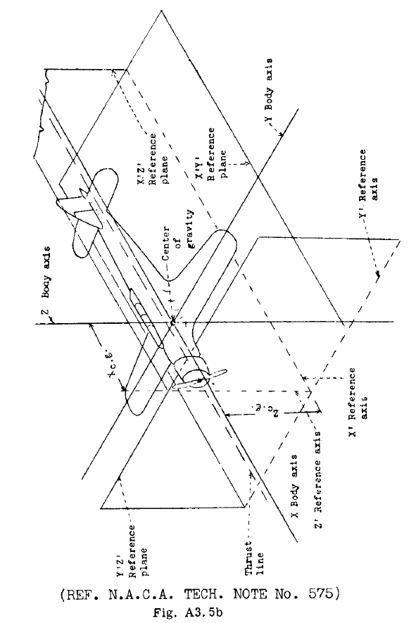

(REF. N.A.C.A. TECH. NOTE No. 575)

Fig. A3.5b

A3.8 CENTROIDS, C ENTER OF GRAVITY, MOMENTS OF INERTIA

Table 6a

CO~PUTATIONS OF MOMENTS OF INERTIA

Xc.g. Zl c.g.

|1.|2.|3.|4.|5.|6.|7.|8.|9.|10.|11.|12.|13.|14.|
|---|---|---|---|---|---|---|---|---|---|---|---|---|---|
|Item|Weight|x|Y |I:|WX|WI:|wx2|wy2 |w..2|lllX|6Iy |6Iz|WXI:|
|Zl  Center sect10n 108.8 102 ~~-~~ 57 11,098 6,202 1,131,955 ~~-~~ 353,491 261,229 nose assel!lbly Center ssction 204.6 121 - 57 24,757 11,662 2,995,549 - 664,745 491,245 beam, etc. Center section 84.2 148 - 55 12,462 4,631 1,844,317 - 254,705 202,164 ribs, etc. Flap 2a.0 180 - 53 3,960 1,166 712,800 - 61,798 48,598 Outer panel** nose** 104.6 105 166 65 10,983 6,799 1,153,215 2,545,546 441,935 184,514 Outer panel beam 155.5 120 156 65 18,672 10,114 2,240,640 3,786,682 657,410 274,478 Outer panel ribs 89.8 139 156 64 12,482 5,747 1,735,026 2,185,373 367,821 158,407 Ailerons 31.4 172 156 62 5,401 1,947 928,938 764,150 120,702 55,390 Horizontal tail 87.1 367 - 96.7 31,966 8,423 11,731,412 - 814,463 176,378 Vertical tail 31.4 352 - 125 11,053 3,925 3,890,586 - 490,625 110,200 Fueelage skele- 314.0 176 - 81 55,264 25,434 9,726,464 - 2,060,154 69,394 ton Engine mount 40.5 60 - 80 2,430 3,240 145,800 - 259,200 5,184 Turtleback 48.5 254 - 80 12,319 3,880 3,129,026 - 310,400 15,181 ( fairing) Firewall 11.0 70 - 80 770 880 53,900 - 70,400 2,200 Steps 2.0 170 20 70 340 140 57,800 800 9,800 - ~.A.C.A. cowling 70.0 50 - 80 3,500 5,600 175,000 - 448,000 16,940 Cabin and 66.5 146 - 108 9,709 7,182 1,417,514 - 775,656 2,394 Windshield Foot troughs 2.0 77 5 68 154 136 11,858 50 ·9,248 - Floor, rear 9.5 210 - 66 1,995 627 418,950 - 41,382 608 Wing fillets 18.5 142 20 58 2,627 1,073 373,034 7,400 62,234 - Bottom cowling 27.0 140 11 75 3,780 2,025 529,200 3,267 151,875 - and side frames Arresting door 1.3 284 - 63 369 82 104,853 - 5,160 5 Tail-woeel pan, 4.0 365 - 84 1,480 336 532,900 - 28,224 100 etc. Side doors 17.0 143 18 82 2,431 1,394 347,633 5,508 114,308 1,088 Baggage door 1.8 165 - 63 297 113 49,005 - 7,144 720 Fabric and dope 13.0 254 - 80 3,302 1,040 838,708 - 83,200 4,394 Tail cone 7.5 385 - 91 2,888 683 1,111,688 - 62,108 120 Cowling, sta- 12.0 110 - 95 1,320 1,140 145,200 - 108,300 1,200 tions 1-2 Chassis (re- 232.4 115 54 51 26,726 11,852 3,073,490 677,678 604,472 - tracted) Retracting mech- 28.6 110 25 67 3,146 1,916 346,060 17,875 128,385 - anism Wheels, etc. 91.0 141 54 56 12,831 5,096 1,809,171 265,356 285,376 - Tail wheel 26.0 360 - 74 9,360 1,924 3,369,600 - 142,376 26 Engine 1049.0 33 - 80 34,617 83,920 1,142,361 - 6,713,600 253,858 Engine acces- 90.6 52 - 83 4,711 7,520 244,982 - 624,143 9,060 sorills Engins controls 11.0 103 10 76 1,133 836 116,699 1,100 63,536 - Propeller 222.0 9.3 - 80 2,065 17,760 19,201 - 1,420,300 177,600 Starting system 37.0 56 - 85 2,072 3,145 116,032 - 267,325 148 LUbricating ays- 26.0 69 - 82 1,794 2,132 123,786 - 174,824 1,274 tem ~'uel system 82.0 128 - 80 10,496 6,560 1,343,488 - 524,300 22,058 Instruments 38.0 102 - 92 3,876 3,496 395,352 - 321,632 2,432 Surface con- 81.5 160 - 71 13,040 5,787 2,086,400 - 410,842 123,962 troIs Furni shings 160.0 156 - 80 24,960 12,800 3,893,760 - 1,024,000 108,160 Electrical 100.7 128 15 81 12,890 8,157 1,649,869 22,658 660,693 - equipment Hoist sling 6.0 115 - 102 690 612 79,350 - 62,424 864 --- --- ---- AIRP.LAHi DlPTY 3867.4 106.6 0 74.8 412,196 289,138 67,342,573 10,283,443 22,263,736 2,681,572 Pilot 200.0 105 - 90 21,000 18,000 2,205,000 - 1,620,000 33,800 Observer 200.0 205 - 89 41,000 17,800 8,405,000 - 1,584,200 33,800 Fuel 780.0 132 - 85.5 102,960 66,690 13,590,720 - 5,701,995 141,180 Oil 75.0 71 - 85 5,325 6,375 378,075 - 541,875 3,675 Very Pistol 3.9 195 14 75 761 293 148,298 764 21,938 - Smoke candles 4.0 184 14 96 736 384 135,424 784 36,864 - Float lights 9.0 190 14 72 1,710 648 324,900 1,764 46,656 - Radio 142.7 178 - 85 25,401 12,130 4,521,307 - 1,031,008 5,137 Chart board, etc 3.7 80 3 94 296 348 23,680 33 32,693 - Drift sigt,t 1.6 222 14 84 355 134 78,854 314 11,290 - First aid 4.0 165 10 57 660 228 108,900 400 12,996 - Life raft 34.0 136 - 101 4,624 3,434 628,864 - 346,834 306 --- USEFUL LOAD 1457.9 140.5 0 86.7 204,828 126,464 30,549,022 4,079 10,988,299 217,898 --- --~~-~~ TOTALS 5325.3 617,024 414,848 97,891,595 10,287,522 ~252,035 2,899,470 CORRECTION 5325.3 115.9 0 77.8 r71~~•~~2OO,ooO °r32.260.000 I I 1~~26,691,595 ~~10,287,522, 992,035 I 1 I I 10,287,522  I I I I 992.035 I I I - I I I I 14,179,027  k2 • I I I I I 2,662 1< • I I I I I 51.8 I|Zl  Center sect10n 108.8 102 ~~-~~ 57 11,098 6,202 1,131,955 ~~-~~ 353,491 261,229 nose assel!lbly Center ssction 204.6 121 - 57 24,757 11,662 2,995,549 - 664,745 491,245 beam, etc. Center section 84.2 148 - 55 12,462 4,631 1,844,317 - 254,705 202,164 ribs, etc. Flap 2a.0 180 - 53 3,960 1,166 712,800 - 61,798 48,598 Outer panel** nose** 104.6 105 166 65 10,983 6,799 1,153,215 2,545,546 441,935 184,514 Outer panel beam 155.5 120 156 65 18,672 10,114 2,240,640 3,786,682 657,410 274,478 Outer panel ribs 89.8 139 156 64 12,482 5,747 1,735,026 2,185,373 367,821 158,407 Ailerons 31.4 172 156 62 5,401 1,947 928,938 764,150 120,702 55,390 Horizontal tail 87.1 367 - 96.7 31,966 8,423 11,731,412 - 814,463 176,378 Vertical tail 31.4 352 - 125 11,053 3,925 3,890,586 - 490,625 110,200 Fueelage skele- 314.0 176 - 81 55,264 25,434 9,726,464 - 2,060,154 69,394 ton Engine mount 40.5 60 - 80 2,430 3,240 145,800 - 259,200 5,184 Turtleback 48.5 254 - 80 12,319 3,880 3,129,026 - 310,400 15,181 ( fairing) Firewall 11.0 70 - 80 770 880 53,900 - 70,400 2,200 Steps 2.0 170 20 70 340 140 57,800 800 9,800 - ~.A.C.A. cowling 70.0 50 - 80 3,500 5,600 175,000 - 448,000 16,940 Cabin and 66.5 146 - 108 9,709 7,182 1,417,514 - 775,656 2,394 Windshield Foot troughs 2.0 77 5 68 154 136 11,858 50 ·9,248 - Floor, rear 9.5 210 - 66 1,995 627 418,950 - 41,382 608 Wing fillets 18.5 142 20 58 2,627 1,073 373,034 7,400 62,234 - Bottom cowling 27.0 140 11 75 3,780 2,025 529,200 3,267 151,875 - and side frames Arresting door 1.3 284 - 63 369 82 104,853 - 5,160 5 Tail-woeel pan, 4.0 365 - 84 1,480 336 532,900 - 28,224 100 etc. Side doors 17.0 143 18 82 2,431 1,394 347,633 5,508 114,308 1,088 Baggage door 1.8 165 - 63 297 113 49,005 - 7,144 720 Fabric and dope 13.0 254 - 80 3,302 1,040 838,708 - 83,200 4,394 Tail cone 7.5 385 - 91 2,888 683 1,111,688 - 62,108 120 Cowling, sta- 12.0 110 - 95 1,320 1,140 145,200 - 108,300 1,200 tions 1-2 Chassis (re- 232.4 115 54 51 26,726 11,852 3,073,490 677,678 604,472 - tracted) Retracting mech- 28.6 110 25 67 3,146 1,916 346,060 17,875 128,385 - anism Wheels, etc. 91.0 141 54 56 12,831 5,096 1,809,171 265,356 285,376 - Tail wheel 26.0 360 - 74 9,360 1,924 3,369,600 - 142,376 26 Engine 1049.0 33 - 80 34,617 83,920 1,142,361 - 6,713,600 253,858 Engine acces- 90.6 52 - 83 4,711 7,520 244,982 - 624,143 9,060 sorills Engins controls 11.0 103 10 76 1,133 836 116,699 1,100 63,536 - Propeller 222.0 9.3 - 80 2,065 17,760 19,201 - 1,420,300 177,600 Starting system 37.0 56 - 85 2,072 3,145 116,032 - 267,325 148 LUbricating ays- 26.0 69 - 82 1,794 2,132 123,786 - 174,824 1,274 tem ~'uel system 82.0 128 - 80 10,496 6,560 1,343,488 - 524,300 22,058 Instruments 38.0 102 - 92 3,876 3,496 395,352 - 321,632 2,432 Surface con- 81.5 160 - 71 13,040 5,787 2,086,400 - 410,842 123,962 troIs Furni shings 160.0 156 - 80 24,960 12,800 3,893,760 - 1,024,000 108,160 Electrical 100.7 128 15 81 12,890 8,157 1,649,869 22,658 660,693 - equipment Hoist sling 6.0 115 - 102 690 612 79,350 - 62,424 864 --- --- ---- AIRP.LAHi DlPTY 3867.4 106.6 0 74.8 412,196 289,138 67,342,573 10,283,443 22,263,736 2,681,572 Pilot 200.0 105 - 90 21,000 18,000 2,205,000 - 1,620,000 33,800 Observer 200.0 205 - 89 41,000 17,800 8,405,000 - 1,584,200 33,800 Fuel 780.0 132 - 85.5 102,960 66,690 13,590,720 - 5,701,995 141,180 Oil 75.0 71 - 85 5,325 6,375 378,075 - 541,875 3,675 Very Pistol 3.9 195 14 75 761 293 148,298 764 21,938 - Smoke candles 4.0 184 14 96 736 384 135,424 784 36,864 - Float lights 9.0 190 14 72 1,710 648 324,900 1,764 46,656 - Radio 142.7 178 - 85 25,401 12,130 4,521,307 - 1,031,008 5,137 Chart board, etc 3.7 80 3 94 296 348 23,680 33 32,693 - Drift sigt,t 1.6 222 14 84 355 134 78,854 314 11,290 - First aid 4.0 165 10 57 660 228 108,900 400 12,996 - Life raft 34.0 136 - 101 4,624 3,434 628,864 - 346,834 306 --- USEFUL LOAD 1457.9 140.5 0 86.7 204,828 126,464 30,549,022 4,079 10,988,299 217,898 --- --~~-~~ TOTALS 5325.3 617,024 414,848 97,891,595 10,287,522 ~252,035 2,899,470 CORRECTION 5325.3 115.9 0 77.8 r71~~•~~2OO,ooO °r32.260.000 I I 1~~26,691,595 ~~10,287,522, 992,035 I 1 I I 10,287,522  I I I I 992.035 I I I - I I I I 14,179,027  k2 • I I I I I 2,662 1< • I I I I I 51.8 I|Zl  Center sect10n 108.8 102 ~~-~~ 57 11,098 6,202 1,131,955 ~~-~~ 353,491 261,229 nose assel!lbly Center ssction 204.6 121 - 57 24,757 11,662 2,995,549 - 664,745 491,245 beam, etc. Center section 84.2 148 - 55 12,462 4,631 1,844,317 - 254,705 202,164 ribs, etc. Flap 2a.0 180 - 53 3,960 1,166 712,800 - 61,798 48,598 Outer panel** nose** 104.6 105 166 65 10,983 6,799 1,153,215 2,545,546 441,935 184,514 Outer panel beam 155.5 120 156 65 18,672 10,114 2,240,640 3,786,682 657,410 274,478 Outer panel ribs 89.8 139 156 64 12,482 5,747 1,735,026 2,185,373 367,821 158,407 Ailerons 31.4 172 156 62 5,401 1,947 928,938 764,150 120,702 55,390 Horizontal tail 87.1 367 - 96.7 31,966 8,423 11,731,412 - 814,463 176,378 Vertical tail 31.4 352 - 125 11,053 3,925 3,890,586 - 490,625 110,200 Fueelage skele- 314.0 176 - 81 55,264 25,434 9,726,464 - 2,060,154 69,394 ton Engine mount 40.5 60 - 80 2,430 3,240 145,800 - 259,200 5,184 Turtleback 48.5 254 - 80 12,319 3,880 3,129,026 - 310,400 15,181 ( fairing) Firewall 11.0 70 - 80 770 880 53,900 - 70,400 2,200 Steps 2.0 170 20 70 340 140 57,800 800 9,800 - ~.A.C.A. cowling 70.0 50 - 80 3,500 5,600 175,000 - 448,000 16,940 Cabin and 66.5 146 - 108 9,709 7,182 1,417,514 - 775,656 2,394 Windshield Foot troughs 2.0 77 5 68 154 136 11,858 50 ·9,248 - Floor, rear 9.5 210 - 66 1,995 627 418,950 - 41,382 608 Wing fillets 18.5 142 20 58 2,627 1,073 373,034 7,400 62,234 - Bottom cowling 27.0 140 11 75 3,780 2,025 529,200 3,267 151,875 - and side frames Arresting door 1.3 284 - 63 369 82 104,853 - 5,160 5 Tail-woeel pan, 4.0 365 - 84 1,480 336 532,900 - 28,224 100 etc. Side doors 17.0 143 18 82 2,431 1,394 347,633 5,508 114,308 1,088 Baggage door 1.8 165 - 63 297 113 49,005 - 7,144 720 Fabric and dope 13.0 254 - 80 3,302 1,040 838,708 - 83,200 4,394 Tail cone 7.5 385 - 91 2,888 683 1,111,688 - 62,108 120 Cowling, sta- 12.0 110 - 95 1,320 1,140 145,200 - 108,300 1,200 tions 1-2 Chassis (re- 232.4 115 54 51 26,726 11,852 3,073,490 677,678 604,472 - tracted) Retracting mech- 28.6 110 25 67 3,146 1,916 346,060 17,875 128,385 - anism Wheels, etc. 91.0 141 54 56 12,831 5,096 1,809,171 265,356 285,376 - Tail wheel 26.0 360 - 74 9,360 1,924 3,369,600 - 142,376 26 Engine 1049.0 33 - 80 34,617 83,920 1,142,361 - 6,713,600 253,858 Engine acces- 90.6 52 - 83 4,711 7,520 244,982 - 624,143 9,060 sorills Engins controls 11.0 103 10 76 1,133 836 116,699 1,100 63,536 - Propeller 222.0 9.3 - 80 2,065 17,760 19,201 - 1,420,300 177,600 Starting system 37.0 56 - 85 2,072 3,145 116,032 - 267,325 148 LUbricating ays- 26.0 69 - 82 1,794 2,132 123,786 - 174,824 1,274 tem ~'uel system 82.0 128 - 80 10,496 6,560 1,343,488 - 524,300 22,058 Instruments 38.0 102 - 92 3,876 3,496 395,352 - 321,632 2,432 Surface con- 81.5 160 - 71 13,040 5,787 2,086,400 - 410,842 123,962 troIs Furni shings 160.0 156 - 80 24,960 12,800 3,893,760 - 1,024,000 108,160 Electrical 100.7 128 15 81 12,890 8,157 1,649,869 22,658 660,693 - equipment Hoist sling 6.0 115 - 102 690 612 79,350 - 62,424 864 --- --- ---- AIRP.LAHi DlPTY 3867.4 106.6 0 74.8 412,196 289,138 67,342,573 10,283,443 22,263,736 2,681,572 Pilot 200.0 105 - 90 21,000 18,000 2,205,000 - 1,620,000 33,800 Observer 200.0 205 - 89 41,000 17,800 8,405,000 - 1,584,200 33,800 Fuel 780.0 132 - 85.5 102,960 66,690 13,590,720 - 5,701,995 141,180 Oil 75.0 71 - 85 5,325 6,375 378,075 - 541,875 3,675 Very Pistol 3.9 195 14 75 761 293 148,298 764 21,938 - Smoke candles 4.0 184 14 96 736 384 135,424 784 36,864 - Float lights 9.0 190 14 72 1,710 648 324,900 1,764 46,656 - Radio 142.7 178 - 85 25,401 12,130 4,521,307 - 1,031,008 5,137 Chart board, etc 3.7 80 3 94 296 348 23,680 33 32,693 - Drift sigt,t 1.6 222 14 84 355 134 78,854 314 11,290 - First aid 4.0 165 10 57 660 228 108,900 400 12,996 - Life raft 34.0 136 - 101 4,624 3,434 628,864 - 346,834 306 --- USEFUL LOAD 1457.9 140.5 0 86.7 204,828 126,464 30,549,022 4,079 10,988,299 217,898 --- --~~-~~ TOTALS 5325.3 617,024 414,848 97,891,595 10,287,522 ~252,035 2,899,470 CORRECTION 5325.3 115.9 0 77.8 r71~~•~~2OO,ooO °r32.260.000 I I 1~~26,691,595 ~~10,287,522, 992,035 I 1 I I 10,287,522  I I I I 992.035 I I I - I I I I 14,179,027  k2 • I I I I I 2,662 1< • I I I I I 51.8 I|Zl  Center sect10n 108.8 102 ~~-~~ 57 11,098 6,202 1,131,955 ~~-~~ 353,491 261,229 nose assel!lbly Center ssction 204.6 121 - 57 24,757 11,662 2,995,549 - 664,745 491,245 beam, etc. Center section 84.2 148 - 55 12,462 4,631 1,844,317 - 254,705 202,164 ribs, etc. Flap 2a.0 180 - 53 3,960 1,166 712,800 - 61,798 48,598 Outer panel** nose** 104.6 105 166 65 10,983 6,799 1,153,215 2,545,546 441,935 184,514 Outer panel beam 155.5 120 156 65 18,672 10,114 2,240,640 3,786,682 657,410 274,478 Outer panel ribs 89.8 139 156 64 12,482 5,747 1,735,026 2,185,373 367,821 158,407 Ailerons 31.4 172 156 62 5,401 1,947 928,938 764,150 120,702 55,390 Horizontal tail 87.1 367 - 96.7 31,966 8,423 11,731,412 - 814,463 176,378 Vertical tail 31.4 352 - 125 11,053 3,925 3,890,586 - 490,625 110,200 Fueelage skele- 314.0 176 - 81 55,264 25,434 9,726,464 - 2,060,154 69,394 ton Engine mount 40.5 60 - 80 2,430 3,240 145,800 - 259,200 5,184 Turtleback 48.5 254 - 80 12,319 3,880 3,129,026 - 310,400 15,181 ( fairing) Firewall 11.0 70 - 80 770 880 53,900 - 70,400 2,200 Steps 2.0 170 20 70 340 140 57,800 800 9,800 - ~.A.C.A. cowling 70.0 50 - 80 3,500 5,600 175,000 - 448,000 16,940 Cabin and 66.5 146 - 108 9,709 7,182 1,417,514 - 775,656 2,394 Windshield Foot troughs 2.0 77 5 68 154 136 11,858 50 ·9,248 - Floor, rear 9.5 210 - 66 1,995 627 418,950 - 41,382 608 Wing fillets 18.5 142 20 58 2,627 1,073 373,034 7,400 62,234 - Bottom cowling 27.0 140 11 75 3,780 2,025 529,200 3,267 151,875 - and side frames Arresting door 1.3 284 - 63 369 82 104,853 - 5,160 5 Tail-woeel pan, 4.0 365 - 84 1,480 336 532,900 - 28,224 100 etc. Side doors 17.0 143 18 82 2,431 1,394 347,633 5,508 114,308 1,088 Baggage door 1.8 165 - 63 297 113 49,005 - 7,144 720 Fabric and dope 13.0 254 - 80 3,302 1,040 838,708 - 83,200 4,394 Tail cone 7.5 385 - 91 2,888 683 1,111,688 - 62,108 120 Cowling, sta- 12.0 110 - 95 1,320 1,140 145,200 - 108,300 1,200 tions 1-2 Chassis (re- 232.4 115 54 51 26,726 11,852 3,073,490 677,678 604,472 - tracted) Retracting mech- 28.6 110 25 67 3,146 1,916 346,060 17,875 128,385 - anism Wheels, etc. 91.0 141 54 56 12,831 5,096 1,809,171 265,356 285,376 - Tail wheel 26.0 360 - 74 9,360 1,924 3,369,600 - 142,376 26 Engine 1049.0 33 - 80 34,617 83,920 1,142,361 - 6,713,600 253,858 Engine acces- 90.6 52 - 83 4,711 7,520 244,982 - 624,143 9,060 sorills Engins controls 11.0 103 10 76 1,133 836 116,699 1,100 63,536 - Propeller 222.0 9.3 - 80 2,065 17,760 19,201 - 1,420,300 177,600 Starting system 37.0 56 - 85 2,072 3,145 116,032 - 267,325 148 LUbricating ays- 26.0 69 - 82 1,794 2,132 123,786 - 174,824 1,274 tem ~'uel system 82.0 128 - 80 10,496 6,560 1,343,488 - 524,300 22,058 Instruments 38.0 102 - 92 3,876 3,496 395,352 - 321,632 2,432 Surface con- 81.5 160 - 71 13,040 5,787 2,086,400 - 410,842 123,962 troIs Furni shings 160.0 156 - 80 24,960 12,800 3,893,760 - 1,024,000 108,160 Electrical 100.7 128 15 81 12,890 8,157 1,649,869 22,658 660,693 - equipment Hoist sling 6.0 115 - 102 690 612 79,350 - 62,424 864 --- --- ---- AIRP.LAHi DlPTY 3867.4 106.6 0 74.8 412,196 289,138 67,342,573 10,283,443 22,263,736 2,681,572 Pilot 200.0 105 - 90 21,000 18,000 2,205,000 - 1,620,000 33,800 Observer 200.0 205 - 89 41,000 17,800 8,405,000 - 1,584,200 33,800 Fuel 780.0 132 - 85.5 102,960 66,690 13,590,720 - 5,701,995 141,180 Oil 75.0 71 - 85 5,325 6,375 378,075 - 541,875 3,675 Very Pistol 3.9 195 14 75 761 293 148,298 764 21,938 - Smoke candles 4.0 184 14 96 736 384 135,424 784 36,864 - Float lights 9.0 190 14 72 1,710 648 324,900 1,764 46,656 - Radio 142.7 178 - 85 25,401 12,130 4,521,307 - 1,031,008 5,137 Chart board, etc 3.7 80 3 94 296 348 23,680 33 32,693 - Drift sigt,t 1.6 222 14 84 355 134 78,854 314 11,290 - First aid 4.0 165 10 57 660 228 108,900 400 12,996 - Life raft 34.0 136 - 101 4,624 3,434 628,864 - 346,834 306 --- USEFUL LOAD 1457.9 140.5 0 86.7 204,828 126,464 30,549,022 4,079 10,988,299 217,898 --- --~~-~~ TOTALS 5325.3 617,024 414,848 97,891,595 10,287,522 ~252,035 2,899,470 CORRECTION 5325.3 115.9 0 77.8 r71~~•~~2OO,ooO °r32.260.000 I I 1~~26,691,595 ~~10,287,522, 992,035 I 1 I I 10,287,522  I I I I 992.035 I I I - I I I I 14,179,027  k2 • I I I I I 2,662 1< • I I I I I 51.8 I|Zl  Center sect10n 108.8 102 ~~-~~ 57 11,098 6,202 1,131,955 ~~-~~ 353,491 261,229 nose assel!lbly Center ssction 204.6 121 - 57 24,757 11,662 2,995,549 - 664,745 491,245 beam, etc. Center section 84.2 148 - 55 12,462 4,631 1,844,317 - 254,705 202,164 ribs, etc. Flap 2a.0 180 - 53 3,960 1,166 712,800 - 61,798 48,598 Outer panel** nose** 104.6 105 166 65 10,983 6,799 1,153,215 2,545,546 441,935 184,514 Outer panel beam 155.5 120 156 65 18,672 10,114 2,240,640 3,786,682 657,410 274,478 Outer panel ribs 89.8 139 156 64 12,482 5,747 1,735,026 2,185,373 367,821 158,407 Ailerons 31.4 172 156 62 5,401 1,947 928,938 764,150 120,702 55,390 Horizontal tail 87.1 367 - 96.7 31,966 8,423 11,731,412 - 814,463 176,378 Vertical tail 31.4 352 - 125 11,053 3,925 3,890,586 - 490,625 110,200 Fueelage skele- 314.0 176 - 81 55,264 25,434 9,726,464 - 2,060,154 69,394 ton Engine mount 40.5 60 - 80 2,430 3,240 145,800 - 259,200 5,184 Turtleback 48.5 254 - 80 12,319 3,880 3,129,026 - 310,400 15,181 ( fairing) Firewall 11.0 70 - 80 770 880 53,900 - 70,400 2,200 Steps 2.0 170 20 70 340 140 57,800 800 9,800 - ~.A.C.A. cowling 70.0 50 - 80 3,500 5,600 175,000 - 448,000 16,940 Cabin and 66.5 146 - 108 9,709 7,182 1,417,514 - 775,656 2,394 Windshield Foot troughs 2.0 77 5 68 154 136 11,858 50 ·9,248 - Floor, rear 9.5 210 - 66 1,995 627 418,950 - 41,382 608 Wing fillets 18.5 142 20 58 2,627 1,073 373,034 7,400 62,234 - Bottom cowling 27.0 140 11 75 3,780 2,025 529,200 3,267 151,875 - and side frames Arresting door 1.3 284 - 63 369 82 104,853 - 5,160 5 Tail-woeel pan, 4.0 365 - 84 1,480 336 532,900 - 28,224 100 etc. Side doors 17.0 143 18 82 2,431 1,394 347,633 5,508 114,308 1,088 Baggage door 1.8 165 - 63 297 113 49,005 - 7,144 720 Fabric and dope 13.0 254 - 80 3,302 1,040 838,708 - 83,200 4,394 Tail cone 7.5 385 - 91 2,888 683 1,111,688 - 62,108 120 Cowling, sta- 12.0 110 - 95 1,320 1,140 145,200 - 108,300 1,200 tions 1-2 Chassis (re- 232.4 115 54 51 26,726 11,852 3,073,490 677,678 604,472 - tracted) Retracting mech- 28.6 110 25 67 3,146 1,916 346,060 17,875 128,385 - anism Wheels, etc. 91.0 141 54 56 12,831 5,096 1,809,171 265,356 285,376 - Tail wheel 26.0 360 - 74 9,360 1,924 3,369,600 - 142,376 26 Engine 1049.0 33 - 80 34,617 83,920 1,142,361 - 6,713,600 253,858 Engine acces- 90.6 52 - 83 4,711 7,520 244,982 - 624,143 9,060 sorills Engins controls 11.0 103 10 76 1,133 836 116,699 1,100 63,536 - Propeller 222.0 9.3 - 80 2,065 17,760 19,201 - 1,420,300 177,600 Starting system 37.0 56 - 85 2,072 3,145 116,032 - 267,325 148 LUbricating ays- 26.0 69 - 82 1,794 2,132 123,786 - 174,824 1,274 tem ~'uel system 82.0 128 - 80 10,496 6,560 1,343,488 - 524,300 22,058 Instruments 38.0 102 - 92 3,876 3,496 395,352 - 321,632 2,432 Surface con- 81.5 160 - 71 13,040 5,787 2,086,400 - 410,842 123,962 troIs Furni shings 160.0 156 - 80 24,960 12,800 3,893,760 - 1,024,000 108,160 Electrical 100.7 128 15 81 12,890 8,157 1,649,869 22,658 660,693 - equipment Hoist sling 6.0 115 - 102 690 612 79,350 - 62,424 864 --- --- ---- AIRP.LAHi DlPTY 3867.4 106.6 0 74.8 412,196 289,138 67,342,573 10,283,443 22,263,736 2,681,572 Pilot 200.0 105 - 90 21,000 18,000 2,205,000 - 1,620,000 33,800 Observer 200.0 205 - 89 41,000 17,800 8,405,000 - 1,584,200 33,800 Fuel 780.0 132 - 85.5 102,960 66,690 13,590,720 - 5,701,995 141,180 Oil 75.0 71 - 85 5,325 6,375 378,075 - 541,875 3,675 Very Pistol 3.9 195 14 75 761 293 148,298 764 21,938 - Smoke candles 4.0 184 14 96 736 384 135,424 784 36,864 - Float lights 9.0 190 14 72 1,710 648 324,900 1,764 46,656 - Radio 142.7 178 - 85 25,401 12,130 4,521,307 - 1,031,008 5,137 Chart board, etc 3.7 80 3 94 296 348 23,680 33 32,693 - Drift sigt,t 1.6 222 14 84 355 134 78,854 314 11,290 - First aid 4.0 165 10 57 660 228 108,900 400 12,996 - Life raft 34.0 136 - 101 4,624 3,434 628,864 - 346,834 306 --- USEFUL LOAD 1457.9 140.5 0 86.7 204,828 126,464 30,549,022 4,079 10,988,299 217,898 --- --~~-~~ TOTALS 5325.3 617,024 414,848 97,891,595 10,287,522 ~252,035 2,899,470 CORRECTION 5325.3 115.9 0 77.8 r71~~•~~2OO,ooO °r32.260.000 I I 1~~26,691,595 ~~10,287,522, 992,035 I 1 I I 10,287,522  I I I I 992.035 I I I - I I I I 14,179,027  k2 • I I I I I 2,662 1< • I I I I I 51.8 I|Zl  Center sect10n 108.8 102 ~~-~~ 57 11,098 6,202 1,131,955 ~~-~~ 353,491 261,229 nose assel!lbly Center ssction 204.6 121 - 57 24,757 11,662 2,995,549 - 664,745 491,245 beam, etc. Center section 84.2 148 - 55 12,462 4,631 1,844,317 - 254,705 202,164 ribs, etc. Flap 2a.0 180 - 53 3,960 1,166 712,800 - 61,798 48,598 Outer panel** nose** 104.6 105 166 65 10,983 6,799 1,153,215 2,545,546 441,935 184,514 Outer panel beam 155.5 120 156 65 18,672 10,114 2,240,640 3,786,682 657,410 274,478 Outer panel ribs 89.8 139 156 64 12,482 5,747 1,735,026 2,185,373 367,821 158,407 Ailerons 31.4 172 156 62 5,401 1,947 928,938 764,150 120,702 55,390 Horizontal tail 87.1 367 - 96.7 31,966 8,423 11,731,412 - 814,463 176,378 Vertical tail 31.4 352 - 125 11,053 3,925 3,890,586 - 490,625 110,200 Fueelage skele- 314.0 176 - 81 55,264 25,434 9,726,464 - 2,060,154 69,394 ton Engine mount 40.5 60 - 80 2,430 3,240 145,800 - 259,200 5,184 Turtleback 48.5 254 - 80 12,319 3,880 3,129,026 - 310,400 15,181 ( fairing) Firewall 11.0 70 - 80 770 880 53,900 - 70,400 2,200 Steps 2.0 170 20 70 340 140 57,800 800 9,800 - ~.A.C.A. cowling 70.0 50 - 80 3,500 5,600 175,000 - 448,000 16,940 Cabin and 66.5 146 - 108 9,709 7,182 1,417,514 - 775,656 2,394 Windshield Foot troughs 2.0 77 5 68 154 136 11,858 50 ·9,248 - Floor, rear 9.5 210 - 66 1,995 627 418,950 - 41,382 608 Wing fillets 18.5 142 20 58 2,627 1,073 373,034 7,400 62,234 - Bottom cowling 27.0 140 11 75 3,780 2,025 529,200 3,267 151,875 - and side frames Arresting door 1.3 284 - 63 369 82 104,853 - 5,160 5 Tail-woeel pan, 4.0 365 - 84 1,480 336 532,900 - 28,224 100 etc. Side doors 17.0 143 18 82 2,431 1,394 347,633 5,508 114,308 1,088 Baggage door 1.8 165 - 63 297 113 49,005 - 7,144 720 Fabric and dope 13.0 254 - 80 3,302 1,040 838,708 - 83,200 4,394 Tail cone 7.5 385 - 91 2,888 683 1,111,688 - 62,108 120 Cowling, sta- 12.0 110 - 95 1,320 1,140 145,200 - 108,300 1,200 tions 1-2 Chassis (re- 232.4 115 54 51 26,726 11,852 3,073,490 677,678 604,472 - tracted) Retracting mech- 28.6 110 25 67 3,146 1,916 346,060 17,875 128,385 - anism Wheels, etc. 91.0 141 54 56 12,831 5,096 1,809,171 265,356 285,376 - Tail wheel 26.0 360 - 74 9,360 1,924 3,369,600 - 142,376 26 Engine 1049.0 33 - 80 34,617 83,920 1,142,361 - 6,713,600 253,858 Engine acces- 90.6 52 - 83 4,711 7,520 244,982 - 624,143 9,060 sorills Engins controls 11.0 103 10 76 1,133 836 116,699 1,100 63,536 - Propeller 222.0 9.3 - 80 2,065 17,760 19,201 - 1,420,300 177,600 Starting system 37.0 56 - 85 2,072 3,145 116,032 - 267,325 148 LUbricating ays- 26.0 69 - 82 1,794 2,132 123,786 - 174,824 1,274 tem ~'uel system 82.0 128 - 80 10,496 6,560 1,343,488 - 524,300 22,058 Instruments 38.0 102 - 92 3,876 3,496 395,352 - 321,632 2,432 Surface con- 81.5 160 - 71 13,040 5,787 2,086,400 - 410,842 123,962 troIs Furni shings 160.0 156 - 80 24,960 12,800 3,893,760 - 1,024,000 108,160 Electrical 100.7 128 15 81 12,890 8,157 1,649,869 22,658 660,693 - equipment Hoist sling 6.0 115 - 102 690 612 79,350 - 62,424 864 --- --- ---- AIRP.LAHi DlPTY 3867.4 106.6 0 74.8 412,196 289,138 67,342,573 10,283,443 22,263,736 2,681,572 Pilot 200.0 105 - 90 21,000 18,000 2,205,000 - 1,620,000 33,800 Observer 200.0 205 - 89 41,000 17,800 8,405,000 - 1,584,200 33,800 Fuel 780.0 132 - 85.5 102,960 66,690 13,590,720 - 5,701,995 141,180 Oil 75.0 71 - 85 5,325 6,375 378,075 - 541,875 3,675 Very Pistol 3.9 195 14 75 761 293 148,298 764 21,938 - Smoke candles 4.0 184 14 96 736 384 135,424 784 36,864 - Float lights 9.0 190 14 72 1,710 648 324,900 1,764 46,656 - Radio 142.7 178 - 85 25,401 12,130 4,521,307 - 1,031,008 5,137 Chart board, etc 3.7 80 3 94 296 348 23,680 33 32,693 - Drift sigt,t 1.6 222 14 84 355 134 78,854 314 11,290 - First aid 4.0 165 10 57 660 228 108,900 400 12,996 - Life raft 34.0 136 - 101 4,624 3,434 628,864 - 346,834 306 --- USEFUL LOAD 1457.9 140.5 0 86.7 204,828 126,464 30,549,022 4,079 10,988,299 217,898 --- --~~-~~ TOTALS 5325.3 617,024 414,848 97,891,595 10,287,522 ~252,035 2,899,470 CORRECTION 5325.3 115.9 0 77.8 r71~~•~~2OO,ooO °r32.260.000 I I 1~~26,691,595 ~~10,287,522, 992,035 I 1 I I 10,287,522  I I I I 992.035 I I I - I I I I 14,179,027  k2 • I I I I I 2,662 1< • I I I I I 51.8 I|6,202 11,662 4,631 1,166 6,799 10,114 5,747 1,947 8,423  3,925 25,434 3,240 3,880 880 140 5,600 7,182 136  627 1,073 2,025 82 336 1,394 113 1,040 683 1,140 11,852 1,916 5,096 1,924 83,920 7,520 836 17,760 3,145 2,132 6,560 3,496 5,787 12,800 8,157 612  ----  289,138 18,000 17,800 66,690 6,375 293 384 648 12,130 348 134 228 3,434|1,131,955 2,995,549 1,844,317 712,800 1,153,215 2,240,640 1,735,026 928,938  11,731,412 3,890,586 9,726,464 145,800 3,129,026 53,900 57,800 175,000 1,417,514 11,858 418,950 373,034 529,200 104,853 532,900 347,633 49,005 838,708 1,111,688 145,200 3,073,490 346,060 1,809,171 3,369,600 1,142,361 244,982 116,699 19,201 116,032 123,786 1,343,488 395,352 2,086,400 3,893,760 1,649,869 79,350|~~-~~ - - - 2,545,546 3,786,682 2,185,373 764,150 - - - - - - 800 - - 50 - 7,400 3,267 - - 5,508 - - - - 677,678 17,875 265,356 - - - 1,100 - - - - - - - 22,658 -|353,491 664,745 254,705 61,798 441,935 657,410 367,821 120,702 814,463 490,625 2,060,154 259,200 310,400 70,400 9,800 448,000 775,656 ·9,248 41,382 62,234 151,875 5,160 28,224 114,308 7,144 83,200 62,108 108,300 604,472 128,385 285,376 142,376 6,713,600 624,143 63,536 1,420,300 267,325 174,824 524,300 321,632 410,842 1,024,000 660,693 62,424|261,229 491,245 202,164 48,598 184,514 274,478 158,407 55,390 176,378 110,200 69,394 5,184 15,181 2,200 - 16,940 2,394 - 608 - - 5 100 1,088 720 4,394 120 1,200 - - - 26 253,858 9,060 - 177,600 148 1,274 22,058 2,432 123,962 108,160 - 864|- - 33,680 - - - 17,601 - - 10,174 1,576,594 5,184 57,861 1,100 - 15,470 106,400 - 1,368 18,944 24,300 - - 28,288 - 15,509 - - 23,240 - - - 253,858 - - 89,300 333 - 20,008 60,800 130,400 400,000 - -|261,229 491,245 235,844 48,598 184,514 274,478 176,008 55,390 176,378 31 1,570,000 5,184 56,648 1,100 - 15,470 108,794 - 1,976 18,944 24,300 5 100 27,200 720 15,509 120 1,200 23,240 - - 26 253,858 9,060 - 89,300 481 1,274 25,666 63,232 254,362 508,160 - 864|o o 00 3 6 8 o 5o 1 50 3 00 632,56 1,411,12 685,38 209,88 713,89 1,213,68 798,86 334,8 3,091,08 1,381,6 4,476,384 194,400 985,52 61,6 23,800 280,00 1,048,572 10,472 131,670 152,366 283,500 23,260 122,640 199,342 18,711 264,160 262,763 125,400 1,363,026 210,782 ?l8,538 692,640 2,769,360 391,030 86,108 165,168 176,120 147,108 839,680 356,592 925,840 1,996,800 1,044,058 70,380|
|Zl  Center sect10n 108.8 102 ~~-~~ 57 11,098 6,202 1,131,955 ~~-~~ 353,491 261,229 nose assel!lbly Center ssction 204.6 121 - 57 24,757 11,662 2,995,549 - 664,745 491,245 beam, etc. Center section 84.2 148 - 55 12,462 4,631 1,844,317 - 254,705 202,164 ribs, etc. Flap 2a.0 180 - 53 3,960 1,166 712,800 - 61,798 48,598 Outer panel** nose** 104.6 105 166 65 10,983 6,799 1,153,215 2,545,546 441,935 184,514 Outer panel beam 155.5 120 156 65 18,672 10,114 2,240,640 3,786,682 657,410 274,478 Outer panel ribs 89.8 139 156 64 12,482 5,747 1,735,026 2,185,373 367,821 158,407 Ailerons 31.4 172 156 62 5,401 1,947 928,938 764,150 120,702 55,390 Horizontal tail 87.1 367 - 96.7 31,966 8,423 11,731,412 - 814,463 176,378 Vertical tail 31.4 352 - 125 11,053 3,925 3,890,586 - 490,625 110,200 Fueelage skele- 314.0 176 - 81 55,264 25,434 9,726,464 - 2,060,154 69,394 ton Engine mount 40.5 60 - 80 2,430 3,240 145,800 - 259,200 5,184 Turtleback 48.5 254 - 80 12,319 3,880 3,129,026 - 310,400 15,181 ( fairing) Firewall 11.0 70 - 80 770 880 53,900 - 70,400 2,200 Steps 2.0 170 20 70 340 140 57,800 800 9,800 - ~.A.C.A. cowling 70.0 50 - 80 3,500 5,600 175,000 - 448,000 16,940 Cabin and 66.5 146 - 108 9,709 7,182 1,417,514 - 775,656 2,394 Windshield Foot troughs 2.0 77 5 68 154 136 11,858 50 ·9,248 - Floor, rear 9.5 210 - 66 1,995 627 418,950 - 41,382 608 Wing fillets 18.5 142 20 58 2,627 1,073 373,034 7,400 62,234 - Bottom cowling 27.0 140 11 75 3,780 2,025 529,200 3,267 151,875 - and side frames Arresting door 1.3 284 - 63 369 82 104,853 - 5,160 5 Tail-woeel pan, 4.0 365 - 84 1,480 336 532,900 - 28,224 100 etc. Side doors 17.0 143 18 82 2,431 1,394 347,633 5,508 114,308 1,088 Baggage door 1.8 165 - 63 297 113 49,005 - 7,144 720 Fabric and dope 13.0 254 - 80 3,302 1,040 838,708 - 83,200 4,394 Tail cone 7.5 385 - 91 2,888 683 1,111,688 - 62,108 120 Cowling, sta- 12.0 110 - 95 1,320 1,140 145,200 - 108,300 1,200 tions 1-2 Chassis (re- 232.4 115 54 51 26,726 11,852 3,073,490 677,678 604,472 - tracted) Retracting mech- 28.6 110 25 67 3,146 1,916 346,060 17,875 128,385 - anism Wheels, etc. 91.0 141 54 56 12,831 5,096 1,809,171 265,356 285,376 - Tail wheel 26.0 360 - 74 9,360 1,924 3,369,600 - 142,376 26 Engine 1049.0 33 - 80 34,617 83,920 1,142,361 - 6,713,600 253,858 Engine acces- 90.6 52 - 83 4,711 7,520 244,982 - 624,143 9,060 sorills Engins controls 11.0 103 10 76 1,133 836 116,699 1,100 63,536 - Propeller 222.0 9.3 - 80 2,065 17,760 19,201 - 1,420,300 177,600 Starting system 37.0 56 - 85 2,072 3,145 116,032 - 267,325 148 LUbricating ays- 26.0 69 - 82 1,794 2,132 123,786 - 174,824 1,274 tem ~'uel system 82.0 128 - 80 10,496 6,560 1,343,488 - 524,300 22,058 Instruments 38.0 102 - 92 3,876 3,496 395,352 - 321,632 2,432 Surface con- 81.5 160 - 71 13,040 5,787 2,086,400 - 410,842 123,962 troIs Furni shings 160.0 156 - 80 24,960 12,800 3,893,760 - 1,024,000 108,160 Electrical 100.7 128 15 81 12,890 8,157 1,649,869 22,658 660,693 - equipment Hoist sling 6.0 115 - 102 690 612 79,350 - 62,424 864 --- --- ---- AIRP.LAHi DlPTY 3867.4 106.6 0 74.8 412,196 289,138 67,342,573 10,283,443 22,263,736 2,681,572 Pilot 200.0 105 - 90 21,000 18,000 2,205,000 - 1,620,000 33,800 Observer 200.0 205 - 89 41,000 17,800 8,405,000 - 1,584,200 33,800 Fuel 780.0 132 - 85.5 102,960 66,690 13,590,720 - 5,701,995 141,180 Oil 75.0 71 - 85 5,325 6,375 378,075 - 541,875 3,675 Very Pistol 3.9 195 14 75 761 293 148,298 764 21,938 - Smoke candles 4.0 184 14 96 736 384 135,424 784 36,864 - Float lights 9.0 190 14 72 1,710 648 324,900 1,764 46,656 - Radio 142.7 178 - 85 25,401 12,130 4,521,307 - 1,031,008 5,137 Chart board, etc 3.7 80 3 94 296 348 23,680 33 32,693 - Drift sigt,t 1.6 222 14 84 355 134 78,854 314 11,290 - First aid 4.0 165 10 57 660 228 108,900 400 12,996 - Life raft 34.0 136 - 101 4,624 3,434 628,864 - 346,834 306 --- USEFUL LOAD 1457.9 140.5 0 86.7 204,828 126,464 30,549,022 4,079 10,988,299 217,898 --- --~~-~~ TOTALS 5325.3 617,024 414,848 97,891,595 10,287,522 ~252,035 2,899,470 CORRECTION 5325.3 115.9 0 77.8 r71~~•~~2OO,ooO °r32.260.000 I I 1~~26,691,595 ~~10,287,522, 992,035 I 1 I I 10,287,522  I I I I 992.035 I I I - I I I I 14,179,027  k2 • I I I I I 2,662 1< • I I I I I 51.8 I|Zl  Center sect10n 108.8 102 ~~-~~ 57 11,098 6,202 1,131,955 ~~-~~ 353,491 261,229 nose assel!lbly Center ssction 204.6 121 - 57 24,757 11,662 2,995,549 - 664,745 491,245 beam, etc. Center section 84.2 148 - 55 12,462 4,631 1,844,317 - 254,705 202,164 ribs, etc. Flap 2a.0 180 - 53 3,960 1,166 712,800 - 61,798 48,598 Outer panel** nose** 104.6 105 166 65 10,983 6,799 1,153,215 2,545,546 441,935 184,514 Outer panel beam 155.5 120 156 65 18,672 10,114 2,240,640 3,786,682 657,410 274,478 Outer panel ribs 89.8 139 156 64 12,482 5,747 1,735,026 2,185,373 367,821 158,407 Ailerons 31.4 172 156 62 5,401 1,947 928,938 764,150 120,702 55,390 Horizontal tail 87.1 367 - 96.7 31,966 8,423 11,731,412 - 814,463 176,378 Vertical tail 31.4 352 - 125 11,053 3,925 3,890,586 - 490,625 110,200 Fueelage skele- 314.0 176 - 81 55,264 25,434 9,726,464 - 2,060,154 69,394 ton Engine mount 40.5 60 - 80 2,430 3,240 145,800 - 259,200 5,184 Turtleback 48.5 254 - 80 12,319 3,880 3,129,026 - 310,400 15,181 ( fairing) Firewall 11.0 70 - 80 770 880 53,900 - 70,400 2,200 Steps 2.0 170 20 70 340 140 57,800 800 9,800 - ~.A.C.A. cowling 70.0 50 - 80 3,500 5,600 175,000 - 448,000 16,940 Cabin and 66.5 146 - 108 9,709 7,182 1,417,514 - 775,656 2,394 Windshield Foot troughs 2.0 77 5 68 154 136 11,858 50 ·9,248 - Floor, rear 9.5 210 - 66 1,995 627 418,950 - 41,382 608 Wing fillets 18.5 142 20 58 2,627 1,073 373,034 7,400 62,234 - Bottom cowling 27.0 140 11 75 3,780 2,025 529,200 3,267 151,875 - and side frames Arresting door 1.3 284 - 63 369 82 104,853 - 5,160 5 Tail-woeel pan, 4.0 365 - 84 1,480 336 532,900 - 28,224 100 etc. Side doors 17.0 143 18 82 2,431 1,394 347,633 5,508 114,308 1,088 Baggage door 1.8 165 - 63 297 113 49,005 - 7,144 720 Fabric and dope 13.0 254 - 80 3,302 1,040 838,708 - 83,200 4,394 Tail cone 7.5 385 - 91 2,888 683 1,111,688 - 62,108 120 Cowling, sta- 12.0 110 - 95 1,320 1,140 145,200 - 108,300 1,200 tions 1-2 Chassis (re- 232.4 115 54 51 26,726 11,852 3,073,490 677,678 604,472 - tracted) Retracting mech- 28.6 110 25 67 3,146 1,916 346,060 17,875 128,385 - anism Wheels, etc. 91.0 141 54 56 12,831 5,096 1,809,171 265,356 285,376 - Tail wheel 26.0 360 - 74 9,360 1,924 3,369,600 - 142,376 26 Engine 1049.0 33 - 80 34,617 83,920 1,142,361 - 6,713,600 253,858 Engine acces- 90.6 52 - 83 4,711 7,520 244,982 - 624,143 9,060 sorills Engins controls 11.0 103 10 76 1,133 836 116,699 1,100 63,536 - Propeller 222.0 9.3 - 80 2,065 17,760 19,201 - 1,420,300 177,600 Starting system 37.0 56 - 85 2,072 3,145 116,032 - 267,325 148 LUbricating ays- 26.0 69 - 82 1,794 2,132 123,786 - 174,824 1,274 tem ~'uel system 82.0 128 - 80 10,496 6,560 1,343,488 - 524,300 22,058 Instruments 38.0 102 - 92 3,876 3,496 395,352 - 321,632 2,432 Surface con- 81.5 160 - 71 13,040 5,787 2,086,400 - 410,842 123,962 troIs Furni shings 160.0 156 - 80 24,960 12,800 3,893,760 - 1,024,000 108,160 Electrical 100.7 128 15 81 12,890 8,157 1,649,869 22,658 660,693 - equipment Hoist sling 6.0 115 - 102 690 612 79,350 - 62,424 864 --- --- ---- AIRP.LAHi DlPTY 3867.4 106.6 0 74.8 412,196 289,138 67,342,573 10,283,443 22,263,736 2,681,572 Pilot 200.0 105 - 90 21,000 18,000 2,205,000 - 1,620,000 33,800 Observer 200.0 205 - 89 41,000 17,800 8,405,000 - 1,584,200 33,800 Fuel 780.0 132 - 85.5 102,960 66,690 13,590,720 - 5,701,995 141,180 Oil 75.0 71 - 85 5,325 6,375 378,075 - 541,875 3,675 Very Pistol 3.9 195 14 75 761 293 148,298 764 21,938 - Smoke candles 4.0 184 14 96 736 384 135,424 784 36,864 - Float lights 9.0 190 14 72 1,710 648 324,900 1,764 46,656 - Radio 142.7 178 - 85 25,401 12,130 4,521,307 - 1,031,008 5,137 Chart board, etc 3.7 80 3 94 296 348 23,680 33 32,693 - Drift sigt,t 1.6 222 14 84 355 134 78,854 314 11,290 - First aid 4.0 165 10 57 660 228 108,900 400 12,996 - Life raft 34.0 136 - 101 4,624 3,434 628,864 - 346,834 306 --- USEFUL LOAD 1457.9 140.5 0 86.7 204,828 126,464 30,549,022 4,079 10,988,299 217,898 --- --~~-~~ TOTALS 5325.3 617,024 414,848 97,891,595 10,287,522 ~252,035 2,899,470 CORRECTION 5325.3 115.9 0 77.8 r71~~•~~2OO,ooO °r32.260.000 I I 1~~26,691,595 ~~10,287,522, 992,035 I 1 I I 10,287,522  I I I I 992.035 I I I - I I I I 14,179,027  k2 • I I I I I 2,662 1< • I I I I I 51.8 I|Zl  Center sect10n 108.8 102 ~~-~~ 57 11,098 6,202 1,131,955 ~~-~~ 353,491 261,229 nose assel!lbly Center ssction 204.6 121 - 57 24,757 11,662 2,995,549 - 664,745 491,245 beam, etc. Center section 84.2 148 - 55 12,462 4,631 1,844,317 - 254,705 202,164 ribs, etc. Flap 2a.0 180 - 53 3,960 1,166 712,800 - 61,798 48,598 Outer panel** nose** 104.6 105 166 65 10,983 6,799 1,153,215 2,545,546 441,935 184,514 Outer panel beam 155.5 120 156 65 18,672 10,114 2,240,640 3,786,682 657,410 274,478 Outer panel ribs 89.8 139 156 64 12,482 5,747 1,735,026 2,185,373 367,821 158,407 Ailerons 31.4 172 156 62 5,401 1,947 928,938 764,150 120,702 55,390 Horizontal tail 87.1 367 - 96.7 31,966 8,423 11,731,412 - 814,463 176,378 Vertical tail 31.4 352 - 125 11,053 3,925 3,890,586 - 490,625 110,200 Fueelage skele- 314.0 176 - 81 55,264 25,434 9,726,464 - 2,060,154 69,394 ton Engine mount 40.5 60 - 80 2,430 3,240 145,800 - 259,200 5,184 Turtleback 48.5 254 - 80 12,319 3,880 3,129,026 - 310,400 15,181 ( fairing) Firewall 11.0 70 - 80 770 880 53,900 - 70,400 2,200 Steps 2.0 170 20 70 340 140 57,800 800 9,800 - ~.A.C.A. cowling 70.0 50 - 80 3,500 5,600 175,000 - 448,000 16,940 Cabin and 66.5 146 - 108 9,709 7,182 1,417,514 - 775,656 2,394 Windshield Foot troughs 2.0 77 5 68 154 136 11,858 50 ·9,248 - Floor, rear 9.5 210 - 66 1,995 627 418,950 - 41,382 608 Wing fillets 18.5 142 20 58 2,627 1,073 373,034 7,400 62,234 - Bottom cowling 27.0 140 11 75 3,780 2,025 529,200 3,267 151,875 - and side frames Arresting door 1.3 284 - 63 369 82 104,853 - 5,160 5 Tail-woeel pan, 4.0 365 - 84 1,480 336 532,900 - 28,224 100 etc. Side doors 17.0 143 18 82 2,431 1,394 347,633 5,508 114,308 1,088 Baggage door 1.8 165 - 63 297 113 49,005 - 7,144 720 Fabric and dope 13.0 254 - 80 3,302 1,040 838,708 - 83,200 4,394 Tail cone 7.5 385 - 91 2,888 683 1,111,688 - 62,108 120 Cowling, sta- 12.0 110 - 95 1,320 1,140 145,200 - 108,300 1,200 tions 1-2 Chassis (re- 232.4 115 54 51 26,726 11,852 3,073,490 677,678 604,472 - tracted) Retracting mech- 28.6 110 25 67 3,146 1,916 346,060 17,875 128,385 - anism Wheels, etc. 91.0 141 54 56 12,831 5,096 1,809,171 265,356 285,376 - Tail wheel 26.0 360 - 74 9,360 1,924 3,369,600 - 142,376 26 Engine 1049.0 33 - 80 34,617 83,920 1,142,361 - 6,713,600 253,858 Engine acces- 90.6 52 - 83 4,711 7,520 244,982 - 624,143 9,060 sorills Engins controls 11.0 103 10 76 1,133 836 116,699 1,100 63,536 - Propeller 222.0 9.3 - 80 2,065 17,760 19,201 - 1,420,300 177,600 Starting system 37.0 56 - 85 2,072 3,145 116,032 - 267,325 148 LUbricating ays- 26.0 69 - 82 1,794 2,132 123,786 - 174,824 1,274 tem ~'uel system 82.0 128 - 80 10,496 6,560 1,343,488 - 524,300 22,058 Instruments 38.0 102 - 92 3,876 3,496 395,352 - 321,632 2,432 Surface con- 81.5 160 - 71 13,040 5,787 2,086,400 - 410,842 123,962 troIs Furni shings 160.0 156 - 80 24,960 12,800 3,893,760 - 1,024,000 108,160 Electrical 100.7 128 15 81 12,890 8,157 1,649,869 22,658 660,693 - equipment Hoist sling 6.0 115 - 102 690 612 79,350 - 62,424 864 --- --- ---- AIRP.LAHi DlPTY 3867.4 106.6 0 74.8 412,196 289,138 67,342,573 10,283,443 22,263,736 2,681,572 Pilot 200.0 105 - 90 21,000 18,000 2,205,000 - 1,620,000 33,800 Observer 200.0 205 - 89 41,000 17,800 8,405,000 - 1,584,200 33,800 Fuel 780.0 132 - 85.5 102,960 66,690 13,590,720 - 5,701,995 141,180 Oil 75.0 71 - 85 5,325 6,375 378,075 - 541,875 3,675 Very Pistol 3.9 195 14 75 761 293 148,298 764 21,938 - Smoke candles 4.0 184 14 96 736 384 135,424 784 36,864 - Float lights 9.0 190 14 72 1,710 648 324,900 1,764 46,656 - Radio 142.7 178 - 85 25,401 12,130 4,521,307 - 1,031,008 5,137 Chart board, etc 3.7 80 3 94 296 348 23,680 33 32,693 - Drift sigt,t 1.6 222 14 84 355 134 78,854 314 11,290 - First aid 4.0 165 10 57 660 228 108,900 400 12,996 - Life raft 34.0 136 - 101 4,624 3,434 628,864 - 346,834 306 --- USEFUL LOAD 1457.9 140.5 0 86.7 204,828 126,464 30,549,022 4,079 10,988,299 217,898 --- --~~-~~ TOTALS 5325.3 617,024 414,848 97,891,595 10,287,522 ~252,035 2,899,470 CORRECTION 5325.3 115.9 0 77.8 r71~~•~~2OO,ooO °r32.260.000 I I 1~~26,691,595 ~~10,287,522, 992,035 I 1 I I 10,287,522  I I I I 992.035 I I I - I I I I 14,179,027  k2 • I I I I I 2,662 1< • I I I I I 51.8 I|Zl  Center sect10n 108.8 102 ~~-~~ 57 11,098 6,202 1,131,955 ~~-~~ 353,491 261,229 nose assel!lbly Center ssction 204.6 121 - 57 24,757 11,662 2,995,549 - 664,745 491,245 beam, etc. Center section 84.2 148 - 55 12,462 4,631 1,844,317 - 254,705 202,164 ribs, etc. Flap 2a.0 180 - 53 3,960 1,166 712,800 - 61,798 48,598 Outer panel** nose** 104.6 105 166 65 10,983 6,799 1,153,215 2,545,546 441,935 184,514 Outer panel beam 155.5 120 156 65 18,672 10,114 2,240,640 3,786,682 657,410 274,478 Outer panel ribs 89.8 139 156 64 12,482 5,747 1,735,026 2,185,373 367,821 158,407 Ailerons 31.4 172 156 62 5,401 1,947 928,938 764,150 120,702 55,390 Horizontal tail 87.1 367 - 96.7 31,966 8,423 11,731,412 - 814,463 176,378 Vertical tail 31.4 352 - 125 11,053 3,925 3,890,586 - 490,625 110,200 Fueelage skele- 314.0 176 - 81 55,264 25,434 9,726,464 - 2,060,154 69,394 ton Engine mount 40.5 60 - 80 2,430 3,240 145,800 - 259,200 5,184 Turtleback 48.5 254 - 80 12,319 3,880 3,129,026 - 310,400 15,181 ( fairing) Firewall 11.0 70 - 80 770 880 53,900 - 70,400 2,200 Steps 2.0 170 20 70 340 140 57,800 800 9,800 - ~.A.C.A. cowling 70.0 50 - 80 3,500 5,600 175,000 - 448,000 16,940 Cabin and 66.5 146 - 108 9,709 7,182 1,417,514 - 775,656 2,394 Windshield Foot troughs 2.0 77 5 68 154 136 11,858 50 ·9,248 - Floor, rear 9.5 210 - 66 1,995 627 418,950 - 41,382 608 Wing fillets 18.5 142 20 58 2,627 1,073 373,034 7,400 62,234 - Bottom cowling 27.0 140 11 75 3,780 2,025 529,200 3,267 151,875 - and side frames Arresting door 1.3 284 - 63 369 82 104,853 - 5,160 5 Tail-woeel pan, 4.0 365 - 84 1,480 336 532,900 - 28,224 100 etc. Side doors 17.0 143 18 82 2,431 1,394 347,633 5,508 114,308 1,088 Baggage door 1.8 165 - 63 297 113 49,005 - 7,144 720 Fabric and dope 13.0 254 - 80 3,302 1,040 838,708 - 83,200 4,394 Tail cone 7.5 385 - 91 2,888 683 1,111,688 - 62,108 120 Cowling, sta- 12.0 110 - 95 1,320 1,140 145,200 - 108,300 1,200 tions 1-2 Chassis (re- 232.4 115 54 51 26,726 11,852 3,073,490 677,678 604,472 - tracted) Retracting mech- 28.6 110 25 67 3,146 1,916 346,060 17,875 128,385 - anism Wheels, etc. 91.0 141 54 56 12,831 5,096 1,809,171 265,356 285,376 - Tail wheel 26.0 360 - 74 9,360 1,924 3,369,600 - 142,376 26 Engine 1049.0 33 - 80 34,617 83,920 1,142,361 - 6,713,600 253,858 Engine acces- 90.6 52 - 83 4,711 7,520 244,982 - 624,143 9,060 sorills Engins controls 11.0 103 10 76 1,133 836 116,699 1,100 63,536 - Propeller 222.0 9.3 - 80 2,065 17,760 19,201 - 1,420,300 177,600 Starting system 37.0 56 - 85 2,072 3,145 116,032 - 267,325 148 LUbricating ays- 26.0 69 - 82 1,794 2,132 123,786 - 174,824 1,274 tem ~'uel system 82.0 128 - 80 10,496 6,560 1,343,488 - 524,300 22,058 Instruments 38.0 102 - 92 3,876 3,496 395,352 - 321,632 2,432 Surface con- 81.5 160 - 71 13,040 5,787 2,086,400 - 410,842 123,962 troIs Furni shings 160.0 156 - 80 24,960 12,800 3,893,760 - 1,024,000 108,160 Electrical 100.7 128 15 81 12,890 8,157 1,649,869 22,658 660,693 - equipment Hoist sling 6.0 115 - 102 690 612 79,350 - 62,424 864 --- --- ---- AIRP.LAHi DlPTY 3867.4 106.6 0 74.8 412,196 289,138 67,342,573 10,283,443 22,263,736 2,681,572 Pilot 200.0 105 - 90 21,000 18,000 2,205,000 - 1,620,000 33,800 Observer 200.0 205 - 89 41,000 17,800 8,405,000 - 1,584,200 33,800 Fuel 780.0 132 - 85.5 102,960 66,690 13,590,720 - 5,701,995 141,180 Oil 75.0 71 - 85 5,325 6,375 378,075 - 541,875 3,675 Very Pistol 3.9 195 14 75 761 293 148,298 764 21,938 - Smoke candles 4.0 184 14 96 736 384 135,424 784 36,864 - Float lights 9.0 190 14 72 1,710 648 324,900 1,764 46,656 - Radio 142.7 178 - 85 25,401 12,130 4,521,307 - 1,031,008 5,137 Chart board, etc 3.7 80 3 94 296 348 23,680 33 32,693 - Drift sigt,t 1.6 222 14 84 355 134 78,854 314 11,290 - First aid 4.0 165 10 57 660 228 108,900 400 12,996 - Life raft 34.0 136 - 101 4,624 3,434 628,864 - 346,834 306 --- USEFUL LOAD 1457.9 140.5 0 86.7 204,828 126,464 30,549,022 4,079 10,988,299 217,898 --- --~~-~~ TOTALS 5325.3 617,024 414,848 97,891,595 10,287,522 ~252,035 2,899,470 CORRECTION 5325.3 115.9 0 77.8 r71~~•~~2OO,ooO °r32.260.000 I I 1~~26,691,595 ~~10,287,522, 992,035 I 1 I I 10,287,522  I I I I 992.035 I I I - I I I I 14,179,027  k2 • I I I I I 2,662 1< • I I I I I 51.8 I|Zl  Center sect10n 108.8 102 ~~-~~ 57 11,098 6,202 1,131,955 ~~-~~ 353,491 261,229 nose assel!lbly Center ssction 204.6 121 - 57 24,757 11,662 2,995,549 - 664,745 491,245 beam, etc. Center section 84.2 148 - 55 12,462 4,631 1,844,317 - 254,705 202,164 ribs, etc. Flap 2a.0 180 - 53 3,960 1,166 712,800 - 61,798 48,598 Outer panel** nose** 104.6 105 166 65 10,983 6,799 1,153,215 2,545,546 441,935 184,514 Outer panel beam 155.5 120 156 65 18,672 10,114 2,240,640 3,786,682 657,410 274,478 Outer panel ribs 89.8 139 156 64 12,482 5,747 1,735,026 2,185,373 367,821 158,407 Ailerons 31.4 172 156 62 5,401 1,947 928,938 764,150 120,702 55,390 Horizontal tail 87.1 367 - 96.7 31,966 8,423 11,731,412 - 814,463 176,378 Vertical tail 31.4 352 - 125 11,053 3,925 3,890,586 - 490,625 110,200 Fueelage skele- 314.0 176 - 81 55,264 25,434 9,726,464 - 2,060,154 69,394 ton Engine mount 40.5 60 - 80 2,430 3,240 145,800 - 259,200 5,184 Turtleback 48.5 254 - 80 12,319 3,880 3,129,026 - 310,400 15,181 ( fairing) Firewall 11.0 70 - 80 770 880 53,900 - 70,400 2,200 Steps 2.0 170 20 70 340 140 57,800 800 9,800 - ~.A.C.A. cowling 70.0 50 - 80 3,500 5,600 175,000 - 448,000 16,940 Cabin and 66.5 146 - 108 9,709 7,182 1,417,514 - 775,656 2,394 Windshield Foot troughs 2.0 77 5 68 154 136 11,858 50 ·9,248 - Floor, rear 9.5 210 - 66 1,995 627 418,950 - 41,382 608 Wing fillets 18.5 142 20 58 2,627 1,073 373,034 7,400 62,234 - Bottom cowling 27.0 140 11 75 3,780 2,025 529,200 3,267 151,875 - and side frames Arresting door 1.3 284 - 63 369 82 104,853 - 5,160 5 Tail-woeel pan, 4.0 365 - 84 1,480 336 532,900 - 28,224 100 etc. Side doors 17.0 143 18 82 2,431 1,394 347,633 5,508 114,308 1,088 Baggage door 1.8 165 - 63 297 113 49,005 - 7,144 720 Fabric and dope 13.0 254 - 80 3,302 1,040 838,708 - 83,200 4,394 Tail cone 7.5 385 - 91 2,888 683 1,111,688 - 62,108 120 Cowling, sta- 12.0 110 - 95 1,320 1,140 145,200 - 108,300 1,200 tions 1-2 Chassis (re- 232.4 115 54 51 26,726 11,852 3,073,490 677,678 604,472 - tracted) Retracting mech- 28.6 110 25 67 3,146 1,916 346,060 17,875 128,385 - anism Wheels, etc. 91.0 141 54 56 12,831 5,096 1,809,171 265,356 285,376 - Tail wheel 26.0 360 - 74 9,360 1,924 3,369,600 - 142,376 26 Engine 1049.0 33 - 80 34,617 83,920 1,142,361 - 6,713,600 253,858 Engine acces- 90.6 52 - 83 4,711 7,520 244,982 - 624,143 9,060 sorills Engins controls 11.0 103 10 76 1,133 836 116,699 1,100 63,536 - Propeller 222.0 9.3 - 80 2,065 17,760 19,201 - 1,420,300 177,600 Starting system 37.0 56 - 85 2,072 3,145 116,032 - 267,325 148 LUbricating ays- 26.0 69 - 82 1,794 2,132 123,786 - 174,824 1,274 tem ~'uel system 82.0 128 - 80 10,496 6,560 1,343,488 - 524,300 22,058 Instruments 38.0 102 - 92 3,876 3,496 395,352 - 321,632 2,432 Surface con- 81.5 160 - 71 13,040 5,787 2,086,400 - 410,842 123,962 troIs Furni shings 160.0 156 - 80 24,960 12,800 3,893,760 - 1,024,000 108,160 Electrical 100.7 128 15 81 12,890 8,157 1,649,869 22,658 660,693 - equipment Hoist sling 6.0 115 - 102 690 612 79,350 - 62,424 864 --- --- ---- AIRP.LAHi DlPTY 3867.4 106.6 0 74.8 412,196 289,138 67,342,573 10,283,443 22,263,736 2,681,572 Pilot 200.0 105 - 90 21,000 18,000 2,205,000 - 1,620,000 33,800 Observer 200.0 205 - 89 41,000 17,800 8,405,000 - 1,584,200 33,800 Fuel 780.0 132 - 85.5 102,960 66,690 13,590,720 - 5,701,995 141,180 Oil 75.0 71 - 85 5,325 6,375 378,075 - 541,875 3,675 Very Pistol 3.9 195 14 75 761 293 148,298 764 21,938 - Smoke candles 4.0 184 14 96 736 384 135,424 784 36,864 - Float lights 9.0 190 14 72 1,710 648 324,900 1,764 46,656 - Radio 142.7 178 - 85 25,401 12,130 4,521,307 - 1,031,008 5,137 Chart board, etc 3.7 80 3 94 296 348 23,680 33 32,693 - Drift sigt,t 1.6 222 14 84 355 134 78,854 314 11,290 - First aid 4.0 165 10 57 660 228 108,900 400 12,996 - Life raft 34.0 136 - 101 4,624 3,434 628,864 - 346,834 306 --- USEFUL LOAD 1457.9 140.5 0 86.7 204,828 126,464 30,549,022 4,079 10,988,299 217,898 --- --~~-~~ TOTALS 5325.3 617,024 414,848 97,891,595 10,287,522 ~252,035 2,899,470 CORRECTION 5325.3 115.9 0 77.8 r71~~•~~2OO,ooO °r32.260.000 I I 1~~26,691,595 ~~10,287,522, 992,035 I 1 I I 10,287,522  I I I I 992.035 I I I - I I I I 14,179,027  k2 • I I I I I 2,662 1< • I I I I I 51.8 I|Zl  Center sect10n 108.8 102 ~~-~~ 57 11,098 6,202 1,131,955 ~~-~~ 353,491 261,229 nose assel!lbly Center ssction 204.6 121 - 57 24,757 11,662 2,995,549 - 664,745 491,245 beam, etc. Center section 84.2 148 - 55 12,462 4,631 1,844,317 - 254,705 202,164 ribs, etc. Flap 2a.0 180 - 53 3,960 1,166 712,800 - 61,798 48,598 Outer panel** nose** 104.6 105 166 65 10,983 6,799 1,153,215 2,545,546 441,935 184,514 Outer panel beam 155.5 120 156 65 18,672 10,114 2,240,640 3,786,682 657,410 274,478 Outer panel ribs 89.8 139 156 64 12,482 5,747 1,735,026 2,185,373 367,821 158,407 Ailerons 31.4 172 156 62 5,401 1,947 928,938 764,150 120,702 55,390 Horizontal tail 87.1 367 - 96.7 31,966 8,423 11,731,412 - 814,463 176,378 Vertical tail 31.4 352 - 125 11,053 3,925 3,890,586 - 490,625 110,200 Fueelage skele- 314.0 176 - 81 55,264 25,434 9,726,464 - 2,060,154 69,394 ton Engine mount 40.5 60 - 80 2,430 3,240 145,800 - 259,200 5,184 Turtleback 48.5 254 - 80 12,319 3,880 3,129,026 - 310,400 15,181 ( fairing) Firewall 11.0 70 - 80 770 880 53,900 - 70,400 2,200 Steps 2.0 170 20 70 340 140 57,800 800 9,800 - ~.A.C.A. cowling 70.0 50 - 80 3,500 5,600 175,000 - 448,000 16,940 Cabin and 66.5 146 - 108 9,709 7,182 1,417,514 - 775,656 2,394 Windshield Foot troughs 2.0 77 5 68 154 136 11,858 50 ·9,248 - Floor, rear 9.5 210 - 66 1,995 627 418,950 - 41,382 608 Wing fillets 18.5 142 20 58 2,627 1,073 373,034 7,400 62,234 - Bottom cowling 27.0 140 11 75 3,780 2,025 529,200 3,267 151,875 - and side frames Arresting door 1.3 284 - 63 369 82 104,853 - 5,160 5 Tail-woeel pan, 4.0 365 - 84 1,480 336 532,900 - 28,224 100 etc. Side doors 17.0 143 18 82 2,431 1,394 347,633 5,508 114,308 1,088 Baggage door 1.8 165 - 63 297 113 49,005 - 7,144 720 Fabric and dope 13.0 254 - 80 3,302 1,040 838,708 - 83,200 4,394 Tail cone 7.5 385 - 91 2,888 683 1,111,688 - 62,108 120 Cowling, sta- 12.0 110 - 95 1,320 1,140 145,200 - 108,300 1,200 tions 1-2 Chassis (re- 232.4 115 54 51 26,726 11,852 3,073,490 677,678 604,472 - tracted) Retracting mech- 28.6 110 25 67 3,146 1,916 346,060 17,875 128,385 - anism Wheels, etc. 91.0 141 54 56 12,831 5,096 1,809,171 265,356 285,376 - Tail wheel 26.0 360 - 74 9,360 1,924 3,369,600 - 142,376 26 Engine 1049.0 33 - 80 34,617 83,920 1,142,361 - 6,713,600 253,858 Engine acces- 90.6 52 - 83 4,711 7,520 244,982 - 624,143 9,060 sorills Engins controls 11.0 103 10 76 1,133 836 116,699 1,100 63,536 - Propeller 222.0 9.3 - 80 2,065 17,760 19,201 - 1,420,300 177,600 Starting system 37.0 56 - 85 2,072 3,145 116,032 - 267,325 148 LUbricating ays- 26.0 69 - 82 1,794 2,132 123,786 - 174,824 1,274 tem ~'uel system 82.0 128 - 80 10,496 6,560 1,343,488 - 524,300 22,058 Instruments 38.0 102 - 92 3,876 3,496 395,352 - 321,632 2,432 Surface con- 81.5 160 - 71 13,040 5,787 2,086,400 - 410,842 123,962 troIs Furni shings 160.0 156 - 80 24,960 12,800 3,893,760 - 1,024,000 108,160 Electrical 100.7 128 15 81 12,890 8,157 1,649,869 22,658 660,693 - equipment Hoist sling 6.0 115 - 102 690 612 79,350 - 62,424 864 --- --- ---- AIRP.LAHi DlPTY 3867.4 106.6 0 74.8 412,196 289,138 67,342,573 10,283,443 22,263,736 2,681,572 Pilot 200.0 105 - 90 21,000 18,000 2,205,000 - 1,620,000 33,800 Observer 200.0 205 - 89 41,000 17,800 8,405,000 - 1,584,200 33,800 Fuel 780.0 132 - 85.5 102,960 66,690 13,590,720 - 5,701,995 141,180 Oil 75.0 71 - 85 5,325 6,375 378,075 - 541,875 3,675 Very Pistol 3.9 195 14 75 761 293 148,298 764 21,938 - Smoke candles 4.0 184 14 96 736 384 135,424 784 36,864 - Float lights 9.0 190 14 72 1,710 648 324,900 1,764 46,656 - Radio 142.7 178 - 85 25,401 12,130 4,521,307 - 1,031,008 5,137 Chart board, etc 3.7 80 3 94 296 348 23,680 33 32,693 - Drift sigt,t 1.6 222 14 84 355 134 78,854 314 11,290 - First aid 4.0 165 10 57 660 228 108,900 400 12,996 - Life raft 34.0 136 - 101 4,624 3,434 628,864 - 346,834 306 --- USEFUL LOAD 1457.9 140.5 0 86.7 204,828 126,464 30,549,022 4,079 10,988,299 217,898 --- --~~-~~ TOTALS 5325.3 617,024 414,848 97,891,595 10,287,522 ~252,035 2,899,470 CORRECTION 5325.3 115.9 0 77.8 r71~~•~~2OO,ooO °r32.260.000 I I 1~~26,691,595 ~~10,287,522, 992,035 I 1 I I 10,287,522  I I I I 992.035 I I I - I I I I 14,179,027  k2 • I I I I I 2,662 1< • I I I I I 51.8 I|6,202 11,662 4,631 1,166 6,799 10,114 5,747 1,947 8,423  3,925 25,434 3,240 3,880 880 140 5,600 7,182 136  627 1,073 2,025 82 336 1,394 113 1,040 683 1,140 11,852 1,916 5,096 1,924 83,920 7,520 836 17,760 3,145 2,132 6,560 3,496 5,787 12,800 8,157 612  ----  289,138 18,000 17,800 66,690 6,375 293 384 648 12,130 348 134 228 3,434|67,342,573 2,205,000 8,405,000  13,590,720 378,075 148,298 135,424 324,900 4,521,307 23,680 78,854 108,900 628,864|10,283,443 - - - - 764 784 1,764 - 33 314 400 -|22,263,736 1,620,000 1,584,200 5,701,995 541,875 21,938 36,864 46,656 1,031,008 32,693 11,290 12,996 346,834|2,681,572 33,800 33,800 141,180 3,675 - - - 5,137 - - - 306|2,890,404 28,800 28,800 172,380 - - - - - - - - -|4,980,508  5,000 5,000 157,560 3,675 - - - 5,137 - - - 306|31,090,714 1,890,000 3,649,000 8,803,080 452,625 57,038 70,656 123,120 2,159,051 27,824 29,837 37,620 487,024|
|Zl  Center sect10n 108.8 102 ~~-~~ 57 11,098 6,202 1,131,955 ~~-~~ 353,491 261,229 nose assel!lbly Center ssction 204.6 121 - 57 24,757 11,662 2,995,549 - 664,745 491,245 beam, etc. Center section 84.2 148 - 55 12,462 4,631 1,844,317 - 254,705 202,164 ribs, etc. Flap 2a.0 180 - 53 3,960 1,166 712,800 - 61,798 48,598 Outer panel** nose** 104.6 105 166 65 10,983 6,799 1,153,215 2,545,546 441,935 184,514 Outer panel beam 155.5 120 156 65 18,672 10,114 2,240,640 3,786,682 657,410 274,478 Outer panel ribs 89.8 139 156 64 12,482 5,747 1,735,026 2,185,373 367,821 158,407 Ailerons 31.4 172 156 62 5,401 1,947 928,938 764,150 120,702 55,390 Horizontal tail 87.1 367 - 96.7 31,966 8,423 11,731,412 - 814,463 176,378 Vertical tail 31.4 352 - 125 11,053 3,925 3,890,586 - 490,625 110,200 Fueelage skele- 314.0 176 - 81 55,264 25,434 9,726,464 - 2,060,154 69,394 ton Engine mount 40.5 60 - 80 2,430 3,240 145,800 - 259,200 5,184 Turtleback 48.5 254 - 80 12,319 3,880 3,129,026 - 310,400 15,181 ( fairing) Firewall 11.0 70 - 80 770 880 53,900 - 70,400 2,200 Steps 2.0 170 20 70 340 140 57,800 800 9,800 - ~.A.C.A. cowling 70.0 50 - 80 3,500 5,600 175,000 - 448,000 16,940 Cabin and 66.5 146 - 108 9,709 7,182 1,417,514 - 775,656 2,394 Windshield Foot troughs 2.0 77 5 68 154 136 11,858 50 ·9,248 - Floor, rear 9.5 210 - 66 1,995 627 418,950 - 41,382 608 Wing fillets 18.5 142 20 58 2,627 1,073 373,034 7,400 62,234 - Bottom cowling 27.0 140 11 75 3,780 2,025 529,200 3,267 151,875 - and side frames Arresting door 1.3 284 - 63 369 82 104,853 - 5,160 5 Tail-woeel pan, 4.0 365 - 84 1,480 336 532,900 - 28,224 100 etc. Side doors 17.0 143 18 82 2,431 1,394 347,633 5,508 114,308 1,088 Baggage door 1.8 165 - 63 297 113 49,005 - 7,144 720 Fabric and dope 13.0 254 - 80 3,302 1,040 838,708 - 83,200 4,394 Tail cone 7.5 385 - 91 2,888 683 1,111,688 - 62,108 120 Cowling, sta- 12.0 110 - 95 1,320 1,140 145,200 - 108,300 1,200 tions 1-2 Chassis (re- 232.4 115 54 51 26,726 11,852 3,073,490 677,678 604,472 - tracted) Retracting mech- 28.6 110 25 67 3,146 1,916 346,060 17,875 128,385 - anism Wheels, etc. 91.0 141 54 56 12,831 5,096 1,809,171 265,356 285,376 - Tail wheel 26.0 360 - 74 9,360 1,924 3,369,600 - 142,376 26 Engine 1049.0 33 - 80 34,617 83,920 1,142,361 - 6,713,600 253,858 Engine acces- 90.6 52 - 83 4,711 7,520 244,982 - 624,143 9,060 sorills Engins controls 11.0 103 10 76 1,133 836 116,699 1,100 63,536 - Propeller 222.0 9.3 - 80 2,065 17,760 19,201 - 1,420,300 177,600 Starting system 37.0 56 - 85 2,072 3,145 116,032 - 267,325 148 LUbricating ays- 26.0 69 - 82 1,794 2,132 123,786 - 174,824 1,274 tem ~'uel system 82.0 128 - 80 10,496 6,560 1,343,488 - 524,300 22,058 Instruments 38.0 102 - 92 3,876 3,496 395,352 - 321,632 2,432 Surface con- 81.5 160 - 71 13,040 5,787 2,086,400 - 410,842 123,962 troIs Furni shings 160.0 156 - 80 24,960 12,800 3,893,760 - 1,024,000 108,160 Electrical 100.7 128 15 81 12,890 8,157 1,649,869 22,658 660,693 - equipment Hoist sling 6.0 115 - 102 690 612 79,350 - 62,424 864 --- --- ---- AIRP.LAHi DlPTY 3867.4 106.6 0 74.8 412,196 289,138 67,342,573 10,283,443 22,263,736 2,681,572 Pilot 200.0 105 - 90 21,000 18,000 2,205,000 - 1,620,000 33,800 Observer 200.0 205 - 89 41,000 17,800 8,405,000 - 1,584,200 33,800 Fuel 780.0 132 - 85.5 102,960 66,690 13,590,720 - 5,701,995 141,180 Oil 75.0 71 - 85 5,325 6,375 378,075 - 541,875 3,675 Very Pistol 3.9 195 14 75 761 293 148,298 764 21,938 - Smoke candles 4.0 184 14 96 736 384 135,424 784 36,864 - Float lights 9.0 190 14 72 1,710 648 324,900 1,764 46,656 - Radio 142.7 178 - 85 25,401 12,130 4,521,307 - 1,031,008 5,137 Chart board, etc 3.7 80 3 94 296 348 23,680 33 32,693 - Drift sigt,t 1.6 222 14 84 355 134 78,854 314 11,290 - First aid 4.0 165 10 57 660 228 108,900 400 12,996 - Life raft 34.0 136 - 101 4,624 3,434 628,864 - 346,834 306 --- USEFUL LOAD 1457.9 140.5 0 86.7 204,828 126,464 30,549,022 4,079 10,988,299 217,898 --- --~~-~~ TOTALS 5325.3 617,024 414,848 97,891,595 10,287,522 ~252,035 2,899,470 CORRECTION 5325.3 115.9 0 77.8 r71~~•~~2OO,ooO °r32.260.000 I I 1~~26,691,595 ~~10,287,522, 992,035 I 1 I I 10,287,522  I I I I 992.035 I I I - I I I I 14,179,027  k2 • I I I I I 2,662 1< • I I I I I 51.8 I|Zl  Center sect10n 108.8 102 ~~-~~ 57 11,098 6,202 1,131,955 ~~-~~ 353,491 261,229 nose assel!lbly Center ssction 204.6 121 - 57 24,757 11,662 2,995,549 - 664,745 491,245 beam, etc. Center section 84.2 148 - 55 12,462 4,631 1,844,317 - 254,705 202,164 ribs, etc. Flap 2a.0 180 - 53 3,960 1,166 712,800 - 61,798 48,598 Outer panel** nose** 104.6 105 166 65 10,983 6,799 1,153,215 2,545,546 441,935 184,514 Outer panel beam 155.5 120 156 65 18,672 10,114 2,240,640 3,786,682 657,410 274,478 Outer panel ribs 89.8 139 156 64 12,482 5,747 1,735,026 2,185,373 367,821 158,407 Ailerons 31.4 172 156 62 5,401 1,947 928,938 764,150 120,702 55,390 Horizontal tail 87.1 367 - 96.7 31,966 8,423 11,731,412 - 814,463 176,378 Vertical tail 31.4 352 - 125 11,053 3,925 3,890,586 - 490,625 110,200 Fueelage skele- 314.0 176 - 81 55,264 25,434 9,726,464 - 2,060,154 69,394 ton Engine mount 40.5 60 - 80 2,430 3,240 145,800 - 259,200 5,184 Turtleback 48.5 254 - 80 12,319 3,880 3,129,026 - 310,400 15,181 ( fairing) Firewall 11.0 70 - 80 770 880 53,900 - 70,400 2,200 Steps 2.0 170 20 70 340 140 57,800 800 9,800 - ~.A.C.A. cowling 70.0 50 - 80 3,500 5,600 175,000 - 448,000 16,940 Cabin and 66.5 146 - 108 9,709 7,182 1,417,514 - 775,656 2,394 Windshield Foot troughs 2.0 77 5 68 154 136 11,858 50 ·9,248 - Floor, rear 9.5 210 - 66 1,995 627 418,950 - 41,382 608 Wing fillets 18.5 142 20 58 2,627 1,073 373,034 7,400 62,234 - Bottom cowling 27.0 140 11 75 3,780 2,025 529,200 3,267 151,875 - and side frames Arresting door 1.3 284 - 63 369 82 104,853 - 5,160 5 Tail-woeel pan, 4.0 365 - 84 1,480 336 532,900 - 28,224 100 etc. Side doors 17.0 143 18 82 2,431 1,394 347,633 5,508 114,308 1,088 Baggage door 1.8 165 - 63 297 113 49,005 - 7,144 720 Fabric and dope 13.0 254 - 80 3,302 1,040 838,708 - 83,200 4,394 Tail cone 7.5 385 - 91 2,888 683 1,111,688 - 62,108 120 Cowling, sta- 12.0 110 - 95 1,320 1,140 145,200 - 108,300 1,200 tions 1-2 Chassis (re- 232.4 115 54 51 26,726 11,852 3,073,490 677,678 604,472 - tracted) Retracting mech- 28.6 110 25 67 3,146 1,916 346,060 17,875 128,385 - anism Wheels, etc. 91.0 141 54 56 12,831 5,096 1,809,171 265,356 285,376 - Tail wheel 26.0 360 - 74 9,360 1,924 3,369,600 - 142,376 26 Engine 1049.0 33 - 80 34,617 83,920 1,142,361 - 6,713,600 253,858 Engine acces- 90.6 52 - 83 4,711 7,520 244,982 - 624,143 9,060 sorills Engins controls 11.0 103 10 76 1,133 836 116,699 1,100 63,536 - Propeller 222.0 9.3 - 80 2,065 17,760 19,201 - 1,420,300 177,600 Starting system 37.0 56 - 85 2,072 3,145 116,032 - 267,325 148 LUbricating ays- 26.0 69 - 82 1,794 2,132 123,786 - 174,824 1,274 tem ~'uel system 82.0 128 - 80 10,496 6,560 1,343,488 - 524,300 22,058 Instruments 38.0 102 - 92 3,876 3,496 395,352 - 321,632 2,432 Surface con- 81.5 160 - 71 13,040 5,787 2,086,400 - 410,842 123,962 troIs Furni shings 160.0 156 - 80 24,960 12,800 3,893,760 - 1,024,000 108,160 Electrical 100.7 128 15 81 12,890 8,157 1,649,869 22,658 660,693 - equipment Hoist sling 6.0 115 - 102 690 612 79,350 - 62,424 864 --- --- ---- AIRP.LAHi DlPTY 3867.4 106.6 0 74.8 412,196 289,138 67,342,573 10,283,443 22,263,736 2,681,572 Pilot 200.0 105 - 90 21,000 18,000 2,205,000 - 1,620,000 33,800 Observer 200.0 205 - 89 41,000 17,800 8,405,000 - 1,584,200 33,800 Fuel 780.0 132 - 85.5 102,960 66,690 13,590,720 - 5,701,995 141,180 Oil 75.0 71 - 85 5,325 6,375 378,075 - 541,875 3,675 Very Pistol 3.9 195 14 75 761 293 148,298 764 21,938 - Smoke candles 4.0 184 14 96 736 384 135,424 784 36,864 - Float lights 9.0 190 14 72 1,710 648 324,900 1,764 46,656 - Radio 142.7 178 - 85 25,401 12,130 4,521,307 - 1,031,008 5,137 Chart board, etc 3.7 80 3 94 296 348 23,680 33 32,693 - Drift sigt,t 1.6 222 14 84 355 134 78,854 314 11,290 - First aid 4.0 165 10 57 660 228 108,900 400 12,996 - Life raft 34.0 136 - 101 4,624 3,434 628,864 - 346,834 306 --- USEFUL LOAD 1457.9 140.5 0 86.7 204,828 126,464 30,549,022 4,079 10,988,299 217,898 --- --~~-~~ TOTALS 5325.3 617,024 414,848 97,891,595 10,287,522 ~252,035 2,899,470 CORRECTION 5325.3 115.9 0 77.8 r71~~•~~2OO,ooO °r32.260.000 I I 1~~26,691,595 ~~10,287,522, 992,035 I 1 I I 10,287,522  I I I I 992.035 I I I - I I I I 14,179,027  k2 • I I I I I 2,662 1< • I I I I I 51.8 I|Zl  Center sect10n 108.8 102 ~~-~~ 57 11,098 6,202 1,131,955 ~~-~~ 353,491 261,229 nose assel!lbly Center ssction 204.6 121 - 57 24,757 11,662 2,995,549 - 664,745 491,245 beam, etc. Center section 84.2 148 - 55 12,462 4,631 1,844,317 - 254,705 202,164 ribs, etc. Flap 2a.0 180 - 53 3,960 1,166 712,800 - 61,798 48,598 Outer panel** nose** 104.6 105 166 65 10,983 6,799 1,153,215 2,545,546 441,935 184,514 Outer panel beam 155.5 120 156 65 18,672 10,114 2,240,640 3,786,682 657,410 274,478 Outer panel ribs 89.8 139 156 64 12,482 5,747 1,735,026 2,185,373 367,821 158,407 Ailerons 31.4 172 156 62 5,401 1,947 928,938 764,150 120,702 55,390 Horizontal tail 87.1 367 - 96.7 31,966 8,423 11,731,412 - 814,463 176,378 Vertical tail 31.4 352 - 125 11,053 3,925 3,890,586 - 490,625 110,200 Fueelage skele- 314.0 176 - 81 55,264 25,434 9,726,464 - 2,060,154 69,394 ton Engine mount 40.5 60 - 80 2,430 3,240 145,800 - 259,200 5,184 Turtleback 48.5 254 - 80 12,319 3,880 3,129,026 - 310,400 15,181 ( fairing) Firewall 11.0 70 - 80 770 880 53,900 - 70,400 2,200 Steps 2.0 170 20 70 340 140 57,800 800 9,800 - ~.A.C.A. cowling 70.0 50 - 80 3,500 5,600 175,000 - 448,000 16,940 Cabin and 66.5 146 - 108 9,709 7,182 1,417,514 - 775,656 2,394 Windshield Foot troughs 2.0 77 5 68 154 136 11,858 50 ·9,248 - Floor, rear 9.5 210 - 66 1,995 627 418,950 - 41,382 608 Wing fillets 18.5 142 20 58 2,627 1,073 373,034 7,400 62,234 - Bottom cowling 27.0 140 11 75 3,780 2,025 529,200 3,267 151,875 - and side frames Arresting door 1.3 284 - 63 369 82 104,853 - 5,160 5 Tail-woeel pan, 4.0 365 - 84 1,480 336 532,900 - 28,224 100 etc. Side doors 17.0 143 18 82 2,431 1,394 347,633 5,508 114,308 1,088 Baggage door 1.8 165 - 63 297 113 49,005 - 7,144 720 Fabric and dope 13.0 254 - 80 3,302 1,040 838,708 - 83,200 4,394 Tail cone 7.5 385 - 91 2,888 683 1,111,688 - 62,108 120 Cowling, sta- 12.0 110 - 95 1,320 1,140 145,200 - 108,300 1,200 tions 1-2 Chassis (re- 232.4 115 54 51 26,726 11,852 3,073,490 677,678 604,472 - tracted) Retracting mech- 28.6 110 25 67 3,146 1,916 346,060 17,875 128,385 - anism Wheels, etc. 91.0 141 54 56 12,831 5,096 1,809,171 265,356 285,376 - Tail wheel 26.0 360 - 74 9,360 1,924 3,369,600 - 142,376 26 Engine 1049.0 33 - 80 34,617 83,920 1,142,361 - 6,713,600 253,858 Engine acces- 90.6 52 - 83 4,711 7,520 244,982 - 624,143 9,060 sorills Engins controls 11.0 103 10 76 1,133 836 116,699 1,100 63,536 - Propeller 222.0 9.3 - 80 2,065 17,760 19,201 - 1,420,300 177,600 Starting system 37.0 56 - 85 2,072 3,145 116,032 - 267,325 148 LUbricating ays- 26.0 69 - 82 1,794 2,132 123,786 - 174,824 1,274 tem ~'uel system 82.0 128 - 80 10,496 6,560 1,343,488 - 524,300 22,058 Instruments 38.0 102 - 92 3,876 3,496 395,352 - 321,632 2,432 Surface con- 81.5 160 - 71 13,040 5,787 2,086,400 - 410,842 123,962 troIs Furni shings 160.0 156 - 80 24,960 12,800 3,893,760 - 1,024,000 108,160 Electrical 100.7 128 15 81 12,890 8,157 1,649,869 22,658 660,693 - equipment Hoist sling 6.0 115 - 102 690 612 79,350 - 62,424 864 --- --- ---- AIRP.LAHi DlPTY 3867.4 106.6 0 74.8 412,196 289,138 67,342,573 10,283,443 22,263,736 2,681,572 Pilot 200.0 105 - 90 21,000 18,000 2,205,000 - 1,620,000 33,800 Observer 200.0 205 - 89 41,000 17,800 8,405,000 - 1,584,200 33,800 Fuel 780.0 132 - 85.5 102,960 66,690 13,590,720 - 5,701,995 141,180 Oil 75.0 71 - 85 5,325 6,375 378,075 - 541,875 3,675 Very Pistol 3.9 195 14 75 761 293 148,298 764 21,938 - Smoke candles 4.0 184 14 96 736 384 135,424 784 36,864 - Float lights 9.0 190 14 72 1,710 648 324,900 1,764 46,656 - Radio 142.7 178 - 85 25,401 12,130 4,521,307 - 1,031,008 5,137 Chart board, etc 3.7 80 3 94 296 348 23,680 33 32,693 - Drift sigt,t 1.6 222 14 84 355 134 78,854 314 11,290 - First aid 4.0 165 10 57 660 228 108,900 400 12,996 - Life raft 34.0 136 - 101 4,624 3,434 628,864 - 346,834 306 --- USEFUL LOAD 1457.9 140.5 0 86.7 204,828 126,464 30,549,022 4,079 10,988,299 217,898 --- --~~-~~ TOTALS 5325.3 617,024 414,848 97,891,595 10,287,522 ~252,035 2,899,470 CORRECTION 5325.3 115.9 0 77.8 r71~~•~~2OO,ooO °r32.260.000 I I 1~~26,691,595 ~~10,287,522, 992,035 I 1 I I 10,287,522  I I I I 992.035 I I I - I I I I 14,179,027  k2 • I I I I I 2,662 1< • I I I I I 51.8 I|Zl  Center sect10n 108.8 102 ~~-~~ 57 11,098 6,202 1,131,955 ~~-~~ 353,491 261,229 nose assel!lbly Center ssction 204.6 121 - 57 24,757 11,662 2,995,549 - 664,745 491,245 beam, etc. Center section 84.2 148 - 55 12,462 4,631 1,844,317 - 254,705 202,164 ribs, etc. Flap 2a.0 180 - 53 3,960 1,166 712,800 - 61,798 48,598 Outer panel** nose** 104.6 105 166 65 10,983 6,799 1,153,215 2,545,546 441,935 184,514 Outer panel beam 155.5 120 156 65 18,672 10,114 2,240,640 3,786,682 657,410 274,478 Outer panel ribs 89.8 139 156 64 12,482 5,747 1,735,026 2,185,373 367,821 158,407 Ailerons 31.4 172 156 62 5,401 1,947 928,938 764,150 120,702 55,390 Horizontal tail 87.1 367 - 96.7 31,966 8,423 11,731,412 - 814,463 176,378 Vertical tail 31.4 352 - 125 11,053 3,925 3,890,586 - 490,625 110,200 Fueelage skele- 314.0 176 - 81 55,264 25,434 9,726,464 - 2,060,154 69,394 ton Engine mount 40.5 60 - 80 2,430 3,240 145,800 - 259,200 5,184 Turtleback 48.5 254 - 80 12,319 3,880 3,129,026 - 310,400 15,181 ( fairing) Firewall 11.0 70 - 80 770 880 53,900 - 70,400 2,200 Steps 2.0 170 20 70 340 140 57,800 800 9,800 - ~.A.C.A. cowling 70.0 50 - 80 3,500 5,600 175,000 - 448,000 16,940 Cabin and 66.5 146 - 108 9,709 7,182 1,417,514 - 775,656 2,394 Windshield Foot troughs 2.0 77 5 68 154 136 11,858 50 ·9,248 - Floor, rear 9.5 210 - 66 1,995 627 418,950 - 41,382 608 Wing fillets 18.5 142 20 58 2,627 1,073 373,034 7,400 62,234 - Bottom cowling 27.0 140 11 75 3,780 2,025 529,200 3,267 151,875 - and side frames Arresting door 1.3 284 - 63 369 82 104,853 - 5,160 5 Tail-woeel pan, 4.0 365 - 84 1,480 336 532,900 - 28,224 100 etc. Side doors 17.0 143 18 82 2,431 1,394 347,633 5,508 114,308 1,088 Baggage door 1.8 165 - 63 297 113 49,005 - 7,144 720 Fabric and dope 13.0 254 - 80 3,302 1,040 838,708 - 83,200 4,394 Tail cone 7.5 385 - 91 2,888 683 1,111,688 - 62,108 120 Cowling, sta- 12.0 110 - 95 1,320 1,140 145,200 - 108,300 1,200 tions 1-2 Chassis (re- 232.4 115 54 51 26,726 11,852 3,073,490 677,678 604,472 - tracted) Retracting mech- 28.6 110 25 67 3,146 1,916 346,060 17,875 128,385 - anism Wheels, etc. 91.0 141 54 56 12,831 5,096 1,809,171 265,356 285,376 - Tail wheel 26.0 360 - 74 9,360 1,924 3,369,600 - 142,376 26 Engine 1049.0 33 - 80 34,617 83,920 1,142,361 - 6,713,600 253,858 Engine acces- 90.6 52 - 83 4,711 7,520 244,982 - 624,143 9,060 sorills Engins controls 11.0 103 10 76 1,133 836 116,699 1,100 63,536 - Propeller 222.0 9.3 - 80 2,065 17,760 19,201 - 1,420,300 177,600 Starting system 37.0 56 - 85 2,072 3,145 116,032 - 267,325 148 LUbricating ays- 26.0 69 - 82 1,794 2,132 123,786 - 174,824 1,274 tem ~'uel system 82.0 128 - 80 10,496 6,560 1,343,488 - 524,300 22,058 Instruments 38.0 102 - 92 3,876 3,496 395,352 - 321,632 2,432 Surface con- 81.5 160 - 71 13,040 5,787 2,086,400 - 410,842 123,962 troIs Furni shings 160.0 156 - 80 24,960 12,800 3,893,760 - 1,024,000 108,160 Electrical 100.7 128 15 81 12,890 8,157 1,649,869 22,658 660,693 - equipment Hoist sling 6.0 115 - 102 690 612 79,350 - 62,424 864 --- --- ---- AIRP.LAHi DlPTY 3867.4 106.6 0 74.8 412,196 289,138 67,342,573 10,283,443 22,263,736 2,681,572 Pilot 200.0 105 - 90 21,000 18,000 2,205,000 - 1,620,000 33,800 Observer 200.0 205 - 89 41,000 17,800 8,405,000 - 1,584,200 33,800 Fuel 780.0 132 - 85.5 102,960 66,690 13,590,720 - 5,701,995 141,180 Oil 75.0 71 - 85 5,325 6,375 378,075 - 541,875 3,675 Very Pistol 3.9 195 14 75 761 293 148,298 764 21,938 - Smoke candles 4.0 184 14 96 736 384 135,424 784 36,864 - Float lights 9.0 190 14 72 1,710 648 324,900 1,764 46,656 - Radio 142.7 178 - 85 25,401 12,130 4,521,307 - 1,031,008 5,137 Chart board, etc 3.7 80 3 94 296 348 23,680 33 32,693 - Drift sigt,t 1.6 222 14 84 355 134 78,854 314 11,290 - First aid 4.0 165 10 57 660 228 108,900 400 12,996 - Life raft 34.0 136 - 101 4,624 3,434 628,864 - 346,834 306 --- USEFUL LOAD 1457.9 140.5 0 86.7 204,828 126,464 30,549,022 4,079 10,988,299 217,898 --- --~~-~~ TOTALS 5325.3 617,024 414,848 97,891,595 10,287,522 ~252,035 2,899,470 CORRECTION 5325.3 115.9 0 77.8 r71~~•~~2OO,ooO °r32.260.000 I I 1~~26,691,595 ~~10,287,522, 992,035 I 1 I I 10,287,522  I I I I 992.035 I I I - I I I I 14,179,027  k2 • I I I I I 2,662 1< • I I I I I 51.8 I|Zl  Center sect10n 108.8 102 ~~-~~ 57 11,098 6,202 1,131,955 ~~-~~ 353,491 261,229 nose assel!lbly Center ssction 204.6 121 - 57 24,757 11,662 2,995,549 - 664,745 491,245 beam, etc. Center section 84.2 148 - 55 12,462 4,631 1,844,317 - 254,705 202,164 ribs, etc. Flap 2a.0 180 - 53 3,960 1,166 712,800 - 61,798 48,598 Outer panel** nose** 104.6 105 166 65 10,983 6,799 1,153,215 2,545,546 441,935 184,514 Outer panel beam 155.5 120 156 65 18,672 10,114 2,240,640 3,786,682 657,410 274,478 Outer panel ribs 89.8 139 156 64 12,482 5,747 1,735,026 2,185,373 367,821 158,407 Ailerons 31.4 172 156 62 5,401 1,947 928,938 764,150 120,702 55,390 Horizontal tail 87.1 367 - 96.7 31,966 8,423 11,731,412 - 814,463 176,378 Vertical tail 31.4 352 - 125 11,053 3,925 3,890,586 - 490,625 110,200 Fueelage skele- 314.0 176 - 81 55,264 25,434 9,726,464 - 2,060,154 69,394 ton Engine mount 40.5 60 - 80 2,430 3,240 145,800 - 259,200 5,184 Turtleback 48.5 254 - 80 12,319 3,880 3,129,026 - 310,400 15,181 ( fairing) Firewall 11.0 70 - 80 770 880 53,900 - 70,400 2,200 Steps 2.0 170 20 70 340 140 57,800 800 9,800 - ~.A.C.A. cowling 70.0 50 - 80 3,500 5,600 175,000 - 448,000 16,940 Cabin and 66.5 146 - 108 9,709 7,182 1,417,514 - 775,656 2,394 Windshield Foot troughs 2.0 77 5 68 154 136 11,858 50 ·9,248 - Floor, rear 9.5 210 - 66 1,995 627 418,950 - 41,382 608 Wing fillets 18.5 142 20 58 2,627 1,073 373,034 7,400 62,234 - Bottom cowling 27.0 140 11 75 3,780 2,025 529,200 3,267 151,875 - and side frames Arresting door 1.3 284 - 63 369 82 104,853 - 5,160 5 Tail-woeel pan, 4.0 365 - 84 1,480 336 532,900 - 28,224 100 etc. Side doors 17.0 143 18 82 2,431 1,394 347,633 5,508 114,308 1,088 Baggage door 1.8 165 - 63 297 113 49,005 - 7,144 720 Fabric and dope 13.0 254 - 80 3,302 1,040 838,708 - 83,200 4,394 Tail cone 7.5 385 - 91 2,888 683 1,111,688 - 62,108 120 Cowling, sta- 12.0 110 - 95 1,320 1,140 145,200 - 108,300 1,200 tions 1-2 Chassis (re- 232.4 115 54 51 26,726 11,852 3,073,490 677,678 604,472 - tracted) Retracting mech- 28.6 110 25 67 3,146 1,916 346,060 17,875 128,385 - anism Wheels, etc. 91.0 141 54 56 12,831 5,096 1,809,171 265,356 285,376 - Tail wheel 26.0 360 - 74 9,360 1,924 3,369,600 - 142,376 26 Engine 1049.0 33 - 80 34,617 83,920 1,142,361 - 6,713,600 253,858 Engine acces- 90.6 52 - 83 4,711 7,520 244,982 - 624,143 9,060 sorills Engins controls 11.0 103 10 76 1,133 836 116,699 1,100 63,536 - Propeller 222.0 9.3 - 80 2,065 17,760 19,201 - 1,420,300 177,600 Starting system 37.0 56 - 85 2,072 3,145 116,032 - 267,325 148 LUbricating ays- 26.0 69 - 82 1,794 2,132 123,786 - 174,824 1,274 tem ~'uel system 82.0 128 - 80 10,496 6,560 1,343,488 - 524,300 22,058 Instruments 38.0 102 - 92 3,876 3,496 395,352 - 321,632 2,432 Surface con- 81.5 160 - 71 13,040 5,787 2,086,400 - 410,842 123,962 troIs Furni shings 160.0 156 - 80 24,960 12,800 3,893,760 - 1,024,000 108,160 Electrical 100.7 128 15 81 12,890 8,157 1,649,869 22,658 660,693 - equipment Hoist sling 6.0 115 - 102 690 612 79,350 - 62,424 864 --- --- ---- AIRP.LAHi DlPTY 3867.4 106.6 0 74.8 412,196 289,138 67,342,573 10,283,443 22,263,736 2,681,572 Pilot 200.0 105 - 90 21,000 18,000 2,205,000 - 1,620,000 33,800 Observer 200.0 205 - 89 41,000 17,800 8,405,000 - 1,584,200 33,800 Fuel 780.0 132 - 85.5 102,960 66,690 13,590,720 - 5,701,995 141,180 Oil 75.0 71 - 85 5,325 6,375 378,075 - 541,875 3,675 Very Pistol 3.9 195 14 75 761 293 148,298 764 21,938 - Smoke candles 4.0 184 14 96 736 384 135,424 784 36,864 - Float lights 9.0 190 14 72 1,710 648 324,900 1,764 46,656 - Radio 142.7 178 - 85 25,401 12,130 4,521,307 - 1,031,008 5,137 Chart board, etc 3.7 80 3 94 296 348 23,680 33 32,693 - Drift sigt,t 1.6 222 14 84 355 134 78,854 314 11,290 - First aid 4.0 165 10 57 660 228 108,900 400 12,996 - Life raft 34.0 136 - 101 4,624 3,434 628,864 - 346,834 306 --- USEFUL LOAD 1457.9 140.5 0 86.7 204,828 126,464 30,549,022 4,079 10,988,299 217,898 --- --~~-~~ TOTALS 5325.3 617,024 414,848 97,891,595 10,287,522 ~252,035 2,899,470 CORRECTION 5325.3 115.9 0 77.8 r71~~•~~2OO,ooO °r32.260.000 I I 1~~26,691,595 ~~10,287,522, 992,035 I 1 I I 10,287,522  I I I I 992.035 I I I - I I I I 14,179,027  k2 • I I I I I 2,662 1< • I I I I I 51.8 I|Zl  Center sect10n 108.8 102 ~~-~~ 57 11,098 6,202 1,131,955 ~~-~~ 353,491 261,229 nose assel!lbly Center ssction 204.6 121 - 57 24,757 11,662 2,995,549 - 664,745 491,245 beam, etc. Center section 84.2 148 - 55 12,462 4,631 1,844,317 - 254,705 202,164 ribs, etc. Flap 2a.0 180 - 53 3,960 1,166 712,800 - 61,798 48,598 Outer panel** nose** 104.6 105 166 65 10,983 6,799 1,153,215 2,545,546 441,935 184,514 Outer panel beam 155.5 120 156 65 18,672 10,114 2,240,640 3,786,682 657,410 274,478 Outer panel ribs 89.8 139 156 64 12,482 5,747 1,735,026 2,185,373 367,821 158,407 Ailerons 31.4 172 156 62 5,401 1,947 928,938 764,150 120,702 55,390 Horizontal tail 87.1 367 - 96.7 31,966 8,423 11,731,412 - 814,463 176,378 Vertical tail 31.4 352 - 125 11,053 3,925 3,890,586 - 490,625 110,200 Fueelage skele- 314.0 176 - 81 55,264 25,434 9,726,464 - 2,060,154 69,394 ton Engine mount 40.5 60 - 80 2,430 3,240 145,800 - 259,200 5,184 Turtleback 48.5 254 - 80 12,319 3,880 3,129,026 - 310,400 15,181 ( fairing) Firewall 11.0 70 - 80 770 880 53,900 - 70,400 2,200 Steps 2.0 170 20 70 340 140 57,800 800 9,800 - ~.A.C.A. cowling 70.0 50 - 80 3,500 5,600 175,000 - 448,000 16,940 Cabin and 66.5 146 - 108 9,709 7,182 1,417,514 - 775,656 2,394 Windshield Foot troughs 2.0 77 5 68 154 136 11,858 50 ·9,248 - Floor, rear 9.5 210 - 66 1,995 627 418,950 - 41,382 608 Wing fillets 18.5 142 20 58 2,627 1,073 373,034 7,400 62,234 - Bottom cowling 27.0 140 11 75 3,780 2,025 529,200 3,267 151,875 - and side frames Arresting door 1.3 284 - 63 369 82 104,853 - 5,160 5 Tail-woeel pan, 4.0 365 - 84 1,480 336 532,900 - 28,224 100 etc. Side doors 17.0 143 18 82 2,431 1,394 347,633 5,508 114,308 1,088 Baggage door 1.8 165 - 63 297 113 49,005 - 7,144 720 Fabric and dope 13.0 254 - 80 3,302 1,040 838,708 - 83,200 4,394 Tail cone 7.5 385 - 91 2,888 683 1,111,688 - 62,108 120 Cowling, sta- 12.0 110 - 95 1,320 1,140 145,200 - 108,300 1,200 tions 1-2 Chassis (re- 232.4 115 54 51 26,726 11,852 3,073,490 677,678 604,472 - tracted) Retracting mech- 28.6 110 25 67 3,146 1,916 346,060 17,875 128,385 - anism Wheels, etc. 91.0 141 54 56 12,831 5,096 1,809,171 265,356 285,376 - Tail wheel 26.0 360 - 74 9,360 1,924 3,369,600 - 142,376 26 Engine 1049.0 33 - 80 34,617 83,920 1,142,361 - 6,713,600 253,858 Engine acces- 90.6 52 - 83 4,711 7,520 244,982 - 624,143 9,060 sorills Engins controls 11.0 103 10 76 1,133 836 116,699 1,100 63,536 - Propeller 222.0 9.3 - 80 2,065 17,760 19,201 - 1,420,300 177,600 Starting system 37.0 56 - 85 2,072 3,145 116,032 - 267,325 148 LUbricating ays- 26.0 69 - 82 1,794 2,132 123,786 - 174,824 1,274 tem ~'uel system 82.0 128 - 80 10,496 6,560 1,343,488 - 524,300 22,058 Instruments 38.0 102 - 92 3,876 3,496 395,352 - 321,632 2,432 Surface con- 81.5 160 - 71 13,040 5,787 2,086,400 - 410,842 123,962 troIs Furni shings 160.0 156 - 80 24,960 12,800 3,893,760 - 1,024,000 108,160 Electrical 100.7 128 15 81 12,890 8,157 1,649,869 22,658 660,693 - equipment Hoist sling 6.0 115 - 102 690 612 79,350 - 62,424 864 --- --- ---- AIRP.LAHi DlPTY 3867.4 106.6 0 74.8 412,196 289,138 67,342,573 10,283,443 22,263,736 2,681,572 Pilot 200.0 105 - 90 21,000 18,000 2,205,000 - 1,620,000 33,800 Observer 200.0 205 - 89 41,000 17,800 8,405,000 - 1,584,200 33,800 Fuel 780.0 132 - 85.5 102,960 66,690 13,590,720 - 5,701,995 141,180 Oil 75.0 71 - 85 5,325 6,375 378,075 - 541,875 3,675 Very Pistol 3.9 195 14 75 761 293 148,298 764 21,938 - Smoke candles 4.0 184 14 96 736 384 135,424 784 36,864 - Float lights 9.0 190 14 72 1,710 648 324,900 1,764 46,656 - Radio 142.7 178 - 85 25,401 12,130 4,521,307 - 1,031,008 5,137 Chart board, etc 3.7 80 3 94 296 348 23,680 33 32,693 - Drift sigt,t 1.6 222 14 84 355 134 78,854 314 11,290 - First aid 4.0 165 10 57 660 228 108,900 400 12,996 - Life raft 34.0 136 - 101 4,624 3,434 628,864 - 346,834 306 --- USEFUL LOAD 1457.9 140.5 0 86.7 204,828 126,464 30,549,022 4,079 10,988,299 217,898 --- --~~-~~ TOTALS 5325.3 617,024 414,848 97,891,595 10,287,522 ~252,035 2,899,470 CORRECTION 5325.3 115.9 0 77.8 r71~~•~~2OO,ooO °r32.260.000 I I 1~~26,691,595 ~~10,287,522, 992,035 I 1 I I 10,287,522  I I I I 992.035 I I I - I I I I 14,179,027  k2 • I I I I I 2,662 1< • I I I I I 51.8 I|6,202 11,662 4,631 1,166 6,799 10,114 5,747 1,947 8,423  3,925 25,434 3,240 3,880 880 140 5,600 7,182 136  627 1,073 2,025 82 336 1,394 113 1,040 683 1,140 11,852 1,916 5,096 1,924 83,920 7,520 836 17,760 3,145 2,132 6,560 3,496 5,787 12,800 8,157 612  ----  289,138 18,000 17,800 66,690 6,375 293 384 648 12,130 348 134 228 3,434|30,549,022|4,079|10,988,299|217,898|229,980|176,678|17,766,875|
|Zl  Center sect10n 108.8 102 ~~-~~ 57 11,098 6,202 1,131,955 ~~-~~ 353,491 261,229 nose assel!lbly Center ssction 204.6 121 - 57 24,757 11,662 2,995,549 - 664,745 491,245 beam, etc. Center section 84.2 148 - 55 12,462 4,631 1,844,317 - 254,705 202,164 ribs, etc. Flap 2a.0 180 - 53 3,960 1,166 712,800 - 61,798 48,598 Outer panel** nose** 104.6 105 166 65 10,983 6,799 1,153,215 2,545,546 441,935 184,514 Outer panel beam 155.5 120 156 65 18,672 10,114 2,240,640 3,786,682 657,410 274,478 Outer panel ribs 89.8 139 156 64 12,482 5,747 1,735,026 2,185,373 367,821 158,407 Ailerons 31.4 172 156 62 5,401 1,947 928,938 764,150 120,702 55,390 Horizontal tail 87.1 367 - 96.7 31,966 8,423 11,731,412 - 814,463 176,378 Vertical tail 31.4 352 - 125 11,053 3,925 3,890,586 - 490,625 110,200 Fueelage skele- 314.0 176 - 81 55,264 25,434 9,726,464 - 2,060,154 69,394 ton Engine mount 40.5 60 - 80 2,430 3,240 145,800 - 259,200 5,184 Turtleback 48.5 254 - 80 12,319 3,880 3,129,026 - 310,400 15,181 ( fairing) Firewall 11.0 70 - 80 770 880 53,900 - 70,400 2,200 Steps 2.0 170 20 70 340 140 57,800 800 9,800 - ~.A.C.A. cowling 70.0 50 - 80 3,500 5,600 175,000 - 448,000 16,940 Cabin and 66.5 146 - 108 9,709 7,182 1,417,514 - 775,656 2,394 Windshield Foot troughs 2.0 77 5 68 154 136 11,858 50 ·9,248 - Floor, rear 9.5 210 - 66 1,995 627 418,950 - 41,382 608 Wing fillets 18.5 142 20 58 2,627 1,073 373,034 7,400 62,234 - Bottom cowling 27.0 140 11 75 3,780 2,025 529,200 3,267 151,875 - and side frames Arresting door 1.3 284 - 63 369 82 104,853 - 5,160 5 Tail-woeel pan, 4.0 365 - 84 1,480 336 532,900 - 28,224 100 etc. Side doors 17.0 143 18 82 2,431 1,394 347,633 5,508 114,308 1,088 Baggage door 1.8 165 - 63 297 113 49,005 - 7,144 720 Fabric and dope 13.0 254 - 80 3,302 1,040 838,708 - 83,200 4,394 Tail cone 7.5 385 - 91 2,888 683 1,111,688 - 62,108 120 Cowling, sta- 12.0 110 - 95 1,320 1,140 145,200 - 108,300 1,200 tions 1-2 Chassis (re- 232.4 115 54 51 26,726 11,852 3,073,490 677,678 604,472 - tracted) Retracting mech- 28.6 110 25 67 3,146 1,916 346,060 17,875 128,385 - anism Wheels, etc. 91.0 141 54 56 12,831 5,096 1,809,171 265,356 285,376 - Tail wheel 26.0 360 - 74 9,360 1,924 3,369,600 - 142,376 26 Engine 1049.0 33 - 80 34,617 83,920 1,142,361 - 6,713,600 253,858 Engine acces- 90.6 52 - 83 4,711 7,520 244,982 - 624,143 9,060 sorills Engins controls 11.0 103 10 76 1,133 836 116,699 1,100 63,536 - Propeller 222.0 9.3 - 80 2,065 17,760 19,201 - 1,420,300 177,600 Starting system 37.0 56 - 85 2,072 3,145 116,032 - 267,325 148 LUbricating ays- 26.0 69 - 82 1,794 2,132 123,786 - 174,824 1,274 tem ~'uel system 82.0 128 - 80 10,496 6,560 1,343,488 - 524,300 22,058 Instruments 38.0 102 - 92 3,876 3,496 395,352 - 321,632 2,432 Surface con- 81.5 160 - 71 13,040 5,787 2,086,400 - 410,842 123,962 troIs Furni shings 160.0 156 - 80 24,960 12,800 3,893,760 - 1,024,000 108,160 Electrical 100.7 128 15 81 12,890 8,157 1,649,869 22,658 660,693 - equipment Hoist sling 6.0 115 - 102 690 612 79,350 - 62,424 864 --- --- ---- AIRP.LAHi DlPTY 3867.4 106.6 0 74.8 412,196 289,138 67,342,573 10,283,443 22,263,736 2,681,572 Pilot 200.0 105 - 90 21,000 18,000 2,205,000 - 1,620,000 33,800 Observer 200.0 205 - 89 41,000 17,800 8,405,000 - 1,584,200 33,800 Fuel 780.0 132 - 85.5 102,960 66,690 13,590,720 - 5,701,995 141,180 Oil 75.0 71 - 85 5,325 6,375 378,075 - 541,875 3,675 Very Pistol 3.9 195 14 75 761 293 148,298 764 21,938 - Smoke candles 4.0 184 14 96 736 384 135,424 784 36,864 - Float lights 9.0 190 14 72 1,710 648 324,900 1,764 46,656 - Radio 142.7 178 - 85 25,401 12,130 4,521,307 - 1,031,008 5,137 Chart board, etc 3.7 80 3 94 296 348 23,680 33 32,693 - Drift sigt,t 1.6 222 14 84 355 134 78,854 314 11,290 - First aid 4.0 165 10 57 660 228 108,900 400 12,996 - Life raft 34.0 136 - 101 4,624 3,434 628,864 - 346,834 306 --- USEFUL LOAD 1457.9 140.5 0 86.7 204,828 126,464 30,549,022 4,079 10,988,299 217,898 --- --~~-~~ TOTALS 5325.3 617,024 414,848 97,891,595 10,287,522 ~252,035 2,899,470 CORRECTION 5325.3 115.9 0 77.8 r71~~•~~2OO,ooO °r32.260.000 I I 1~~26,691,595 ~~10,287,522, 992,035 I 1 I I 10,287,522  I I I I 992.035 I I I - I I I I 14,179,027  k2 • I I I I I 2,662 1< • I I I I I 51.8 I|Zl  Center sect10n 108.8 102 ~~-~~ 57 11,098 6,202 1,131,955 ~~-~~ 353,491 261,229 nose assel!lbly Center ssction 204.6 121 - 57 24,757 11,662 2,995,549 - 664,745 491,245 beam, etc. Center section 84.2 148 - 55 12,462 4,631 1,844,317 - 254,705 202,164 ribs, etc. Flap 2a.0 180 - 53 3,960 1,166 712,800 - 61,798 48,598 Outer panel** nose** 104.6 105 166 65 10,983 6,799 1,153,215 2,545,546 441,935 184,514 Outer panel beam 155.5 120 156 65 18,672 10,114 2,240,640 3,786,682 657,410 274,478 Outer panel ribs 89.8 139 156 64 12,482 5,747 1,735,026 2,185,373 367,821 158,407 Ailerons 31.4 172 156 62 5,401 1,947 928,938 764,150 120,702 55,390 Horizontal tail 87.1 367 - 96.7 31,966 8,423 11,731,412 - 814,463 176,378 Vertical tail 31.4 352 - 125 11,053 3,925 3,890,586 - 490,625 110,200 Fueelage skele- 314.0 176 - 81 55,264 25,434 9,726,464 - 2,060,154 69,394 ton Engine mount 40.5 60 - 80 2,430 3,240 145,800 - 259,200 5,184 Turtleback 48.5 254 - 80 12,319 3,880 3,129,026 - 310,400 15,181 ( fairing) Firewall 11.0 70 - 80 770 880 53,900 - 70,400 2,200 Steps 2.0 170 20 70 340 140 57,800 800 9,800 - ~.A.C.A. cowling 70.0 50 - 80 3,500 5,600 175,000 - 448,000 16,940 Cabin and 66.5 146 - 108 9,709 7,182 1,417,514 - 775,656 2,394 Windshield Foot troughs 2.0 77 5 68 154 136 11,858 50 ·9,248 - Floor, rear 9.5 210 - 66 1,995 627 418,950 - 41,382 608 Wing fillets 18.5 142 20 58 2,627 1,073 373,034 7,400 62,234 - Bottom cowling 27.0 140 11 75 3,780 2,025 529,200 3,267 151,875 - and side frames Arresting door 1.3 284 - 63 369 82 104,853 - 5,160 5 Tail-woeel pan, 4.0 365 - 84 1,480 336 532,900 - 28,224 100 etc. Side doors 17.0 143 18 82 2,431 1,394 347,633 5,508 114,308 1,088 Baggage door 1.8 165 - 63 297 113 49,005 - 7,144 720 Fabric and dope 13.0 254 - 80 3,302 1,040 838,708 - 83,200 4,394 Tail cone 7.5 385 - 91 2,888 683 1,111,688 - 62,108 120 Cowling, sta- 12.0 110 - 95 1,320 1,140 145,200 - 108,300 1,200 tions 1-2 Chassis (re- 232.4 115 54 51 26,726 11,852 3,073,490 677,678 604,472 - tracted) Retracting mech- 28.6 110 25 67 3,146 1,916 346,060 17,875 128,385 - anism Wheels, etc. 91.0 141 54 56 12,831 5,096 1,809,171 265,356 285,376 - Tail wheel 26.0 360 - 74 9,360 1,924 3,369,600 - 142,376 26 Engine 1049.0 33 - 80 34,617 83,920 1,142,361 - 6,713,600 253,858 Engine acces- 90.6 52 - 83 4,711 7,520 244,982 - 624,143 9,060 sorills Engins controls 11.0 103 10 76 1,133 836 116,699 1,100 63,536 - Propeller 222.0 9.3 - 80 2,065 17,760 19,201 - 1,420,300 177,600 Starting system 37.0 56 - 85 2,072 3,145 116,032 - 267,325 148 LUbricating ays- 26.0 69 - 82 1,794 2,132 123,786 - 174,824 1,274 tem ~'uel system 82.0 128 - 80 10,496 6,560 1,343,488 - 524,300 22,058 Instruments 38.0 102 - 92 3,876 3,496 395,352 - 321,632 2,432 Surface con- 81.5 160 - 71 13,040 5,787 2,086,400 - 410,842 123,962 troIs Furni shings 160.0 156 - 80 24,960 12,800 3,893,760 - 1,024,000 108,160 Electrical 100.7 128 15 81 12,890 8,157 1,649,869 22,658 660,693 - equipment Hoist sling 6.0 115 - 102 690 612 79,350 - 62,424 864 --- --- ---- AIRP.LAHi DlPTY 3867.4 106.6 0 74.8 412,196 289,138 67,342,573 10,283,443 22,263,736 2,681,572 Pilot 200.0 105 - 90 21,000 18,000 2,205,000 - 1,620,000 33,800 Observer 200.0 205 - 89 41,000 17,800 8,405,000 - 1,584,200 33,800 Fuel 780.0 132 - 85.5 102,960 66,690 13,590,720 - 5,701,995 141,180 Oil 75.0 71 - 85 5,325 6,375 378,075 - 541,875 3,675 Very Pistol 3.9 195 14 75 761 293 148,298 764 21,938 - Smoke candles 4.0 184 14 96 736 384 135,424 784 36,864 - Float lights 9.0 190 14 72 1,710 648 324,900 1,764 46,656 - Radio 142.7 178 - 85 25,401 12,130 4,521,307 - 1,031,008 5,137 Chart board, etc 3.7 80 3 94 296 348 23,680 33 32,693 - Drift sigt,t 1.6 222 14 84 355 134 78,854 314 11,290 - First aid 4.0 165 10 57 660 228 108,900 400 12,996 - Life raft 34.0 136 - 101 4,624 3,434 628,864 - 346,834 306 --- USEFUL LOAD 1457.9 140.5 0 86.7 204,828 126,464 30,549,022 4,079 10,988,299 217,898 --- --~~-~~ TOTALS 5325.3 617,024 414,848 97,891,595 10,287,522 ~252,035 2,899,470 CORRECTION 5325.3 115.9 0 77.8 r71~~•~~2OO,ooO °r32.260.000 I I 1~~26,691,595 ~~10,287,522, 992,035 I 1 I I 10,287,522  I I I I 992.035 I I I - I I I I 14,179,027  k2 • I I I I I 2,662 1< • I I I I I 51.8 I|Zl  Center sect10n 108.8 102 ~~-~~ 57 11,098 6,202 1,131,955 ~~-~~ 353,491 261,229 nose assel!lbly Center ssction 204.6 121 - 57 24,757 11,662 2,995,549 - 664,745 491,245 beam, etc. Center section 84.2 148 - 55 12,462 4,631 1,844,317 - 254,705 202,164 ribs, etc. Flap 2a.0 180 - 53 3,960 1,166 712,800 - 61,798 48,598 Outer panel** nose** 104.6 105 166 65 10,983 6,799 1,153,215 2,545,546 441,935 184,514 Outer panel beam 155.5 120 156 65 18,672 10,114 2,240,640 3,786,682 657,410 274,478 Outer panel ribs 89.8 139 156 64 12,482 5,747 1,735,026 2,185,373 367,821 158,407 Ailerons 31.4 172 156 62 5,401 1,947 928,938 764,150 120,702 55,390 Horizontal tail 87.1 367 - 96.7 31,966 8,423 11,731,412 - 814,463 176,378 Vertical tail 31.4 352 - 125 11,053 3,925 3,890,586 - 490,625 110,200 Fueelage skele- 314.0 176 - 81 55,264 25,434 9,726,464 - 2,060,154 69,394 ton Engine mount 40.5 60 - 80 2,430 3,240 145,800 - 259,200 5,184 Turtleback 48.5 254 - 80 12,319 3,880 3,129,026 - 310,400 15,181 ( fairing) Firewall 11.0 70 - 80 770 880 53,900 - 70,400 2,200 Steps 2.0 170 20 70 340 140 57,800 800 9,800 - ~.A.C.A. cowling 70.0 50 - 80 3,500 5,600 175,000 - 448,000 16,940 Cabin and 66.5 146 - 108 9,709 7,182 1,417,514 - 775,656 2,394 Windshield Foot troughs 2.0 77 5 68 154 136 11,858 50 ·9,248 - Floor, rear 9.5 210 - 66 1,995 627 418,950 - 41,382 608 Wing fillets 18.5 142 20 58 2,627 1,073 373,034 7,400 62,234 - Bottom cowling 27.0 140 11 75 3,780 2,025 529,200 3,267 151,875 - and side frames Arresting door 1.3 284 - 63 369 82 104,853 - 5,160 5 Tail-woeel pan, 4.0 365 - 84 1,480 336 532,900 - 28,224 100 etc. Side doors 17.0 143 18 82 2,431 1,394 347,633 5,508 114,308 1,088 Baggage door 1.8 165 - 63 297 113 49,005 - 7,144 720 Fabric and dope 13.0 254 - 80 3,302 1,040 838,708 - 83,200 4,394 Tail cone 7.5 385 - 91 2,888 683 1,111,688 - 62,108 120 Cowling, sta- 12.0 110 - 95 1,320 1,140 145,200 - 108,300 1,200 tions 1-2 Chassis (re- 232.4 115 54 51 26,726 11,852 3,073,490 677,678 604,472 - tracted) Retracting mech- 28.6 110 25 67 3,146 1,916 346,060 17,875 128,385 - anism Wheels, etc. 91.0 141 54 56 12,831 5,096 1,809,171 265,356 285,376 - Tail wheel 26.0 360 - 74 9,360 1,924 3,369,600 - 142,376 26 Engine 1049.0 33 - 80 34,617 83,920 1,142,361 - 6,713,600 253,858 Engine acces- 90.6 52 - 83 4,711 7,520 244,982 - 624,143 9,060 sorills Engins controls 11.0 103 10 76 1,133 836 116,699 1,100 63,536 - Propeller 222.0 9.3 - 80 2,065 17,760 19,201 - 1,420,300 177,600 Starting system 37.0 56 - 85 2,072 3,145 116,032 - 267,325 148 LUbricating ays- 26.0 69 - 82 1,794 2,132 123,786 - 174,824 1,274 tem ~'uel system 82.0 128 - 80 10,496 6,560 1,343,488 - 524,300 22,058 Instruments 38.0 102 - 92 3,876 3,496 395,352 - 321,632 2,432 Surface con- 81.5 160 - 71 13,040 5,787 2,086,400 - 410,842 123,962 troIs Furni shings 160.0 156 - 80 24,960 12,800 3,893,760 - 1,024,000 108,160 Electrical 100.7 128 15 81 12,890 8,157 1,649,869 22,658 660,693 - equipment Hoist sling 6.0 115 - 102 690 612 79,350 - 62,424 864 --- --- ---- AIRP.LAHi DlPTY 3867.4 106.6 0 74.8 412,196 289,138 67,342,573 10,283,443 22,263,736 2,681,572 Pilot 200.0 105 - 90 21,000 18,000 2,205,000 - 1,620,000 33,800 Observer 200.0 205 - 89 41,000 17,800 8,405,000 - 1,584,200 33,800 Fuel 780.0 132 - 85.5 102,960 66,690 13,590,720 - 5,701,995 141,180 Oil 75.0 71 - 85 5,325 6,375 378,075 - 541,875 3,675 Very Pistol 3.9 195 14 75 761 293 148,298 764 21,938 - Smoke candles 4.0 184 14 96 736 384 135,424 784 36,864 - Float lights 9.0 190 14 72 1,710 648 324,900 1,764 46,656 - Radio 142.7 178 - 85 25,401 12,130 4,521,307 - 1,031,008 5,137 Chart board, etc 3.7 80 3 94 296 348 23,680 33 32,693 - Drift sigt,t 1.6 222 14 84 355 134 78,854 314 11,290 - First aid 4.0 165 10 57 660 228 108,900 400 12,996 - Life raft 34.0 136 - 101 4,624 3,434 628,864 - 346,834 306 --- USEFUL LOAD 1457.9 140.5 0 86.7 204,828 126,464 30,549,022 4,079 10,988,299 217,898 --- --~~-~~ TOTALS 5325.3 617,024 414,848 97,891,595 10,287,522 ~252,035 2,899,470 CORRECTION 5325.3 115.9 0 77.8 r71~~•~~2OO,ooO °r32.260.000 I I 1~~26,691,595 ~~10,287,522, 992,035 I 1 I I 10,287,522  I I I I 992.035 I I I - I I I I 14,179,027  k2 • I I I I I 2,662 1< • I I I I I 51.8 I|Zl  Center sect10n 108.8 102 ~~-~~ 57 11,098 6,202 1,131,955 ~~-~~ 353,491 261,229 nose assel!lbly Center ssction 204.6 121 - 57 24,757 11,662 2,995,549 - 664,745 491,245 beam, etc. Center section 84.2 148 - 55 12,462 4,631 1,844,317 - 254,705 202,164 ribs, etc. Flap 2a.0 180 - 53 3,960 1,166 712,800 - 61,798 48,598 Outer panel** nose** 104.6 105 166 65 10,983 6,799 1,153,215 2,545,546 441,935 184,514 Outer panel beam 155.5 120 156 65 18,672 10,114 2,240,640 3,786,682 657,410 274,478 Outer panel ribs 89.8 139 156 64 12,482 5,747 1,735,026 2,185,373 367,821 158,407 Ailerons 31.4 172 156 62 5,401 1,947 928,938 764,150 120,702 55,390 Horizontal tail 87.1 367 - 96.7 31,966 8,423 11,731,412 - 814,463 176,378 Vertical tail 31.4 352 - 125 11,053 3,925 3,890,586 - 490,625 110,200 Fueelage skele- 314.0 176 - 81 55,264 25,434 9,726,464 - 2,060,154 69,394 ton Engine mount 40.5 60 - 80 2,430 3,240 145,800 - 259,200 5,184 Turtleback 48.5 254 - 80 12,319 3,880 3,129,026 - 310,400 15,181 ( fairing) Firewall 11.0 70 - 80 770 880 53,900 - 70,400 2,200 Steps 2.0 170 20 70 340 140 57,800 800 9,800 - ~.A.C.A. cowling 70.0 50 - 80 3,500 5,600 175,000 - 448,000 16,940 Cabin and 66.5 146 - 108 9,709 7,182 1,417,514 - 775,656 2,394 Windshield Foot troughs 2.0 77 5 68 154 136 11,858 50 ·9,248 - Floor, rear 9.5 210 - 66 1,995 627 418,950 - 41,382 608 Wing fillets 18.5 142 20 58 2,627 1,073 373,034 7,400 62,234 - Bottom cowling 27.0 140 11 75 3,780 2,025 529,200 3,267 151,875 - and side frames Arresting door 1.3 284 - 63 369 82 104,853 - 5,160 5 Tail-woeel pan, 4.0 365 - 84 1,480 336 532,900 - 28,224 100 etc. Side doors 17.0 143 18 82 2,431 1,394 347,633 5,508 114,308 1,088 Baggage door 1.8 165 - 63 297 113 49,005 - 7,144 720 Fabric and dope 13.0 254 - 80 3,302 1,040 838,708 - 83,200 4,394 Tail cone 7.5 385 - 91 2,888 683 1,111,688 - 62,108 120 Cowling, sta- 12.0 110 - 95 1,320 1,140 145,200 - 108,300 1,200 tions 1-2 Chassis (re- 232.4 115 54 51 26,726 11,852 3,073,490 677,678 604,472 - tracted) Retracting mech- 28.6 110 25 67 3,146 1,916 346,060 17,875 128,385 - anism Wheels, etc. 91.0 141 54 56 12,831 5,096 1,809,171 265,356 285,376 - Tail wheel 26.0 360 - 74 9,360 1,924 3,369,600 - 142,376 26 Engine 1049.0 33 - 80 34,617 83,920 1,142,361 - 6,713,600 253,858 Engine acces- 90.6 52 - 83 4,711 7,520 244,982 - 624,143 9,060 sorills Engins controls 11.0 103 10 76 1,133 836 116,699 1,100 63,536 - Propeller 222.0 9.3 - 80 2,065 17,760 19,201 - 1,420,300 177,600 Starting system 37.0 56 - 85 2,072 3,145 116,032 - 267,325 148 LUbricating ays- 26.0 69 - 82 1,794 2,132 123,786 - 174,824 1,274 tem ~'uel system 82.0 128 - 80 10,496 6,560 1,343,488 - 524,300 22,058 Instruments 38.0 102 - 92 3,876 3,496 395,352 - 321,632 2,432 Surface con- 81.5 160 - 71 13,040 5,787 2,086,400 - 410,842 123,962 troIs Furni shings 160.0 156 - 80 24,960 12,800 3,893,760 - 1,024,000 108,160 Electrical 100.7 128 15 81 12,890 8,157 1,649,869 22,658 660,693 - equipment Hoist sling 6.0 115 - 102 690 612 79,350 - 62,424 864 --- --- ---- AIRP.LAHi DlPTY 3867.4 106.6 0 74.8 412,196 289,138 67,342,573 10,283,443 22,263,736 2,681,572 Pilot 200.0 105 - 90 21,000 18,000 2,205,000 - 1,620,000 33,800 Observer 200.0 205 - 89 41,000 17,800 8,405,000 - 1,584,200 33,800 Fuel 780.0 132 - 85.5 102,960 66,690 13,590,720 - 5,701,995 141,180 Oil 75.0 71 - 85 5,325 6,375 378,075 - 541,875 3,675 Very Pistol 3.9 195 14 75 761 293 148,298 764 21,938 - Smoke candles 4.0 184 14 96 736 384 135,424 784 36,864 - Float lights 9.0 190 14 72 1,710 648 324,900 1,764 46,656 - Radio 142.7 178 - 85 25,401 12,130 4,521,307 - 1,031,008 5,137 Chart board, etc 3.7 80 3 94 296 348 23,680 33 32,693 - Drift sigt,t 1.6 222 14 84 355 134 78,854 314 11,290 - First aid 4.0 165 10 57 660 228 108,900 400 12,996 - Life raft 34.0 136 - 101 4,624 3,434 628,864 - 346,834 306 --- USEFUL LOAD 1457.9 140.5 0 86.7 204,828 126,464 30,549,022 4,079 10,988,299 217,898 --- --~~-~~ TOTALS 5325.3 617,024 414,848 97,891,595 10,287,522 ~252,035 2,899,470 CORRECTION 5325.3 115.9 0 77.8 r71~~•~~2OO,ooO °r32.260.000 I I 1~~26,691,595 ~~10,287,522, 992,035 I 1 I I 10,287,522  I I I I 992.035 I I I - I I I I 14,179,027  k2 • I I I I I 2,662 1< • I I I I I 51.8 I|Zl  Center sect10n 108.8 102 ~~-~~ 57 11,098 6,202 1,131,955 ~~-~~ 353,491 261,229 nose assel!lbly Center ssction 204.6 121 - 57 24,757 11,662 2,995,549 - 664,745 491,245 beam, etc. Center section 84.2 148 - 55 12,462 4,631 1,844,317 - 254,705 202,164 ribs, etc. Flap 2a.0 180 - 53 3,960 1,166 712,800 - 61,798 48,598 Outer panel** nose** 104.6 105 166 65 10,983 6,799 1,153,215 2,545,546 441,935 184,514 Outer panel beam 155.5 120 156 65 18,672 10,114 2,240,640 3,786,682 657,410 274,478 Outer panel ribs 89.8 139 156 64 12,482 5,747 1,735,026 2,185,373 367,821 158,407 Ailerons 31.4 172 156 62 5,401 1,947 928,938 764,150 120,702 55,390 Horizontal tail 87.1 367 - 96.7 31,966 8,423 11,731,412 - 814,463 176,378 Vertical tail 31.4 352 - 125 11,053 3,925 3,890,586 - 490,625 110,200 Fueelage skele- 314.0 176 - 81 55,264 25,434 9,726,464 - 2,060,154 69,394 ton Engine mount 40.5 60 - 80 2,430 3,240 145,800 - 259,200 5,184 Turtleback 48.5 254 - 80 12,319 3,880 3,129,026 - 310,400 15,181 ( fairing) Firewall 11.0 70 - 80 770 880 53,900 - 70,400 2,200 Steps 2.0 170 20 70 340 140 57,800 800 9,800 - ~.A.C.A. cowling 70.0 50 - 80 3,500 5,600 175,000 - 448,000 16,940 Cabin and 66.5 146 - 108 9,709 7,182 1,417,514 - 775,656 2,394 Windshield Foot troughs 2.0 77 5 68 154 136 11,858 50 ·9,248 - Floor, rear 9.5 210 - 66 1,995 627 418,950 - 41,382 608 Wing fillets 18.5 142 20 58 2,627 1,073 373,034 7,400 62,234 - Bottom cowling 27.0 140 11 75 3,780 2,025 529,200 3,267 151,875 - and side frames Arresting door 1.3 284 - 63 369 82 104,853 - 5,160 5 Tail-woeel pan, 4.0 365 - 84 1,480 336 532,900 - 28,224 100 etc. Side doors 17.0 143 18 82 2,431 1,394 347,633 5,508 114,308 1,088 Baggage door 1.8 165 - 63 297 113 49,005 - 7,144 720 Fabric and dope 13.0 254 - 80 3,302 1,040 838,708 - 83,200 4,394 Tail cone 7.5 385 - 91 2,888 683 1,111,688 - 62,108 120 Cowling, sta- 12.0 110 - 95 1,320 1,140 145,200 - 108,300 1,200 tions 1-2 Chassis (re- 232.4 115 54 51 26,726 11,852 3,073,490 677,678 604,472 - tracted) Retracting mech- 28.6 110 25 67 3,146 1,916 346,060 17,875 128,385 - anism Wheels, etc. 91.0 141 54 56 12,831 5,096 1,809,171 265,356 285,376 - Tail wheel 26.0 360 - 74 9,360 1,924 3,369,600 - 142,376 26 Engine 1049.0 33 - 80 34,617 83,920 1,142,361 - 6,713,600 253,858 Engine acces- 90.6 52 - 83 4,711 7,520 244,982 - 624,143 9,060 sorills Engins controls 11.0 103 10 76 1,133 836 116,699 1,100 63,536 - Propeller 222.0 9.3 - 80 2,065 17,760 19,201 - 1,420,300 177,600 Starting system 37.0 56 - 85 2,072 3,145 116,032 - 267,325 148 LUbricating ays- 26.0 69 - 82 1,794 2,132 123,786 - 174,824 1,274 tem ~'uel system 82.0 128 - 80 10,496 6,560 1,343,488 - 524,300 22,058 Instruments 38.0 102 - 92 3,876 3,496 395,352 - 321,632 2,432 Surface con- 81.5 160 - 71 13,040 5,787 2,086,400 - 410,842 123,962 troIs Furni shings 160.0 156 - 80 24,960 12,800 3,893,760 - 1,024,000 108,160 Electrical 100.7 128 15 81 12,890 8,157 1,649,869 22,658 660,693 - equipment Hoist sling 6.0 115 - 102 690 612 79,350 - 62,424 864 --- --- ---- AIRP.LAHi DlPTY 3867.4 106.6 0 74.8 412,196 289,138 67,342,573 10,283,443 22,263,736 2,681,572 Pilot 200.0 105 - 90 21,000 18,000 2,205,000 - 1,620,000 33,800 Observer 200.0 205 - 89 41,000 17,800 8,405,000 - 1,584,200 33,800 Fuel 780.0 132 - 85.5 102,960 66,690 13,590,720 - 5,701,995 141,180 Oil 75.0 71 - 85 5,325 6,375 378,075 - 541,875 3,675 Very Pistol 3.9 195 14 75 761 293 148,298 764 21,938 - Smoke candles 4.0 184 14 96 736 384 135,424 784 36,864 - Float lights 9.0 190 14 72 1,710 648 324,900 1,764 46,656 - Radio 142.7 178 - 85 25,401 12,130 4,521,307 - 1,031,008 5,137 Chart board, etc 3.7 80 3 94 296 348 23,680 33 32,693 - Drift sigt,t 1.6 222 14 84 355 134 78,854 314 11,290 - First aid 4.0 165 10 57 660 228 108,900 400 12,996 - Life raft 34.0 136 - 101 4,624 3,434 628,864 - 346,834 306 --- USEFUL LOAD 1457.9 140.5 0 86.7 204,828 126,464 30,549,022 4,079 10,988,299 217,898 --- --~~-~~ TOTALS 5325.3 617,024 414,848 97,891,595 10,287,522 ~252,035 2,899,470 CORRECTION 5325.3 115.9 0 77.8 r71~~•~~2OO,ooO °r32.260.000 I I 1~~26,691,595 ~~10,287,522, 992,035 I 1 I I 10,287,522  I I I I 992.035 I I I - I I I I 14,179,027  k2 • I I I I I 2,662 1< • I I I I I 51.8 I|Zl  Center sect10n 108.8 102 ~~-~~ 57 11,098 6,202 1,131,955 ~~-~~ 353,491 261,229 nose assel!lbly Center ssction 204.6 121 - 57 24,757 11,662 2,995,549 - 664,745 491,245 beam, etc. Center section 84.2 148 - 55 12,462 4,631 1,844,317 - 254,705 202,164 ribs, etc. Flap 2a.0 180 - 53 3,960 1,166 712,800 - 61,798 48,598 Outer panel** nose** 104.6 105 166 65 10,983 6,799 1,153,215 2,545,546 441,935 184,514 Outer panel beam 155.5 120 156 65 18,672 10,114 2,240,640 3,786,682 657,410 274,478 Outer panel ribs 89.8 139 156 64 12,482 5,747 1,735,026 2,185,373 367,821 158,407 Ailerons 31.4 172 156 62 5,401 1,947 928,938 764,150 120,702 55,390 Horizontal tail 87.1 367 - 96.7 31,966 8,423 11,731,412 - 814,463 176,378 Vertical tail 31.4 352 - 125 11,053 3,925 3,890,586 - 490,625 110,200 Fueelage skele- 314.0 176 - 81 55,264 25,434 9,726,464 - 2,060,154 69,394 ton Engine mount 40.5 60 - 80 2,430 3,240 145,800 - 259,200 5,184 Turtleback 48.5 254 - 80 12,319 3,880 3,129,026 - 310,400 15,181 ( fairing) Firewall 11.0 70 - 80 770 880 53,900 - 70,400 2,200 Steps 2.0 170 20 70 340 140 57,800 800 9,800 - ~.A.C.A. cowling 70.0 50 - 80 3,500 5,600 175,000 - 448,000 16,940 Cabin and 66.5 146 - 108 9,709 7,182 1,417,514 - 775,656 2,394 Windshield Foot troughs 2.0 77 5 68 154 136 11,858 50 ·9,248 - Floor, rear 9.5 210 - 66 1,995 627 418,950 - 41,382 608 Wing fillets 18.5 142 20 58 2,627 1,073 373,034 7,400 62,234 - Bottom cowling 27.0 140 11 75 3,780 2,025 529,200 3,267 151,875 - and side frames Arresting door 1.3 284 - 63 369 82 104,853 - 5,160 5 Tail-woeel pan, 4.0 365 - 84 1,480 336 532,900 - 28,224 100 etc. Side doors 17.0 143 18 82 2,431 1,394 347,633 5,508 114,308 1,088 Baggage door 1.8 165 - 63 297 113 49,005 - 7,144 720 Fabric and dope 13.0 254 - 80 3,302 1,040 838,708 - 83,200 4,394 Tail cone 7.5 385 - 91 2,888 683 1,111,688 - 62,108 120 Cowling, sta- 12.0 110 - 95 1,320 1,140 145,200 - 108,300 1,200 tions 1-2 Chassis (re- 232.4 115 54 51 26,726 11,852 3,073,490 677,678 604,472 - tracted) Retracting mech- 28.6 110 25 67 3,146 1,916 346,060 17,875 128,385 - anism Wheels, etc. 91.0 141 54 56 12,831 5,096 1,809,171 265,356 285,376 - Tail wheel 26.0 360 - 74 9,360 1,924 3,369,600 - 142,376 26 Engine 1049.0 33 - 80 34,617 83,920 1,142,361 - 6,713,600 253,858 Engine acces- 90.6 52 - 83 4,711 7,520 244,982 - 624,143 9,060 sorills Engins controls 11.0 103 10 76 1,133 836 116,699 1,100 63,536 - Propeller 222.0 9.3 - 80 2,065 17,760 19,201 - 1,420,300 177,600 Starting system 37.0 56 - 85 2,072 3,145 116,032 - 267,325 148 LUbricating ays- 26.0 69 - 82 1,794 2,132 123,786 - 174,824 1,274 tem ~'uel system 82.0 128 - 80 10,496 6,560 1,343,488 - 524,300 22,058 Instruments 38.0 102 - 92 3,876 3,496 395,352 - 321,632 2,432 Surface con- 81.5 160 - 71 13,040 5,787 2,086,400 - 410,842 123,962 troIs Furni shings 160.0 156 - 80 24,960 12,800 3,893,760 - 1,024,000 108,160 Electrical 100.7 128 15 81 12,890 8,157 1,649,869 22,658 660,693 - equipment Hoist sling 6.0 115 - 102 690 612 79,350 - 62,424 864 --- --- ---- AIRP.LAHi DlPTY 3867.4 106.6 0 74.8 412,196 289,138 67,342,573 10,283,443 22,263,736 2,681,572 Pilot 200.0 105 - 90 21,000 18,000 2,205,000 - 1,620,000 33,800 Observer 200.0 205 - 89 41,000 17,800 8,405,000 - 1,584,200 33,800 Fuel 780.0 132 - 85.5 102,960 66,690 13,590,720 - 5,701,995 141,180 Oil 75.0 71 - 85 5,325 6,375 378,075 - 541,875 3,675 Very Pistol 3.9 195 14 75 761 293 148,298 764 21,938 - Smoke candles 4.0 184 14 96 736 384 135,424 784 36,864 - Float lights 9.0 190 14 72 1,710 648 324,900 1,764 46,656 - Radio 142.7 178 - 85 25,401 12,130 4,521,307 - 1,031,008 5,137 Chart board, etc 3.7 80 3 94 296 348 23,680 33 32,693 - Drift sigt,t 1.6 222 14 84 355 134 78,854 314 11,290 - First aid 4.0 165 10 57 660 228 108,900 400 12,996 - Life raft 34.0 136 - 101 4,624 3,434 628,864 - 346,834 306 --- USEFUL LOAD 1457.9 140.5 0 86.7 204,828 126,464 30,549,022 4,079 10,988,299 217,898 --- --~~-~~ TOTALS 5325.3 617,024 414,848 97,891,595 10,287,522 ~252,035 2,899,470 CORRECTION 5325.3 115.9 0 77.8 r71~~•~~2OO,ooO °r32.260.000 I I 1~~26,691,595 ~~10,287,522, 992,035 I 1 I I 10,287,522  I I I I 992.035 I I I - I I I I 14,179,027  k2 • I I I I I 2,662 1< • I I I I I 51.8 I|6,202 11,662 4,631 1,166 6,799 10,114 5,747 1,947 8,423  3,925 25,434 3,240 3,880 880 140 5,600 7,182 136  627 1,073 2,025 82 336 1,394 113 1,040 683 1,140 11,852 1,916 5,096 1,924 83,920 7,520 836 17,760 3,145 2,132 6,560 3,496 5,787 12,800 8,157 612  ----  289,138 18,000 17,800 66,690 6,375 293 384 648 12,130 348 134 228 3,434|30,549,022|10,287,522 ~252,035 °r32.260.000  |10,287,522 ~252,035 °r32.260.000  |10,287,522 ~252,035 °r32.260.000  |3,120,384 26,691,595  992.035  ~~30,~~804,014  I 5,784 I 76.1 I|5,157,186  26,691,595 10.287.522 42,136,303 I 7,912 I 89 I|48,857,589 48,018.336 |
|Zl  Center sect10n 108.8 102 ~~-~~ 57 11,098 6,202 1,131,955 ~~-~~ 353,491 261,229 nose assel!lbly Center ssction 204.6 121 - 57 24,757 11,662 2,995,549 - 664,745 491,245 beam, etc. Center section 84.2 148 - 55 12,462 4,631 1,844,317 - 254,705 202,164 ribs, etc. Flap 2a.0 180 - 53 3,960 1,166 712,800 - 61,798 48,598 Outer panel** nose** 104.6 105 166 65 10,983 6,799 1,153,215 2,545,546 441,935 184,514 Outer panel beam 155.5 120 156 65 18,672 10,114 2,240,640 3,786,682 657,410 274,478 Outer panel ribs 89.8 139 156 64 12,482 5,747 1,735,026 2,185,373 367,821 158,407 Ailerons 31.4 172 156 62 5,401 1,947 928,938 764,150 120,702 55,390 Horizontal tail 87.1 367 - 96.7 31,966 8,423 11,731,412 - 814,463 176,378 Vertical tail 31.4 352 - 125 11,053 3,925 3,890,586 - 490,625 110,200 Fueelage skele- 314.0 176 - 81 55,264 25,434 9,726,464 - 2,060,154 69,394 ton Engine mount 40.5 60 - 80 2,430 3,240 145,800 - 259,200 5,184 Turtleback 48.5 254 - 80 12,319 3,880 3,129,026 - 310,400 15,181 ( fairing) Firewall 11.0 70 - 80 770 880 53,900 - 70,400 2,200 Steps 2.0 170 20 70 340 140 57,800 800 9,800 - ~.A.C.A. cowling 70.0 50 - 80 3,500 5,600 175,000 - 448,000 16,940 Cabin and 66.5 146 - 108 9,709 7,182 1,417,514 - 775,656 2,394 Windshield Foot troughs 2.0 77 5 68 154 136 11,858 50 ·9,248 - Floor, rear 9.5 210 - 66 1,995 627 418,950 - 41,382 608 Wing fillets 18.5 142 20 58 2,627 1,073 373,034 7,400 62,234 - Bottom cowling 27.0 140 11 75 3,780 2,025 529,200 3,267 151,875 - and side frames Arresting door 1.3 284 - 63 369 82 104,853 - 5,160 5 Tail-woeel pan, 4.0 365 - 84 1,480 336 532,900 - 28,224 100 etc. Side doors 17.0 143 18 82 2,431 1,394 347,633 5,508 114,308 1,088 Baggage door 1.8 165 - 63 297 113 49,005 - 7,144 720 Fabric and dope 13.0 254 - 80 3,302 1,040 838,708 - 83,200 4,394 Tail cone 7.5 385 - 91 2,888 683 1,111,688 - 62,108 120 Cowling, sta- 12.0 110 - 95 1,320 1,140 145,200 - 108,300 1,200 tions 1-2 Chassis (re- 232.4 115 54 51 26,726 11,852 3,073,490 677,678 604,472 - tracted) Retracting mech- 28.6 110 25 67 3,146 1,916 346,060 17,875 128,385 - anism Wheels, etc. 91.0 141 54 56 12,831 5,096 1,809,171 265,356 285,376 - Tail wheel 26.0 360 - 74 9,360 1,924 3,369,600 - 142,376 26 Engine 1049.0 33 - 80 34,617 83,920 1,142,361 - 6,713,600 253,858 Engine acces- 90.6 52 - 83 4,711 7,520 244,982 - 624,143 9,060 sorills Engins controls 11.0 103 10 76 1,133 836 116,699 1,100 63,536 - Propeller 222.0 9.3 - 80 2,065 17,760 19,201 - 1,420,300 177,600 Starting system 37.0 56 - 85 2,072 3,145 116,032 - 267,325 148 LUbricating ays- 26.0 69 - 82 1,794 2,132 123,786 - 174,824 1,274 tem ~'uel system 82.0 128 - 80 10,496 6,560 1,343,488 - 524,300 22,058 Instruments 38.0 102 - 92 3,876 3,496 395,352 - 321,632 2,432 Surface con- 81.5 160 - 71 13,040 5,787 2,086,400 - 410,842 123,962 troIs Furni shings 160.0 156 - 80 24,960 12,800 3,893,760 - 1,024,000 108,160 Electrical 100.7 128 15 81 12,890 8,157 1,649,869 22,658 660,693 - equipment Hoist sling 6.0 115 - 102 690 612 79,350 - 62,424 864 --- --- ---- AIRP.LAHi DlPTY 3867.4 106.6 0 74.8 412,196 289,138 67,342,573 10,283,443 22,263,736 2,681,572 Pilot 200.0 105 - 90 21,000 18,000 2,205,000 - 1,620,000 33,800 Observer 200.0 205 - 89 41,000 17,800 8,405,000 - 1,584,200 33,800 Fuel 780.0 132 - 85.5 102,960 66,690 13,590,720 - 5,701,995 141,180 Oil 75.0 71 - 85 5,325 6,375 378,075 - 541,875 3,675 Very Pistol 3.9 195 14 75 761 293 148,298 764 21,938 - Smoke candles 4.0 184 14 96 736 384 135,424 784 36,864 - Float lights 9.0 190 14 72 1,710 648 324,900 1,764 46,656 - Radio 142.7 178 - 85 25,401 12,130 4,521,307 - 1,031,008 5,137 Chart board, etc 3.7 80 3 94 296 348 23,680 33 32,693 - Drift sigt,t 1.6 222 14 84 355 134 78,854 314 11,290 - First aid 4.0 165 10 57 660 228 108,900 400 12,996 - Life raft 34.0 136 - 101 4,624 3,434 628,864 - 346,834 306 --- USEFUL LOAD 1457.9 140.5 0 86.7 204,828 126,464 30,549,022 4,079 10,988,299 217,898 --- --~~-~~ TOTALS 5325.3 617,024 414,848 97,891,595 10,287,522 ~252,035 2,899,470 CORRECTION 5325.3 115.9 0 77.8 r71~~•~~2OO,ooO °r32.260.000 I I 1~~26,691,595 ~~10,287,522, 992,035 I 1 I I 10,287,522  I I I I 992.035 I I I - I I I I 14,179,027  k2 • I I I I I 2,662 1< • I I I I I 51.8 I|Zl  Center sect10n 108.8 102 ~~-~~ 57 11,098 6,202 1,131,955 ~~-~~ 353,491 261,229 nose assel!lbly Center ssction 204.6 121 - 57 24,757 11,662 2,995,549 - 664,745 491,245 beam, etc. Center section 84.2 148 - 55 12,462 4,631 1,844,317 - 254,705 202,164 ribs, etc. Flap 2a.0 180 - 53 3,960 1,166 712,800 - 61,798 48,598 Outer panel** nose** 104.6 105 166 65 10,983 6,799 1,153,215 2,545,546 441,935 184,514 Outer panel beam 155.5 120 156 65 18,672 10,114 2,240,640 3,786,682 657,410 274,478 Outer panel ribs 89.8 139 156 64 12,482 5,747 1,735,026 2,185,373 367,821 158,407 Ailerons 31.4 172 156 62 5,401 1,947 928,938 764,150 120,702 55,390 Horizontal tail 87.1 367 - 96.7 31,966 8,423 11,731,412 - 814,463 176,378 Vertical tail 31.4 352 - 125 11,053 3,925 3,890,586 - 490,625 110,200 Fueelage skele- 314.0 176 - 81 55,264 25,434 9,726,464 - 2,060,154 69,394 ton Engine mount 40.5 60 - 80 2,430 3,240 145,800 - 259,200 5,184 Turtleback 48.5 254 - 80 12,319 3,880 3,129,026 - 310,400 15,181 ( fairing) Firewall 11.0 70 - 80 770 880 53,900 - 70,400 2,200 Steps 2.0 170 20 70 340 140 57,800 800 9,800 - ~.A.C.A. cowling 70.0 50 - 80 3,500 5,600 175,000 - 448,000 16,940 Cabin and 66.5 146 - 108 9,709 7,182 1,417,514 - 775,656 2,394 Windshield Foot troughs 2.0 77 5 68 154 136 11,858 50 ·9,248 - Floor, rear 9.5 210 - 66 1,995 627 418,950 - 41,382 608 Wing fillets 18.5 142 20 58 2,627 1,073 373,034 7,400 62,234 - Bottom cowling 27.0 140 11 75 3,780 2,025 529,200 3,267 151,875 - and side frames Arresting door 1.3 284 - 63 369 82 104,853 - 5,160 5 Tail-woeel pan, 4.0 365 - 84 1,480 336 532,900 - 28,224 100 etc. Side doors 17.0 143 18 82 2,431 1,394 347,633 5,508 114,308 1,088 Baggage door 1.8 165 - 63 297 113 49,005 - 7,144 720 Fabric and dope 13.0 254 - 80 3,302 1,040 838,708 - 83,200 4,394 Tail cone 7.5 385 - 91 2,888 683 1,111,688 - 62,108 120 Cowling, sta- 12.0 110 - 95 1,320 1,140 145,200 - 108,300 1,200 tions 1-2 Chassis (re- 232.4 115 54 51 26,726 11,852 3,073,490 677,678 604,472 - tracted) Retracting mech- 28.6 110 25 67 3,146 1,916 346,060 17,875 128,385 - anism Wheels, etc. 91.0 141 54 56 12,831 5,096 1,809,171 265,356 285,376 - Tail wheel 26.0 360 - 74 9,360 1,924 3,369,600 - 142,376 26 Engine 1049.0 33 - 80 34,617 83,920 1,142,361 - 6,713,600 253,858 Engine acces- 90.6 52 - 83 4,711 7,520 244,982 - 624,143 9,060 sorills Engins controls 11.0 103 10 76 1,133 836 116,699 1,100 63,536 - Propeller 222.0 9.3 - 80 2,065 17,760 19,201 - 1,420,300 177,600 Starting system 37.0 56 - 85 2,072 3,145 116,032 - 267,325 148 LUbricating ays- 26.0 69 - 82 1,794 2,132 123,786 - 174,824 1,274 tem ~'uel system 82.0 128 - 80 10,496 6,560 1,343,488 - 524,300 22,058 Instruments 38.0 102 - 92 3,876 3,496 395,352 - 321,632 2,432 Surface con- 81.5 160 - 71 13,040 5,787 2,086,400 - 410,842 123,962 troIs Furni shings 160.0 156 - 80 24,960 12,800 3,893,760 - 1,024,000 108,160 Electrical 100.7 128 15 81 12,890 8,157 1,649,869 22,658 660,693 - equipment Hoist sling 6.0 115 - 102 690 612 79,350 - 62,424 864 --- --- ---- AIRP.LAHi DlPTY 3867.4 106.6 0 74.8 412,196 289,138 67,342,573 10,283,443 22,263,736 2,681,572 Pilot 200.0 105 - 90 21,000 18,000 2,205,000 - 1,620,000 33,800 Observer 200.0 205 - 89 41,000 17,800 8,405,000 - 1,584,200 33,800 Fuel 780.0 132 - 85.5 102,960 66,690 13,590,720 - 5,701,995 141,180 Oil 75.0 71 - 85 5,325 6,375 378,075 - 541,875 3,675 Very Pistol 3.9 195 14 75 761 293 148,298 764 21,938 - Smoke candles 4.0 184 14 96 736 384 135,424 784 36,864 - Float lights 9.0 190 14 72 1,710 648 324,900 1,764 46,656 - Radio 142.7 178 - 85 25,401 12,130 4,521,307 - 1,031,008 5,137 Chart board, etc 3.7 80 3 94 296 348 23,680 33 32,693 - Drift sigt,t 1.6 222 14 84 355 134 78,854 314 11,290 - First aid 4.0 165 10 57 660 228 108,900 400 12,996 - Life raft 34.0 136 - 101 4,624 3,434 628,864 - 346,834 306 --- USEFUL LOAD 1457.9 140.5 0 86.7 204,828 126,464 30,549,022 4,079 10,988,299 217,898 --- --~~-~~ TOTALS 5325.3 617,024 414,848 97,891,595 10,287,522 ~252,035 2,899,470 CORRECTION 5325.3 115.9 0 77.8 r71~~•~~2OO,ooO °r32.260.000 I I 1~~26,691,595 ~~10,287,522, 992,035 I 1 I I 10,287,522  I I I I 992.035 I I I - I I I I 14,179,027  k2 • I I I I I 2,662 1< • I I I I I 51.8 I|Zl  Center sect10n 108.8 102 ~~-~~ 57 11,098 6,202 1,131,955 ~~-~~ 353,491 261,229 nose assel!lbly Center ssction 204.6 121 - 57 24,757 11,662 2,995,549 - 664,745 491,245 beam, etc. Center section 84.2 148 - 55 12,462 4,631 1,844,317 - 254,705 202,164 ribs, etc. Flap 2a.0 180 - 53 3,960 1,166 712,800 - 61,798 48,598 Outer panel** nose** 104.6 105 166 65 10,983 6,799 1,153,215 2,545,546 441,935 184,514 Outer panel beam 155.5 120 156 65 18,672 10,114 2,240,640 3,786,682 657,410 274,478 Outer panel ribs 89.8 139 156 64 12,482 5,747 1,735,026 2,185,373 367,821 158,407 Ailerons 31.4 172 156 62 5,401 1,947 928,938 764,150 120,702 55,390 Horizontal tail 87.1 367 - 96.7 31,966 8,423 11,731,412 - 814,463 176,378 Vertical tail 31.4 352 - 125 11,053 3,925 3,890,586 - 490,625 110,200 Fueelage skele- 314.0 176 - 81 55,264 25,434 9,726,464 - 2,060,154 69,394 ton Engine mount 40.5 60 - 80 2,430 3,240 145,800 - 259,200 5,184 Turtleback 48.5 254 - 80 12,319 3,880 3,129,026 - 310,400 15,181 ( fairing) Firewall 11.0 70 - 80 770 880 53,900 - 70,400 2,200 Steps 2.0 170 20 70 340 140 57,800 800 9,800 - ~.A.C.A. cowling 70.0 50 - 80 3,500 5,600 175,000 - 448,000 16,940 Cabin and 66.5 146 - 108 9,709 7,182 1,417,514 - 775,656 2,394 Windshield Foot troughs 2.0 77 5 68 154 136 11,858 50 ·9,248 - Floor, rear 9.5 210 - 66 1,995 627 418,950 - 41,382 608 Wing fillets 18.5 142 20 58 2,627 1,073 373,034 7,400 62,234 - Bottom cowling 27.0 140 11 75 3,780 2,025 529,200 3,267 151,875 - and side frames Arresting door 1.3 284 - 63 369 82 104,853 - 5,160 5 Tail-woeel pan, 4.0 365 - 84 1,480 336 532,900 - 28,224 100 etc. Side doors 17.0 143 18 82 2,431 1,394 347,633 5,508 114,308 1,088 Baggage door 1.8 165 - 63 297 113 49,005 - 7,144 720 Fabric and dope 13.0 254 - 80 3,302 1,040 838,708 - 83,200 4,394 Tail cone 7.5 385 - 91 2,888 683 1,111,688 - 62,108 120 Cowling, sta- 12.0 110 - 95 1,320 1,140 145,200 - 108,300 1,200 tions 1-2 Chassis (re- 232.4 115 54 51 26,726 11,852 3,073,490 677,678 604,472 - tracted) Retracting mech- 28.6 110 25 67 3,146 1,916 346,060 17,875 128,385 - anism Wheels, etc. 91.0 141 54 56 12,831 5,096 1,809,171 265,356 285,376 - Tail wheel 26.0 360 - 74 9,360 1,924 3,369,600 - 142,376 26 Engine 1049.0 33 - 80 34,617 83,920 1,142,361 - 6,713,600 253,858 Engine acces- 90.6 52 - 83 4,711 7,520 244,982 - 624,143 9,060 sorills Engins controls 11.0 103 10 76 1,133 836 116,699 1,100 63,536 - Propeller 222.0 9.3 - 80 2,065 17,760 19,201 - 1,420,300 177,600 Starting system 37.0 56 - 85 2,072 3,145 116,032 - 267,325 148 LUbricating ays- 26.0 69 - 82 1,794 2,132 123,786 - 174,824 1,274 tem ~'uel system 82.0 128 - 80 10,496 6,560 1,343,488 - 524,300 22,058 Instruments 38.0 102 - 92 3,876 3,496 395,352 - 321,632 2,432 Surface con- 81.5 160 - 71 13,040 5,787 2,086,400 - 410,842 123,962 troIs Furni shings 160.0 156 - 80 24,960 12,800 3,893,760 - 1,024,000 108,160 Electrical 100.7 128 15 81 12,890 8,157 1,649,869 22,658 660,693 - equipment Hoist sling 6.0 115 - 102 690 612 79,350 - 62,424 864 --- --- ---- AIRP.LAHi DlPTY 3867.4 106.6 0 74.8 412,196 289,138 67,342,573 10,283,443 22,263,736 2,681,572 Pilot 200.0 105 - 90 21,000 18,000 2,205,000 - 1,620,000 33,800 Observer 200.0 205 - 89 41,000 17,800 8,405,000 - 1,584,200 33,800 Fuel 780.0 132 - 85.5 102,960 66,690 13,590,720 - 5,701,995 141,180 Oil 75.0 71 - 85 5,325 6,375 378,075 - 541,875 3,675 Very Pistol 3.9 195 14 75 761 293 148,298 764 21,938 - Smoke candles 4.0 184 14 96 736 384 135,424 784 36,864 - Float lights 9.0 190 14 72 1,710 648 324,900 1,764 46,656 - Radio 142.7 178 - 85 25,401 12,130 4,521,307 - 1,031,008 5,137 Chart board, etc 3.7 80 3 94 296 348 23,680 33 32,693 - Drift sigt,t 1.6 222 14 84 355 134 78,854 314 11,290 - First aid 4.0 165 10 57 660 228 108,900 400 12,996 - Life raft 34.0 136 - 101 4,624 3,434 628,864 - 346,834 306 --- USEFUL LOAD 1457.9 140.5 0 86.7 204,828 126,464 30,549,022 4,079 10,988,299 217,898 --- --~~-~~ TOTALS 5325.3 617,024 414,848 97,891,595 10,287,522 ~252,035 2,899,470 CORRECTION 5325.3 115.9 0 77.8 r71~~•~~2OO,ooO °r32.260.000 I I 1~~26,691,595 ~~10,287,522, 992,035 I 1 I I 10,287,522  I I I I 992.035 I I I - I I I I 14,179,027  k2 • I I I I I 2,662 1< • I I I I I 51.8 I|Zl  Center sect10n 108.8 102 ~~-~~ 57 11,098 6,202 1,131,955 ~~-~~ 353,491 261,229 nose assel!lbly Center ssction 204.6 121 - 57 24,757 11,662 2,995,549 - 664,745 491,245 beam, etc. Center section 84.2 148 - 55 12,462 4,631 1,844,317 - 254,705 202,164 ribs, etc. Flap 2a.0 180 - 53 3,960 1,166 712,800 - 61,798 48,598 Outer panel** nose** 104.6 105 166 65 10,983 6,799 1,153,215 2,545,546 441,935 184,514 Outer panel beam 155.5 120 156 65 18,672 10,114 2,240,640 3,786,682 657,410 274,478 Outer panel ribs 89.8 139 156 64 12,482 5,747 1,735,026 2,185,373 367,821 158,407 Ailerons 31.4 172 156 62 5,401 1,947 928,938 764,150 120,702 55,390 Horizontal tail 87.1 367 - 96.7 31,966 8,423 11,731,412 - 814,463 176,378 Vertical tail 31.4 352 - 125 11,053 3,925 3,890,586 - 490,625 110,200 Fueelage skele- 314.0 176 - 81 55,264 25,434 9,726,464 - 2,060,154 69,394 ton Engine mount 40.5 60 - 80 2,430 3,240 145,800 - 259,200 5,184 Turtleback 48.5 254 - 80 12,319 3,880 3,129,026 - 310,400 15,181 ( fairing) Firewall 11.0 70 - 80 770 880 53,900 - 70,400 2,200 Steps 2.0 170 20 70 340 140 57,800 800 9,800 - ~.A.C.A. cowling 70.0 50 - 80 3,500 5,600 175,000 - 448,000 16,940 Cabin and 66.5 146 - 108 9,709 7,182 1,417,514 - 775,656 2,394 Windshield Foot troughs 2.0 77 5 68 154 136 11,858 50 ·9,248 - Floor, rear 9.5 210 - 66 1,995 627 418,950 - 41,382 608 Wing fillets 18.5 142 20 58 2,627 1,073 373,034 7,400 62,234 - Bottom cowling 27.0 140 11 75 3,780 2,025 529,200 3,267 151,875 - and side frames Arresting door 1.3 284 - 63 369 82 104,853 - 5,160 5 Tail-woeel pan, 4.0 365 - 84 1,480 336 532,900 - 28,224 100 etc. Side doors 17.0 143 18 82 2,431 1,394 347,633 5,508 114,308 1,088 Baggage door 1.8 165 - 63 297 113 49,005 - 7,144 720 Fabric and dope 13.0 254 - 80 3,302 1,040 838,708 - 83,200 4,394 Tail cone 7.5 385 - 91 2,888 683 1,111,688 - 62,108 120 Cowling, sta- 12.0 110 - 95 1,320 1,140 145,200 - 108,300 1,200 tions 1-2 Chassis (re- 232.4 115 54 51 26,726 11,852 3,073,490 677,678 604,472 - tracted) Retracting mech- 28.6 110 25 67 3,146 1,916 346,060 17,875 128,385 - anism Wheels, etc. 91.0 141 54 56 12,831 5,096 1,809,171 265,356 285,376 - Tail wheel 26.0 360 - 74 9,360 1,924 3,369,600 - 142,376 26 Engine 1049.0 33 - 80 34,617 83,920 1,142,361 - 6,713,600 253,858 Engine acces- 90.6 52 - 83 4,711 7,520 244,982 - 624,143 9,060 sorills Engins controls 11.0 103 10 76 1,133 836 116,699 1,100 63,536 - Propeller 222.0 9.3 - 80 2,065 17,760 19,201 - 1,420,300 177,600 Starting system 37.0 56 - 85 2,072 3,145 116,032 - 267,325 148 LUbricating ays- 26.0 69 - 82 1,794 2,132 123,786 - 174,824 1,274 tem ~'uel system 82.0 128 - 80 10,496 6,560 1,343,488 - 524,300 22,058 Instruments 38.0 102 - 92 3,876 3,496 395,352 - 321,632 2,432 Surface con- 81.5 160 - 71 13,040 5,787 2,086,400 - 410,842 123,962 troIs Furni shings 160.0 156 - 80 24,960 12,800 3,893,760 - 1,024,000 108,160 Electrical 100.7 128 15 81 12,890 8,157 1,649,869 22,658 660,693 - equipment Hoist sling 6.0 115 - 102 690 612 79,350 - 62,424 864 --- --- ---- AIRP.LAHi DlPTY 3867.4 106.6 0 74.8 412,196 289,138 67,342,573 10,283,443 22,263,736 2,681,572 Pilot 200.0 105 - 90 21,000 18,000 2,205,000 - 1,620,000 33,800 Observer 200.0 205 - 89 41,000 17,800 8,405,000 - 1,584,200 33,800 Fuel 780.0 132 - 85.5 102,960 66,690 13,590,720 - 5,701,995 141,180 Oil 75.0 71 - 85 5,325 6,375 378,075 - 541,875 3,675 Very Pistol 3.9 195 14 75 761 293 148,298 764 21,938 - Smoke candles 4.0 184 14 96 736 384 135,424 784 36,864 - Float lights 9.0 190 14 72 1,710 648 324,900 1,764 46,656 - Radio 142.7 178 - 85 25,401 12,130 4,521,307 - 1,031,008 5,137 Chart board, etc 3.7 80 3 94 296 348 23,680 33 32,693 - Drift sigt,t 1.6 222 14 84 355 134 78,854 314 11,290 - First aid 4.0 165 10 57 660 228 108,900 400 12,996 - Life raft 34.0 136 - 101 4,624 3,434 628,864 - 346,834 306 --- USEFUL LOAD 1457.9 140.5 0 86.7 204,828 126,464 30,549,022 4,079 10,988,299 217,898 --- --~~-~~ TOTALS 5325.3 617,024 414,848 97,891,595 10,287,522 ~252,035 2,899,470 CORRECTION 5325.3 115.9 0 77.8 r71~~•~~2OO,ooO °r32.260.000 I I 1~~26,691,595 ~~10,287,522, 992,035 I 1 I I 10,287,522  I I I I 992.035 I I I - I I I I 14,179,027  k2 • I I I I I 2,662 1< • I I I I I 51.8 I|Zl  Center sect10n 108.8 102 ~~-~~ 57 11,098 6,202 1,131,955 ~~-~~ 353,491 261,229 nose assel!lbly Center ssction 204.6 121 - 57 24,757 11,662 2,995,549 - 664,745 491,245 beam, etc. Center section 84.2 148 - 55 12,462 4,631 1,844,317 - 254,705 202,164 ribs, etc. Flap 2a.0 180 - 53 3,960 1,166 712,800 - 61,798 48,598 Outer panel** nose** 104.6 105 166 65 10,983 6,799 1,153,215 2,545,546 441,935 184,514 Outer panel beam 155.5 120 156 65 18,672 10,114 2,240,640 3,786,682 657,410 274,478 Outer panel ribs 89.8 139 156 64 12,482 5,747 1,735,026 2,185,373 367,821 158,407 Ailerons 31.4 172 156 62 5,401 1,947 928,938 764,150 120,702 55,390 Horizontal tail 87.1 367 - 96.7 31,966 8,423 11,731,412 - 814,463 176,378 Vertical tail 31.4 352 - 125 11,053 3,925 3,890,586 - 490,625 110,200 Fueelage skele- 314.0 176 - 81 55,264 25,434 9,726,464 - 2,060,154 69,394 ton Engine mount 40.5 60 - 80 2,430 3,240 145,800 - 259,200 5,184 Turtleback 48.5 254 - 80 12,319 3,880 3,129,026 - 310,400 15,181 ( fairing) Firewall 11.0 70 - 80 770 880 53,900 - 70,400 2,200 Steps 2.0 170 20 70 340 140 57,800 800 9,800 - ~.A.C.A. cowling 70.0 50 - 80 3,500 5,600 175,000 - 448,000 16,940 Cabin and 66.5 146 - 108 9,709 7,182 1,417,514 - 775,656 2,394 Windshield Foot troughs 2.0 77 5 68 154 136 11,858 50 ·9,248 - Floor, rear 9.5 210 - 66 1,995 627 418,950 - 41,382 608 Wing fillets 18.5 142 20 58 2,627 1,073 373,034 7,400 62,234 - Bottom cowling 27.0 140 11 75 3,780 2,025 529,200 3,267 151,875 - and side frames Arresting door 1.3 284 - 63 369 82 104,853 - 5,160 5 Tail-woeel pan, 4.0 365 - 84 1,480 336 532,900 - 28,224 100 etc. Side doors 17.0 143 18 82 2,431 1,394 347,633 5,508 114,308 1,088 Baggage door 1.8 165 - 63 297 113 49,005 - 7,144 720 Fabric and dope 13.0 254 - 80 3,302 1,040 838,708 - 83,200 4,394 Tail cone 7.5 385 - 91 2,888 683 1,111,688 - 62,108 120 Cowling, sta- 12.0 110 - 95 1,320 1,140 145,200 - 108,300 1,200 tions 1-2 Chassis (re- 232.4 115 54 51 26,726 11,852 3,073,490 677,678 604,472 - tracted) Retracting mech- 28.6 110 25 67 3,146 1,916 346,060 17,875 128,385 - anism Wheels, etc. 91.0 141 54 56 12,831 5,096 1,809,171 265,356 285,376 - Tail wheel 26.0 360 - 74 9,360 1,924 3,369,600 - 142,376 26 Engine 1049.0 33 - 80 34,617 83,920 1,142,361 - 6,713,600 253,858 Engine acces- 90.6 52 - 83 4,711 7,520 244,982 - 624,143 9,060 sorills Engins controls 11.0 103 10 76 1,133 836 116,699 1,100 63,536 - Propeller 222.0 9.3 - 80 2,065 17,760 19,201 - 1,420,300 177,600 Starting system 37.0 56 - 85 2,072 3,145 116,032 - 267,325 148 LUbricating ays- 26.0 69 - 82 1,794 2,132 123,786 - 174,824 1,274 tem ~'uel system 82.0 128 - 80 10,496 6,560 1,343,488 - 524,300 22,058 Instruments 38.0 102 - 92 3,876 3,496 395,352 - 321,632 2,432 Surface con- 81.5 160 - 71 13,040 5,787 2,086,400 - 410,842 123,962 troIs Furni shings 160.0 156 - 80 24,960 12,800 3,893,760 - 1,024,000 108,160 Electrical 100.7 128 15 81 12,890 8,157 1,649,869 22,658 660,693 - equipment Hoist sling 6.0 115 - 102 690 612 79,350 - 62,424 864 --- --- ---- AIRP.LAHi DlPTY 3867.4 106.6 0 74.8 412,196 289,138 67,342,573 10,283,443 22,263,736 2,681,572 Pilot 200.0 105 - 90 21,000 18,000 2,205,000 - 1,620,000 33,800 Observer 200.0 205 - 89 41,000 17,800 8,405,000 - 1,584,200 33,800 Fuel 780.0 132 - 85.5 102,960 66,690 13,590,720 - 5,701,995 141,180 Oil 75.0 71 - 85 5,325 6,375 378,075 - 541,875 3,675 Very Pistol 3.9 195 14 75 761 293 148,298 764 21,938 - Smoke candles 4.0 184 14 96 736 384 135,424 784 36,864 - Float lights 9.0 190 14 72 1,710 648 324,900 1,764 46,656 - Radio 142.7 178 - 85 25,401 12,130 4,521,307 - 1,031,008 5,137 Chart board, etc 3.7 80 3 94 296 348 23,680 33 32,693 - Drift sigt,t 1.6 222 14 84 355 134 78,854 314 11,290 - First aid 4.0 165 10 57 660 228 108,900 400 12,996 - Life raft 34.0 136 - 101 4,624 3,434 628,864 - 346,834 306 --- USEFUL LOAD 1457.9 140.5 0 86.7 204,828 126,464 30,549,022 4,079 10,988,299 217,898 --- --~~-~~ TOTALS 5325.3 617,024 414,848 97,891,595 10,287,522 ~252,035 2,899,470 CORRECTION 5325.3 115.9 0 77.8 r71~~•~~2OO,ooO °r32.260.000 I I 1~~26,691,595 ~~10,287,522, 992,035 I 1 I I 10,287,522  I I I I 992.035 I I I - I I I I 14,179,027  k2 • I I I I I 2,662 1< • I I I I I 51.8 I|Zl  Center sect10n 108.8 102 ~~-~~ 57 11,098 6,202 1,131,955 ~~-~~ 353,491 261,229 nose assel!lbly Center ssction 204.6 121 - 57 24,757 11,662 2,995,549 - 664,745 491,245 beam, etc. Center section 84.2 148 - 55 12,462 4,631 1,844,317 - 254,705 202,164 ribs, etc. Flap 2a.0 180 - 53 3,960 1,166 712,800 - 61,798 48,598 Outer panel** nose** 104.6 105 166 65 10,983 6,799 1,153,215 2,545,546 441,935 184,514 Outer panel beam 155.5 120 156 65 18,672 10,114 2,240,640 3,786,682 657,410 274,478 Outer panel ribs 89.8 139 156 64 12,482 5,747 1,735,026 2,185,373 367,821 158,407 Ailerons 31.4 172 156 62 5,401 1,947 928,938 764,150 120,702 55,390 Horizontal tail 87.1 367 - 96.7 31,966 8,423 11,731,412 - 814,463 176,378 Vertical tail 31.4 352 - 125 11,053 3,925 3,890,586 - 490,625 110,200 Fueelage skele- 314.0 176 - 81 55,264 25,434 9,726,464 - 2,060,154 69,394 ton Engine mount 40.5 60 - 80 2,430 3,240 145,800 - 259,200 5,184 Turtleback 48.5 254 - 80 12,319 3,880 3,129,026 - 310,400 15,181 ( fairing) Firewall 11.0 70 - 80 770 880 53,900 - 70,400 2,200 Steps 2.0 170 20 70 340 140 57,800 800 9,800 - ~.A.C.A. cowling 70.0 50 - 80 3,500 5,600 175,000 - 448,000 16,940 Cabin and 66.5 146 - 108 9,709 7,182 1,417,514 - 775,656 2,394 Windshield Foot troughs 2.0 77 5 68 154 136 11,858 50 ·9,248 - Floor, rear 9.5 210 - 66 1,995 627 418,950 - 41,382 608 Wing fillets 18.5 142 20 58 2,627 1,073 373,034 7,400 62,234 - Bottom cowling 27.0 140 11 75 3,780 2,025 529,200 3,267 151,875 - and side frames Arresting door 1.3 284 - 63 369 82 104,853 - 5,160 5 Tail-woeel pan, 4.0 365 - 84 1,480 336 532,900 - 28,224 100 etc. Side doors 17.0 143 18 82 2,431 1,394 347,633 5,508 114,308 1,088 Baggage door 1.8 165 - 63 297 113 49,005 - 7,144 720 Fabric and dope 13.0 254 - 80 3,302 1,040 838,708 - 83,200 4,394 Tail cone 7.5 385 - 91 2,888 683 1,111,688 - 62,108 120 Cowling, sta- 12.0 110 - 95 1,320 1,140 145,200 - 108,300 1,200 tions 1-2 Chassis (re- 232.4 115 54 51 26,726 11,852 3,073,490 677,678 604,472 - tracted) Retracting mech- 28.6 110 25 67 3,146 1,916 346,060 17,875 128,385 - anism Wheels, etc. 91.0 141 54 56 12,831 5,096 1,809,171 265,356 285,376 - Tail wheel 26.0 360 - 74 9,360 1,924 3,369,600 - 142,376 26 Engine 1049.0 33 - 80 34,617 83,920 1,142,361 - 6,713,600 253,858 Engine acces- 90.6 52 - 83 4,711 7,520 244,982 - 624,143 9,060 sorills Engins controls 11.0 103 10 76 1,133 836 116,699 1,100 63,536 - Propeller 222.0 9.3 - 80 2,065 17,760 19,201 - 1,420,300 177,600 Starting system 37.0 56 - 85 2,072 3,145 116,032 - 267,325 148 LUbricating ays- 26.0 69 - 82 1,794 2,132 123,786 - 174,824 1,274 tem ~'uel system 82.0 128 - 80 10,496 6,560 1,343,488 - 524,300 22,058 Instruments 38.0 102 - 92 3,876 3,496 395,352 - 321,632 2,432 Surface con- 81.5 160 - 71 13,040 5,787 2,086,400 - 410,842 123,962 troIs Furni shings 160.0 156 - 80 24,960 12,800 3,893,760 - 1,024,000 108,160 Electrical 100.7 128 15 81 12,890 8,157 1,649,869 22,658 660,693 - equipment Hoist sling 6.0 115 - 102 690 612 79,350 - 62,424 864 --- --- ---- AIRP.LAHi DlPTY 3867.4 106.6 0 74.8 412,196 289,138 67,342,573 10,283,443 22,263,736 2,681,572 Pilot 200.0 105 - 90 21,000 18,000 2,205,000 - 1,620,000 33,800 Observer 200.0 205 - 89 41,000 17,800 8,405,000 - 1,584,200 33,800 Fuel 780.0 132 - 85.5 102,960 66,690 13,590,720 - 5,701,995 141,180 Oil 75.0 71 - 85 5,325 6,375 378,075 - 541,875 3,675 Very Pistol 3.9 195 14 75 761 293 148,298 764 21,938 - Smoke candles 4.0 184 14 96 736 384 135,424 784 36,864 - Float lights 9.0 190 14 72 1,710 648 324,900 1,764 46,656 - Radio 142.7 178 - 85 25,401 12,130 4,521,307 - 1,031,008 5,137 Chart board, etc 3.7 80 3 94 296 348 23,680 33 32,693 - Drift sigt,t 1.6 222 14 84 355 134 78,854 314 11,290 - First aid 4.0 165 10 57 660 228 108,900 400 12,996 - Life raft 34.0 136 - 101 4,624 3,434 628,864 - 346,834 306 --- USEFUL LOAD 1457.9 140.5 0 86.7 204,828 126,464 30,549,022 4,079 10,988,299 217,898 --- --~~-~~ TOTALS 5325.3 617,024 414,848 97,891,595 10,287,522 ~252,035 2,899,470 CORRECTION 5325.3 115.9 0 77.8 r71~~•~~2OO,ooO °r32.260.000 I I 1~~26,691,595 ~~10,287,522, 992,035 I 1 I I 10,287,522  I I I I 992.035 I I I - I I I I 14,179,027  k2 • I I I I I 2,662 1< • I I I I I 51.8 I|6,202 11,662 4,631 1,166 6,799 10,114 5,747 1,947 8,423  3,925 25,434 3,240 3,880 880 140 5,600 7,182 136  627 1,073 2,025 82 336 1,394 113 1,040 683 1,140 11,852 1,916 5,096 1,924 83,920 7,520 836 17,760 3,145 2,132 6,560 3,496 5,787 12,800 8,157 612  ----  289,138 18,000 17,800 66,690 6,375 293 384 648 12,130 348 134 228 3,434|30,549,022|10,287,522 ~252,035 °r32.260.000  |10,287,522 ~252,035 °r32.260.000  |10,287,522 ~252,035 °r32.260.000  |3,120,384 26,691,595  992.035  ~~30,~~804,014  I 5,784 I 76.1 I|5,157,186  26,691,595 10.287.522 42,136,303 I 7,912 I 89 I|I    ~~839,253~~ I I  I I  I I|

H I
Wx .. J
e.g. e.g.
(Table 6a Fra. N.A.C.A. Tech. Note #575)

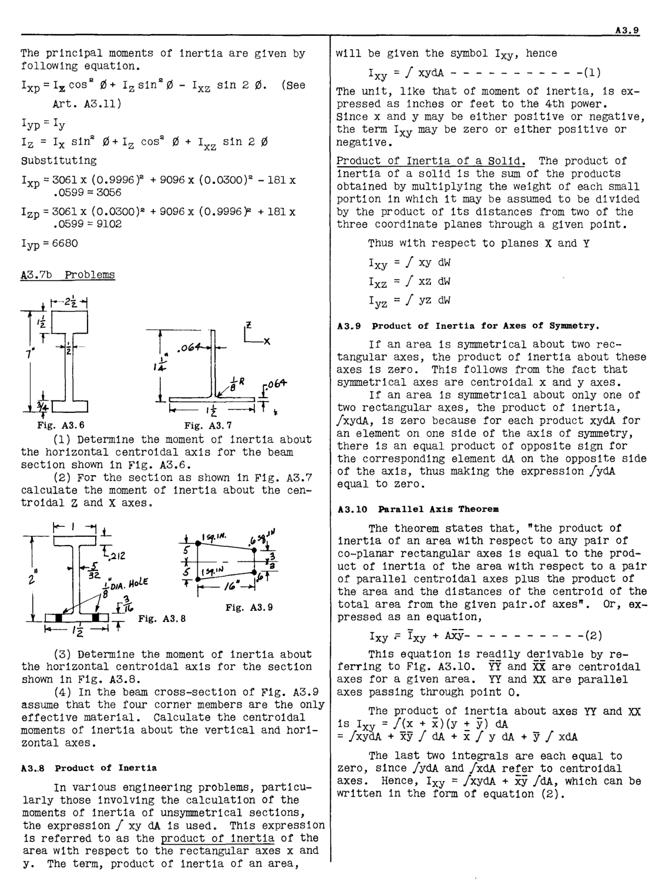

The principal moments of inertia are given by
following equation.

Ixp = I:z cos [2] 0 + Iz sin [2] 0 - Ixz sin 2 0. (see
Art. A3.11)

Iyp = Iy
Iz = Ix sin [2] 0 + Iz cos [2] 0 + Ixz sin 2 0
substituting

I xp = 3061 x (0.9996)2 + 9096 x (0.0300)2 -181x
.0599 = 3056

Izp =3061x (0.0300)2 + 9096 x (0.9996)2 +181x
.0599 = 9102

I yp = 6680

## A3.7b Problems

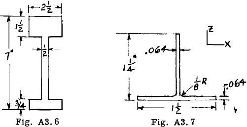

T:
              J...

,~
1

~ k---
1

,~
1

_J..R_ _8_ _1_ _[0]_ _1"_ _£.4-_

1

~ k---- It ---+l T ~

Fig. A3.6 Fig. A3. 7
(1) Determine the moment of inertia about
the horizontal centroidal axis for the beam
section shown in Fig. A3.6.
(2) For the section as shown in Fig. A3.7
calculate the moment of inertia about the centroidal Z and X axes.

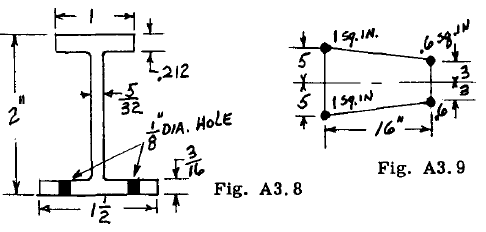

(3) Determine the moment of inertia about
the horizontal centroidal axis for the section
shown in Fig. A3.8.
(4) In the beam cross-section of Fig. A3.9
assume that the four corner members are the only
effective material. Calculate the centroidal
moments of inertia about the vertical and horizontal axes.
