## A3.11 Moments of Inertia with Respect of Inclined Axes

unsymmetrical beam sections are very common in aircraft structure, because the airfoil
shape is generally unsymmetrical. Thus, the
general procedure with such sections is to first
find the moment of inertia about some set of
rectangular axes and then transfer to other inclined axes. Thus, in Fig. A3.11 the moment of
inertia of the area with respect to axis X 1 X 1 is,

Ix _=jy_ 1 "dA= 1 j(ycos0-xsin0)"dA

_=_ _cos"0j_ y"dA+sin"0jx [2] dA-2Sin0 cos 0

_j_ xydA

= Ix cos" 0 + I y sin" 0 - 2 Ixy sin 0 cos 0 (3)

and likewise in a similar manner, the following
equation can be derived:

I Y1 =I x sin"0 + Iycos"0 + 2 I XY sin 0 cos

By adding equations (3) and (4), we obtain I x1 +
IY1 = Ix + Iy- - - - - - - - - - - - - - - - -(5)

or the sum of the moments of inertia of an area
with respect to all pairs of rectangular axes,
thru a common point of intersection, is constant.

## A3.12 Location of Axes for which Product of Inertia is Zero.

In Fig. A3.11

I X1Y1 _=jx_ y dA=j(xcos0+ysin0)(ycos0x siJ 0)dA

= (cos" 0 - s in [2] 0 _j_ xydA + cos 0 sin 0 _j_
(y"-x") dA

= Ixy cos 20+ ~ (Ix       - Iy ) sin 2 13
2

Therefore, I X1Y1 is zero when
tan 2 13 = 2I xy   - - - - - - - - - - - -(6)
Iy_I X

## A3.13 Principal Axes.

In problems involving unsymmetrical bending,
the moment of an area is frequently used with respect to a certain axis called the principal
axis. A principal axis of an area is an axis
about which the moment of inertia of the area is
either greater or less than for any other axis
passing thru the centroid of the area.
Axes for Which the product of inertia is
zero are principal axes.
Since the product of inertia is zero about
symmetrical axes, it follows that symmetrical
axes are principal axes.
The angle between a set of rectangular
centroidal axes and the principal axes is given
by equation (6).

Example Problem 4.

Determine the moment of inertia of the angle as shown in Fig. A3.12 about the principal
axes passing through the centroid. Solution:
Reference axes X and Yare assumed as shown in
Fig. A3.12 and the moment of inertia is first
calculated about these axes. Table 8 gives the
calculations. The angle is divided into the
two portions (1) and (2).

o- - - 

-(4)

|Col1|Col2|Col3|Table R|Col5|Col6|Col7|Col8|Col9|Col10|Col11|Col12|
|---|---|---|---|---|---|---|---|---|---|---|---|
|Part|**Area** A|x|y|Ay|Ax|Ay2|Ax2|Axy|~~I ~~cx|ICy|Ix I y|
|1|.375|.75|.125|.0469|.281|.0058|.211|.0351|.l.xl 5(1)3-= 0019 12 • (4) •    |11 3 12x4Xl, 5 =.070|.0077 .281|
|2|.500 |.125|1,25|.625 |.0625 |.7800 |.0078 |.0781 |~~1~~ ~~1~~ ~~3~~ .167 12 x4x2 ~~=~~|i2x2X.253 •• 0026|.9470 .010  |
||~~.875~~|||~~.6719~~|~~.3435~~|~~.7858~~|~~.2188~~|~~.1132~~|||.9547 .291|

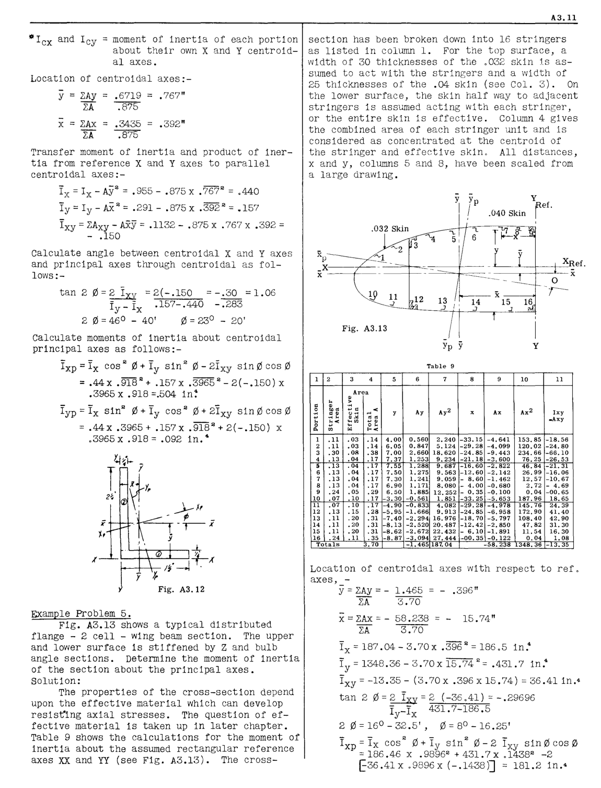

~Icx and Icy = moment of inertia of each portion
about their own X and Y centroidal axes.

Location of centroidal axes;

y = ZAy .6719 = .767"
li .875

x = ZAx .3435 = .392"
ZA .875

Transfer moment of inertia and product of inertia from reference X and Y axes to parallel
centroidal axes;

Ix = Ix    - A~?' = .955 - .875 x .767 2 = .440

Iy = Iy - Ai. 2 = .291 - .875 x .392 2 = .157

I XY = ZA xy - _AY:.y_ = .1132 - .875 x .767 x .392 =
        - .150

Calculate angle between centroidal X and Y axes
and principal axes through centroidal as follows;

tan 2 0 = ~ = 2(-.150 = -.30 = 1.06
Iy - Ix .157-.440 -.283
2 0 = 46 [0]      - 40' 0 = 23 [0]      - 20'

Calculate moments of inertia about centroidal
principal axes as follows;

Ixp = Ix cos 2 0 + I y sin 2 0 - 2I xy sin 0 cos 0

2 2
= .44x .918 + .157x .3965 -2(-.150)x
.3965 x .918 =.504 in~

Iyp = Ix sin 2 0 + I y cos 2 0 + 2I xy sin 0 cos 0

= .44x .3965+ .157x .918 2 +2(-.150) x
.3965 x .918= .092 in. [4]

,(

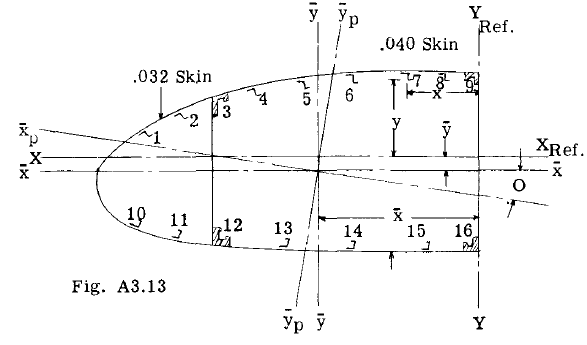

Example Problem 5.
Fig. A3.13 shows a typical distributed
flange - 2 cell - wing beam section. The upper
and lower surface is stiffened by Z and bulb
angle sections. Determine the moment of inertia
of the section about the principal axes.
Solution;
The properties of the cross-section depend
upon the effective material which can develop
resist1ng axial stresses. The question of effective material is taken up in later chapter.
Table 9 shows the calculations for the moment of
inertia about the assumed rectangular reference
axes XX and YY (see Fig. A3.13). The cross

**A3.1l**

section has been broken down into 16 stringers
as listed in column 1. For the top surface, a
width of 30 thicknesses of the .032 skin 1s assumed to act with the stringers and a width of
25 thicknesses of the .04 skin (see Col. 3). On
the lower surface, the skin half way to adjacent
stringers is assumed acting with each stringer,
or the entire skin is effective. Column 4 gives
the combined area of each stringer wlit and is
considered as concentrated at the centroid of
the stringer and effective skin. All distances,
x and y, columns 5 and 8, have been scaled from
a large drawing.

y
ef.

.032 Skin

3
""2

--,---+_-+-~XRef.

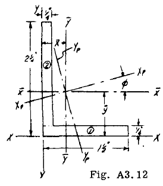

|1|2|3 4|Col4|5|6|7|8|9|10|11|
|---|---|---|---|---|---|---|---|---|---|---|
|" .~ ... ~ 0 ~~'"~~|~ m "''' " m ... ~ _b<_ .,|**Area** m .~ ... " .-< < u·.. m... " " ..."" ... m '" o ~ ~~'"~~ E-«|**Area** m .~ ... " .-< < u·.. m... " " ..."" ... m '" o ~ ~~'"~~ E-«|y|Ay|Ay2|x|Ax|Ax2|lxy -Axy|
|1 2 3 4 |.11 .11 .30 .13 |.03 .03 _.OR_ .04 |.14 .14 .38 .17 |4.00 6.05 7.00 7.37 |0.560 0.847 2.660 1.253 |2.240  5.124   18.620   9.234  |-33.15 -29.28 -24.85 -21.18 |-4.641  -4.099  -9.443 ** -3.600** |153.85  120.02  234.66  76.25  |-18.56 -24.80 -66.10 -26.53 |
|~~5~~ 6 7 8 9 10 |~~.13~~ .13 .13 .13 .24 .07 |~~.04~~ .04 .04 .04 .05 .10 |~~.17~~ .17 .17 .17 .29 .17  |~~7.55~~ 7.50 7.30 6.90 6.50 -3.30 |~~1.288~~ 1.275 1. 241 1.171 1.885  -0.561 |~~9.687~~  9.563 9.059  8.080  12.252 1. 851  |~~-16.60~~  -12.60  - 8.60  - 4.00  - 0.35 -33.25 |~~ -2.822~~  -2.142  -1. 462  -0.680  -0.100  -5.653 |~~46.84~~ 26.99 12.57 2.72 0.04  187.96 |~~-21. 31~~  -16.06  -10.67  - 4.69 -00.65 18.65 |
|~~11~~ 12 13 14 15 16 |~~.07~~ .13 .11 .11 .11 .24 |~~.10~~ .15 .20 .20 .20 .11|~~.17~~ .28  .31  .31  .31  .35 |~~-4.90~~ -5.95 -7.40 -8.13 -8.62 -8.87|~~ -0.833~~  -1. 666  -2.294  -2.520  -2.672  -3.094 |~~4.082~~  9.913  16.976  20.487   22.432  27•.444 |~~-29.28~~  -24.85  -18.70 -12.42  - 6.10 -00.35 |~~ -4.978~~  -6.958  -5.797  -2.850  -1.891  -0.122 |~~145.76~~ 172.90 108.40 47.82 11. 54 0.04 |~~24.39~~ 41.40 42.90 31.30 16.30 1. 08 |
|~~**Totals**~~ ~~3.70~~|~~**Totals**~~ ~~3.70~~|~~**Totals**~~ ~~3.70~~|~~**Totals**~~ ~~3.70~~||~~-1. 465~~|~~ 187.04~~|~~-58.2381348.36~~|~~-58.2381348.36~~|~~-58.2381348.36~~|~~-13.35~~|

Location of centroidal axes with respect to ref.

axes, 
y = ZAy = - 1.465 = - .396"
li 3.70

x=ZAx=- 58.238 15.74"

ZA 3.70

I x =187.04-3.70x .396 2 =186.5 in. 4

2 4
I y = 1348.36     - 3. 70x 15.74 = .431. 7 in.

I XY = -13.35     - (3.70 x .396 x 15.74) = 36.41in. [4]

tan 2 0 = ~ = 2 (-36.41) = -.29696

Iy-I X 431.7-186.5
20=16 [0] -32.5', 0=8 [0] -16.25'

Ixp=Yx cos 2 0+l y sin 2 0-2 I XY sin0cos0
= 186.46 x .9896 [2] + 431. 7 x .1438 [2] -2
t36.41x .9896x (-.1438)J = 181.2 in. [4]

L9 11 _.J_ ca 12 13

Fig. A3.13
"/1
Yp            - Y

**Table** **9**

~~--.---t~~.- x

o
-r

16

y

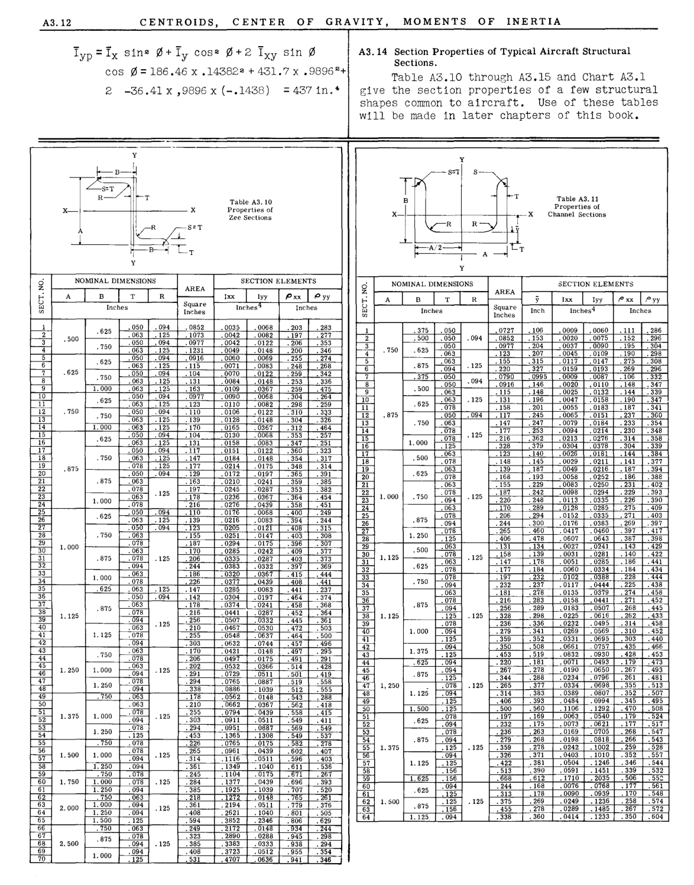

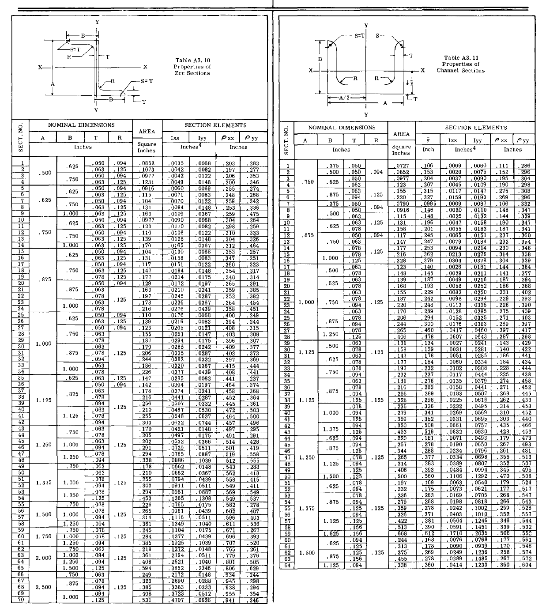

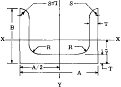

|A3.12 CENTROIDS, CENTER OF GRA|Col2|Col3|Col4|Col5|Col6|Col7|Col8|Col9|AVITY, MOMENTS OF INERTIA|
|---|---|---|---|---|---|---|---|---|---|
|I yp =Ix sin 2 0 + Iy cOS 2 0 + 2 Ixy sin 0 cos 0=186.46 x .14382 2 + 431. 7 x .9896 2 + 2 -36.41x,9896x(-.1438) =437in. 4|I yp =Ix sin 2 0 + Iy cOS 2 0 + 2 Ixy sin 0 cos 0=186.46 x .14382 2 + 431. 7 x .9896 2 + 2 -36.41x,9896x(-.1438) =437in. 4|I yp =Ix sin 2 0 + Iy cOS 2 0 + 2 Ixy sin 0 cos 0=186.46 x .14382 2 + 431. 7 x .9896 2 + 2 -36.41x,9896x(-.1438) =437in. 4|I yp =Ix sin 2 0 + Iy cOS 2 0 + 2 Ixy sin 0 cos 0=186.46 x .14382 2 + 431. 7 x .9896 2 + 2 -36.41x,9896x(-.1438) =437in. 4|I yp =Ix sin 2 0 + Iy cOS 2 0 + 2 Ixy sin 0 cos 0=186.46 x .14382 2 + 431. 7 x .9896 2 + 2 -36.41x,9896x(-.1438) =437in. 4|I yp =Ix sin 2 0 + Iy cOS 2 0 + 2 Ixy sin 0 cos 0=186.46 x .14382 2 + 431. 7 x .9896 2 + 2 -36.41x,9896x(-.1438) =437in. 4|I yp =Ix sin 2 0 + Iy cOS 2 0 + 2 Ixy sin 0 cos 0=186.46 x .14382 2 + 431. 7 x .9896 2 + 2 -36.41x,9896x(-.1438) =437in. 4|I yp =Ix sin 2 0 + Iy cOS 2 0 + 2 Ixy sin 0 cos 0=186.46 x .14382 2 + 431. 7 x .9896 2 + 2 -36.41x,9896x(-.1438) =437in. 4|I yp =Ix sin 2 0 + Iy cOS 2 0 + 2 Ixy sin 0 cos 0=186.46 x .14382 2 + 431. 7 x .9896 2 + 2 -36.41x,9896x(-.1438) =437in. 4|A3.14 Section Properties of Typical Aircraft Structural Sections. Table A3.10 through A3.15 and Chart A3.1 give the section properties of a few structural shapes common to aircraft. Use of these tables will be made in later chapters of this book.|
|y Table A3.10 Properties of Zee Sections NOMINAL DIMENSIONS Inches AREA ~~Square~~ Inches SECTION ELEMENTS Ixx~~ I~~ Iyy _P_ xx~~ I~~_ p_ yy Inches 4 Inches ~~1. 000~~ .407 ~~.403~~ .536 ~~.267~~ .537 ~~.278~~ .555 ~~.288~~ .393 .418 ~~.415~~ .496 .376 ~~.520~~ ~~.261~~ ~~.298~~ .411 ~~.549~~ .385 .382 ~~.454~~ .368 .364 ~~.361~~ .308 ~~.307~~ ~~.428~~ .419 ~~.558~~ .505 .251 .323 .317 .314 ~~.391~~ .369 .444 .244 ~~.315~~ .294 ~~.295~~ .291 .451 ~~.249~~ .354 ~~.346~~ .377 ~~.373~~ .283 .277 .353 ~~.346~~ ~~.629~~ ~~.244~~ .274 .268 .342 .336 ~~.475~~ .264 .259 . 3~3 .326 .464 ~~.257~~ ~~.441~~ .237 ~~.374~~ ~~ ~~.500~~ .696 .779 ~~.707~~ ~~.7 5~~ .801 ~~.945~~ ~~.938~~ ~~.497~~ .491 .403 ~~.396~~ .457 .549 ~~.569~~ .472 ~~.464~~ .611 ~~.671~~ ~~.514~~ .501 ~~.519~~ .602 ~~.596~~ .512 ~~.543~~ .562 ~~.558~~ .549 ~~.582~~ .203 .197 .206 ~~.200~~ ~~.408~~ .441 ~~.464~~ .304 .298 .310 .304 .312 ~~.353~~ .458 .452 ~~.445~~ .358 ~~.400~~ .955 ~~.941~~ .347 .360 .354 .348 ~~.365~~ .255 .248 .259 .253 ~~.259~~ .409 ~~.403~~ .397 .415 .394 ~~.408~~ .359 .353 ~~.364~~ ~~.806~~ ~~.9:14~~ .0439 .0333 .1308 ~~.0175~~ .1040 ~~.0175~~ ~~.0288~~ .0439 ~~.0511~~ .0511 ~~.0887~~ .0147 ~~.0175~~ .1040 .0744 .0530 ~~.0637~~ ~~.0148~~ .0175 ~~.0366~~ .0511 ~~.0887~~ .1039 ~~.0148~~ ~~.1039~~ ~~.014~~ .0367 ~~.0439~~ .0511 ~~.2346~~ ~~.0148~~ .0241 .0287 ~~.0367~~ .0242 ~~.0287~~ .0439 ~~.0068~~ .0083 .0122 .0148 .0175 ~~.0197~~ .0241 .0287 ~~.0332~~ .0069 .0083 .0122 .0148 ~~.0367~~ ~~.0439~~ .0083 ~~.0197~~ .0068 .0082 .0122 .0148 .0367 ~~.0068~~ .0512 ~~.0636~~ .0068 .0082 .0122 ~~.0148~~ .0332 .0367 .0083 ~~.0121~~ .0911 ~~.0951~~ .1365 ~~.0765~~ ~~.1925~~ ~~.1272~~ .0886 ~~.0562~~ .0467 ~~.0548~~ .2890 .0662 ~~.0794~~ ~~.0532~~ .0729 ~~.0765~~ .1377 .2194 .3383 .0632 .0961 ~~.1116~~ .1349 ~~.1104~~ .2621 ~~.0421~~ .0497 ~~.3852~~ ~~.2172~~ .0285 ~~.0335~~ .0374 .0441 ~~.0507~~ .0251 ~~.0294~~ .0210 .0245 ~~.0236~~ .0090 .0110 .0106 .0128 .0165 ~~.0130~~ .0276 ~~.0176~~ .0035 .0042 .0042 .0049 .0383 .0320 .0216 ~~.0205~~ ~~.0377~~ .0285 ~~.0304~~ .3723 ~~.4707~~ .0060 .0071 .0070 .0084 ~~.0109~~ .0158 .0151 .0184 .0214 ~~.0172~~ .210 ~~.255~~ .361 .361 ~~.245~~ .385 .303 ~~.170~~ .206 .265 ~~.314~~ .408 ~~.531~~ ~~.202~~ .291 ~~.294~~ .284 .155 ~~.187~~ .163 .197 ~~.178~~ ~~.323~~ .244 .186 ~~.594~~ ~~.249~~ .338 ~~.178~~ .453 ~~.226~~ .408 .210 ~~.255~~ ~~.385~~ ~~.218~~ .303 ~~.294~~ .216 ~~.110~~ ~~.226~~ .147 ~~.142~~ .131 .117 .147 .177 ~~.129~~ .139 ~~.123~~ .0977 .123 .110 .139 .170 ~~.104~~ .178 .216 ~~.256~~ .0852 .1073 .0977 .1231 .0916 .115 .104 .131 ~~.163~~ .170 ~~.206~~ .125 .125 .125 .125 .125 .125 .125 .125 .094 .125 .094 .125 .125 .094 .125 .094 .125 .125 ~~.094~~ .125 .094 .125 .125 ~~.094~~ .094 .125 .094 .125 .125 .125 ~~.094~~ .125 ~~.094~~ ~~.094~~ .050 .063 .050 .063 ~~.050~~ .063 .050 .063 .078 ~~.050~~ .050 .063 .050 .063 .063 .050 .063 .050 .063 .063 .063 ~~.0'"~~ ~ .078 ~~~~~ .078 ~~.050~~ ~~~~~ .078 ~~.094~~ ~~~~~ ~ .094 ~ ~ .094 ~~~~~ .094 ~~.063~~ ~~.078~~ ~~.125~~ ~~~~~ ~~.125~~ ~~~~~ .094 ~~.063~~ ~~.094~~ .094 ~~.078~~ ~~~~~ .094 ~~~~~ .094 ~~.094~~ ~~.063~~ ~ ~ .094 I : ~~~ ~~.078~~ .625 .750 .750 .875 .750 .625 .625 .625 .875 ~~.625~~ .625 ~~.750~~ .875 .875 ~~.750~~ .750 ~~1. 000~~ 1. 000 1. 250 ~~.750~~ ~~1. 250~~ 1. 250 ~~.750~~ 1. 000 ~~1. 250~~ ~~.750~~ .750 1. 000 1. 000 1. 000 1. 000 1. 125 ~~1. 250~~ ~~1. 500~~ 1. 000 .750 1. 000 .750 .875 .500 .625 1. 375 1. 500 ~ 1. 000 f----t--'-;.0",7",,8-1 ~ ~ .094 2.500 1. 250 2.000 1.125 1. 750|y Table A3.10 Properties of Zee Sections NOMINAL DIMENSIONS Inches AREA ~~Square~~ Inches SECTION ELEMENTS Ixx~~ I~~ Iyy _P_ xx~~ I~~_ p_ yy Inches 4 Inches ~~1. 000~~ .407 ~~.403~~ .536 ~~.267~~ .537 ~~.278~~ .555 ~~.288~~ .393 .418 ~~.415~~ .496 .376 ~~.520~~ ~~.261~~ ~~.298~~ .411 ~~.549~~ .385 .382 ~~.454~~ .368 .364 ~~.361~~ .308 ~~.307~~ ~~.428~~ .419 ~~.558~~ .505 .251 .323 .317 .314 ~~.391~~ .369 .444 .244 ~~.315~~ .294 ~~.295~~ .291 .451 ~~.249~~ .354 ~~.346~~ .377 ~~.373~~ .283 .277 .353 ~~.346~~ ~~.629~~ ~~.244~~ .274 .268 .342 .336 ~~.475~~ .264 .259 . 3~3 .326 .464 ~~.257~~ ~~.441~~ .237 ~~.374~~ ~~ ~~.500~~ .696 .779 ~~.707~~ ~~.7 5~~ .801 ~~.945~~ ~~.938~~ ~~.497~~ .491 .403 ~~.396~~ .457 .549 ~~.569~~ .472 ~~.464~~ .611 ~~.671~~ ~~.514~~ .501 ~~.519~~ .602 ~~.596~~ .512 ~~.543~~ .562 ~~.558~~ .549 ~~.582~~ .203 .197 .206 ~~.200~~ ~~.408~~ .441 ~~.464~~ .304 .298 .310 .304 .312 ~~.353~~ .458 .452 ~~.445~~ .358 ~~.400~~ .955 ~~.941~~ .347 .360 .354 .348 ~~.365~~ .255 .248 .259 .253 ~~.259~~ .409 ~~.403~~ .397 .415 .394 ~~.408~~ .359 .353 ~~.364~~ ~~.806~~ ~~.9:14~~ .0439 .0333 .1308 ~~.0175~~ .1040 ~~.0175~~ ~~.0288~~ .0439 ~~.0511~~ .0511 ~~.0887~~ .0147 ~~.0175~~ .1040 .0744 .0530 ~~.0637~~ ~~.0148~~ .0175 ~~.0366~~ .0511 ~~.0887~~ .1039 ~~.0148~~ ~~.1039~~ ~~.014~~ .0367 ~~.0439~~ .0511 ~~.2346~~ ~~.0148~~ .0241 .0287 ~~.0367~~ .0242 ~~.0287~~ .0439 ~~.0068~~ .0083 .0122 .0148 .0175 ~~.0197~~ .0241 .0287 ~~.0332~~ .0069 .0083 .0122 .0148 ~~.0367~~ ~~.0439~~ .0083 ~~.0197~~ .0068 .0082 .0122 .0148 .0367 ~~.0068~~ .0512 ~~.0636~~ .0068 .0082 .0122 ~~.0148~~ .0332 .0367 .0083 ~~.0121~~ .0911 ~~.0951~~ .1365 ~~.0765~~ ~~.1925~~ ~~.1272~~ .0886 ~~.0562~~ .0467 ~~.0548~~ .2890 .0662 ~~.0794~~ ~~.0532~~ .0729 ~~.0765~~ .1377 .2194 .3383 .0632 .0961 ~~.1116~~ .1349 ~~.1104~~ .2621 ~~.0421~~ .0497 ~~.3852~~ ~~.2172~~ .0285 ~~.0335~~ .0374 .0441 ~~.0507~~ .0251 ~~.0294~~ .0210 .0245 ~~.0236~~ .0090 .0110 .0106 .0128 .0165 ~~.0130~~ .0276 ~~.0176~~ .0035 .0042 .0042 .0049 .0383 .0320 .0216 ~~.0205~~ ~~.0377~~ .0285 ~~.0304~~ .3723 ~~.4707~~ .0060 .0071 .0070 .0084 ~~.0109~~ .0158 .0151 .0184 .0214 ~~.0172~~ .210 ~~.255~~ .361 .361 ~~.245~~ .385 .303 ~~.170~~ .206 .265 ~~.314~~ .408 ~~.531~~ ~~.202~~ .291 ~~.294~~ .284 .155 ~~.187~~ .163 .197 ~~.178~~ ~~.323~~ .244 .186 ~~.594~~ ~~.249~~ .338 ~~.178~~ .453 ~~.226~~ .408 .210 ~~.255~~ ~~.385~~ ~~.218~~ .303 ~~.294~~ .216 ~~.110~~ ~~.226~~ .147 ~~.142~~ .131 .117 .147 .177 ~~.129~~ .139 ~~.123~~ .0977 .123 .110 .139 .170 ~~.104~~ .178 .216 ~~.256~~ .0852 .1073 .0977 .1231 .0916 .115 .104 .131 ~~.163~~ .170 ~~.206~~ .125 .125 .125 .125 .125 .125 .125 .125 .094 .125 .094 .125 .125 .094 .125 .094 .125 .125 ~~.094~~ .125 .094 .125 .125 ~~.094~~ .094 .125 .094 .125 .125 .125 ~~.094~~ .125 ~~.094~~ ~~.094~~ .050 .063 .050 .063 ~~.050~~ .063 .050 .063 .078 ~~.050~~ .050 .063 .050 .063 .063 .050 .063 .050 .063 .063 .063 ~~.0'"~~ ~ .078 ~~~~~ .078 ~~.050~~ ~~~~~ .078 ~~.094~~ ~~~~~ ~ .094 ~ ~ .094 ~~~~~ .094 ~~.063~~ ~~.078~~ ~~.125~~ ~~~~~ ~~.125~~ ~~~~~ .094 ~~.063~~ ~~.094~~ .094 ~~.078~~ ~~~~~ .094 ~~~~~ .094 ~~.094~~ ~~.063~~ ~ ~ .094 I : ~~~ ~~.078~~ .625 .750 .750 .875 .750 .625 .625 .625 .875 ~~.625~~ .625 ~~.750~~ .875 .875 ~~.750~~ .750 ~~1. 000~~ 1. 000 1. 250 ~~.750~~ ~~1. 250~~ 1. 250 ~~.750~~ 1. 000 ~~1. 250~~ ~~.750~~ .750 1. 000 1. 000 1. 000 1. 000 1. 125 ~~1. 250~~ ~~1. 500~~ 1. 000 .750 1. 000 .750 .875 .500 .625 1. 375 1. 500 ~ 1. 000 f----t--'-;.0",7",,8-1 ~ ~ .094 2.500 1. 250 2.000 1.125 1. 750|y Table A3.10 Properties of Zee Sections NOMINAL DIMENSIONS Inches AREA ~~Square~~ Inches SECTION ELEMENTS Ixx~~ I~~ Iyy _P_ xx~~ I~~_ p_ yy Inches 4 Inches ~~1. 000~~ .407 ~~.403~~ .536 ~~.267~~ .537 ~~.278~~ .555 ~~.288~~ .393 .418 ~~.415~~ .496 .376 ~~.520~~ ~~.261~~ ~~.298~~ .411 ~~.549~~ .385 .382 ~~.454~~ .368 .364 ~~.361~~ .308 ~~.307~~ ~~.428~~ .419 ~~.558~~ .505 .251 .323 .317 .314 ~~.391~~ .369 .444 .244 ~~.315~~ .294 ~~.295~~ .291 .451 ~~.249~~ .354 ~~.346~~ .377 ~~.373~~ .283 .277 .353 ~~.346~~ ~~.629~~ ~~.244~~ .274 .268 .342 .336 ~~.475~~ .264 .259 . 3~3 .326 .464 ~~.257~~ ~~.441~~ .237 ~~.374~~ ~~ ~~.500~~ .696 .779 ~~.707~~ ~~.7 5~~ .801 ~~.945~~ ~~.938~~ ~~.497~~ .491 .403 ~~.396~~ .457 .549 ~~.569~~ .472 ~~.464~~ .611 ~~.671~~ ~~.514~~ .501 ~~.519~~ .602 ~~.596~~ .512 ~~.543~~ .562 ~~.558~~ .549 ~~.582~~ .203 .197 .206 ~~.200~~ ~~.408~~ .441 ~~.464~~ .304 .298 .310 .304 .312 ~~.353~~ .458 .452 ~~.445~~ .358 ~~.400~~ .955 ~~.941~~ .347 .360 .354 .348 ~~.365~~ .255 .248 .259 .253 ~~.259~~ .409 ~~.403~~ .397 .415 .394 ~~.408~~ .359 .353 ~~.364~~ ~~.806~~ ~~.9:14~~ .0439 .0333 .1308 ~~.0175~~ .1040 ~~.0175~~ ~~.0288~~ .0439 ~~.0511~~ .0511 ~~.0887~~ .0147 ~~.0175~~ .1040 .0744 .0530 ~~.0637~~ ~~.0148~~ .0175 ~~.0366~~ .0511 ~~.0887~~ .1039 ~~.0148~~ ~~.1039~~ ~~.014~~ .0367 ~~.0439~~ .0511 ~~.2346~~ ~~.0148~~ .0241 .0287 ~~.0367~~ .0242 ~~.0287~~ .0439 ~~.0068~~ .0083 .0122 .0148 .0175 ~~.0197~~ .0241 .0287 ~~.0332~~ .0069 .0083 .0122 .0148 ~~.0367~~ ~~.0439~~ .0083 ~~.0197~~ .0068 .0082 .0122 .0148 .0367 ~~.0068~~ .0512 ~~.0636~~ .0068 .0082 .0122 ~~.0148~~ .0332 .0367 .0083 ~~.0121~~ .0911 ~~.0951~~ .1365 ~~.0765~~ ~~.1925~~ ~~.1272~~ .0886 ~~.0562~~ .0467 ~~.0548~~ .2890 .0662 ~~.0794~~ ~~.0532~~ .0729 ~~.0765~~ .1377 .2194 .3383 .0632 .0961 ~~.1116~~ .1349 ~~.1104~~ .2621 ~~.0421~~ .0497 ~~.3852~~ ~~.2172~~ .0285 ~~.0335~~ .0374 .0441 ~~.0507~~ .0251 ~~.0294~~ .0210 .0245 ~~.0236~~ .0090 .0110 .0106 .0128 .0165 ~~.0130~~ .0276 ~~.0176~~ .0035 .0042 .0042 .0049 .0383 .0320 .0216 ~~.0205~~ ~~.0377~~ .0285 ~~.0304~~ .3723 ~~.4707~~ .0060 .0071 .0070 .0084 ~~.0109~~ .0158 .0151 .0184 .0214 ~~.0172~~ .210 ~~.255~~ .361 .361 ~~.245~~ .385 .303 ~~.170~~ .206 .265 ~~.314~~ .408 ~~.531~~ ~~.202~~ .291 ~~.294~~ .284 .155 ~~.187~~ .163 .197 ~~.178~~ ~~.323~~ .244 .186 ~~.594~~ ~~.249~~ .338 ~~.178~~ .453 ~~.226~~ .408 .210 ~~.255~~ ~~.385~~ ~~.218~~ .303 ~~.294~~ .216 ~~.110~~ ~~.226~~ .147 ~~.142~~ .131 .117 .147 .177 ~~.129~~ .139 ~~.123~~ .0977 .123 .110 .139 .170 ~~.104~~ .178 .216 ~~.256~~ .0852 .1073 .0977 .1231 .0916 .115 .104 .131 ~~.163~~ .170 ~~.206~~ .125 .125 .125 .125 .125 .125 .125 .125 .094 .125 .094 .125 .125 .094 .125 .094 .125 .125 ~~.094~~ .125 .094 .125 .125 ~~.094~~ .094 .125 .094 .125 .125 .125 ~~.094~~ .125 ~~.094~~ ~~.094~~ .050 .063 .050 .063 ~~.050~~ .063 .050 .063 .078 ~~.050~~ .050 .063 .050 .063 .063 .050 .063 .050 .063 .063 .063 ~~.0'"~~ ~ .078 ~~~~~ .078 ~~.050~~ ~~~~~ .078 ~~.094~~ ~~~~~ ~ .094 ~ ~ .094 ~~~~~ .094 ~~.063~~ ~~.078~~ ~~.125~~ ~~~~~ ~~.125~~ ~~~~~ .094 ~~.063~~ ~~.094~~ .094 ~~.078~~ ~~~~~ .094 ~~~~~ .094 ~~.094~~ ~~.063~~ ~ ~ .094 I : ~~~ ~~.078~~ .625 .750 .750 .875 .750 .625 .625 .625 .875 ~~.625~~ .625 ~~.750~~ .875 .875 ~~.750~~ .750 ~~1. 000~~ 1. 000 1. 250 ~~.750~~ ~~1. 250~~ 1. 250 ~~.750~~ 1. 000 ~~1. 250~~ ~~.750~~ .750 1. 000 1. 000 1. 000 1. 000 1. 125 ~~1. 250~~ ~~1. 500~~ 1. 000 .750 1. 000 .750 .875 .500 .625 1. 375 1. 500 ~ 1. 000 f----t--'-;.0",7",,8-1 ~ ~ .094 2.500 1. 250 2.000 1.125 1. 750|y Table A3.10 Properties of Zee Sections NOMINAL DIMENSIONS Inches AREA ~~Square~~ Inches SECTION ELEMENTS Ixx~~ I~~ Iyy _P_ xx~~ I~~_ p_ yy Inches 4 Inches ~~1. 000~~ .407 ~~.403~~ .536 ~~.267~~ .537 ~~.278~~ .555 ~~.288~~ .393 .418 ~~.415~~ .496 .376 ~~.520~~ ~~.261~~ ~~.298~~ .411 ~~.549~~ .385 .382 ~~.454~~ .368 .364 ~~.361~~ .308 ~~.307~~ ~~.428~~ .419 ~~.558~~ .505 .251 .323 .317 .314 ~~.391~~ .369 .444 .244 ~~.315~~ .294 ~~.295~~ .291 .451 ~~.249~~ .354 ~~.346~~ .377 ~~.373~~ .283 .277 .353 ~~.346~~ ~~.629~~ ~~.244~~ .274 .268 .342 .336 ~~.475~~ .264 .259 . 3~3 .326 .464 ~~.257~~ ~~.441~~ .237 ~~.374~~ ~~ ~~.500~~ .696 .779 ~~.707~~ ~~.7 5~~ .801 ~~.945~~ ~~.938~~ ~~.497~~ .491 .403 ~~.396~~ .457 .549 ~~.569~~ .472 ~~.464~~ .611 ~~.671~~ ~~.514~~ .501 ~~.519~~ .602 ~~.596~~ .512 ~~.543~~ .562 ~~.558~~ .549 ~~.582~~ .203 .197 .206 ~~.200~~ ~~.408~~ .441 ~~.464~~ .304 .298 .310 .304 .312 ~~.353~~ .458 .452 ~~.445~~ .358 ~~.400~~ .955 ~~.941~~ .347 .360 .354 .348 ~~.365~~ .255 .248 .259 .253 ~~.259~~ .409 ~~.403~~ .397 .415 .394 ~~.408~~ .359 .353 ~~.364~~ ~~.806~~ ~~.9:14~~ .0439 .0333 .1308 ~~.0175~~ .1040 ~~.0175~~ ~~.0288~~ .0439 ~~.0511~~ .0511 ~~.0887~~ .0147 ~~.0175~~ .1040 .0744 .0530 ~~.0637~~ ~~.0148~~ .0175 ~~.0366~~ .0511 ~~.0887~~ .1039 ~~.0148~~ ~~.1039~~ ~~.014~~ .0367 ~~.0439~~ .0511 ~~.2346~~ ~~.0148~~ .0241 .0287 ~~.0367~~ .0242 ~~.0287~~ .0439 ~~.0068~~ .0083 .0122 .0148 .0175 ~~.0197~~ .0241 .0287 ~~.0332~~ .0069 .0083 .0122 .0148 ~~.0367~~ ~~.0439~~ .0083 ~~.0197~~ .0068 .0082 .0122 .0148 .0367 ~~.0068~~ .0512 ~~.0636~~ .0068 .0082 .0122 ~~.0148~~ .0332 .0367 .0083 ~~.0121~~ .0911 ~~.0951~~ .1365 ~~.0765~~ ~~.1925~~ ~~.1272~~ .0886 ~~.0562~~ .0467 ~~.0548~~ .2890 .0662 ~~.0794~~ ~~.0532~~ .0729 ~~.0765~~ .1377 .2194 .3383 .0632 .0961 ~~.1116~~ .1349 ~~.1104~~ .2621 ~~.0421~~ .0497 ~~.3852~~ ~~.2172~~ .0285 ~~.0335~~ .0374 .0441 ~~.0507~~ .0251 ~~.0294~~ .0210 .0245 ~~.0236~~ .0090 .0110 .0106 .0128 .0165 ~~.0130~~ .0276 ~~.0176~~ .0035 .0042 .0042 .0049 .0383 .0320 .0216 ~~.0205~~ ~~.0377~~ .0285 ~~.0304~~ .3723 ~~.4707~~ .0060 .0071 .0070 .0084 ~~.0109~~ .0158 .0151 .0184 .0214 ~~.0172~~ .210 ~~.255~~ .361 .361 ~~.245~~ .385 .303 ~~.170~~ .206 .265 ~~.314~~ .408 ~~.531~~ ~~.202~~ .291 ~~.294~~ .284 .155 ~~.187~~ .163 .197 ~~.178~~ ~~.323~~ .244 .186 ~~.594~~ ~~.249~~ .338 ~~.178~~ .453 ~~.226~~ .408 .210 ~~.255~~ ~~.385~~ ~~.218~~ .303 ~~.294~~ .216 ~~.110~~ ~~.226~~ .147 ~~.142~~ .131 .117 .147 .177 ~~.129~~ .139 ~~.123~~ .0977 .123 .110 .139 .170 ~~.104~~ .178 .216 ~~.256~~ .0852 .1073 .0977 .1231 .0916 .115 .104 .131 ~~.163~~ .170 ~~.206~~ .125 .125 .125 .125 .125 .125 .125 .125 .094 .125 .094 .125 .125 .094 .125 .094 .125 .125 ~~.094~~ .125 .094 .125 .125 ~~.094~~ .094 .125 .094 .125 .125 .125 ~~.094~~ .125 ~~.094~~ ~~.094~~ .050 .063 .050 .063 ~~.050~~ .063 .050 .063 .078 ~~.050~~ .050 .063 .050 .063 .063 .050 .063 .050 .063 .063 .063 ~~.0'"~~ ~ .078 ~~~~~ .078 ~~.050~~ ~~~~~ .078 ~~.094~~ ~~~~~ ~ .094 ~ ~ .094 ~~~~~ .094 ~~.063~~ ~~.078~~ ~~.125~~ ~~~~~ ~~.125~~ ~~~~~ .094 ~~.063~~ ~~.094~~ .094 ~~.078~~ ~~~~~ .094 ~~~~~ .094 ~~.094~~ ~~.063~~ ~ ~ .094 I : ~~~ ~~.078~~ .625 .750 .750 .875 .750 .625 .625 .625 .875 ~~.625~~ .625 ~~.750~~ .875 .875 ~~.750~~ .750 ~~1. 000~~ 1. 000 1. 250 ~~.750~~ ~~1. 250~~ 1. 250 ~~.750~~ 1. 000 ~~1. 250~~ ~~.750~~ .750 1. 000 1. 000 1. 000 1. 000 1. 125 ~~1. 250~~ ~~1. 500~~ 1. 000 .750 1. 000 .750 .875 .500 .625 1. 375 1. 500 ~ 1. 000 f----t--'-;.0",7",,8-1 ~ ~ .094 2.500 1. 250 2.000 1.125 1. 750|y Table A3.10 Properties of Zee Sections NOMINAL DIMENSIONS Inches AREA ~~Square~~ Inches SECTION ELEMENTS Ixx~~ I~~ Iyy _P_ xx~~ I~~_ p_ yy Inches 4 Inches ~~1. 000~~ .407 ~~.403~~ .536 ~~.267~~ .537 ~~.278~~ .555 ~~.288~~ .393 .418 ~~.415~~ .496 .376 ~~.520~~ ~~.261~~ ~~.298~~ .411 ~~.549~~ .385 .382 ~~.454~~ .368 .364 ~~.361~~ .308 ~~.307~~ ~~.428~~ .419 ~~.558~~ .505 .251 .323 .317 .314 ~~.391~~ .369 .444 .244 ~~.315~~ .294 ~~.295~~ .291 .451 ~~.249~~ .354 ~~.346~~ .377 ~~.373~~ .283 .277 .353 ~~.346~~ ~~.629~~ ~~.244~~ .274 .268 .342 .336 ~~.475~~ .264 .259 . 3~3 .326 .464 ~~.257~~ ~~.441~~ .237 ~~.374~~ ~~ ~~.500~~ .696 .779 ~~.707~~ ~~.7 5~~ .801 ~~.945~~ ~~.938~~ ~~.497~~ .491 .403 ~~.396~~ .457 .549 ~~.569~~ .472 ~~.464~~ .611 ~~.671~~ ~~.514~~ .501 ~~.519~~ .602 ~~.596~~ .512 ~~.543~~ .562 ~~.558~~ .549 ~~.582~~ .203 .197 .206 ~~.200~~ ~~.408~~ .441 ~~.464~~ .304 .298 .310 .304 .312 ~~.353~~ .458 .452 ~~.445~~ .358 ~~.400~~ .955 ~~.941~~ .347 .360 .354 .348 ~~.365~~ .255 .248 .259 .253 ~~.259~~ .409 ~~.403~~ .397 .415 .394 ~~.408~~ .359 .353 ~~.364~~ ~~.806~~ ~~.9:14~~ .0439 .0333 .1308 ~~.0175~~ .1040 ~~.0175~~ ~~.0288~~ .0439 ~~.0511~~ .0511 ~~.0887~~ .0147 ~~.0175~~ .1040 .0744 .0530 ~~.0637~~ ~~.0148~~ .0175 ~~.0366~~ .0511 ~~.0887~~ .1039 ~~.0148~~ ~~.1039~~ ~~.014~~ .0367 ~~.0439~~ .0511 ~~.2346~~ ~~.0148~~ .0241 .0287 ~~.0367~~ .0242 ~~.0287~~ .0439 ~~.0068~~ .0083 .0122 .0148 .0175 ~~.0197~~ .0241 .0287 ~~.0332~~ .0069 .0083 .0122 .0148 ~~.0367~~ ~~.0439~~ .0083 ~~.0197~~ .0068 .0082 .0122 .0148 .0367 ~~.0068~~ .0512 ~~.0636~~ .0068 .0082 .0122 ~~.0148~~ .0332 .0367 .0083 ~~.0121~~ .0911 ~~.0951~~ .1365 ~~.0765~~ ~~.1925~~ ~~.1272~~ .0886 ~~.0562~~ .0467 ~~.0548~~ .2890 .0662 ~~.0794~~ ~~.0532~~ .0729 ~~.0765~~ .1377 .2194 .3383 .0632 .0961 ~~.1116~~ .1349 ~~.1104~~ .2621 ~~.0421~~ .0497 ~~.3852~~ ~~.2172~~ .0285 ~~.0335~~ .0374 .0441 ~~.0507~~ .0251 ~~.0294~~ .0210 .0245 ~~.0236~~ .0090 .0110 .0106 .0128 .0165 ~~.0130~~ .0276 ~~.0176~~ .0035 .0042 .0042 .0049 .0383 .0320 .0216 ~~.0205~~ ~~.0377~~ .0285 ~~.0304~~ .3723 ~~.4707~~ .0060 .0071 .0070 .0084 ~~.0109~~ .0158 .0151 .0184 .0214 ~~.0172~~ .210 ~~.255~~ .361 .361 ~~.245~~ .385 .303 ~~.170~~ .206 .265 ~~.314~~ .408 ~~.531~~ ~~.202~~ .291 ~~.294~~ .284 .155 ~~.187~~ .163 .197 ~~.178~~ ~~.323~~ .244 .186 ~~.594~~ ~~.249~~ .338 ~~.178~~ .453 ~~.226~~ .408 .210 ~~.255~~ ~~.385~~ ~~.218~~ .303 ~~.294~~ .216 ~~.110~~ ~~.226~~ .147 ~~.142~~ .131 .117 .147 .177 ~~.129~~ .139 ~~.123~~ .0977 .123 .110 .139 .170 ~~.104~~ .178 .216 ~~.256~~ .0852 .1073 .0977 .1231 .0916 .115 .104 .131 ~~.163~~ .170 ~~.206~~ .125 .125 .125 .125 .125 .125 .125 .125 .094 .125 .094 .125 .125 .094 .125 .094 .125 .125 ~~.094~~ .125 .094 .125 .125 ~~.094~~ .094 .125 .094 .125 .125 .125 ~~.094~~ .125 ~~.094~~ ~~.094~~ .050 .063 .050 .063 ~~.050~~ .063 .050 .063 .078 ~~.050~~ .050 .063 .050 .063 .063 .050 .063 .050 .063 .063 .063 ~~.0'"~~ ~ .078 ~~~~~ .078 ~~.050~~ ~~~~~ .078 ~~.094~~ ~~~~~ ~ .094 ~ ~ .094 ~~~~~ .094 ~~.063~~ ~~.078~~ ~~.125~~ ~~~~~ ~~.125~~ ~~~~~ .094 ~~.063~~ ~~.094~~ .094 ~~.078~~ ~~~~~ .094 ~~~~~ .094 ~~.094~~ ~~.063~~ ~ ~ .094 I : ~~~ ~~.078~~ .625 .750 .750 .875 .750 .625 .625 .625 .875 ~~.625~~ .625 ~~.750~~ .875 .875 ~~.750~~ .750 ~~1. 000~~ 1. 000 1. 250 ~~.750~~ ~~1. 250~~ 1. 250 ~~.750~~ 1. 000 ~~1. 250~~ ~~.750~~ .750 1. 000 1. 000 1. 000 1. 000 1. 125 ~~1. 250~~ ~~1. 500~~ 1. 000 .750 1. 000 .750 .875 .500 .625 1. 375 1. 500 ~ 1. 000 f----t--'-;.0",7",,8-1 ~ ~ .094 2.500 1. 250 2.000 1.125 1. 750|y Table A3.10 Properties of Zee Sections NOMINAL DIMENSIONS Inches AREA ~~Square~~ Inches SECTION ELEMENTS Ixx~~ I~~ Iyy _P_ xx~~ I~~_ p_ yy Inches 4 Inches ~~1. 000~~ .407 ~~.403~~ .536 ~~.267~~ .537 ~~.278~~ .555 ~~.288~~ .393 .418 ~~.415~~ .496 .376 ~~.520~~ ~~.261~~ ~~.298~~ .411 ~~.549~~ .385 .382 ~~.454~~ .368 .364 ~~.361~~ .308 ~~.307~~ ~~.428~~ .419 ~~.558~~ .505 .251 .323 .317 .314 ~~.391~~ .369 .444 .244 ~~.315~~ .294 ~~.295~~ .291 .451 ~~.249~~ .354 ~~.346~~ .377 ~~.373~~ .283 .277 .353 ~~.346~~ ~~.629~~ ~~.244~~ .274 .268 .342 .336 ~~.475~~ .264 .259 . 3~3 .326 .464 ~~.257~~ ~~.441~~ .237 ~~.374~~ ~~ ~~.500~~ .696 .779 ~~.707~~ ~~.7 5~~ .801 ~~.945~~ ~~.938~~ ~~.497~~ .491 .403 ~~.396~~ .457 .549 ~~.569~~ .472 ~~.464~~ .611 ~~.671~~ ~~.514~~ .501 ~~.519~~ .602 ~~.596~~ .512 ~~.543~~ .562 ~~.558~~ .549 ~~.582~~ .203 .197 .206 ~~.200~~ ~~.408~~ .441 ~~.464~~ .304 .298 .310 .304 .312 ~~.353~~ .458 .452 ~~.445~~ .358 ~~.400~~ .955 ~~.941~~ .347 .360 .354 .348 ~~.365~~ .255 .248 .259 .253 ~~.259~~ .409 ~~.403~~ .397 .415 .394 ~~.408~~ .359 .353 ~~.364~~ ~~.806~~ ~~.9:14~~ .0439 .0333 .1308 ~~.0175~~ .1040 ~~.0175~~ ~~.0288~~ .0439 ~~.0511~~ .0511 ~~.0887~~ .0147 ~~.0175~~ .1040 .0744 .0530 ~~.0637~~ ~~.0148~~ .0175 ~~.0366~~ .0511 ~~.0887~~ .1039 ~~.0148~~ ~~.1039~~ ~~.014~~ .0367 ~~.0439~~ .0511 ~~.2346~~ ~~.0148~~ .0241 .0287 ~~.0367~~ .0242 ~~.0287~~ .0439 ~~.0068~~ .0083 .0122 .0148 .0175 ~~.0197~~ .0241 .0287 ~~.0332~~ .0069 .0083 .0122 .0148 ~~.0367~~ ~~.0439~~ .0083 ~~.0197~~ .0068 .0082 .0122 .0148 .0367 ~~.0068~~ .0512 ~~.0636~~ .0068 .0082 .0122 ~~.0148~~ .0332 .0367 .0083 ~~.0121~~ .0911 ~~.0951~~ .1365 ~~.0765~~ ~~.1925~~ ~~.1272~~ .0886 ~~.0562~~ .0467 ~~.0548~~ .2890 .0662 ~~.0794~~ ~~.0532~~ .0729 ~~.0765~~ .1377 .2194 .3383 .0632 .0961 ~~.1116~~ .1349 ~~.1104~~ .2621 ~~.0421~~ .0497 ~~.3852~~ ~~.2172~~ .0285 ~~.0335~~ .0374 .0441 ~~.0507~~ .0251 ~~.0294~~ .0210 .0245 ~~.0236~~ .0090 .0110 .0106 .0128 .0165 ~~.0130~~ .0276 ~~.0176~~ .0035 .0042 .0042 .0049 .0383 .0320 .0216 ~~.0205~~ ~~.0377~~ .0285 ~~.0304~~ .3723 ~~.4707~~ .0060 .0071 .0070 .0084 ~~.0109~~ .0158 .0151 .0184 .0214 ~~.0172~~ .210 ~~.255~~ .361 .361 ~~.245~~ .385 .303 ~~.170~~ .206 .265 ~~.314~~ .408 ~~.531~~ ~~.202~~ .291 ~~.294~~ .284 .155 ~~.187~~ .163 .197 ~~.178~~ ~~.323~~ .244 .186 ~~.594~~ ~~.249~~ .338 ~~.178~~ .453 ~~.226~~ .408 .210 ~~.255~~ ~~.385~~ ~~.218~~ .303 ~~.294~~ .216 ~~.110~~ ~~.226~~ .147 ~~.142~~ .131 .117 .147 .177 ~~.129~~ .139 ~~.123~~ .0977 .123 .110 .139 .170 ~~.104~~ .178 .216 ~~.256~~ .0852 .1073 .0977 .1231 .0916 .115 .104 .131 ~~.163~~ .170 ~~.206~~ .125 .125 .125 .125 .125 .125 .125 .125 .094 .125 .094 .125 .125 .094 .125 .094 .125 .125 ~~.094~~ .125 .094 .125 .125 ~~.094~~ .094 .125 .094 .125 .125 .125 ~~.094~~ .125 ~~.094~~ ~~.094~~ .050 .063 .050 .063 ~~.050~~ .063 .050 .063 .078 ~~.050~~ .050 .063 .050 .063 .063 .050 .063 .050 .063 .063 .063 ~~.0'"~~ ~ .078 ~~~~~ .078 ~~.050~~ ~~~~~ .078 ~~.094~~ ~~~~~ ~ .094 ~ ~ .094 ~~~~~ .094 ~~.063~~ ~~.078~~ ~~.125~~ ~~~~~ ~~.125~~ ~~~~~ .094 ~~.063~~ ~~.094~~ .094 ~~.078~~ ~~~~~ .094 ~~~~~ .094 ~~.094~~ ~~.063~~ ~ ~ .094 I : ~~~ ~~.078~~ .625 .750 .750 .875 .750 .625 .625 .625 .875 ~~.625~~ .625 ~~.750~~ .875 .875 ~~.750~~ .750 ~~1. 000~~ 1. 000 1. 250 ~~.750~~ ~~1. 250~~ 1. 250 ~~.750~~ 1. 000 ~~1. 250~~ ~~.750~~ .750 1. 000 1. 000 1. 000 1. 000 1. 125 ~~1. 250~~ ~~1. 500~~ 1. 000 .750 1. 000 .750 .875 .500 .625 1. 375 1. 500 ~ 1. 000 f----t--'-;.0",7",,8-1 ~ ~ .094 2.500 1. 250 2.000 1.125 1. 750|y Table A3.10 Properties of Zee Sections NOMINAL DIMENSIONS Inches AREA ~~Square~~ Inches SECTION ELEMENTS Ixx~~ I~~ Iyy _P_ xx~~ I~~_ p_ yy Inches 4 Inches ~~1. 000~~ .407 ~~.403~~ .536 ~~.267~~ .537 ~~.278~~ .555 ~~.288~~ .393 .418 ~~.415~~ .496 .376 ~~.520~~ ~~.261~~ ~~.298~~ .411 ~~.549~~ .385 .382 ~~.454~~ .368 .364 ~~.361~~ .308 ~~.307~~ ~~.428~~ .419 ~~.558~~ .505 .251 .323 .317 .314 ~~.391~~ .369 .444 .244 ~~.315~~ .294 ~~.295~~ .291 .451 ~~.249~~ .354 ~~.346~~ .377 ~~.373~~ .283 .277 .353 ~~.346~~ ~~.629~~ ~~.244~~ .274 .268 .342 .336 ~~.475~~ .264 .259 . 3~3 .326 .464 ~~.257~~ ~~.441~~ .237 ~~.374~~ ~~ ~~.500~~ .696 .779 ~~.707~~ ~~.7 5~~ .801 ~~.945~~ ~~.938~~ ~~.497~~ .491 .403 ~~.396~~ .457 .549 ~~.569~~ .472 ~~.464~~ .611 ~~.671~~ ~~.514~~ .501 ~~.519~~ .602 ~~.596~~ .512 ~~.543~~ .562 ~~.558~~ .549 ~~.582~~ .203 .197 .206 ~~.200~~ ~~.408~~ .441 ~~.464~~ .304 .298 .310 .304 .312 ~~.353~~ .458 .452 ~~.445~~ .358 ~~.400~~ .955 ~~.941~~ .347 .360 .354 .348 ~~.365~~ .255 .248 .259 .253 ~~.259~~ .409 ~~.403~~ .397 .415 .394 ~~.408~~ .359 .353 ~~.364~~ ~~.806~~ ~~.9:14~~ .0439 .0333 .1308 ~~.0175~~ .1040 ~~.0175~~ ~~.0288~~ .0439 ~~.0511~~ .0511 ~~.0887~~ .0147 ~~.0175~~ .1040 .0744 .0530 ~~.0637~~ ~~.0148~~ .0175 ~~.0366~~ .0511 ~~.0887~~ .1039 ~~.0148~~ ~~.1039~~ ~~.014~~ .0367 ~~.0439~~ .0511 ~~.2346~~ ~~.0148~~ .0241 .0287 ~~.0367~~ .0242 ~~.0287~~ .0439 ~~.0068~~ .0083 .0122 .0148 .0175 ~~.0197~~ .0241 .0287 ~~.0332~~ .0069 .0083 .0122 .0148 ~~.0367~~ ~~.0439~~ .0083 ~~.0197~~ .0068 .0082 .0122 .0148 .0367 ~~.0068~~ .0512 ~~.0636~~ .0068 .0082 .0122 ~~.0148~~ .0332 .0367 .0083 ~~.0121~~ .0911 ~~.0951~~ .1365 ~~.0765~~ ~~.1925~~ ~~.1272~~ .0886 ~~.0562~~ .0467 ~~.0548~~ .2890 .0662 ~~.0794~~ ~~.0532~~ .0729 ~~.0765~~ .1377 .2194 .3383 .0632 .0961 ~~.1116~~ .1349 ~~.1104~~ .2621 ~~.0421~~ .0497 ~~.3852~~ ~~.2172~~ .0285 ~~.0335~~ .0374 .0441 ~~.0507~~ .0251 ~~.0294~~ .0210 .0245 ~~.0236~~ .0090 .0110 .0106 .0128 .0165 ~~.0130~~ .0276 ~~.0176~~ .0035 .0042 .0042 .0049 .0383 .0320 .0216 ~~.0205~~ ~~.0377~~ .0285 ~~.0304~~ .3723 ~~.4707~~ .0060 .0071 .0070 .0084 ~~.0109~~ .0158 .0151 .0184 .0214 ~~.0172~~ .210 ~~.255~~ .361 .361 ~~.245~~ .385 .303 ~~.170~~ .206 .265 ~~.314~~ .408 ~~.531~~ ~~.202~~ .291 ~~.294~~ .284 .155 ~~.187~~ .163 .197 ~~.178~~ ~~.323~~ .244 .186 ~~.594~~ ~~.249~~ .338 ~~.178~~ .453 ~~.226~~ .408 .210 ~~.255~~ ~~.385~~ ~~.218~~ .303 ~~.294~~ .216 ~~.110~~ ~~.226~~ .147 ~~.142~~ .131 .117 .147 .177 ~~.129~~ .139 ~~.123~~ .0977 .123 .110 .139 .170 ~~.104~~ .178 .216 ~~.256~~ .0852 .1073 .0977 .1231 .0916 .115 .104 .131 ~~.163~~ .170 ~~.206~~ .125 .125 .125 .125 .125 .125 .125 .125 .094 .125 .094 .125 .125 .094 .125 .094 .125 .125 ~~.094~~ .125 .094 .125 .125 ~~.094~~ .094 .125 .094 .125 .125 .125 ~~.094~~ .125 ~~.094~~ ~~.094~~ .050 .063 .050 .063 ~~.050~~ .063 .050 .063 .078 ~~.050~~ .050 .063 .050 .063 .063 .050 .063 .050 .063 .063 .063 ~~.0'"~~ ~ .078 ~~~~~ .078 ~~.050~~ ~~~~~ .078 ~~.094~~ ~~~~~ ~ .094 ~ ~ .094 ~~~~~ .094 ~~.063~~ ~~.078~~ ~~.125~~ ~~~~~ ~~.125~~ ~~~~~ .094 ~~.063~~ ~~.094~~ .094 ~~.078~~ ~~~~~ .094 ~~~~~ .094 ~~.094~~ ~~.063~~ ~ ~ .094 I : ~~~ ~~.078~~ .625 .750 .750 .875 .750 .625 .625 .625 .875 ~~.625~~ .625 ~~.750~~ .875 .875 ~~.750~~ .750 ~~1. 000~~ 1. 000 1. 250 ~~.750~~ ~~1. 250~~ 1. 250 ~~.750~~ 1. 000 ~~1. 250~~ ~~.750~~ .750 1. 000 1. 000 1. 000 1. 000 1. 125 ~~1. 250~~ ~~1. 500~~ 1. 000 .750 1. 000 .750 .875 .500 .625 1. 375 1. 500 ~ 1. 000 f----t--'-;.0",7",,8-1 ~ ~ .094 2.500 1. 250 2.000 1.125 1. 750|y Table A3.10 Properties of Zee Sections NOMINAL DIMENSIONS Inches AREA ~~Square~~ Inches SECTION ELEMENTS Ixx~~ I~~ Iyy _P_ xx~~ I~~_ p_ yy Inches 4 Inches ~~1. 000~~ .407 ~~.403~~ .536 ~~.267~~ .537 ~~.278~~ .555 ~~.288~~ .393 .418 ~~.415~~ .496 .376 ~~.520~~ ~~.261~~ ~~.298~~ .411 ~~.549~~ .385 .382 ~~.454~~ .368 .364 ~~.361~~ .308 ~~.307~~ ~~.428~~ .419 ~~.558~~ .505 .251 .323 .317 .314 ~~.391~~ .369 .444 .244 ~~.315~~ .294 ~~.295~~ .291 .451 ~~.249~~ .354 ~~.346~~ .377 ~~.373~~ .283 .277 .353 ~~.346~~ ~~.629~~ ~~.244~~ .274 .268 .342 .336 ~~.475~~ .264 .259 . 3~3 .326 .464 ~~.257~~ ~~.441~~ .237 ~~.374~~ ~~ ~~.500~~ .696 .779 ~~.707~~ ~~.7 5~~ .801 ~~.945~~ ~~.938~~ ~~.497~~ .491 .403 ~~.396~~ .457 .549 ~~.569~~ .472 ~~.464~~ .611 ~~.671~~ ~~.514~~ .501 ~~.519~~ .602 ~~.596~~ .512 ~~.543~~ .562 ~~.558~~ .549 ~~.582~~ .203 .197 .206 ~~.200~~ ~~.408~~ .441 ~~.464~~ .304 .298 .310 .304 .312 ~~.353~~ .458 .452 ~~.445~~ .358 ~~.400~~ .955 ~~.941~~ .347 .360 .354 .348 ~~.365~~ .255 .248 .259 .253 ~~.259~~ .409 ~~.403~~ .397 .415 .394 ~~.408~~ .359 .353 ~~.364~~ ~~.806~~ ~~.9:14~~ .0439 .0333 .1308 ~~.0175~~ .1040 ~~.0175~~ ~~.0288~~ .0439 ~~.0511~~ .0511 ~~.0887~~ .0147 ~~.0175~~ .1040 .0744 .0530 ~~.0637~~ ~~.0148~~ .0175 ~~.0366~~ .0511 ~~.0887~~ .1039 ~~.0148~~ ~~.1039~~ ~~.014~~ .0367 ~~.0439~~ .0511 ~~.2346~~ ~~.0148~~ .0241 .0287 ~~.0367~~ .0242 ~~.0287~~ .0439 ~~.0068~~ .0083 .0122 .0148 .0175 ~~.0197~~ .0241 .0287 ~~.0332~~ .0069 .0083 .0122 .0148 ~~.0367~~ ~~.0439~~ .0083 ~~.0197~~ .0068 .0082 .0122 .0148 .0367 ~~.0068~~ .0512 ~~.0636~~ .0068 .0082 .0122 ~~.0148~~ .0332 .0367 .0083 ~~.0121~~ .0911 ~~.0951~~ .1365 ~~.0765~~ ~~.1925~~ ~~.1272~~ .0886 ~~.0562~~ .0467 ~~.0548~~ .2890 .0662 ~~.0794~~ ~~.0532~~ .0729 ~~.0765~~ .1377 .2194 .3383 .0632 .0961 ~~.1116~~ .1349 ~~.1104~~ .2621 ~~.0421~~ .0497 ~~.3852~~ ~~.2172~~ .0285 ~~.0335~~ .0374 .0441 ~~.0507~~ .0251 ~~.0294~~ .0210 .0245 ~~.0236~~ .0090 .0110 .0106 .0128 .0165 ~~.0130~~ .0276 ~~.0176~~ .0035 .0042 .0042 .0049 .0383 .0320 .0216 ~~.0205~~ ~~.0377~~ .0285 ~~.0304~~ .3723 ~~.4707~~ .0060 .0071 .0070 .0084 ~~.0109~~ .0158 .0151 .0184 .0214 ~~.0172~~ .210 ~~.255~~ .361 .361 ~~.245~~ .385 .303 ~~.170~~ .206 .265 ~~.314~~ .408 ~~.531~~ ~~.202~~ .291 ~~.294~~ .284 .155 ~~.187~~ .163 .197 ~~.178~~ ~~.323~~ .244 .186 ~~.594~~ ~~.249~~ .338 ~~.178~~ .453 ~~.226~~ .408 .210 ~~.255~~ ~~.385~~ ~~.218~~ .303 ~~.294~~ .216 ~~.110~~ ~~.226~~ .147 ~~.142~~ .131 .117 .147 .177 ~~.129~~ .139 ~~.123~~ .0977 .123 .110 .139 .170 ~~.104~~ .178 .216 ~~.256~~ .0852 .1073 .0977 .1231 .0916 .115 .104 .131 ~~.163~~ .170 ~~.206~~ .125 .125 .125 .125 .125 .125 .125 .125 .094 .125 .094 .125 .125 .094 .125 .094 .125 .125 ~~.094~~ .125 .094 .125 .125 ~~.094~~ .094 .125 .094 .125 .125 .125 ~~.094~~ .125 ~~.094~~ ~~.094~~ .050 .063 .050 .063 ~~.050~~ .063 .050 .063 .078 ~~.050~~ .050 .063 .050 .063 .063 .050 .063 .050 .063 .063 .063 ~~.0'"~~ ~ .078 ~~~~~ .078 ~~.050~~ ~~~~~ .078 ~~.094~~ ~~~~~ ~ .094 ~ ~ .094 ~~~~~ .094 ~~.063~~ ~~.078~~ ~~.125~~ ~~~~~ ~~.125~~ ~~~~~ .094 ~~.063~~ ~~.094~~ .094 ~~.078~~ ~~~~~ .094 ~~~~~ .094 ~~.094~~ ~~.063~~ ~ ~ .094 I : ~~~ ~~.078~~ .625 .750 .750 .875 .750 .625 .625 .625 .875 ~~.625~~ .625 ~~.750~~ .875 .875 ~~.750~~ .750 ~~1. 000~~ 1. 000 1. 250 ~~.750~~ ~~1. 250~~ 1. 250 ~~.750~~ 1. 000 ~~1. 250~~ ~~.750~~ .750 1. 000 1. 000 1. 000 1. 000 1. 125 ~~1. 250~~ ~~1. 500~~ 1. 000 .750 1. 000 .750 .875 .500 .625 1. 375 1. 500 ~ 1. 000 f----t--'-;.0",7",,8-1 ~ ~ .094 2.500 1. 250 2.000 1.125 1. 750|y Table A3.10 Properties of Zee Sections NOMINAL DIMENSIONS Inches AREA ~~Square~~ Inches SECTION ELEMENTS Ixx~~ I~~ Iyy _P_ xx~~ I~~_ p_ yy Inches 4 Inches ~~1. 000~~ .407 ~~.403~~ .536 ~~.267~~ .537 ~~.278~~ .555 ~~.288~~ .393 .418 ~~.415~~ .496 .376 ~~.520~~ ~~.261~~ ~~.298~~ .411 ~~.549~~ .385 .382 ~~.454~~ .368 .364 ~~.361~~ .308 ~~.307~~ ~~.428~~ .419 ~~.558~~ .505 .251 .323 .317 .314 ~~.391~~ .369 .444 .244 ~~.315~~ .294 ~~.295~~ .291 .451 ~~.249~~ .354 ~~.346~~ .377 ~~.373~~ .283 .277 .353 ~~.346~~ ~~.629~~ ~~.244~~ .274 .268 .342 .336 ~~.475~~ .264 .259 . 3~3 .326 .464 ~~.257~~ ~~.441~~ .237 ~~.374~~ ~~ ~~.500~~ .696 .779 ~~.707~~ ~~.7 5~~ .801 ~~.945~~ ~~.938~~ ~~.497~~ .491 .403 ~~.396~~ .457 .549 ~~.569~~ .472 ~~.464~~ .611 ~~.671~~ ~~.514~~ .501 ~~.519~~ .602 ~~.596~~ .512 ~~.543~~ .562 ~~.558~~ .549 ~~.582~~ .203 .197 .206 ~~.200~~ ~~.408~~ .441 ~~.464~~ .304 .298 .310 .304 .312 ~~.353~~ .458 .452 ~~.445~~ .358 ~~.400~~ .955 ~~.941~~ .347 .360 .354 .348 ~~.365~~ .255 .248 .259 .253 ~~.259~~ .409 ~~.403~~ .397 .415 .394 ~~.408~~ .359 .353 ~~.364~~ ~~.806~~ ~~.9:14~~ .0439 .0333 .1308 ~~.0175~~ .1040 ~~.0175~~ ~~.0288~~ .0439 ~~.0511~~ .0511 ~~.0887~~ .0147 ~~.0175~~ .1040 .0744 .0530 ~~.0637~~ ~~.0148~~ .0175 ~~.0366~~ .0511 ~~.0887~~ .1039 ~~.0148~~ ~~.1039~~ ~~.014~~ .0367 ~~.0439~~ .0511 ~~.2346~~ ~~.0148~~ .0241 .0287 ~~.0367~~ .0242 ~~.0287~~ .0439 ~~.0068~~ .0083 .0122 .0148 .0175 ~~.0197~~ .0241 .0287 ~~.0332~~ .0069 .0083 .0122 .0148 ~~.0367~~ ~~.0439~~ .0083 ~~.0197~~ .0068 .0082 .0122 .0148 .0367 ~~.0068~~ .0512 ~~.0636~~ .0068 .0082 .0122 ~~.0148~~ .0332 .0367 .0083 ~~.0121~~ .0911 ~~.0951~~ .1365 ~~.0765~~ ~~.1925~~ ~~.1272~~ .0886 ~~.0562~~ .0467 ~~.0548~~ .2890 .0662 ~~.0794~~ ~~.0532~~ .0729 ~~.0765~~ .1377 .2194 .3383 .0632 .0961 ~~.1116~~ .1349 ~~.1104~~ .2621 ~~.0421~~ .0497 ~~.3852~~ ~~.2172~~ .0285 ~~.0335~~ .0374 .0441 ~~.0507~~ .0251 ~~.0294~~ .0210 .0245 ~~.0236~~ .0090 .0110 .0106 .0128 .0165 ~~.0130~~ .0276 ~~.0176~~ .0035 .0042 .0042 .0049 .0383 .0320 .0216 ~~.0205~~ ~~.0377~~ .0285 ~~.0304~~ .3723 ~~.4707~~ .0060 .0071 .0070 .0084 ~~.0109~~ .0158 .0151 .0184 .0214 ~~.0172~~ .210 ~~.255~~ .361 .361 ~~.245~~ .385 .303 ~~.170~~ .206 .265 ~~.314~~ .408 ~~.531~~ ~~.202~~ .291 ~~.294~~ .284 .155 ~~.187~~ .163 .197 ~~.178~~ ~~.323~~ .244 .186 ~~.594~~ ~~.249~~ .338 ~~.178~~ .453 ~~.226~~ .408 .210 ~~.255~~ ~~.385~~ ~~.218~~ .303 ~~.294~~ .216 ~~.110~~ ~~.226~~ .147 ~~.142~~ .131 .117 .147 .177 ~~.129~~ .139 ~~.123~~ .0977 .123 .110 .139 .170 ~~.104~~ .178 .216 ~~.256~~ .0852 .1073 .0977 .1231 .0916 .115 .104 .131 ~~.163~~ .170 ~~.206~~ .125 .125 .125 .125 .125 .125 .125 .125 .094 .125 .094 .125 .125 .094 .125 .094 .125 .125 ~~.094~~ .125 .094 .125 .125 ~~.094~~ .094 .125 .094 .125 .125 .125 ~~.094~~ .125 ~~.094~~ ~~.094~~ .050 .063 .050 .063 ~~.050~~ .063 .050 .063 .078 ~~.050~~ .050 .063 .050 .063 .063 .050 .063 .050 .063 .063 .063 ~~.0'"~~ ~ .078 ~~~~~ .078 ~~.050~~ ~~~~~ .078 ~~.094~~ ~~~~~ ~ .094 ~ ~ .094 ~~~~~ .094 ~~.063~~ ~~.078~~ ~~.125~~ ~~~~~ ~~.125~~ ~~~~~ .094 ~~.063~~ ~~.094~~ .094 ~~.078~~ ~~~~~ .094 ~~~~~ .094 ~~.094~~ ~~.063~~ ~ ~ .094 I : ~~~ ~~.078~~ .625 .750 .750 .875 .750 .625 .625 .625 .875 ~~.625~~ .625 ~~.750~~ .875 .875 ~~.750~~ .750 ~~1. 000~~ 1. 000 1. 250 ~~.750~~ ~~1. 250~~ 1. 250 ~~.750~~ 1. 000 ~~1. 250~~ ~~.750~~ .750 1. 000 1. 000 1. 000 1. 000 1. 125 ~~1. 250~~ ~~1. 500~~ 1. 000 .750 1. 000 .750 .875 .500 .625 1. 375 1. 500 ~ 1. 000 f----t--'-;.0",7",,8-1 ~ ~ .094 2.500 1. 250 2.000 1.125 1. 750|y S=1 Table A3.11 Properties of Channel Sections AREA y- I 1 A~~ I BIT~~ R e---- Ixx Iyy _f'_ xx f'yy 1-"::"--.JL"":::",......,L"":"'....l.""'::':"-., Square I-::-In'-C-h-+-':;:':I:"'n-Chl.e-s";'4!...:...--+L::I:"'n..Jch~e~s-'-'---1 Inches Inches NOMINAL DIMENSIONS SECTION ELEMENTS .094 .338.360.0414.1233.350.604 .050 .094 .0916 . 146 .0020 .0110 .148 .347 ~ .244 .168 .0076 .0768 .177 .561 .125 .313 .178 .0090.0939.170.548 ~ .125 .375 .269 .0249 .1236 .258 .574 .156 .455.278.0289.1485. 267 .572 ~ ~~'j2~67~t~'f27~8S~'~01~9~0~~·t06~5~0¢~·t2~67S~·~4~9i3 . 125 .344.288.0234.0796.261.481 I .078 .125 .265 .377 .0334 .0698 .355 .513 ~ .314.383.0389.0807.352.507 .125 .406.393.0484.0994.345.495 .125 .500.560.1106 .1292 .470 .508 ~~.500~~ .875 .875 ~~.375~~ .625 ~~.625~~ .750 .625 .875 .625 .500 .750 .875 1.125 ~~1. 625~~ .625 ~~1.125~~ 1. 125 ~~1. 500~~ 1. 375 1. 000 .875 .063 .115 .148 .0025 .0132 .144 .339 ~ =~~'~1'01613r":12:51_'lll3!1~§'11916§§'!001417~c'10115i8~c'11190~!~'3i4i .625 .078 .158.201.0055.0183 .187 .341 .875 .050 .094 .117 .245 .0065 .0151 .237 .360 . 750 ~ .147.247.0079.0184.233.354 .078 .177.253.0094.0214.230.348 ~ .125 .216 .362 .0213 .0276 .314 .358 1. 000 . 125 .328.379.0304.0378.304.339 ~~~~~ ~~.123.140.0026.0181.144.384~~ 1.500 1,250 .094 .232.237.0117.0444.225.438 ~~~~~ . 181 .278 .0135 .0379 .274 .458 ~ .216.283.0158.0441.271.452 1.125 f-._8_7_5f-1~:~~~"'~-1 . 125 : ;~~ : ~~~ : ~~~; : ~~~~ : ~~~ : :~; ~ .236.336.0232.0495.314.458 ~ .279.341.0269.0569.310.452 .125 .359.352.0331.0695.303.440 ~ .350.508.0661.0757.435.466 .125 .453.519.0832.0930.428.453 ~~.094~~ ~~.220.181.0071.0493. 179~~ ~~.473~~ ~~~~~ .197 .169 .0063 .0540 .179 .524 .094 .232 .175 .0073 .0621 .177 .517 ~ .236.263.0169.0705.268.547 ~ t~'j2~7!9=~.~26g8~~.~0~19~8t:1=~.+0~81N84:~.~2~66~~. 5~4~3~ 1. 375 1-__-+-'-.'"'12"'5, .125 .359 .278 .0242 .1002 .259 .528 ~ .326.371.0403.1010.352.557 ~ .422.381.0504. 1246 .346 .544 .156 .513.390.0591. 1451 .339 .532 ~~.1~~56 .668 .612 .1710 .2035 .506 .55~ .078 .148.145.0029.0211.141.377 ~~~~~ . 139 . 187 .0049 .0216 . 187 .394 .078 . 168 . 193 .0058 .0252 . 186 .388 ~ . 155 .229 .0083 .0250 .231 .402 ~ . 187 . 242 .0098 .0294 .229 .393 .094 . 125 .220 .248 .0113 .0335 .226 .390 ~ . 170 .289 .0128 .0285 .275 .409 ~ .206.294.0152.0335.271.403 .094 .244.300.0176.0383.269.397 ~ .265.460.0417.0460.397.417 1. 250 . 125 .406.478.0607.0643. 387 .398 1.125 f-_._50_0---+1_:'"'~~~",,~-1 .125 : :~~ : :;~ : ~~;; : ~~:: : ::~ : :~~ ~ .147 .178 .0051.0285.186.441 .078 . 177 . 184 .0060 .0334 . 184 .434 ~ . 197 .232 .0102 .0388 .22R .444 1. 000|
||NOMINAL DIMENSIONS|NOMINAL DIMENSIONS|NOMINAL DIMENSIONS|NOMINAL DIMENSIONS|AREA |AREA |AREA |AREA |AREA |
|||||||Ixx~~ I~~ Iyy|Ixx~~ I~~ Iyy|Ixx~~ I~~ Iyy|Ixx~~ I~~ Iyy|
||Inches|Inches|Inches|Inches|~~Square~~ Inches|Inches 4|Inches 4|Inches 4|Inches 4|
||.500|.625 .750|.050 .063 .050 .063|.094 .125 .094 .125|.0852 .1073 .0977 .1231|.0035 .0042 .0042 .0049|.0068 .0082 .0122 ~~.0148~~|.203 .197 .206 ~~.200~~|.203 .197 .206 ~~.200~~|
||.625|.625 .750 1. 000|.050 .063 .050 .063 .063|.094 .125 .094 .125 .125|.0916 .115 .104 .131 ~~.163~~|.0060 .0071 .0070 .0084 ~~.0109~~|.0069 .0083 .0122 .0148 ~~.0367~~ |.255 .248 .259 .253 ~~.259~~|.255 .248 .259 .253 ~~.259~~|
||.750|.625  .750 1. 000|.050 .063 .050 .063 .063|.094 .125 .094 .125 .125  |.0977 .123 .110 .139 .170  |.0090 .0110 .0106 .0128 .0165  |.0068 .0082 .0122 .0148 .0367 |.304 .298 .310 .304 .312  |.304 .298 .310 .304 .312  |
||.875|.750 .625|~~.050~~ .063 .050 .063 .078 ~~.050~~|~~.094~~ .125 .094 .125 .125 ~~.094~~|.131 .117 .147 .177 ~~.129~~ ~~.104~~|~~.0130~~ .0158 .0151 .0184 .0214 ~~.0172~~|.0083 .0122 .0148 .0175 ~~.0197~~ ~~.0068~~|~~.353~~ .347 .360 .354 .348 ~~.365~~|~~.353~~ .347 .360 .354 .348 ~~.365~~|
||.875|.875|~ .078|.125    |.163 .197  |.0210 .0245  |.0241 .0287  |.359 .353 |.359 .353 |
||.875|1. 000|~~~~~ .078 |~~~~~ .078 |~~~~~ .078 |~~~~~ .078 |~~~~~ .078 |~~~~~ .078 |~~~~~ .078 |
||.875|1. 000|~~~~~ .078 |~~~~~ .078 |~~.178~~ .216 |~~.0236~~ .0276 |~~.0367~~ .0439 |.358  ~~.364~~|.358  ~~.364~~|
||1. 000|~~.625~~|.063  ~~.050~~|.125  ~~.094~~|~~.110~~ .139 |~~.0176~~ .0216 |~~.0068~~ .0083 |~~.400~~ .394 |~~.400~~ .394 |
||1. 000|.750 .875 f----t--|~~.0'"~~ ~ '-;.0",7",,8 ~ ~ .094|.125 ~~.094~~  -1  |.155  ~~.123~~|.0251  ~~.0205~~|.0147  ~~.0121~~|.403  ~~.408~~|.403  ~~.408~~|
||1. 000|.750 .875 f----t--|~~.0'"~~ ~ '-;.0",7",,8 ~ ~ .094|.125 ~~.094~~  -1  |~~.187~~ .170 |.0285  ~~.0294~~|~~.0175~~ .0242 |~~.396~~ .409 |~~.396~~ .409 |
||1. 000|.750 .875 f----t--|~~.0'"~~ ~ '-;.0",7",,8 ~ ~ .094|.125 ~~.094~~  -1  |.244 .186 ~~.206~~|~~.0335~~ .0383 .0320|~~.0287~~ .0332 .0367|~~.403~~ .397 .415|~~.403~~ .397 .415|
||1. 000|||||||||
||1.125|~~1. 000~~ .625||.125 ~~.094~~|~~.226~~ .147 ~~.142~~|~~.0377~~ .0285 ~~.0304~~|~~.0439~~ .0083 ~~.0197~~ |~~.408~~ .441 ~~.464~~ |~~.408~~ .441 ~~.464~~ |
||1.125|.875|~ ~ .094|.125     |.178 .216 ~~.256~~|.0374 .0441 ~~.0507~~ |.0241 .0287 ~~.0332~~ |.458 .452 ~~.445~~|.458 .452 ~~.445~~|
||1.125|1. 125|~~~~~ ~ .094 |~~~~~ ~ .094 |.210  |.0467  |.0530  |.472  |.472  |
||1.125|1. 125|~~~~~ ~ .094 |~~~~~ ~ .094 |~~.255~~ .303 |~~.0548~~ .0632 |.0744 ~~.0637~~ |.457 ~~.464~~|.457 ~~.464~~|
||1. 250|.750|~~~~~ .078 |.125   |~~.170~~ .206 |~~.0421~~ .0497|~~.0148~~ .0175 |~~.497~~ .491  |~~.497~~ .491  |
||1. 250|1. 000|~~~~~ .094|~~~~~ .094|~~.202~~ .291 |~~.0532~~ .0729  |~~.0366~~ .0511 |~~.514~~ .501 |~~.514~~ .501 |
||1. 250|1. 250 |~~~~~ .094 |~~~~~ .094 |~~.294~~ .338 |.0886  ~~.0765~~|~~.0887~~ .1039 |~~.519~~ .512 |~~.519~~ .512 |
||1. 375|||.125  |~~.178~~ .210 |~~.0562~~ .0662 |~~.0148~~ .0367 |~~.543~~ .562 |~~.543~~ .562 |
||1. 375|1. 000 |~ ~ .094 |~ ~ .094 |~ ~ .094 |~ ~ .094 |~ ~ .094 |~ ~ .094 |~ ~ .094 |
||1. 375|1. 000 |~ ~ .094 |~ ~ .094 |~~.255~~ .303 |.0911  ~~.0794~~|.0511  ~~.0439~~|.549  ~~.558~~|.549  ~~.558~~|
||1. 375|1. 250 |I : ~~~ |I : ~~~ |I : ~~~ |I : ~~~ |I : ~~~ |I : ~~~ |I : ~~~ |
||1. 375|1. 250 |I : ~~~ |I : ~~~ |.453  ~~.294~~|~~.0951~~ .1365 |.1308  ~~.0887~~|~~.569~~ .549 |~~.569~~ .549 |
||1. 500|~~.750~~|~~.078~~|.125 |.265  ~~.226~~|~~.0765~~ .0961 |~~.0175~~ .0439 |.602  ~~.582~~|.602  ~~.582~~|
||1. 500|1. 000|~~~~~ .094 |~~~~~ .094 |~~~~~ .094 |~~~~~ .094 |~~~~~ .094 |~~~~~ .094 |~~~~~ .094 |
||1. 500|1. 000|~~~~~ .094 |~~~~~ .094 |.361  ~~.314~~|~~.1116~~ .1349 |.1040  ~~.0511~~|.611  ~~.596~~|.611  ~~.596~~|
||1. 500|~~1. 250~~|~~.094~~  |~~.094~~  |~~.094~~  |~~.094~~  |~~.094~~  |~~.094~~  |~~.094~~  |
||1. 750|~~.750~~ |~~.078~~|.125|~~.245~~ .284 |.1377 ~~.1104~~|.0439 ~~.0175~~ |.696  ~~.671~~|.696  ~~.671~~|
||1. 750|~~1. 000~~ |~~.078~~ |~~.078~~ |~~.078~~ |~~.078~~ |~~.078~~ |~~.078~~ |~~.078~~ |
||1. 750|~~1. 250~~ |~~.094~~ |~~.094~~ |~~.385~~ |~~.1925~~  |~~.1039~~ |~~.707~~ |~~.707~~ |
||2.000|~~.750~~ 1. 000 |.094 ~~.063~~|.125|.361  ~~.218~~|~~.1272~~ .2194 |~~.014~~ .0511|.779 ~~.7 5~~ |.779 ~~.7 5~~ |
||2.000|~~1. 250~~ ~~1. 500~~|~~.125~~ ~~.094~~|~~.125~~ ~~.094~~|~~.594~~  .408|.2621 ~~.3852~~ |.1040 ~~.2346~~ |.801 ~~.806~~ |.801 ~~.806~~ |
||2.500|~~.750~~|~~.063~~|.125  |~~.323~~ ~~.249~~|.2890 ~~.2172~~|~~.0288~~ ~~.0148~~|~~.945~~ ~~.9:14~~|~~.945~~ ~~.9:14~~|
||2.500|.875|~~~~~ .094 |~~~~~ .094 |~~~~~ .094 |~~~~~ .094 |~~~~~ .094 |~~~~~ .094 |~~~~~ .094 |
||2.500|.875|~~~~~ .094 |~~~~~ .094 |.385  |.3383 |.0333  |~~.938~~|~~.938~~|
||2.500|1. 000|~~~~~ |~~~~~ |.408 |.3723 |.0512 |.955 |.955 |
||||~~.125~~||~~.531~~|~~.4707~~|~~.0636~~|~~.941~~|~~.941~~|

|NOMINAL DIMENSIONS|Col2|eA-R-E-A- , Square Inches|SECTIOIN ELEMENTS1 y- Ixx Iyy f' xx f'yy I-::-In'-C-h-+-':;:':I:"'n-Chl.e-s";'4!...:...--+L::I:"'n..Jch~e~s-'-'---|1|
|---|---|---|---|---|
|A~~ I BIT~~ R 1-"::"--.JL"":::",......,L"":"'....l.""'::':"-. Inches|A~~ I BIT~~ R 1-"::"--.JL"":::",......,L"":"'....l.""'::':"-. Inches|A~~ I BIT~~ R 1-"::"--.JL"":::",......,L"":"'....l.""'::':"-. Inches|A~~ I BIT~~ R 1-"::"--.JL"":::",......,L"":"'....l.""'::':"-. Inches|A~~ I BIT~~ R 1-"::"--.JL"":::",......,L"":"'....l.""'::':"-. Inches|
||.875|.875|.875|4i|
||~~.375~~|~~.375~~|~~.375~~|~~.375~~|
||~~.500~~|~~.500~~|~~.500~~|~~.500~~|
|~~.625~~ .750 .625 .875 .625 .500 .750 1. 375 1. 000 ~~~~~ ~~.123.140.0026.0181.144.384~~ .094 .232.237.0117.0444.225.438 ~~~~~ . 181 .278 .0135 .0379 .274 .458 ~ .216.283.0158.0441.271.452 1.125 f-._8_7_5f-1~:~~~"'~-1 . 125 : ;~~ : ~~~ : ~~~; : ~~~~ : ~~~ : :~; ~ .236.336.0232.0495.314.458 ~ .279.341.0269.0569.310.452 .125 .359.352.0331.0695.303.440 ~ .350.508.0661.0757.435.466 .125 .453.519.0832.0930.428.453 ~~.094~~ ~~.220.181.0071.0493. 179~~ ~~.473~~ .078 .148.145.0029.0211.141.377 ~~~~~ . 139 . 187 .0049 .0216 . 187 .394 .078 . 168 . 193 .0058 .0252 . 186 .388 ~ . 155 .229 .0083 .0250 .231 .402 ~ . 187 . 242 .0098 .0294 .229 .393 .094 . 125 .220 .248 .0113 .0335 .226 .390 ~ . 170 .289 .0128 .0285 .275 .409 ~ .206.294.0152.0335.271.403 .094 .244.300.0176.0383.269.397 ~ .265.460.0417.0460.397.417 1. 250 . 125 .406.478.0607.0643. 387 .398 1.125 f-_._50_0---+1_:'"'~~~",,~-1 .125 : :~~ : :;~ : ~~;; : ~~:: : ::~ : :~~ ~ .147 .178 .0051.0285.186.441 .078 . 177 . 184 .0060 .0334 . 184 .434 ~ . 197 .232 .0102 .0388 .22R .444 1. 000|~~.625~~ .750 .625 .875 .625 .500 .750 1. 375 1. 000 ~~~~~ ~~.123.140.0026.0181.144.384~~ .094 .232.237.0117.0444.225.438 ~~~~~ . 181 .278 .0135 .0379 .274 .458 ~ .216.283.0158.0441.271.452 1.125 f-._8_7_5f-1~:~~~"'~-1 . 125 : ;~~ : ~~~ : ~~~; : ~~~~ : ~~~ : :~; ~ .236.336.0232.0495.314.458 ~ .279.341.0269.0569.310.452 .125 .359.352.0331.0695.303.440 ~ .350.508.0661.0757.435.466 .125 .453.519.0832.0930.428.453 ~~.094~~ ~~.220.181.0071.0493. 179~~ ~~.473~~ .078 .148.145.0029.0211.141.377 ~~~~~ . 139 . 187 .0049 .0216 . 187 .394 .078 . 168 . 193 .0058 .0252 . 186 .388 ~ . 155 .229 .0083 .0250 .231 .402 ~ . 187 . 242 .0098 .0294 .229 .393 .094 . 125 .220 .248 .0113 .0335 .226 .390 ~ . 170 .289 .0128 .0285 .275 .409 ~ .206.294.0152.0335.271.403 .094 .244.300.0176.0383.269.397 ~ .265.460.0417.0460.397.417 1. 250 . 125 .406.478.0607.0643. 387 .398 1.125 f-_._50_0---+1_:'"'~~~",,~-1 .125 : :~~ : :;~ : ~~;; : ~~:: : ::~ : :~~ ~ .147 .178 .0051.0285.186.441 .078 . 177 . 184 .0060 .0334 . 184 .434 ~ . 197 .232 .0102 .0388 .22R .444 1. 000|~~.625~~ .750 .625 .875 .625 .500 .750 1. 375 1. 000 ~~~~~ ~~.123.140.0026.0181.144.384~~ .094 .232.237.0117.0444.225.438 ~~~~~ . 181 .278 .0135 .0379 .274 .458 ~ .216.283.0158.0441.271.452 1.125 f-._8_7_5f-1~:~~~"'~-1 . 125 : ;~~ : ~~~ : ~~~; : ~~~~ : ~~~ : :~; ~ .236.336.0232.0495.314.458 ~ .279.341.0269.0569.310.452 .125 .359.352.0331.0695.303.440 ~ .350.508.0661.0757.435.466 .125 .453.519.0832.0930.428.453 ~~.094~~ ~~.220.181.0071.0493. 179~~ ~~.473~~ .078 .148.145.0029.0211.141.377 ~~~~~ . 139 . 187 .0049 .0216 . 187 .394 .078 . 168 . 193 .0058 .0252 . 186 .388 ~ . 155 .229 .0083 .0250 .231 .402 ~ . 187 . 242 .0098 .0294 .229 .393 .094 . 125 .220 .248 .0113 .0335 .226 .390 ~ . 170 .289 .0128 .0285 .275 .409 ~ .206.294.0152.0335.271.403 .094 .244.300.0176.0383.269.397 ~ .265.460.0417.0460.397.417 1. 250 . 125 .406.478.0607.0643. 387 .398 1.125 f-_._50_0---+1_:'"'~~~",,~-1 .125 : :~~ : :;~ : ~~;; : ~~:: : ::~ : :~~ ~ .147 .178 .0051.0285.186.441 .078 . 177 . 184 .0060 .0334 . 184 .434 ~ . 197 .232 .0102 .0388 .22R .444 1. 000|~~.625~~ .750 .625 .875 .625 .500 .750 1. 375 1. 000 ~~~~~ ~~.123.140.0026.0181.144.384~~ .094 .232.237.0117.0444.225.438 ~~~~~ . 181 .278 .0135 .0379 .274 .458 ~ .216.283.0158.0441.271.452 1.125 f-._8_7_5f-1~:~~~"'~-1 . 125 : ;~~ : ~~~ : ~~~; : ~~~~ : ~~~ : :~; ~ .236.336.0232.0495.314.458 ~ .279.341.0269.0569.310.452 .125 .359.352.0331.0695.303.440 ~ .350.508.0661.0757.435.466 .125 .453.519.0832.0930.428.453 ~~.094~~ ~~.220.181.0071.0493. 179~~ ~~.473~~ .078 .148.145.0029.0211.141.377 ~~~~~ . 139 . 187 .0049 .0216 . 187 .394 .078 . 168 . 193 .0058 .0252 . 186 .388 ~ . 155 .229 .0083 .0250 .231 .402 ~ . 187 . 242 .0098 .0294 .229 .393 .094 . 125 .220 .248 .0113 .0335 .226 .390 ~ . 170 .289 .0128 .0285 .275 .409 ~ .206.294.0152.0335.271.403 .094 .244.300.0176.0383.269.397 ~ .265.460.0417.0460.397.417 1. 250 . 125 .406.478.0607.0643. 387 .398 1.125 f-_._50_0---+1_:'"'~~~",,~-1 .125 : :~~ : :;~ : ~~;; : ~~:: : ::~ : :~~ ~ .147 .178 .0051.0285.186.441 .078 . 177 . 184 .0060 .0334 . 184 .434 ~ . 197 .232 .0102 .0388 .22R .444 1. 000||
|~ .244 .168 .0076 .0768 .177 .561 .125 .313 .178 .0090.0939.170.548 ~ .125 .375 .269 .0249 .1236 .258 .574 .156 .455.278.0289.1485. 267 .572 ~ ~~'j2~67~t~'f27~8S~'~01~9~0~~·t06~5~0¢~·t2~67S~·~4~9 . 125 .344.288.0234.0796.261.481 I .078 .125 .265 .377 .0334 .0698 .355 .513 ~ .314.383.0389.0807.352.507 .125 .406.393.0484.0994.345.495 .125 .500.560.1106 .1292 .470 .508 .875 .875 .625  .875 1.125 ~~1. 625~~ .625 1. 125 ~~1. 500~~ 1.500 1,250    ~~~~~ .197 .169 .0063 .0540 .179 .524 .094 .232 .175 .0073 .0621 .177 .517 ~ .236.263.0169.0705.268.547 ~ t~'j2~7!9=~.~26g8~~.~0~19~8t:1=~.+0~81N84:~.~2~66~~. 5~4~ 1. 375 1-__-+-'-.'"'12"'5, .125 .359 .278 .0242 .1002 .259 .528 ~ .326.371.0403.1010.352.557 ~ .422.381.0504. 1246 .346 .544 .156 .513.390.0591. 1451 .339 .532 ~~.1~~56 .668 .612 .1710 .2035 .506 .55~|~ .244 .168 .0076 .0768 .177 .561 .125 .313 .178 .0090.0939.170.548 ~ .125 .375 .269 .0249 .1236 .258 .574 .156 .455.278.0289.1485. 267 .572 ~ ~~'j2~67~t~'f27~8S~'~01~9~0~~·t06~5~0¢~·t2~67S~·~4~9 . 125 .344.288.0234.0796.261.481 I .078 .125 .265 .377 .0334 .0698 .355 .513 ~ .314.383.0389.0807.352.507 .125 .406.393.0484.0994.345.495 .125 .500.560.1106 .1292 .470 .508 .875 .875 .625  .875 1.125 ~~1. 625~~ .625 1. 125 ~~1. 500~~ 1.500 1,250    ~~~~~ .197 .169 .0063 .0540 .179 .524 .094 .232 .175 .0073 .0621 .177 .517 ~ .236.263.0169.0705.268.547 ~ t~'j2~7!9=~.~26g8~~.~0~19~8t:1=~.+0~81N84:~.~2~66~~. 5~4~ 1. 375 1-__-+-'-.'"'12"'5, .125 .359 .278 .0242 .1002 .259 .528 ~ .326.371.0403.1010.352.557 ~ .422.381.0504. 1246 .346 .544 .156 .513.390.0591. 1451 .339 .532 ~~.1~~56 .668 .612 .1710 .2035 .506 .55~|~ .244 .168 .0076 .0768 .177 .561 .125 .313 .178 .0090.0939.170.548 ~ .125 .375 .269 .0249 .1236 .258 .574 .156 .455.278.0289.1485. 267 .572 ~ ~~'j2~67~t~'f27~8S~'~01~9~0~~·t06~5~0¢~·t2~67S~·~4~9 . 125 .344.288.0234.0796.261.481 I .078 .125 .265 .377 .0334 .0698 .355 .513 ~ .314.383.0389.0807.352.507 .125 .406.393.0484.0994.345.495 .125 .500.560.1106 .1292 .470 .508 .875 .875 .625  .875 1.125 ~~1. 625~~ .625 1. 125 ~~1. 500~~ 1.500 1,250    ~~~~~ .197 .169 .0063 .0540 .179 .524 .094 .232 .175 .0073 .0621 .177 .517 ~ .236.263.0169.0705.268.547 ~ t~'j2~7!9=~.~26g8~~.~0~19~8t:1=~.+0~81N84:~.~2~66~~. 5~4~ 1. 375 1-__-+-'-.'"'12"'5, .125 .359 .278 .0242 .1002 .259 .528 ~ .326.371.0403.1010.352.557 ~ .422.381.0504. 1246 .346 .544 .156 .513.390.0591. 1451 .339 .532 ~~.1~~56 .668 .612 .1710 .2035 .506 .55~|~ .244 .168 .0076 .0768 .177 .561 .125 .313 .178 .0090.0939.170.548 ~ .125 .375 .269 .0249 .1236 .258 .574 .156 .455.278.0289.1485. 267 .572 ~ ~~'j2~67~t~'f27~8S~'~01~9~0~~·t06~5~0¢~·t2~67S~·~4~9 . 125 .344.288.0234.0796.261.481 I .078 .125 .265 .377 .0334 .0698 .355 .513 ~ .314.383.0389.0807.352.507 .125 .406.393.0484.0994.345.495 .125 .500.560.1106 .1292 .470 .508 .875 .875 .625  .875 1.125 ~~1. 625~~ .625 1. 125 ~~1. 500~~ 1.500 1,250    ~~~~~ .197 .169 .0063 .0540 .179 .524 .094 .232 .175 .0073 .0621 .177 .517 ~ .236.263.0169.0705.268.547 ~ t~'j2~7!9=~.~26g8~~.~0~19~8t:1=~.+0~81N84:~.~2~66~~. 5~4~ 1. 375 1-__-+-'-.'"'12"'5, .125 .359 .278 .0242 .1002 .259 .528 ~ .326.371.0403.1010.352.557 ~ .422.381.0504. 1246 .346 .544 .156 .513.390.0591. 1451 .339 .532 ~~.1~~56 .668 .612 .1710 .2035 .506 .55~|i3 3~|

|Col1|Col2|Col3|Col4|Col5|Col6|Col7|Col8|Col9|Col10|Col11|Col12|Col13|Col14|Col15|Col16|Col17|Col18|Col19|A3 13|Col21|Col22|Col23|Col24|Col25|Col26|Col27|Col28|Col29|Col30|Col31|Col32|Col33|Col34|Col35|Col36|Col37|Col38|
|---|---|---|---|---|---|---|---|---|---|---|---|---|---|---|---|---|---|---|---|---|---|---|---|---|---|---|---|---|---|---|---|---|---|---|---|---|---|
|||||||||||||||||||||||||||||||||||||||
|~~&~~ Table A3. 12 Ill- Properties of Extruded Aluminum W ' J1 ~'-,-- ~-~-r Alloy Equal Leg Angles. (Ref. 1938 Alcoa Handbook)    |~~&~~ Table A3. 12 Ill- Properties of Extruded Aluminum W ' J1 ~'-,-- ~-~-r Alloy Equal Leg Angles. (Ref. 1938 Alcoa Handbook)    |~~&~~ Table A3. 12 Ill- Properties of Extruded Aluminum W ' J1 ~'-,-- ~-~-r Alloy Equal Leg Angles. (Ref. 1938 Alcoa Handbook)    |~~&~~ Table A3. 12 Ill- Properties of Extruded Aluminum W ' J1 ~'-,-- ~-~-r Alloy Equal Leg Angles. (Ref. 1938 Alcoa Handbook)    |~~&~~ Table A3. 12 Ill- Properties of Extruded Aluminum W ' J1 ~'-,-- ~-~-r Alloy Equal Leg Angles. (Ref. 1938 Alcoa Handbook)    |~~&~~ Table A3. 12 Ill- Properties of Extruded Aluminum W ' J1 ~'-,-- ~-~-r Alloy Equal Leg Angles. (Ref. 1938 Alcoa Handbook)    |~~&~~ Table A3. 12 Ill- Properties of Extruded Aluminum W ' J1 ~'-,-- ~-~-r Alloy Equal Leg Angles. (Ref. 1938 Alcoa Handbook)    |~~&~~ Table A3. 12 Ill- Properties of Extruded Aluminum W ' J1 ~'-,-- ~-~-r Alloy Equal Leg Angles. (Ref. 1938 Alcoa Handbook)    |~~&~~ Table A3. 12 Ill- Properties of Extruded Aluminum W ' J1 ~'-,-- ~-~-r Alloy Equal Leg Angles. (Ref. 1938 Alcoa Handbook)    |~~&~~ Table A3. 12 Ill- Properties of Extruded Aluminum W ' J1 ~'-,-- ~-~-r Alloy Equal Leg Angles. (Ref. 1938 Alcoa Handbook)    |~~&~~ Table A3. 12 Ill- Properties of Extruded Aluminum W ' J1 ~'-,-- ~-~-r Alloy Equal Leg Angles. (Ref. 1938 Alcoa Handbook)    |~~&~~ Table A3. 12 Ill- Properties of Extruded Aluminum W ' J1 ~'-,-- ~-~-r Alloy Equal Leg Angles. (Ref. 1938 Alcoa Handbook)    |~~&~~ Table A3. 12 Ill- Properties of Extruded Aluminum W ' J1 ~'-,-- ~-~-r Alloy Equal Leg Angles. (Ref. 1938 Alcoa Handbook)    |~~&~~ Table A3. 12 Ill- Properties of Extruded Aluminum W ' J1 ~'-,-- ~-~-r Alloy Equal Leg Angles. (Ref. 1938 Alcoa Handbook)    |~~&~~ Table A3. 12 Ill- Properties of Extruded Aluminum W ' J1 ~'-,-- ~-~-r Alloy Equal Leg Angles. (Ref. 1938 Alcoa Handbook)    |~~&~~ Table A3. 12 Ill- Properties of Extruded Aluminum W ' J1 ~'-,-- ~-~-r Alloy Equal Leg Angles. (Ref. 1938 Alcoa Handbook)    |~~&~~ Table A3. 12 Ill- Properties of Extruded Aluminum W ' J1 ~'-,-- ~-~-r Alloy Equal Leg Angles. (Ref. 1938 Alcoa Handbook)    |~~&~~ Table A3. 12 Ill- Properties of Extruded Aluminum W ' J1 ~'-,-- ~-~-r Alloy Equal Leg Angles. (Ref. 1938 Alcoa Handbook)    |~~&~~ Table A3. 12 Ill- Properties of Extruded Aluminum W ' J1 ~'-,-- ~-~-r Alloy Equal Leg Angles. (Ref. 1938 Alcoa Handbook)    |~~r-x-f~~ SoT T~ Table A3.14 B **Properties of** ~l I.r-- R **Unequal Angles** x _V_ ---L1 A~J- I I y|~~r-x-f~~ SoT T~ Table A3.14 B **Properties of** ~l I.r-- R **Unequal Angles** x _V_ ---L1 A~J- I I y|~~r-x-f~~ SoT T~ Table A3.14 B **Properties of** ~l I.r-- R **Unequal Angles** x _V_ ---L1 A~J- I I y|~~r-x-f~~ SoT T~ Table A3.14 B **Properties of** ~l I.r-- R **Unequal Angles** x _V_ ---L1 A~J- I I y|~~r-x-f~~ SoT T~ Table A3.14 B **Properties of** ~l I.r-- R **Unequal Angles** x _V_ ---L1 A~J- I I y|~~r-x-f~~ SoT T~ Table A3.14 B **Properties of** ~l I.r-- R **Unequal Angles** x _V_ ---L1 A~J- I I y|~~r-x-f~~ SoT T~ Table A3.14 B **Properties of** ~l I.r-- R **Unequal Angles** x _V_ ---L1 A~J- I I y|~~r-x-f~~ SoT T~ Table A3.14 B **Properties of** ~l I.r-- R **Unequal Angles** x _V_ ---L1 A~J- I I y|~~r-x-f~~ SoT T~ Table A3.14 B **Properties of** ~l I.r-- R **Unequal Angles** x _V_ ---L1 A~J- I I y|~~r-x-f~~ SoT T~ Table A3.14 B **Properties of** ~l I.r-- R **Unequal Angles** x _V_ ---L1 A~J- I I y|~~r-x-f~~ SoT T~ Table A3.14 B **Properties of** ~l I.r-- R **Unequal Angles** x _V_ ---L1 A~J- I I y|~~r-x-f~~ SoT T~ Table A3.14 B **Properties of** ~l I.r-- R **Unequal Angles** x _V_ ---L1 A~J- I I y|~~r-x-f~~ SoT T~ Table A3.14 B **Properties of** ~l I.r-- R **Unequal Angles** x _V_ ---L1 A~J- I I y|~~r-x-f~~ SoT T~ Table A3.14 B **Properties of** ~l I.r-- R **Unequal Angles** x _V_ ---L1 A~J- I I y|~~r-x-f~~ SoT T~ Table A3.14 B **Properties of** ~l I.r-- R **Unequal Angles** x _V_ ---L1 A~J- I I y|~~r-x-f~~ SoT T~ Table A3.14 B **Properties of** ~l I.r-- R **Unequal Angles** x _V_ ---L1 A~J- I I y|~~r-x-f~~ SoT T~ Table A3.14 B **Properties of** ~l I.r-- R **Unequal Angles** x _V_ ---L1 A~J- I I y|~~r-x-f~~ SoT T~ Table A3.14 B **Properties of** ~l I.r-- R **Unequal Angles** x _V_ ---L1 A~J- I I y|~~r-x-f~~ SoT T~ Table A3.14 B **Properties of** ~l I.r-- R **Unequal Angles** x _V_ ---L1 A~J- I I y|
|~~Dimensions~~   |~~Dimensions~~   |~~Dimensions~~   |~~Dimensions~~   |~~Dimensions~~   |~~Dimensions~~   |~~A~~rea sq. in.|~~A~~rea sq. in.|Axis XX or YY  |Axis XX or YY  |Axis XX or YY  |Axis XX or YY  |Axis XX or YY  |Axis XX or YY  |Axis ZZ  |Axis ZZ  |Axis ZZ  |Axis ZZ  |Axis ZZ  |Axis ZZ  |Axis ZZ  |Axis ZZ  |Axis ZZ  |Axis ZZ  |Axis ZZ  |Axis ZZ  |Axis ZZ  |Axis ZZ  |Axis ZZ  |Axis ZZ  |Axis ZZ  |Axis ZZ  |Axis ZZ  |Axis ZZ  |Axis ZZ  |Axis ZZ  |Axis ZZ  |Axis ZZ  |
|~~W~~|~~W~~|t|t|R|R|R|R|~~I~~|~~I~~|jO|jO|~~d~~|~~d~~|I|I|_f>_|_f>_|II|II|II|II|II|II|II|II|II|II|II|II|II|II|II|II|II|II|II|II|
|5/8 3/4 3/4 3/4 1 1 1 1 1-1/4 1-1/4 1-1/4 1-1/4 1-1/2 1-1/2 1-1/2 1-1/2 1-3/4 1-3/4 1-3/4 1-3/4 2 2 2 2|5/8 3/4 3/4 3/4 1 1 1 1 1-1/4 1-1/4 1-1/4 1-1/4 1-1/2 1-1/2 1-1/2 1-1/2 1-3/4 1-3/4 1-3/4 1-3/4 2 2 2 2|3/3 1/1 3/3 1/8 1/1 3/3 1/8 3/1 3/3 1/8 3/1 1/4 3/3 1/8 3/1 1/4 3/3 1/8 3/1 1/4 1/8 3/1 1/4 5/1|3/3 1/1 3/3 1/8 1/1 3/3 1/8 3/1 3/3 1/8 3/1 1/4 3/3 1/8 3/1 1/4 3/3 1/8 3/1 1/4 1/8 3/1 1/4 5/1|2 1/8 6 1/8 2 1/8 1/8 6 1/16 2 1/8 1/8 6 1/8 2 3/32 3/16 6 3/16 3/16 2 3/16 3/16 6 3/16 3/16 2 3/32 3/16 6 3/16 3/16 1/4 6 1/4 1/4 6 1/4|2 1/8 6 1/8 2 1/8 1/8 6 1/16 2 1/8 1/8 6 1/8 2 3/32 3/16 6 3/16 3/16 2 3/16 3/16 6 3/16 3/16 2 3/32 3/16 6 3/16 3/16 1/4 6 1/4 1/4 6 1/4|.111 .089 .132 .171  .122 .178 .234 . 339  .230  .30  .43  .56  .28  .36  .53  .69  .32 .42 .62 .81 .49 .72 .94 1.16|.111 .089 .132 .171  .122 .178 .234 . 339  .230  .30  .43  .56  .28  .36  .53  .69  .32 .42 .62 .81 .49 .72 .94 1.16|0.004 0.004 0.006 0.008 0.012 0.016 0.021 0.029 0.033 0.042 0.059 0.074 0.058 0.074 0.107 0.135 0.096 0.121 0.174 0.223 0.18 0.27 0.34 0.41|0.004 0.004 0.006 0.008 0.012 0.016 0.021 0.029 0.033 0.042 0.059 0.074 0.058 0.074 0.107 0.135 0.096 0.121 0.174 0.223 0.18 0.27 0.34 0.41|0.183 0.220 0.219 0.217 0.311 0.301 0.298 0.293 0.38 0.37 0.37 0.36 0.46 0.45 0.45 0.44 0.55 0.53 0.53 0.52 0.61 0.61 0.60 0.60|0.183 0.220 0.219 0.217 0.311 0.301 0.298 0.293 0.38 0.37 0.37 0.36 0.46 0.45 0.45 0.44 0.55 0.53 0.53 0.52 0.61 0.61 0.60 0.60|0.187 0.199 0.214 0.227 0.271 0.276 0.290 0.314 0.34 0.35 0.37 0.40 0.40 0.41 0.44 0.46 0.47 0.47 0.50 0.52 0.53 0.56 0.58 0.61|0.187 0.199 0.214 0.227 0.271 0.276 0.290 0.314 0.34 0.35 0.37 0.40 0.40 0.41 0.44 0.46 0.47 0.47 0.50 0.52 0.53 0.56 0.58 0.61|.0015 .0018 .0026 .0034 .0048 .0066 .0085 .0124 .014 .017 .025 .032 .024 .031 .044 .057 .039 .050 .072 .093 .08 .11 .14 .17|.0015 .0018 .0026 .0034 .0048 .0066 .0085 .0124 .014 .017 .025 .032 .024 .031 .044 .057 .039 .050 .072 .093 .08 .11 .14 .17|0.117 0.142 0.141 0.141 0.199 0.193 0.191 0.192 0.24 0.24 0.24 0.24 0.30 0.29 0.29 0.29 0.35 0.34 0.34 0.34 0.40 0.39 0.39 0.39|0.117 0.142 0.141 0.141 0.199 0.193 0.191 0.192 0.24 0.24 0.24 0.24 0.30 0.29 0.29 0.29 0.35 0.34 0.34 0.34 0.40 0.39 0.39 0.39|45° 45° 45° 45° 45° 45° 45° 45° 45° 45° 45° 45° 45° 45° 45° 45° 45° 45° 45° 45° 45° 45° 45° ~~45°~~|45° 45° 45° 45° 45° 45° 45° 45° 45° 45° 45° 45° 45° 45° 45° 45° 45° 45° 45° 45° 45° 45° 45° ~~45°~~|45° 45° 45° 45° 45° 45° 45° 45° 45° 45° 45° 45° 45° 45° 45° 45° 45° 45° 45° 45° 45° 45° 45° ~~45°~~|45° 45° 45° 45° 45° 45° 45° 45° 45° 45° 45° 45° 45° 45° 45° 45° 45° 45° 45° 45° 45° 45° 45° ~~45°~~|45° 45° 45° 45° 45° 45° 45° 45° 45° 45° 45° 45° 45° 45° 45° 45° 45° 45° 45° 45° 45° 45° 45° ~~45°~~|45° 45° 45° 45° 45° 45° 45° 45° 45° 45° 45° 45° 45° 45° 45° 45° 45° 45° 45° 45° 45° 45° 45° ~~45°~~|45° 45° 45° 45° 45° 45° 45° 45° 45° 45° 45° 45° 45° 45° 45° 45° 45° 45° 45° 45° 45° 45° 45° ~~45°~~|45° 45° 45° 45° 45° 45° 45° 45° 45° 45° 45° 45° 45° 45° 45° 45° 45° 45° 45° 45° 45° 45° 45° ~~45°~~|45° 45° 45° 45° 45° 45° 45° 45° 45° 45° 45° 45° 45° 45° 45° 45° 45° 45° 45° 45° 45° 45° 45° ~~45°~~|45° 45° 45° 45° 45° 45° 45° 45° 45° 45° 45° 45° 45° 45° 45° 45° 45° 45° 45° 45° 45° 45° 45° ~~45°~~|45° 45° 45° 45° 45° 45° 45° 45° 45° 45° 45° 45° 45° 45° 45° 45° 45° 45° 45° 45° 45° 45° 45° ~~45°~~|45° 45° 45° 45° 45° 45° 45° 45° 45° 45° 45° 45° 45° 45° 45° 45° 45° 45° 45° 45° 45° 45° 45° ~~45°~~|45° 45° 45° 45° 45° 45° 45° 45° 45° 45° 45° 45° 45° 45° 45° 45° 45° 45° 45° 45° 45° 45° 45° ~~45°~~|45° 45° 45° 45° 45° 45° 45° 45° 45° 45° 45° 45° 45° 45° 45° 45° 45° 45° 45° 45° 45° 45° 45° ~~45°~~|45° 45° 45° 45° 45° 45° 45° 45° 45° 45° 45° 45° 45° 45° 45° 45° 45° 45° 45° 45° 45° 45° 45° ~~45°~~|45° 45° 45° 45° 45° 45° 45° 45° 45° 45° 45° 45° 45° 45° 45° 45° 45° 45° 45° 45° 45° 45° 45° ~~45°~~|45° 45° 45° 45° 45° 45° 45° 45° 45° 45° 45° 45° 45° 45° 45° 45° 45° 45° 45° 45° 45° 45° 45° ~~45°~~|45° 45° 45° 45° 45° 45° 45° 45° 45° 45° 45° 45° 45° 45° 45° 45° 45° 45° 45° 45° 45° 45° 45° ~~45°~~|45° 45° 45° 45° 45° 45° 45° 45° 45° 45° 45° 45° 45° 45° 45° 45° 45° 45° 45° 45° 45° 45° 45° ~~45°~~|45° 45° 45° 45° 45° 45° 45° 45° 45° 45° 45° 45° 45° 45° 45° 45° 45° 45° 45° 45° 45° 45° 45° ~~45°~~|
|5/8 3/4 3/4 3/4 1 1 1 1 1-1/4 1-1/4 1-1/4 1-1/4 1-1/2 1-1/2 1-1/2 1-1/2 1-3/4 1-3/4 1-3/4 1-3/4 2 2 2 2|5/8 3/4 3/4 3/4 1 1 1 1 1-1/4 1-1/4 1-1/4 1-1/4 1-1/2 1-1/2 1-1/2 1-1/2 1-3/4 1-3/4 1-3/4 1-3/4 2 2 2 2|3/3 1/1 3/3 1/8 1/1 3/3 1/8 3/1 3/3 1/8 3/1 1/4 3/3 1/8 3/1 1/4 3/3 1/8 3/1 1/4 1/8 3/1 1/4 5/1|3/3 1/1 3/3 1/8 1/1 3/3 1/8 3/1 3/3 1/8 3/1 1/4 3/3 1/8 3/1 1/4 3/3 1/8 3/1 1/4 1/8 3/1 1/4 5/1|2 1/8 6 1/8 2 1/8 1/8 6 1/16 2 1/8 1/8 6 1/8 2 3/32 3/16 6 3/16 3/16 2 3/16 3/16 6 3/16 3/16 2 3/32 3/16 6 3/16 3/16 1/4 6 1/4 1/4 6 1/4|2 1/8 6 1/8 2 1/8 1/8 6 1/16 2 1/8 1/8 6 1/8 2 3/32 3/16 6 3/16 3/16 2 3/16 3/16 6 3/16 3/16 2 3/32 3/16 6 3/16 3/16 1/4 6 1/4 1/4 6 1/4|.111 .089 .132 .171  .122 .178 .234 . 339  .230  .30  .43  .56  .28  .36  .53  .69  .32 .42 .62 .81 .49 .72 .94 1.16|.111 .089 .132 .171  .122 .178 .234 . 339  .230  .30  .43  .56  .28  .36  .53  .69  .32 .42 .62 .81 .49 .72 .94 1.16|0.004 0.004 0.006 0.008 0.012 0.016 0.021 0.029 0.033 0.042 0.059 0.074 0.058 0.074 0.107 0.135 0.096 0.121 0.174 0.223 0.18 0.27 0.34 0.41|0.004 0.004 0.006 0.008 0.012 0.016 0.021 0.029 0.033 0.042 0.059 0.074 0.058 0.074 0.107 0.135 0.096 0.121 0.174 0.223 0.18 0.27 0.34 0.41|0.183 0.220 0.219 0.217 0.311 0.301 0.298 0.293 0.38 0.37 0.37 0.36 0.46 0.45 0.45 0.44 0.55 0.53 0.53 0.52 0.61 0.61 0.60 0.60|0.183 0.220 0.219 0.217 0.311 0.301 0.298 0.293 0.38 0.37 0.37 0.36 0.46 0.45 0.45 0.44 0.55 0.53 0.53 0.52 0.61 0.61 0.60 0.60|0.187 0.199 0.214 0.227 0.271 0.276 0.290 0.314 0.34 0.35 0.37 0.40 0.40 0.41 0.44 0.46 0.47 0.47 0.50 0.52 0.53 0.56 0.58 0.61|0.187 0.199 0.214 0.227 0.271 0.276 0.290 0.314 0.34 0.35 0.37 0.40 0.40 0.41 0.44 0.46 0.47 0.47 0.50 0.52 0.53 0.56 0.58 0.61|.0015 .0018 .0026 .0034 .0048 .0066 .0085 .0124 .014 .017 .025 .032 .024 .031 .044 .057 .039 .050 .072 .093 .08 .11 .14 .17|.0015 .0018 .0026 .0034 .0048 .0066 .0085 .0124 .014 .017 .025 .032 .024 .031 .044 .057 .039 .050 .072 .093 .08 .11 .14 .17|0.117 0.142 0.141 0.141 0.199 0.193 0.191 0.192 0.24 0.24 0.24 0.24 0.30 0.29 0.29 0.29 0.35 0.34 0.34 0.34 0.40 0.39 0.39 0.39|0.117 0.142 0.141 0.141 0.199 0.193 0.191 0.192 0.24 0.24 0.24 0.24 0.30 0.29 0.29 0.29 0.35 0.34 0.34 0.34 0.40 0.39 0.39 0.39|45° 45° 45° 45° 45° 45° 45° 45° 45° 45° 45° 45° 45° 45° 45° 45° 45° 45° 45° 45° 45° 45° 45° ~~45°~~|0 z ~ u '" OJ|NOMINAL DIMENSIONS|NOMINAL DIMENSIONS|NOMINAL DIMENSIONS|NOMINAL DIMENSIONS|NOMINAL DIMENSIONS|NOMINAL DIMENSIONS|NOMINAL DIMENSIONS|SECTION ELEMENTS AREA - Y x Ixx Iyy ,0xx ,oyy **Square** **Inches4** **Inches** **Inch** **Inch**|SECTION ELEMENTS |SECTION ELEMENTS |SECTION ELEMENTS |SECTION ELEMENTS |SECTION ELEMENTS |SECTION ELEMENTS |SECTION ELEMENTS |SECTION ELEMENTS |SECTION ELEMENTS |SECTION ELEMENTS |
|5/8 3/4 3/4 3/4 1 1 1 1 1-1/4 1-1/4 1-1/4 1-1/4 1-1/2 1-1/2 1-1/2 1-1/2 1-3/4 1-3/4 1-3/4 1-3/4 2 2 2 2|5/8 3/4 3/4 3/4 1 1 1 1 1-1/4 1-1/4 1-1/4 1-1/4 1-1/2 1-1/2 1-1/2 1-1/2 1-3/4 1-3/4 1-3/4 1-3/4 2 2 2 2|3/3 1/1 3/3 1/8 1/1 3/3 1/8 3/1 3/3 1/8 3/1 1/4 3/3 1/8 3/1 1/4 3/3 1/8 3/1 1/4 1/8 3/1 1/4 5/1|3/3 1/1 3/3 1/8 1/1 3/3 1/8 3/1 3/3 1/8 3/1 1/4 3/3 1/8 3/1 1/4 3/3 1/8 3/1 1/4 1/8 3/1 1/4 5/1|2 1/8 6 1/8 2 1/8 1/8 6 1/16 2 1/8 1/8 6 1/8 2 3/32 3/16 6 3/16 3/16 2 3/16 3/16 6 3/16 3/16 2 3/32 3/16 6 3/16 3/16 1/4 6 1/4 1/4 6 1/4|2 1/8 6 1/8 2 1/8 1/8 6 1/16 2 1/8 1/8 6 1/8 2 3/32 3/16 6 3/16 3/16 2 3/16 3/16 6 3/16 3/16 2 3/32 3/16 6 3/16 3/16 1/4 6 1/4 1/4 6 1/4|.111 .089 .132 .171  .122 .178 .234 . 339  .230  .30  .43  .56  .28  .36  .53  .69  .32 .42 .62 .81 .49 .72 .94 1.16|.111 .089 .132 .171  .122 .178 .234 . 339  .230  .30  .43  .56  .28  .36  .53  .69  .32 .42 .62 .81 .49 .72 .94 1.16|0.004 0.004 0.006 0.008 0.012 0.016 0.021 0.029 0.033 0.042 0.059 0.074 0.058 0.074 0.107 0.135 0.096 0.121 0.174 0.223 0.18 0.27 0.34 0.41|0.004 0.004 0.006 0.008 0.012 0.016 0.021 0.029 0.033 0.042 0.059 0.074 0.058 0.074 0.107 0.135 0.096 0.121 0.174 0.223 0.18 0.27 0.34 0.41|0.183 0.220 0.219 0.217 0.311 0.301 0.298 0.293 0.38 0.37 0.37 0.36 0.46 0.45 0.45 0.44 0.55 0.53 0.53 0.52 0.61 0.61 0.60 0.60|0.183 0.220 0.219 0.217 0.311 0.301 0.298 0.293 0.38 0.37 0.37 0.36 0.46 0.45 0.45 0.44 0.55 0.53 0.53 0.52 0.61 0.61 0.60 0.60|0.187 0.199 0.214 0.227 0.271 0.276 0.290 0.314 0.34 0.35 0.37 0.40 0.40 0.41 0.44 0.46 0.47 0.47 0.50 0.52 0.53 0.56 0.58 0.61|0.187 0.199 0.214 0.227 0.271 0.276 0.290 0.314 0.34 0.35 0.37 0.40 0.40 0.41 0.44 0.46 0.47 0.47 0.50 0.52 0.53 0.56 0.58 0.61|.0015 .0018 .0026 .0034 .0048 .0066 .0085 .0124 .014 .017 .025 .032 .024 .031 .044 .057 .039 .050 .072 .093 .08 .11 .14 .17|.0015 .0018 .0026 .0034 .0048 .0066 .0085 .0124 .014 .017 .025 .032 .024 .031 .044 .057 .039 .050 .072 .093 .08 .11 .14 .17|0.117 0.142 0.141 0.141 0.199 0.193 0.191 0.192 0.24 0.24 0.24 0.24 0.30 0.29 0.29 0.29 0.35 0.34 0.34 0.34 0.40 0.39 0.39 0.39|0.117 0.142 0.141 0.141 0.199 0.193 0.191 0.192 0.24 0.24 0.24 0.24 0.30 0.29 0.29 0.29 0.35 0.34 0.34 0.34 0.40 0.39 0.39 0.39|45° 45° 45° 45° 45° 45° 45° 45° 45° 45° 45° 45° 45° 45° 45° 45° 45° 45° 45° 45° 45° 45° 45° ~~45°~~|0 z ~ u '" OJ|A B T R|A B T R|A B T R|A B T R|A B T R|A B T R|A B T R|A B T R|A B T R|A B T R|A B T R|Ixx Iyy|Ixx Iyy|Ixx Iyy|Ixx Iyy|,0xx ,oyy|,0xx ,oyy|,0xx ,oyy|
|5/8 3/4 3/4 3/4 1 1 1 1 1-1/4 1-1/4 1-1/4 1-1/4 1-1/2 1-1/2 1-1/2 1-1/2 1-3/4 1-3/4 1-3/4 1-3/4 2 2 2 2|5/8 3/4 3/4 3/4 1 1 1 1 1-1/4 1-1/4 1-1/4 1-1/4 1-1/2 1-1/2 1-1/2 1-1/2 1-3/4 1-3/4 1-3/4 1-3/4 2 2 2 2|3/3 1/1 3/3 1/8 1/1 3/3 1/8 3/1 3/3 1/8 3/1 1/4 3/3 1/8 3/1 1/4 3/3 1/8 3/1 1/4 1/8 3/1 1/4 5/1|3/3 1/1 3/3 1/8 1/1 3/3 1/8 3/1 3/3 1/8 3/1 1/4 3/3 1/8 3/1 1/4 3/3 1/8 3/1 1/4 1/8 3/1 1/4 5/1|2 1/8 6 1/8 2 1/8 1/8 6 1/16 2 1/8 1/8 6 1/8 2 3/32 3/16 6 3/16 3/16 2 3/16 3/16 6 3/16 3/16 2 3/32 3/16 6 3/16 3/16 1/4 6 1/4 1/4 6 1/4|2 1/8 6 1/8 2 1/8 1/8 6 1/16 2 1/8 1/8 6 1/8 2 3/32 3/16 6 3/16 3/16 2 3/16 3/16 6 3/16 3/16 2 3/32 3/16 6 3/16 3/16 1/4 6 1/4 1/4 6 1/4|.111 .089 .132 .171  .122 .178 .234 . 339  .230  .30  .43  .56  .28  .36  .53  .69  .32 .42 .62 .81 .49 .72 .94 1.16|.111 .089 .132 .171  .122 .178 .234 . 339  .230  .30  .43  .56  .28  .36  .53  .69  .32 .42 .62 .81 .49 .72 .94 1.16|0.004 0.004 0.006 0.008 0.012 0.016 0.021 0.029 0.033 0.042 0.059 0.074 0.058 0.074 0.107 0.135 0.096 0.121 0.174 0.223 0.18 0.27 0.34 0.41|0.004 0.004 0.006 0.008 0.012 0.016 0.021 0.029 0.033 0.042 0.059 0.074 0.058 0.074 0.107 0.135 0.096 0.121 0.174 0.223 0.18 0.27 0.34 0.41|0.183 0.220 0.219 0.217 0.311 0.301 0.298 0.293 0.38 0.37 0.37 0.36 0.46 0.45 0.45 0.44 0.55 0.53 0.53 0.52 0.61 0.61 0.60 0.60|0.183 0.220 0.219 0.217 0.311 0.301 0.298 0.293 0.38 0.37 0.37 0.36 0.46 0.45 0.45 0.44 0.55 0.53 0.53 0.52 0.61 0.61 0.60 0.60|0.187 0.199 0.214 0.227 0.271 0.276 0.290 0.314 0.34 0.35 0.37 0.40 0.40 0.41 0.44 0.46 0.47 0.47 0.50 0.52 0.53 0.56 0.58 0.61|0.187 0.199 0.214 0.227 0.271 0.276 0.290 0.314 0.34 0.35 0.37 0.40 0.40 0.41 0.44 0.46 0.47 0.47 0.50 0.52 0.53 0.56 0.58 0.61|.0015 .0018 .0026 .0034 .0048 .0066 .0085 .0124 .014 .017 .025 .032 .024 .031 .044 .057 .039 .050 .072 .093 .08 .11 .14 .17|.0015 .0018 .0026 .0034 .0048 .0066 .0085 .0124 .014 .017 .025 .032 .024 .031 .044 .057 .039 .050 .072 .093 .08 .11 .14 .17|0.117 0.142 0.141 0.141 0.199 0.193 0.191 0.192 0.24 0.24 0.24 0.24 0.30 0.29 0.29 0.29 0.35 0.34 0.34 0.34 0.40 0.39 0.39 0.39|0.117 0.142 0.141 0.141 0.199 0.193 0.191 0.192 0.24 0.24 0.24 0.24 0.30 0.29 0.29 0.29 0.35 0.34 0.34 0.34 0.40 0.39 0.39 0.39|45° 45° 45° 45° 45° 45° 45° 45° 45° 45° 45° 45° 45° 45° 45° 45° 45° 45° 45° 45° 45° 45° 45° ~~45°~~|0 z ~ u '" OJ|**Inches**|**Inches**|**Inches**|**Inches**|**Inches**|**Inches**|**Inches**|**Inches**|**Inches**|**Inches**|**Inches**|**Inches4**|**Inches4**|**Inches4**|**Inches4**|**Inch**|**Inch**|**Inch**|
|5/8 3/4 3/4 3/4 1 1 1 1 1-1/4 1-1/4 1-1/4 1-1/4 1-1/2 1-1/2 1-1/2 1-1/2 1-3/4 1-3/4 1-3/4 1-3/4 2 2 2 2|5/8 3/4 3/4 3/4 1 1 1 1 1-1/4 1-1/4 1-1/4 1-1/4 1-1/2 1-1/2 1-1/2 1-1/2 1-3/4 1-3/4 1-3/4 1-3/4 2 2 2 2|3/3 1/1 3/3 1/8 1/1 3/3 1/8 3/1 3/3 1/8 3/1 1/4 3/3 1/8 3/1 1/4 3/3 1/8 3/1 1/4 1/8 3/1 1/4 5/1|3/3 1/1 3/3 1/8 1/1 3/3 1/8 3/1 3/3 1/8 3/1 1/4 3/3 1/8 3/1 1/4 3/3 1/8 3/1 1/4 1/8 3/1 1/4 5/1|2 1/8 6 1/8 2 1/8 1/8 6 1/16 2 1/8 1/8 6 1/8 2 3/32 3/16 6 3/16 3/16 2 3/16 3/16 6 3/16 3/16 2 3/32 3/16 6 3/16 3/16 1/4 6 1/4 1/4 6 1/4|2 1/8 6 1/8 2 1/8 1/8 6 1/16 2 1/8 1/8 6 1/8 2 3/32 3/16 6 3/16 3/16 2 3/16 3/16 6 3/16 3/16 2 3/32 3/16 6 3/16 3/16 1/4 6 1/4 1/4 6 1/4|.111 .089 .132 .171  .122 .178 .234 . 339  .230  .30  .43  .56  .28  .36  .53  .69  .32 .42 .62 .81 .49 .72 .94 1.16|.111 .089 .132 .171  .122 .178 .234 . 339  .230  .30  .43  .56  .28  .36  .53  .69  .32 .42 .62 .81 .49 .72 .94 1.16|0.004 0.004 0.006 0.008 0.012 0.016 0.021 0.029 0.033 0.042 0.059 0.074 0.058 0.074 0.107 0.135 0.096 0.121 0.174 0.223 0.18 0.27 0.34 0.41|0.004 0.004 0.006 0.008 0.012 0.016 0.021 0.029 0.033 0.042 0.059 0.074 0.058 0.074 0.107 0.135 0.096 0.121 0.174 0.223 0.18 0.27 0.34 0.41|0.183 0.220 0.219 0.217 0.311 0.301 0.298 0.293 0.38 0.37 0.37 0.36 0.46 0.45 0.45 0.44 0.55 0.53 0.53 0.52 0.61 0.61 0.60 0.60|0.183 0.220 0.219 0.217 0.311 0.301 0.298 0.293 0.38 0.37 0.37 0.36 0.46 0.45 0.45 0.44 0.55 0.53 0.53 0.52 0.61 0.61 0.60 0.60|0.187 0.199 0.214 0.227 0.271 0.276 0.290 0.314 0.34 0.35 0.37 0.40 0.40 0.41 0.44 0.46 0.47 0.47 0.50 0.52 0.53 0.56 0.58 0.61|0.187 0.199 0.214 0.227 0.271 0.276 0.290 0.314 0.34 0.35 0.37 0.40 0.40 0.41 0.44 0.46 0.47 0.47 0.50 0.52 0.53 0.56 0.58 0.61|.0015 .0018 .0026 .0034 .0048 .0066 .0085 .0124 .014 .017 .025 .032 .024 .031 .044 .057 .039 .050 .072 .093 .08 .11 .14 .17|.0015 .0018 .0026 .0034 .0048 .0066 .0085 .0124 .014 .017 .025 .032 .024 .031 .044 .057 .039 .050 .072 .093 .08 .11 .14 .17|0.117 0.142 0.141 0.141 0.199 0.193 0.191 0.192 0.24 0.24 0.24 0.24 0.30 0.29 0.29 0.29 0.35 0.34 0.34 0.34 0.40 0.39 0.39 0.39|0.117 0.142 0.141 0.141 0.199 0.193 0.191 0.192 0.24 0.24 0.24 0.24 0.30 0.29 0.29 0.29 0.35 0.34 0.34 0.34 0.40 0.39 0.39 0.39|45° 45° 45° 45° 45° 45° 45° 45° 45° 45° 45° 45° 45° 45° 45° 45° 45° 45° 45° 45° 45° 45° 45° ~~45°~~|I |.625|.625|.500 |.500 |.050 |.050 |.063|.0535 |.126 |.187 |.187 |.00Il |.00Il |.0020 |.0020 |.146 |.146 |.193 |
|5/8 3/4 3/4 3/4 1 1 1 1 1-1/4 1-1/4 1-1/4 1-1/4 1-1/2 1-1/2 1-1/2 1-1/2 1-3/4 1-3/4 1-3/4 1-3/4 2 2 2 2|5/8 3/4 3/4 3/4 1 1 1 1 1-1/4 1-1/4 1-1/4 1-1/4 1-1/2 1-1/2 1-1/2 1-1/2 1-3/4 1-3/4 1-3/4 1-3/4 2 2 2 2|3/3 1/1 3/3 1/8 1/1 3/3 1/8 3/1 3/3 1/8 3/1 1/4 3/3 1/8 3/1 1/4 3/3 1/8 3/1 1/4 1/8 3/1 1/4 5/1|3/3 1/1 3/3 1/8 1/1 3/3 1/8 3/1 3/3 1/8 3/1 1/4 3/3 1/8 3/1 1/4 3/3 1/8 3/1 1/4 1/8 3/1 1/4 5/1|2 1/8 6 1/8 2 1/8 1/8 6 1/16 2 1/8 1/8 6 1/8 2 3/32 3/16 6 3/16 3/16 2 3/16 3/16 6 3/16 3/16 2 3/32 3/16 6 3/16 3/16 1/4 6 1/4 1/4 6 1/4|2 1/8 6 1/8 2 1/8 1/8 6 1/16 2 1/8 1/8 6 1/8 2 3/32 3/16 6 3/16 3/16 2 3/16 3/16 6 3/16 3/16 2 3/32 3/16 6 3/16 3/16 1/4 6 1/4 1/4 6 1/4|.111 .089 .132 .171  .122 .178 .234 . 339  .230  .30  .43  .56  .28  .36  .53  .69  .32 .42 .62 .81 .49 .72 .94 1.16|.111 .089 .132 .171  .122 .178 .234 . 339  .230  .30  .43  .56  .28  .36  .53  .69  .32 .42 .62 .81 .49 .72 .94 1.16|0.004 0.004 0.006 0.008 0.012 0.016 0.021 0.029 0.033 0.042 0.059 0.074 0.058 0.074 0.107 0.135 0.096 0.121 0.174 0.223 0.18 0.27 0.34 0.41|0.004 0.004 0.006 0.008 0.012 0.016 0.021 0.029 0.033 0.042 0.059 0.074 0.058 0.074 0.107 0.135 0.096 0.121 0.174 0.223 0.18 0.27 0.34 0.41|0.183 0.220 0.219 0.217 0.311 0.301 0.298 0.293 0.38 0.37 0.37 0.36 0.46 0.45 0.45 0.44 0.55 0.53 0.53 0.52 0.61 0.61 0.60 0.60|0.183 0.220 0.219 0.217 0.311 0.301 0.298 0.293 0.38 0.37 0.37 0.36 0.46 0.45 0.45 0.44 0.55 0.53 0.53 0.52 0.61 0.61 0.60 0.60|0.187 0.199 0.214 0.227 0.271 0.276 0.290 0.314 0.34 0.35 0.37 0.40 0.40 0.41 0.44 0.46 0.47 0.47 0.50 0.52 0.53 0.56 0.58 0.61|0.187 0.199 0.214 0.227 0.271 0.276 0.290 0.314 0.34 0.35 0.37 0.40 0.40 0.41 0.44 0.46 0.47 0.47 0.50 0.52 0.53 0.56 0.58 0.61|.0015 .0018 .0026 .0034 .0048 .0066 .0085 .0124 .014 .017 .025 .032 .024 .031 .044 .057 .039 .050 .072 .093 .08 .11 .14 .17|.0015 .0018 .0026 .0034 .0048 .0066 .0085 .0124 .014 .017 .025 .032 .024 .031 .044 .057 .039 .050 .072 .093 .08 .11 .14 .17|0.117 0.142 0.141 0.141 0.199 0.193 0.191 0.192 0.24 0.24 0.24 0.24 0.30 0.29 0.29 0.29 0.35 0.34 0.34 0.34 0.40 0.39 0.39 0.39|0.117 0.142 0.141 0.141 0.199 0.193 0.191 0.192 0.24 0.24 0.24 0.24 0.30 0.29 0.29 0.29 0.35 0.34 0.34 0.34 0.40 0.39 0.39 0.39|45° 45° 45° 45° 45° 45° 45° 45° 45° 45° 45° 45° 45° 45° 45° 45° 45° 45° 45° 45° 45° 45° 45° ~~45°~~|c+ 3 |.750|.750|.500 |.500 |~~.063~~ |~~.063~~ |.063|~~.0739~~ |~~.120~~ |.243 |.243 |.0014 |.0014 |.0041 |.0041 |.139 |.139 |~~.235~~ |
|5/8 3/4 3/4 3/4 1 1 1 1 1-1/4 1-1/4 1-1/4 1-1/4 1-1/2 1-1/2 1-1/2 1-1/2 1-3/4 1-3/4 1-3/4 1-3/4 2 2 2 2|5/8 3/4 3/4 3/4 1 1 1 1 1-1/4 1-1/4 1-1/4 1-1/4 1-1/2 1-1/2 1-1/2 1-1/2 1-3/4 1-3/4 1-3/4 1-3/4 2 2 2 2|3/3 1/1 3/3 1/8 1/1 3/3 1/8 3/1 3/3 1/8 3/1 1/4 3/3 1/8 3/1 1/4 3/3 1/8 3/1 1/4 1/8 3/1 1/4 5/1|3/3 1/1 3/3 1/8 1/1 3/3 1/8 3/1 3/3 1/8 3/1 1/4 3/3 1/8 3/1 1/4 3/3 1/8 3/1 1/4 1/8 3/1 1/4 5/1|2 1/8 6 1/8 2 1/8 1/8 6 1/16 2 1/8 1/8 6 1/8 2 3/32 3/16 6 3/16 3/16 2 3/16 3/16 6 3/16 3/16 2 3/32 3/16 6 3/16 3/16 1/4 6 1/4 1/4 6 1/4|2 1/8 6 1/8 2 1/8 1/8 6 1/16 2 1/8 1/8 6 1/8 2 3/32 3/16 6 3/16 3/16 2 3/16 3/16 6 3/16 3/16 2 3/32 3/16 6 3/16 3/16 1/4 6 1/4 1/4 6 1/4|.111 .089 .132 .171  .122 .178 .234 . 339  .230  .30  .43  .56  .28  .36  .53  .69  .32 .42 .62 .81 .49 .72 .94 1.16|.111 .089 .132 .171  .122 .178 .234 . 339  .230  .30  .43  .56  .28  .36  .53  .69  .32 .42 .62 .81 .49 .72 .94 1.16|0.004 0.004 0.006 0.008 0.012 0.016 0.021 0.029 0.033 0.042 0.059 0.074 0.058 0.074 0.107 0.135 0.096 0.121 0.174 0.223 0.18 0.27 0.34 0.41|0.004 0.004 0.006 0.008 0.012 0.016 0.021 0.029 0.033 0.042 0.059 0.074 0.058 0.074 0.107 0.135 0.096 0.121 0.174 0.223 0.18 0.27 0.34 0.41|0.183 0.220 0.219 0.217 0.311 0.301 0.298 0.293 0.38 0.37 0.37 0.36 0.46 0.45 0.45 0.44 0.55 0.53 0.53 0.52 0.61 0.61 0.60 0.60|0.183 0.220 0.219 0.217 0.311 0.301 0.298 0.293 0.38 0.37 0.37 0.36 0.46 0.45 0.45 0.44 0.55 0.53 0.53 0.52 0.61 0.61 0.60 0.60|0.187 0.199 0.214 0.227 0.271 0.276 0.290 0.314 0.34 0.35 0.37 0.40 0.40 0.41 0.44 0.46 0.47 0.47 0.50 0.52 0.53 0.56 0.58 0.61|0.187 0.199 0.214 0.227 0.271 0.276 0.290 0.314 0.34 0.35 0.37 0.40 0.40 0.41 0.44 0.46 0.47 0.47 0.50 0.52 0.53 0.56 0.58 0.61|.0015 .0018 .0026 .0034 .0048 .0066 .0085 .0124 .014 .017 .025 .032 .024 .031 .044 .057 .039 .050 .072 .093 .08 .11 .14 .17|.0015 .0018 .0026 .0034 .0048 .0066 .0085 .0124 .014 .017 .025 .032 .024 .031 .044 .057 .039 .050 .072 .093 .08 .11 .14 .17|0.117 0.142 0.141 0.141 0.199 0.193 0.191 0.192 0.24 0.24 0.24 0.24 0.30 0.29 0.29 0.29 0.35 0.34 0.34 0.34 0.40 0.39 0.39 0.39|0.117 0.142 0.141 0.141 0.199 0.193 0.191 0.192 0.24 0.24 0.24 0.24 0.30 0.29 0.29 0.29 0.35 0.34 0.34 0.34 0.40 0.39 0.39 0.39|45° 45° 45° 45° 45° 45° 45° 45° 45° 45° 45° 45° 45° 45° 45° 45° 45° 45° 45° 45° 45° 45° 45° ~~45°~~|c+ 3 |.750|.750|.625 |.625 |~~.063~~ |~~.063~~ |~~.063~~ |~~.0818~~ |~~.162~~ |.222 |.222 |.0027 |.0027 |.0044 |.0044 |.181 |.181 |~~.232~~ |
|5/8 3/4 3/4 3/4 1 1 1 1 1-1/4 1-1/4 1-1/4 1-1/4 1-1/2 1-1/2 1-1/2 1-1/2 1-3/4 1-3/4 1-3/4 1-3/4 2 2 2 2|5/8 3/4 3/4 3/4 1 1 1 1 1-1/4 1-1/4 1-1/4 1-1/4 1-1/2 1-1/2 1-1/2 1-1/2 1-3/4 1-3/4 1-3/4 1-3/4 2 2 2 2|3/3 1/1 3/3 1/8 1/1 3/3 1/8 3/1 3/3 1/8 3/1 1/4 3/3 1/8 3/1 1/4 3/3 1/8 3/1 1/4 1/8 3/1 1/4 5/1|3/3 1/1 3/3 1/8 1/1 3/3 1/8 3/1 3/3 1/8 3/1 1/4 3/3 1/8 3/1 1/4 3/3 1/8 3/1 1/4 1/8 3/1 1/4 5/1|2 1/8 6 1/8 2 1/8 1/8 6 1/16 2 1/8 1/8 6 1/8 2 3/32 3/16 6 3/16 3/16 2 3/16 3/16 6 3/16 3/16 2 3/32 3/16 6 3/16 3/16 1/4 6 1/4 1/4 6 1/4|2 1/8 6 1/8 2 1/8 1/8 6 1/16 2 1/8 1/8 6 1/8 2 3/32 3/16 6 3/16 3/16 2 3/16 3/16 6 3/16 3/16 2 3/32 3/16 6 3/16 3/16 1/4 6 1/4 1/4 6 1/4|.111 .089 .132 .171  .122 .178 .234 . 339  .230  .30  .43  .56  .28  .36  .53  .69  .32 .42 .62 .81 .49 .72 .94 1.16|.111 .089 .132 .171  .122 .178 .234 . 339  .230  .30  .43  .56  .28  .36  .53  .69  .32 .42 .62 .81 .49 .72 .94 1.16|0.004 0.004 0.006 0.008 0.012 0.016 0.021 0.029 0.033 0.042 0.059 0.074 0.058 0.074 0.107 0.135 0.096 0.121 0.174 0.223 0.18 0.27 0.34 0.41|0.004 0.004 0.006 0.008 0.012 0.016 0.021 0.029 0.033 0.042 0.059 0.074 0.058 0.074 0.107 0.135 0.096 0.121 0.174 0.223 0.18 0.27 0.34 0.41|0.183 0.220 0.219 0.217 0.311 0.301 0.298 0.293 0.38 0.37 0.37 0.36 0.46 0.45 0.45 0.44 0.55 0.53 0.53 0.52 0.61 0.61 0.60 0.60|0.183 0.220 0.219 0.217 0.311 0.301 0.298 0.293 0.38 0.37 0.37 0.36 0.46 0.45 0.45 0.44 0.55 0.53 0.53 0.52 0.61 0.61 0.60 0.60|0.187 0.199 0.214 0.227 0.271 0.276 0.290 0.314 0.34 0.35 0.37 0.40 0.40 0.41 0.44 0.46 0.47 0.47 0.50 0.52 0.53 0.56 0.58 0.61|0.187 0.199 0.214 0.227 0.271 0.276 0.290 0.314 0.34 0.35 0.37 0.40 0.40 0.41 0.44 0.46 0.47 0.47 0.50 0.52 0.53 0.56 0.58 0.61|.0015 .0018 .0026 .0034 .0048 .0066 .0085 .0124 .014 .017 .025 .032 .024 .031 .044 .057 .039 .050 .072 .093 .08 .11 .14 .17|.0015 .0018 .0026 .0034 .0048 .0066 .0085 .0124 .014 .017 .025 .032 .024 .031 .044 .057 .039 .050 .072 .093 .08 .11 .14 .17|0.117 0.142 0.141 0.141 0.199 0.193 0.191 0.192 0.24 0.24 0.24 0.24 0.30 0.29 0.29 0.29 0.35 0.34 0.34 0.34 0.40 0.39 0.39 0.39|0.117 0.142 0.141 0.141 0.199 0.193 0.191 0.192 0.24 0.24 0.24 0.24 0.30 0.29 0.29 0.29 0.35 0.34 0.34 0.34 0.40 0.39 0.39 0.39|45° 45° 45° 45° 45° 45° 45° 45° 45° 45° 45° 45° 45° 45° 45° 45° 45° 45° 45° 45° 45° 45° 45° ~~45°~~|~ ~ 6|.875|.875|||||.125||||||||||||
|5/8 3/4 3/4 3/4 1 1 1 1 1-1/4 1-1/4 1-1/4 1-1/4 1-1/2 1-1/2 1-1/2 1-1/2 1-3/4 1-3/4 1-3/4 1-3/4 2 2 2 2|5/8 3/4 3/4 3/4 1 1 1 1 1-1/4 1-1/4 1-1/4 1-1/4 1-1/2 1-1/2 1-1/2 1-1/2 1-3/4 1-3/4 1-3/4 1-3/4 2 2 2 2|3/3 1/1 3/3 1/8 1/1 3/3 1/8 3/1 3/3 1/8 3/1 1/4 3/3 1/8 3/1 1/4 3/3 1/8 3/1 1/4 1/8 3/1 1/4 5/1|3/3 1/1 3/3 1/8 1/1 3/3 1/8 3/1 3/3 1/8 3/1 1/4 3/3 1/8 3/1 1/4 3/3 1/8 3/1 1/4 1/8 3/1 1/4 5/1|2 1/8 6 1/8 2 1/8 1/8 6 1/16 2 1/8 1/8 6 1/8 2 3/32 3/16 6 3/16 3/16 2 3/16 3/16 6 3/16 3/16 2 3/32 3/16 6 3/16 3/16 1/4 6 1/4 1/4 6 1/4|2 1/8 6 1/8 2 1/8 1/8 6 1/16 2 1/8 1/8 6 1/8 2 3/32 3/16 6 3/16 3/16 2 3/16 3/16 6 3/16 3/16 2 3/32 3/16 6 3/16 3/16 1/4 6 1/4 1/4 6 1/4|.111 .089 .132 .171  .122 .178 .234 . 339  .230  .30  .43  .56  .28  .36  .53  .69  .32 .42 .62 .81 .49 .72 .94 1.16|.111 .089 .132 .171  .122 .178 .234 . 339  .230  .30  .43  .56  .28  .36  .53  .69  .32 .42 .62 .81 .49 .72 .94 1.16|0.004 0.004 0.006 0.008 0.012 0.016 0.021 0.029 0.033 0.042 0.059 0.074 0.058 0.074 0.107 0.135 0.096 0.121 0.174 0.223 0.18 0.27 0.34 0.41|0.004 0.004 0.006 0.008 0.012 0.016 0.021 0.029 0.033 0.042 0.059 0.074 0.058 0.074 0.107 0.135 0.096 0.121 0.174 0.223 0.18 0.27 0.34 0.41|0.183 0.220 0.219 0.217 0.311 0.301 0.298 0.293 0.38 0.37 0.37 0.36 0.46 0.45 0.45 0.44 0.55 0.53 0.53 0.52 0.61 0.61 0.60 0.60|0.183 0.220 0.219 0.217 0.311 0.301 0.298 0.293 0.38 0.37 0.37 0.36 0.46 0.45 0.45 0.44 0.55 0.53 0.53 0.52 0.61 0.61 0.60 0.60|0.187 0.199 0.214 0.227 0.271 0.276 0.290 0.314 0.34 0.35 0.37 0.40 0.40 0.41 0.44 0.46 0.47 0.47 0.50 0.52 0.53 0.56 0.58 0.61|0.187 0.199 0.214 0.227 0.271 0.276 0.290 0.314 0.34 0.35 0.37 0.40 0.40 0.41 0.44 0.46 0.47 0.47 0.50 0.52 0.53 0.56 0.58 0.61|.0015 .0018 .0026 .0034 .0048 .0066 .0085 .0124 .014 .017 .025 .032 .024 .031 .044 .057 .039 .050 .072 .093 .08 .11 .14 .17|.0015 .0018 .0026 .0034 .0048 .0066 .0085 .0124 .014 .017 .025 .032 .024 .031 .044 .057 .039 .050 .072 .093 .08 .11 .14 .17|0.117 0.142 0.141 0.141 0.199 0.193 0.191 0.192 0.24 0.24 0.24 0.24 0.30 0.29 0.29 0.29 0.35 0.34 0.34 0.34 0.40 0.39 0.39 0.39|0.117 0.142 0.141 0.141 0.199 0.193 0.191 0.192 0.24 0.24 0.24 0.24 0.30 0.29 0.29 0.29 0.35 0.34 0.34 0.34 0.40 0.39 0.39 0.39|45° 45° 45° 45° 45° 45° 45° 45° 45° 45° 45° 45° 45° 45° 45° 45° 45° 45° 45° 45° 45° 45° 45° ~~45°~~|~ ~ 6|.875|.875|.750|.750|~ .125|~ .125|~ .125|~~.100~~ |~~.190~~ |.250 |.250 |.0049 |.0049 |.0073 |.0073 |~~.221~~|~~.221~~|~~.270~~ |
|5/8 3/4 3/4 3/4 1 1 1 1 1-1/4 1-1/4 1-1/4 1-1/4 1-1/2 1-1/2 1-1/2 1-1/2 1-3/4 1-3/4 1-3/4 1-3/4 2 2 2 2|5/8 3/4 3/4 3/4 1 1 1 1 1-1/4 1-1/4 1-1/4 1-1/4 1-1/2 1-1/2 1-1/2 1-1/2 1-3/4 1-3/4 1-3/4 1-3/4 2 2 2 2|3/3 1/1 3/3 1/8 1/1 3/3 1/8 3/1 3/3 1/8 3/1 1/4 3/3 1/8 3/1 1/4 3/3 1/8 3/1 1/4 1/8 3/1 1/4 5/1|3/3 1/1 3/3 1/8 1/1 3/3 1/8 3/1 3/3 1/8 3/1 1/4 3/3 1/8 3/1 1/4 3/3 1/8 3/1 1/4 1/8 3/1 1/4 5/1|2 1/8 6 1/8 2 1/8 1/8 6 1/16 2 1/8 1/8 6 1/8 2 3/32 3/16 6 3/16 3/16 2 3/16 3/16 6 3/16 3/16 2 3/32 3/16 6 3/16 3/16 1/4 6 1/4 1/4 6 1/4|2 1/8 6 1/8 2 1/8 1/8 6 1/16 2 1/8 1/8 6 1/8 2 3/32 3/16 6 3/16 3/16 2 3/16 3/16 6 3/16 3/16 2 3/32 3/16 6 3/16 3/16 1/4 6 1/4 1/4 6 1/4|.111 .089 .132 .171  .122 .178 .234 . 339  .230  .30  .43  .56  .28  .36  .53  .69  .32 .42 .62 .81 .49 .72 .94 1.16|.111 .089 .132 .171  .122 .178 .234 . 339  .230  .30  .43  .56  .28  .36  .53  .69  .32 .42 .62 .81 .49 .72 .94 1.16|0.004 0.004 0.006 0.008 0.012 0.016 0.021 0.029 0.033 0.042 0.059 0.074 0.058 0.074 0.107 0.135 0.096 0.121 0.174 0.223 0.18 0.27 0.34 0.41|0.004 0.004 0.006 0.008 0.012 0.016 0.021 0.029 0.033 0.042 0.059 0.074 0.058 0.074 0.107 0.135 0.096 0.121 0.174 0.223 0.18 0.27 0.34 0.41|0.183 0.220 0.219 0.217 0.311 0.301 0.298 0.293 0.38 0.37 0.37 0.36 0.46 0.45 0.45 0.44 0.55 0.53 0.53 0.52 0.61 0.61 0.60 0.60|0.183 0.220 0.219 0.217 0.311 0.301 0.298 0.293 0.38 0.37 0.37 0.36 0.46 0.45 0.45 0.44 0.55 0.53 0.53 0.52 0.61 0.61 0.60 0.60|0.187 0.199 0.214 0.227 0.271 0.276 0.290 0.314 0.34 0.35 0.37 0.40 0.40 0.41 0.44 0.46 0.47 0.47 0.50 0.52 0.53 0.56 0.58 0.61|0.187 0.199 0.214 0.227 0.271 0.276 0.290 0.314 0.34 0.35 0.37 0.40 0.40 0.41 0.44 0.46 0.47 0.47 0.50 0.52 0.53 0.56 0.58 0.61|.0015 .0018 .0026 .0034 .0048 .0066 .0085 .0124 .014 .017 .025 .032 .024 .031 .044 .057 .039 .050 .072 .093 .08 .11 .14 .17|.0015 .0018 .0026 .0034 .0048 .0066 .0085 .0124 .014 .017 .025 .032 .024 .031 .044 .057 .039 .050 .072 .093 .08 .11 .14 .17|0.117 0.142 0.141 0.141 0.199 0.193 0.191 0.192 0.24 0.24 0.24 0.24 0.30 0.29 0.29 0.29 0.35 0.34 0.34 0.34 0.40 0.39 0.39 0.39|0.117 0.142 0.141 0.141 0.199 0.193 0.191 0.192 0.24 0.24 0.24 0.24 0.30 0.29 0.29 0.29 0.35 0.34 0.34 0.34 0.40 0.39 0.39 0.39|45° 45° 45° 45° 45° 45° 45° 45° 45° 45° 45° 45° 45° 45° 45° 45° 45° 45° 45° 45° 45° 45° 45° ~~45°~~|~ ~ 6|.875|.875|.750|.750|~ .125|~ .125|~ .125|~~.184~~ |~~.2I1~~ |.272 |.272 |.0082 |.0082 |.0123 |.0123 |.2I1 |.2I1 |~~.258~~ |
|5/8 3/4 3/4 3/4 1 1 1 1 1-1/4 1-1/4 1-1/4 1-1/4 1-1/2 1-1/2 1-1/2 1-1/2 1-3/4 1-3/4 1-3/4 1-3/4 2 2 2 2|5/8 3/4 3/4 3/4 1 1 1 1 1-1/4 1-1/4 1-1/4 1-1/4 1-1/2 1-1/2 1-1/2 1-1/2 1-3/4 1-3/4 1-3/4 1-3/4 2 2 2 2|3/3 1/1 3/3 1/8 1/1 3/3 1/8 3/1 3/3 1/8 3/1 1/4 3/3 1/8 3/1 1/4 3/3 1/8 3/1 1/4 1/8 3/1 1/4 5/1|3/3 1/1 3/3 1/8 1/1 3/3 1/8 3/1 3/3 1/8 3/1 1/4 3/3 1/8 3/1 1/4 3/3 1/8 3/1 1/4 1/8 3/1 1/4 5/1|2 1/8 6 1/8 2 1/8 1/8 6 1/16 2 1/8 1/8 6 1/8 2 3/32 3/16 6 3/16 3/16 2 3/16 3/16 6 3/16 3/16 2 3/32 3/16 6 3/16 3/16 1/4 6 1/4 1/4 6 1/4|2 1/8 6 1/8 2 1/8 1/8 6 1/16 2 1/8 1/8 6 1/8 2 3/32 3/16 6 3/16 3/16 2 3/16 3/16 6 3/16 3/16 2 3/32 3/16 6 3/16 3/16 1/4 6 1/4 1/4 6 1/4|.111 .089 .132 .171  .122 .178 .234 . 339  .230  .30  .43  .56  .28  .36  .53  .69  .32 .42 .62 .81 .49 .72 .94 1.16|.111 .089 .132 .171  .122 .178 .234 . 339  .230  .30  .43  .56  .28  .36  .53  .69  .32 .42 .62 .81 .49 .72 .94 1.16|0.004 0.004 0.006 0.008 0.012 0.016 0.021 0.029 0.033 0.042 0.059 0.074 0.058 0.074 0.107 0.135 0.096 0.121 0.174 0.223 0.18 0.27 0.34 0.41|0.004 0.004 0.006 0.008 0.012 0.016 0.021 0.029 0.033 0.042 0.059 0.074 0.058 0.074 0.107 0.135 0.096 0.121 0.174 0.223 0.18 0.27 0.34 0.41|0.183 0.220 0.219 0.217 0.311 0.301 0.298 0.293 0.38 0.37 0.37 0.36 0.46 0.45 0.45 0.44 0.55 0.53 0.53 0.52 0.61 0.61 0.60 0.60|0.183 0.220 0.219 0.217 0.311 0.301 0.298 0.293 0.38 0.37 0.37 0.36 0.46 0.45 0.45 0.44 0.55 0.53 0.53 0.52 0.61 0.61 0.60 0.60|0.187 0.199 0.214 0.227 0.271 0.276 0.290 0.314 0.34 0.35 0.37 0.40 0.40 0.41 0.44 0.46 0.47 0.47 0.50 0.52 0.53 0.56 0.58 0.61|0.187 0.199 0.214 0.227 0.271 0.276 0.290 0.314 0.34 0.35 0.37 0.40 0.40 0.41 0.44 0.46 0.47 0.47 0.50 0.52 0.53 0.56 0.58 0.61|.0015 .0018 .0026 .0034 .0048 .0066 .0085 .0124 .014 .017 .025 .032 .024 .031 .044 .057 .039 .050 .072 .093 .08 .11 .14 .17|.0015 .0018 .0026 .0034 .0048 .0066 .0085 .0124 .014 .017 .025 .032 .024 .031 .044 .057 .039 .050 .072 .093 .08 .11 .14 .17|0.117 0.142 0.141 0.141 0.199 0.193 0.191 0.192 0.24 0.24 0.24 0.24 0.30 0.29 0.29 0.29 0.35 0.34 0.34 0.34 0.40 0.39 0.39 0.39|0.117 0.142 0.141 0.141 0.199 0.193 0.191 0.192 0.24 0.24 0.24 0.24 0.30 0.29 0.29 0.29 0.35 0.34 0.34 0.34 0.40 0.39 0.39 0.39|45° 45° 45° 45° 45° 45° 45° 45° 45° 45° 45° 45° 45° 45° 45° 45° 45° 45° 45° 45° 45° 45° 45° ~~45°~~|~ ~ ~ f-jf- 't2|I. 000|I. 000|.625  |.625  |~ .125 |~ .125 |.125 |~~.100~~ |~~.140~~ |.320 |.320 |.0029 |.0029 |.0100 |.0100 |.170 |.170 |~~.31b~~ |
|5/8 3/4 3/4 3/4 1 1 1 1 1-1/4 1-1/4 1-1/4 1-1/4 1-1/2 1-1/2 1-1/2 1-1/2 1-3/4 1-3/4 1-3/4 1-3/4 2 2 2 2|5/8 3/4 3/4 3/4 1 1 1 1 1-1/4 1-1/4 1-1/4 1-1/4 1-1/2 1-1/2 1-1/2 1-1/2 1-3/4 1-3/4 1-3/4 1-3/4 2 2 2 2|3/3 1/1 3/3 1/8 1/1 3/3 1/8 3/1 3/3 1/8 3/1 1/4 3/3 1/8 3/1 1/4 3/3 1/8 3/1 1/4 1/8 3/1 1/4 5/1|3/3 1/1 3/3 1/8 1/1 3/3 1/8 3/1 3/3 1/8 3/1 1/4 3/3 1/8 3/1 1/4 3/3 1/8 3/1 1/4 1/8 3/1 1/4 5/1|2 1/8 6 1/8 2 1/8 1/8 6 1/16 2 1/8 1/8 6 1/8 2 3/32 3/16 6 3/16 3/16 2 3/16 3/16 6 3/16 3/16 2 3/32 3/16 6 3/16 3/16 1/4 6 1/4 1/4 6 1/4|2 1/8 6 1/8 2 1/8 1/8 6 1/16 2 1/8 1/8 6 1/8 2 3/32 3/16 6 3/16 3/16 2 3/16 3/16 6 3/16 3/16 2 3/32 3/16 6 3/16 3/16 1/4 6 1/4 1/4 6 1/4|.111 .089 .132 .171  .122 .178 .234 . 339  .230  .30  .43  .56  .28  .36  .53  .69  .32 .42 .62 .81 .49 .72 .94 1.16|.111 .089 .132 .171  .122 .178 .234 . 339  .230  .30  .43  .56  .28  .36  .53  .69  .32 .42 .62 .81 .49 .72 .94 1.16|0.004 0.004 0.006 0.008 0.012 0.016 0.021 0.029 0.033 0.042 0.059 0.074 0.058 0.074 0.107 0.135 0.096 0.121 0.174 0.223 0.18 0.27 0.34 0.41|0.004 0.004 0.006 0.008 0.012 0.016 0.021 0.029 0.033 0.042 0.059 0.074 0.058 0.074 0.107 0.135 0.096 0.121 0.174 0.223 0.18 0.27 0.34 0.41|0.183 0.220 0.219 0.217 0.311 0.301 0.298 0.293 0.38 0.37 0.37 0.36 0.46 0.45 0.45 0.44 0.55 0.53 0.53 0.52 0.61 0.61 0.60 0.60|0.183 0.220 0.219 0.217 0.311 0.301 0.298 0.293 0.38 0.37 0.37 0.36 0.46 0.45 0.45 0.44 0.55 0.53 0.53 0.52 0.61 0.61 0.60 0.60|0.187 0.199 0.214 0.227 0.271 0.276 0.290 0.314 0.34 0.35 0.37 0.40 0.40 0.41 0.44 0.46 0.47 0.47 0.50 0.52 0.53 0.56 0.58 0.61|0.187 0.199 0.214 0.227 0.271 0.276 0.290 0.314 0.34 0.35 0.37 0.40 0.40 0.41 0.44 0.46 0.47 0.47 0.50 0.52 0.53 0.56 0.58 0.61|.0015 .0018 .0026 .0034 .0048 .0066 .0085 .0124 .014 .017 .025 .032 .024 .031 .044 .057 .039 .050 .072 .093 .08 .11 .14 .17|.0015 .0018 .0026 .0034 .0048 .0066 .0085 .0124 .014 .017 .025 .032 .024 .031 .044 .057 .039 .050 .072 .093 .08 .11 .14 .17|0.117 0.142 0.141 0.141 0.199 0.193 0.191 0.192 0.24 0.24 0.24 0.24 0.30 0.29 0.29 0.29 0.35 0.34 0.34 0.34 0.40 0.39 0.39 0.39|0.117 0.142 0.141 0.141 0.199 0.193 0.191 0.192 0.24 0.24 0.24 0.24 0.30 0.29 0.29 0.29 0.35 0.34 0.34 0.34 0.40 0.39 0.39 0.39|45° 45° 45° 45° 45° 45° 45° 45° 45° 45° 45° 45° 45° 45° 45° 45° 45° 45° 45° 45° 45° 45° 45° ~~45°~~|~ ~ ~ f-jf- 't2|I. 000|I. 000|.625  |.625  |~ .125 |~ .125 |.125 |~~.184~~ |~~.160~~ |.344 |.344 |.0050 |.0050 |.0170 |.0170 |~~.165~~ |~~.165~~ |~~.304~~ |
|5/8 3/4 3/4 3/4 1 1 1 1 1-1/4 1-1/4 1-1/4 1-1/4 1-1/2 1-1/2 1-1/2 1-1/2 1-3/4 1-3/4 1-3/4 1-3/4 2 2 2 2|5/8 3/4 3/4 3/4 1 1 1 1 1-1/4 1-1/4 1-1/4 1-1/4 1-1/2 1-1/2 1-1/2 1-1/2 1-3/4 1-3/4 1-3/4 1-3/4 2 2 2 2|3/3 1/1 3/3 1/8 1/1 3/3 1/8 3/1 3/3 1/8 3/1 1/4 3/3 1/8 3/1 1/4 3/3 1/8 3/1 1/4 1/8 3/1 1/4 5/1|3/3 1/1 3/3 1/8 1/1 3/3 1/8 3/1 3/3 1/8 3/1 1/4 3/3 1/8 3/1 1/4 3/3 1/8 3/1 1/4 1/8 3/1 1/4 5/1|2 1/8 6 1/8 2 1/8 1/8 6 1/16 2 1/8 1/8 6 1/8 2 3/32 3/16 6 3/16 3/16 2 3/16 3/16 6 3/16 3/16 2 3/32 3/16 6 3/16 3/16 1/4 6 1/4 1/4 6 1/4|2 1/8 6 1/8 2 1/8 1/8 6 1/16 2 1/8 1/8 6 1/8 2 3/32 3/16 6 3/16 3/16 2 3/16 3/16 6 3/16 3/16 2 3/32 3/16 6 3/16 3/16 1/4 6 1/4 1/4 6 1/4|.111 .089 .132 .171  .122 .178 .234 . 339  .230  .30  .43  .56  .28  .36  .53  .69  .32 .42 .62 .81 .49 .72 .94 1.16|.111 .089 .132 .171  .122 .178 .234 . 339  .230  .30  .43  .56  .28  .36  .53  .69  .32 .42 .62 .81 .49 .72 .94 1.16|0.004 0.004 0.006 0.008 0.012 0.016 0.021 0.029 0.033 0.042 0.059 0.074 0.058 0.074 0.107 0.135 0.096 0.121 0.174 0.223 0.18 0.27 0.34 0.41|0.004 0.004 0.006 0.008 0.012 0.016 0.021 0.029 0.033 0.042 0.059 0.074 0.058 0.074 0.107 0.135 0.096 0.121 0.174 0.223 0.18 0.27 0.34 0.41|0.183 0.220 0.219 0.217 0.311 0.301 0.298 0.293 0.38 0.37 0.37 0.36 0.46 0.45 0.45 0.44 0.55 0.53 0.53 0.52 0.61 0.61 0.60 0.60|0.183 0.220 0.219 0.217 0.311 0.301 0.298 0.293 0.38 0.37 0.37 0.36 0.46 0.45 0.45 0.44 0.55 0.53 0.53 0.52 0.61 0.61 0.60 0.60|0.187 0.199 0.214 0.227 0.271 0.276 0.290 0.314 0.34 0.35 0.37 0.40 0.40 0.41 0.44 0.46 0.47 0.47 0.50 0.52 0.53 0.56 0.58 0.61|0.187 0.199 0.214 0.227 0.271 0.276 0.290 0.314 0.34 0.35 0.37 0.40 0.40 0.41 0.44 0.46 0.47 0.47 0.50 0.52 0.53 0.56 0.58 0.61|.0015 .0018 .0026 .0034 .0048 .0066 .0085 .0124 .014 .017 .025 .032 .024 .031 .044 .057 .039 .050 .072 .093 .08 .11 .14 .17|.0015 .0018 .0026 .0034 .0048 .0066 .0085 .0124 .014 .017 .025 .032 .024 .031 .044 .057 .039 .050 .072 .093 .08 .11 .14 .17|0.117 0.142 0.141 0.141 0.199 0.193 0.191 0.192 0.24 0.24 0.24 0.24 0.30 0.29 0.29 0.29 0.35 0.34 0.34 0.34 0.40 0.39 0.39 0.39|0.117 0.142 0.141 0.141 0.199 0.193 0.191 0.192 0.24 0.24 0.24 0.24 0.30 0.29 0.29 0.29 0.35 0.34 0.34 0.34 0.40 0.39 0.39 0.39|45° 45° 45° 45° 45° 45° 45° 45° 45° 45° 45° 45° 45° 45° 45° 45° 45° 45° 45° 45° 45° 45° 45° ~~45°~~|~ ~ ~ f-jf- 't2|I. 000|I. 000|.750|.750|~~~~~ .125|~~~~~ .125|~~~~~ .125|~~.108~~ |~~.178~~ ~~.199~~|.299 |.299 |.0051 .0086|.0051 .0086|.0106 .0182|.0106 .0182|~~.217~~ |~~.217~~ |~~.313~~ |
|5/8 3/4 3/4 3/4 1 1 1 1 1-1/4 1-1/4 1-1/4 1-1/4 1-1/2 1-1/2 1-1/2 1-1/2 1-3/4 1-3/4 1-3/4 1-3/4 2 2 2 2|5/8 3/4 3/4 3/4 1 1 1 1 1-1/4 1-1/4 1-1/4 1-1/4 1-1/2 1-1/2 1-1/2 1-1/2 1-3/4 1-3/4 1-3/4 1-3/4 2 2 2 2|3/3 1/1 3/3 1/8 1/1 3/3 1/8 3/1 3/3 1/8 3/1 1/4 3/3 1/8 3/1 1/4 3/3 1/8 3/1 1/4 1/8 3/1 1/4 5/1|3/3 1/1 3/3 1/8 1/1 3/3 1/8 3/1 3/3 1/8 3/1 1/4 3/3 1/8 3/1 1/4 3/3 1/8 3/1 1/4 1/8 3/1 1/4 5/1|2 1/8 6 1/8 2 1/8 1/8 6 1/16 2 1/8 1/8 6 1/8 2 3/32 3/16 6 3/16 3/16 2 3/16 3/16 6 3/16 3/16 2 3/32 3/16 6 3/16 3/16 1/4 6 1/4 1/4 6 1/4|2 1/8 6 1/8 2 1/8 1/8 6 1/16 2 1/8 1/8 6 1/8 2 3/32 3/16 6 3/16 3/16 2 3/16 3/16 6 3/16 3/16 2 3/32 3/16 6 3/16 3/16 1/4 6 1/4 1/4 6 1/4|.111 .089 .132 .171  .122 .178 .234 . 339  .230  .30  .43  .56  .28  .36  .53  .69  .32 .42 .62 .81 .49 .72 .94 1.16|.111 .089 .132 .171  .122 .178 .234 . 339  .230  .30  .43  .56  .28  .36  .53  .69  .32 .42 .62 .81 .49 .72 .94 1.16|0.004 0.004 0.006 0.008 0.012 0.016 0.021 0.029 0.033 0.042 0.059 0.074 0.058 0.074 0.107 0.135 0.096 0.121 0.174 0.223 0.18 0.27 0.34 0.41|0.004 0.004 0.006 0.008 0.012 0.016 0.021 0.029 0.033 0.042 0.059 0.074 0.058 0.074 0.107 0.135 0.096 0.121 0.174 0.223 0.18 0.27 0.34 0.41|0.183 0.220 0.219 0.217 0.311 0.301 0.298 0.293 0.38 0.37 0.37 0.36 0.46 0.45 0.45 0.44 0.55 0.53 0.53 0.52 0.61 0.61 0.60 0.60|0.183 0.220 0.219 0.217 0.311 0.301 0.298 0.293 0.38 0.37 0.37 0.36 0.46 0.45 0.45 0.44 0.55 0.53 0.53 0.52 0.61 0.61 0.60 0.60|0.187 0.199 0.214 0.227 0.271 0.276 0.290 0.314 0.34 0.35 0.37 0.40 0.40 0.41 0.44 0.46 0.47 0.47 0.50 0.52 0.53 0.56 0.58 0.61|0.187 0.199 0.214 0.227 0.271 0.276 0.290 0.314 0.34 0.35 0.37 0.40 0.40 0.41 0.44 0.46 0.47 0.47 0.50 0.52 0.53 0.56 0.58 0.61|.0015 .0018 .0026 .0034 .0048 .0066 .0085 .0124 .014 .017 .025 .032 .024 .031 .044 .057 .039 .050 .072 .093 .08 .11 .14 .17|.0015 .0018 .0026 .0034 .0048 .0066 .0085 .0124 .014 .017 .025 .032 .024 .031 .044 .057 .039 .050 .072 .093 .08 .11 .14 .17|0.117 0.142 0.141 0.141 0.199 0.193 0.191 0.192 0.24 0.24 0.24 0.24 0.30 0.29 0.29 0.29 0.35 0.34 0.34 0.34 0.40 0.39 0.39 0.39|0.117 0.142 0.141 0.141 0.199 0.193 0.191 0.192 0.24 0.24 0.24 0.24 0.30 0.29 0.29 0.29 0.35 0.34 0.34 0.34 0.40 0.39 0.39 0.39|45° 45° 45° 45° 45° 45° 45° 45° 45° 45° 45° 45° 45° 45° 45° 45° 45° 45° 45° 45° 45° 45° 45° ~~45°~~|~ ~ ~ f-jf- 't2|I. 000|I. 000|.750|.750|~~~~~ .125|~~~~~ .125|~~~~~ .125||||||||||||
|5/8 3/4 3/4 3/4 1 1 1 1 1-1/4 1-1/4 1-1/4 1-1/4 1-1/2 1-1/2 1-1/2 1-1/2 1-3/4 1-3/4 1-3/4 1-3/4 2 2 2 2|5/8 3/4 3/4 3/4 1 1 1 1 1-1/4 1-1/4 1-1/4 1-1/4 1-1/2 1-1/2 1-1/2 1-1/2 1-3/4 1-3/4 1-3/4 1-3/4 2 2 2 2|3/3 1/1 3/3 1/8 1/1 3/3 1/8 3/1 3/3 1/8 3/1 1/4 3/3 1/8 3/1 1/4 3/3 1/8 3/1 1/4 1/8 3/1 1/4 5/1|3/3 1/1 3/3 1/8 1/1 3/3 1/8 3/1 3/3 1/8 3/1 1/4 3/3 1/8 3/1 1/4 3/3 1/8 3/1 1/4 1/8 3/1 1/4 5/1|2 1/8 6 1/8 2 1/8 1/8 6 1/16 2 1/8 1/8 6 1/8 2 3/32 3/16 6 3/16 3/16 2 3/16 3/16 6 3/16 3/16 2 3/32 3/16 6 3/16 3/16 1/4 6 1/4 1/4 6 1/4|2 1/8 6 1/8 2 1/8 1/8 6 1/16 2 1/8 1/8 6 1/8 2 3/32 3/16 6 3/16 3/16 2 3/16 3/16 6 3/16 3/16 2 3/32 3/16 6 3/16 3/16 1/4 6 1/4 1/4 6 1/4|.111 .089 .132 .171  .122 .178 .234 . 339  .230  .30  .43  .56  .28  .36  .53  .69  .32 .42 .62 .81 .49 .72 .94 1.16|.111 .089 .132 .171  .122 .178 .234 . 339  .230  .30  .43  .56  .28  .36  .53  .69  .32 .42 .62 .81 .49 .72 .94 1.16|0.004 0.004 0.006 0.008 0.012 0.016 0.021 0.029 0.033 0.042 0.059 0.074 0.058 0.074 0.107 0.135 0.096 0.121 0.174 0.223 0.18 0.27 0.34 0.41|0.004 0.004 0.006 0.008 0.012 0.016 0.021 0.029 0.033 0.042 0.059 0.074 0.058 0.074 0.107 0.135 0.096 0.121 0.174 0.223 0.18 0.27 0.34 0.41|0.183 0.220 0.219 0.217 0.311 0.301 0.298 0.293 0.38 0.37 0.37 0.36 0.46 0.45 0.45 0.44 0.55 0.53 0.53 0.52 0.61 0.61 0.60 0.60|0.183 0.220 0.219 0.217 0.311 0.301 0.298 0.293 0.38 0.37 0.37 0.36 0.46 0.45 0.45 0.44 0.55 0.53 0.53 0.52 0.61 0.61 0.60 0.60|0.187 0.199 0.214 0.227 0.271 0.276 0.290 0.314 0.34 0.35 0.37 0.40 0.40 0.41 0.44 0.46 0.47 0.47 0.50 0.52 0.53 0.56 0.58 0.61|0.187 0.199 0.214 0.227 0.271 0.276 0.290 0.314 0.34 0.35 0.37 0.40 0.40 0.41 0.44 0.46 0.47 0.47 0.50 0.52 0.53 0.56 0.58 0.61|.0015 .0018 .0026 .0034 .0048 .0066 .0085 .0124 .014 .017 .025 .032 .024 .031 .044 .057 .039 .050 .072 .093 .08 .11 .14 .17|.0015 .0018 .0026 .0034 .0048 .0066 .0085 .0124 .014 .017 .025 .032 .024 .031 .044 .057 .039 .050 .072 .093 .08 .11 .14 .17|0.117 0.142 0.141 0.141 0.199 0.193 0.191 0.192 0.24 0.24 0.24 0.24 0.30 0.29 0.29 0.29 0.35 0.34 0.34 0.34 0.40 0.39 0.39 0.39|0.117 0.142 0.141 0.141 0.199 0.193 0.191 0.192 0.24 0.24 0.24 0.24 0.30 0.29 0.29 0.29 0.35 0.34 0.34 0.34 0.40 0.39 0.39 0.39|45° 45° 45° 45° 45° 45° 45° 45° 45° 45° 45° 45° 45° 45° 45° 45° 45° 45° 45° 45° 45° 45° 45° ~~45°~~|~ ~ ~ f-jf- 't2|I. 000|I. 000|.875|.875|~~~~~ .094|~~~~~ .094|~~~~~ .094|~~. I16~~ |~~.220.~~ |.281 |.281 |.0079 |.0079 |.01Il |.01Il |~~.262~~ |~~.262~~ |~~.310~~ |
|5/8 3/4 3/4 3/4 1 1 1 1 1-1/4 1-1/4 1-1/4 1-1/4 1-1/2 1-1/2 1-1/2 1-1/2 1-3/4 1-3/4 1-3/4 1-3/4 2 2 2 2|5/8 3/4 3/4 3/4 1 1 1 1 1-1/4 1-1/4 1-1/4 1-1/4 1-1/2 1-1/2 1-1/2 1-1/2 1-3/4 1-3/4 1-3/4 1-3/4 2 2 2 2|3/3 1/1 3/3 1/8 1/1 3/3 1/8 3/1 3/3 1/8 3/1 1/4 3/3 1/8 3/1 1/4 3/3 1/8 3/1 1/4 1/8 3/1 1/4 5/1|3/3 1/1 3/3 1/8 1/1 3/3 1/8 3/1 3/3 1/8 3/1 1/4 3/3 1/8 3/1 1/4 3/3 1/8 3/1 1/4 1/8 3/1 1/4 5/1|2 1/8 6 1/8 2 1/8 1/8 6 1/16 2 1/8 1/8 6 1/8 2 3/32 3/16 6 3/16 3/16 2 3/16 3/16 6 3/16 3/16 2 3/32 3/16 6 3/16 3/16 1/4 6 1/4 1/4 6 1/4|2 1/8 6 1/8 2 1/8 1/8 6 1/16 2 1/8 1/8 6 1/8 2 3/32 3/16 6 3/16 3/16 2 3/16 3/16 6 3/16 3/16 2 3/32 3/16 6 3/16 3/16 1/4 6 1/4 1/4 6 1/4|.111 .089 .132 .171  .122 .178 .234 . 339  .230  .30  .43  .56  .28  .36  .53  .69  .32 .42 .62 .81 .49 .72 .94 1.16|.111 .089 .132 .171  .122 .178 .234 . 339  .230  .30  .43  .56  .28  .36  .53  .69  .32 .42 .62 .81 .49 .72 .94 1.16|0.004 0.004 0.006 0.008 0.012 0.016 0.021 0.029 0.033 0.042 0.059 0.074 0.058 0.074 0.107 0.135 0.096 0.121 0.174 0.223 0.18 0.27 0.34 0.41|0.004 0.004 0.006 0.008 0.012 0.016 0.021 0.029 0.033 0.042 0.059 0.074 0.058 0.074 0.107 0.135 0.096 0.121 0.174 0.223 0.18 0.27 0.34 0.41|0.183 0.220 0.219 0.217 0.311 0.301 0.298 0.293 0.38 0.37 0.37 0.36 0.46 0.45 0.45 0.44 0.55 0.53 0.53 0.52 0.61 0.61 0.60 0.60|0.183 0.220 0.219 0.217 0.311 0.301 0.298 0.293 0.38 0.37 0.37 0.36 0.46 0.45 0.45 0.44 0.55 0.53 0.53 0.52 0.61 0.61 0.60 0.60|0.187 0.199 0.214 0.227 0.271 0.276 0.290 0.314 0.34 0.35 0.37 0.40 0.40 0.41 0.44 0.46 0.47 0.47 0.50 0.52 0.53 0.56 0.58 0.61|0.187 0.199 0.214 0.227 0.271 0.276 0.290 0.314 0.34 0.35 0.37 0.40 0.40 0.41 0.44 0.46 0.47 0.47 0.50 0.52 0.53 0.56 0.58 0.61|.0015 .0018 .0026 .0034 .0048 .0066 .0085 .0124 .014 .017 .025 .032 .024 .031 .044 .057 .039 .050 .072 .093 .08 .11 .14 .17|.0015 .0018 .0026 .0034 .0048 .0066 .0085 .0124 .014 .017 .025 .032 .024 .031 .044 .057 .039 .050 .072 .093 .08 .11 .14 .17|0.117 0.142 0.141 0.141 0.199 0.193 0.191 0.192 0.24 0.24 0.24 0.24 0.30 0.29 0.29 0.29 0.35 0.34 0.34 0.34 0.40 0.39 0.39 0.39|0.117 0.142 0.141 0.141 0.199 0.193 0.191 0.192 0.24 0.24 0.24 0.24 0.30 0.29 0.29 0.29 0.35 0.34 0.34 0.34 0.40 0.39 0.39 0.39|45° 45° 45° 45° 45° 45° 45° 45° 45° 45° 45° 45° 45° 45° 45° 45° 45° 45° 45° 45° 45° 45° 45° ~~45°~~|~ ~ ~ f-jf- 't2|I. 000|I. 000|.875|.875|~~~~~ .094|~~~~~ .094|~~~~~ .094|~~.167~~ |~~.231~~ |.292 |.292 |.0IlO |.0IlO |.0155 |.0155 |~~.257~~ |~~.257~~ |~~.305~~ |
|5/8 3/4 3/4 3/4 1 1 1 1 1-1/4 1-1/4 1-1/4 1-1/4 1-1/2 1-1/2 1-1/2 1-1/2 1-3/4 1-3/4 1-3/4 1-3/4 2 2 2 2|5/8 3/4 3/4 3/4 1 1 1 1 1-1/4 1-1/4 1-1/4 1-1/4 1-1/2 1-1/2 1-1/2 1-1/2 1-3/4 1-3/4 1-3/4 1-3/4 2 2 2 2|3/3 1/1 3/3 1/8 1/1 3/3 1/8 3/1 3/3 1/8 3/1 1/4 3/3 1/8 3/1 1/4 3/3 1/8 3/1 1/4 1/8 3/1 1/4 5/1|3/3 1/1 3/3 1/8 1/1 3/3 1/8 3/1 3/3 1/8 3/1 1/4 3/3 1/8 3/1 1/4 3/3 1/8 3/1 1/4 1/8 3/1 1/4 5/1|2 1/8 6 1/8 2 1/8 1/8 6 1/16 2 1/8 1/8 6 1/8 2 3/32 3/16 6 3/16 3/16 2 3/16 3/16 6 3/16 3/16 2 3/32 3/16 6 3/16 3/16 1/4 6 1/4 1/4 6 1/4|2 1/8 6 1/8 2 1/8 1/8 6 1/16 2 1/8 1/8 6 1/8 2 3/32 3/16 6 3/16 3/16 2 3/16 3/16 6 3/16 3/16 2 3/32 3/16 6 3/16 3/16 1/4 6 1/4 1/4 6 1/4|.111 .089 .132 .171  .122 .178 .234 . 339  .230  .30  .43  .56  .28  .36  .53  .69  .32 .42 .62 .81 .49 .72 .94 1.16|.111 .089 .132 .171  .122 .178 .234 . 339  .230  .30  .43  .56  .28  .36  .53  .69  .32 .42 .62 .81 .49 .72 .94 1.16|0.004 0.004 0.006 0.008 0.012 0.016 0.021 0.029 0.033 0.042 0.059 0.074 0.058 0.074 0.107 0.135 0.096 0.121 0.174 0.223 0.18 0.27 0.34 0.41|0.004 0.004 0.006 0.008 0.012 0.016 0.021 0.029 0.033 0.042 0.059 0.074 0.058 0.074 0.107 0.135 0.096 0.121 0.174 0.223 0.18 0.27 0.34 0.41|0.183 0.220 0.219 0.217 0.311 0.301 0.298 0.293 0.38 0.37 0.37 0.36 0.46 0.45 0.45 0.44 0.55 0.53 0.53 0.52 0.61 0.61 0.60 0.60|0.183 0.220 0.219 0.217 0.311 0.301 0.298 0.293 0.38 0.37 0.37 0.36 0.46 0.45 0.45 0.44 0.55 0.53 0.53 0.52 0.61 0.61 0.60 0.60|0.187 0.199 0.214 0.227 0.271 0.276 0.290 0.314 0.34 0.35 0.37 0.40 0.40 0.41 0.44 0.46 0.47 0.47 0.50 0.52 0.53 0.56 0.58 0.61|0.187 0.199 0.214 0.227 0.271 0.276 0.290 0.314 0.34 0.35 0.37 0.40 0.40 0.41 0.44 0.46 0.47 0.47 0.50 0.52 0.53 0.56 0.58 0.61|.0015 .0018 .0026 .0034 .0048 .0066 .0085 .0124 .014 .017 .025 .032 .024 .031 .044 .057 .039 .050 .072 .093 .08 .11 .14 .17|.0015 .0018 .0026 .0034 .0048 .0066 .0085 .0124 .014 .017 .025 .032 .024 .031 .044 .057 .039 .050 .072 .093 .08 .11 .14 .17|0.117 0.142 0.141 0.141 0.199 0.193 0.191 0.192 0.24 0.24 0.24 0.24 0.30 0.29 0.29 0.29 0.35 0.34 0.34 0.34 0.40 0.39 0.39 0.39|0.117 0.142 0.141 0.141 0.199 0.193 0.191 0.192 0.24 0.24 0.24 0.24 0.30 0.29 0.29 0.29 0.35 0.34 0.34 0.34 0.40 0.39 0.39 0.39|45° 45° 45° 45° 45° 45° 45° 45° 45° 45° 45° 45° 45° 45° 45° 45° 45° 45° 45° 45° 45° 45° 45° ~~45°~~|~ ~ .4- 4 ~ 18|I. 250|I. 250|.750  |.750  |~ ~ .125  |~ ~ .125  |.125  |~~.124~~ |~~.159~~ .403  |~~.159~~ .403  |~~.159~~ .403  |.0054 |.0054 |.0197 |.0197 |~~.209~~ |~~.209~~ |~~.400~~ |
|5/8 3/4 3/4 3/4 1 1 1 1 1-1/4 1-1/4 1-1/4 1-1/4 1-1/2 1-1/2 1-1/2 1-1/2 1-3/4 1-3/4 1-3/4 1-3/4 2 2 2 2|5/8 3/4 3/4 3/4 1 1 1 1 1-1/4 1-1/4 1-1/4 1-1/4 1-1/2 1-1/2 1-1/2 1-1/2 1-3/4 1-3/4 1-3/4 1-3/4 2 2 2 2|3/3 1/1 3/3 1/8 1/1 3/3 1/8 3/1 3/3 1/8 3/1 1/4 3/3 1/8 3/1 1/4 3/3 1/8 3/1 1/4 1/8 3/1 1/4 5/1|3/3 1/1 3/3 1/8 1/1 3/3 1/8 3/1 3/3 1/8 3/1 1/4 3/3 1/8 3/1 1/4 3/3 1/8 3/1 1/4 1/8 3/1 1/4 5/1|2 1/8 6 1/8 2 1/8 1/8 6 1/16 2 1/8 1/8 6 1/8 2 3/32 3/16 6 3/16 3/16 2 3/16 3/16 6 3/16 3/16 2 3/32 3/16 6 3/16 3/16 1/4 6 1/4 1/4 6 1/4|2 1/8 6 1/8 2 1/8 1/8 6 1/16 2 1/8 1/8 6 1/8 2 3/32 3/16 6 3/16 3/16 2 3/16 3/16 6 3/16 3/16 2 3/32 3/16 6 3/16 3/16 1/4 6 1/4 1/4 6 1/4|.111 .089 .132 .171  .122 .178 .234 . 339  .230  .30  .43  .56  .28  .36  .53  .69  .32 .42 .62 .81 .49 .72 .94 1.16|.111 .089 .132 .171  .122 .178 .234 . 339  .230  .30  .43  .56  .28  .36  .53  .69  .32 .42 .62 .81 .49 .72 .94 1.16|0.004 0.004 0.006 0.008 0.012 0.016 0.021 0.029 0.033 0.042 0.059 0.074 0.058 0.074 0.107 0.135 0.096 0.121 0.174 0.223 0.18 0.27 0.34 0.41|0.004 0.004 0.006 0.008 0.012 0.016 0.021 0.029 0.033 0.042 0.059 0.074 0.058 0.074 0.107 0.135 0.096 0.121 0.174 0.223 0.18 0.27 0.34 0.41|0.183 0.220 0.219 0.217 0.311 0.301 0.298 0.293 0.38 0.37 0.37 0.36 0.46 0.45 0.45 0.44 0.55 0.53 0.53 0.52 0.61 0.61 0.60 0.60|0.183 0.220 0.219 0.217 0.311 0.301 0.298 0.293 0.38 0.37 0.37 0.36 0.46 0.45 0.45 0.44 0.55 0.53 0.53 0.52 0.61 0.61 0.60 0.60|0.187 0.199 0.214 0.227 0.271 0.276 0.290 0.314 0.34 0.35 0.37 0.40 0.40 0.41 0.44 0.46 0.47 0.47 0.50 0.52 0.53 0.56 0.58 0.61|0.187 0.199 0.214 0.227 0.271 0.276 0.290 0.314 0.34 0.35 0.37 0.40 0.40 0.41 0.44 0.46 0.47 0.47 0.50 0.52 0.53 0.56 0.58 0.61|.0015 .0018 .0026 .0034 .0048 .0066 .0085 .0124 .014 .017 .025 .032 .024 .031 .044 .057 .039 .050 .072 .093 .08 .11 .14 .17|.0015 .0018 .0026 .0034 .0048 .0066 .0085 .0124 .014 .017 .025 .032 .024 .031 .044 .057 .039 .050 .072 .093 .08 .11 .14 .17|0.117 0.142 0.141 0.141 0.199 0.193 0.191 0.192 0.24 0.24 0.24 0.24 0.30 0.29 0.29 0.29 0.35 0.34 0.34 0.34 0.40 0.39 0.39 0.39|0.117 0.142 0.141 0.141 0.199 0.193 0.191 0.192 0.24 0.24 0.24 0.24 0.30 0.29 0.29 0.29 0.35 0.34 0.34 0.34 0.40 0.39 0.39 0.39|45° 45° 45° 45° 45° 45° 45° 45° 45° 45° 45° 45° 45° 45° 45° 45° 45° 45° 45° 45° 45° 45° 45° ~~45°~~|~ ~ .4- 4 ~ 18|I. 250|I. 250|.750  |.750  |~ ~ .125  |~ ~ .125  |.125  |~~.179~~ |.170 |.416 |.416 |.0074 |.0074 |.0276 |.0276 |~~.203~~ |~~.203~~ |~~.393~~ |
|5/8 3/4 3/4 3/4 1 1 1 1 1-1/4 1-1/4 1-1/4 1-1/4 1-1/2 1-1/2 1-1/2 1-1/2 1-3/4 1-3/4 1-3/4 1-3/4 2 2 2 2|5/8 3/4 3/4 3/4 1 1 1 1 1-1/4 1-1/4 1-1/4 1-1/4 1-1/2 1-1/2 1-1/2 1-1/2 1-3/4 1-3/4 1-3/4 1-3/4 2 2 2 2|3/3 1/1 3/3 1/8 1/1 3/3 1/8 3/1 3/3 1/8 3/1 1/4 3/3 1/8 3/1 1/4 3/3 1/8 3/1 1/4 1/8 3/1 1/4 5/1|3/3 1/1 3/3 1/8 1/1 3/3 1/8 3/1 3/3 1/8 3/1 1/4 3/3 1/8 3/1 1/4 3/3 1/8 3/1 1/4 1/8 3/1 1/4 5/1|2 1/8 6 1/8 2 1/8 1/8 6 1/16 2 1/8 1/8 6 1/8 2 3/32 3/16 6 3/16 3/16 2 3/16 3/16 6 3/16 3/16 2 3/32 3/16 6 3/16 3/16 1/4 6 1/4 1/4 6 1/4|2 1/8 6 1/8 2 1/8 1/8 6 1/16 2 1/8 1/8 6 1/8 2 3/32 3/16 6 3/16 3/16 2 3/16 3/16 6 3/16 3/16 2 3/32 3/16 6 3/16 3/16 1/4 6 1/4 1/4 6 1/4|.111 .089 .132 .171  .122 .178 .234 . 339  .230  .30  .43  .56  .28  .36  .53  .69  .32 .42 .62 .81 .49 .72 .94 1.16|.111 .089 .132 .171  .122 .178 .234 . 339  .230  .30  .43  .56  .28  .36  .53  .69  .32 .42 .62 .81 .49 .72 .94 1.16|0.004 0.004 0.006 0.008 0.012 0.016 0.021 0.029 0.033 0.042 0.059 0.074 0.058 0.074 0.107 0.135 0.096 0.121 0.174 0.223 0.18 0.27 0.34 0.41|0.004 0.004 0.006 0.008 0.012 0.016 0.021 0.029 0.033 0.042 0.059 0.074 0.058 0.074 0.107 0.135 0.096 0.121 0.174 0.223 0.18 0.27 0.34 0.41|0.183 0.220 0.219 0.217 0.311 0.301 0.298 0.293 0.38 0.37 0.37 0.36 0.46 0.45 0.45 0.44 0.55 0.53 0.53 0.52 0.61 0.61 0.60 0.60|0.183 0.220 0.219 0.217 0.311 0.301 0.298 0.293 0.38 0.37 0.37 0.36 0.46 0.45 0.45 0.44 0.55 0.53 0.53 0.52 0.61 0.61 0.60 0.60|0.187 0.199 0.214 0.227 0.271 0.276 0.290 0.314 0.34 0.35 0.37 0.40 0.40 0.41 0.44 0.46 0.47 0.47 0.50 0.52 0.53 0.56 0.58 0.61|0.187 0.199 0.214 0.227 0.271 0.276 0.290 0.314 0.34 0.35 0.37 0.40 0.40 0.41 0.44 0.46 0.47 0.47 0.50 0.52 0.53 0.56 0.58 0.61|.0015 .0018 .0026 .0034 .0048 .0066 .0085 .0124 .014 .017 .025 .032 .024 .031 .044 .057 .039 .050 .072 .093 .08 .11 .14 .17|.0015 .0018 .0026 .0034 .0048 .0066 .0085 .0124 .014 .017 .025 .032 .024 .031 .044 .057 .039 .050 .072 .093 .08 .11 .14 .17|0.117 0.142 0.141 0.141 0.199 0.193 0.191 0.192 0.24 0.24 0.24 0.24 0.30 0.29 0.29 0.29 0.35 0.34 0.34 0.34 0.40 0.39 0.39 0.39|0.117 0.142 0.141 0.141 0.199 0.193 0.191 0.192 0.24 0.24 0.24 0.24 0.30 0.29 0.29 0.29 0.35 0.34 0.34 0.34 0.40 0.39 0.39 0.39|45° 45° 45° 45° 45° 45° 45° 45° 45° 45° 45° 45° 45° 45° 45° 45° 45° 45° 45° 45° 45° 45° 45° ~~45°~~|~ ~ .4- 4 ~ 18|I. 250|I. 250|.750  |.750  |~ ~ .125  |~ ~ .125  |.125  |~~.231~~ ~~.139~~|~~.181~~ ~~.239~~|.427 .361|.427 .361|· 0092 · 0124|· 0092 · 0124|· 0346 · 0217|· 0346 · 0217|~~.200~~ ~~.298~~|~~.200~~ ~~.298~~|~~.387~~ ~~.394~~|
|5/8 3/4 3/4 3/4 1 1 1 1 1-1/4 1-1/4 1-1/4 1-1/4 1-1/2 1-1/2 1-1/2 1-1/2 1-3/4 1-3/4 1-3/4 1-3/4 2 2 2 2|5/8 3/4 3/4 3/4 1 1 1 1 1-1/4 1-1/4 1-1/4 1-1/4 1-1/2 1-1/2 1-1/2 1-1/2 1-3/4 1-3/4 1-3/4 1-3/4 2 2 2 2|3/3 1/1 3/3 1/8 1/1 3/3 1/8 3/1 3/3 1/8 3/1 1/4 3/3 1/8 3/1 1/4 3/3 1/8 3/1 1/4 1/8 3/1 1/4 5/1|3/3 1/1 3/3 1/8 1/1 3/3 1/8 3/1 3/3 1/8 3/1 1/4 3/3 1/8 3/1 1/4 3/3 1/8 3/1 1/4 1/8 3/1 1/4 5/1|2 1/8 6 1/8 2 1/8 1/8 6 1/16 2 1/8 1/8 6 1/8 2 3/32 3/16 6 3/16 3/16 2 3/16 3/16 6 3/16 3/16 2 3/32 3/16 6 3/16 3/16 1/4 6 1/4 1/4 6 1/4|2 1/8 6 1/8 2 1/8 1/8 6 1/16 2 1/8 1/8 6 1/8 2 3/32 3/16 6 3/16 3/16 2 3/16 3/16 6 3/16 3/16 2 3/32 3/16 6 3/16 3/16 1/4 6 1/4 1/4 6 1/4|.111 .089 .132 .171  .122 .178 .234 . 339  .230  .30  .43  .56  .28  .36  .53  .69  .32 .42 .62 .81 .49 .72 .94 1.16|.111 .089 .132 .171  .122 .178 .234 . 339  .230  .30  .43  .56  .28  .36  .53  .69  .32 .42 .62 .81 .49 .72 .94 1.16|0.004 0.004 0.006 0.008 0.012 0.016 0.021 0.029 0.033 0.042 0.059 0.074 0.058 0.074 0.107 0.135 0.096 0.121 0.174 0.223 0.18 0.27 0.34 0.41|0.004 0.004 0.006 0.008 0.012 0.016 0.021 0.029 0.033 0.042 0.059 0.074 0.058 0.074 0.107 0.135 0.096 0.121 0.174 0.223 0.18 0.27 0.34 0.41|0.183 0.220 0.219 0.217 0.311 0.301 0.298 0.293 0.38 0.37 0.37 0.36 0.46 0.45 0.45 0.44 0.55 0.53 0.53 0.52 0.61 0.61 0.60 0.60|0.183 0.220 0.219 0.217 0.311 0.301 0.298 0.293 0.38 0.37 0.37 0.36 0.46 0.45 0.45 0.44 0.55 0.53 0.53 0.52 0.61 0.61 0.60 0.60|0.187 0.199 0.214 0.227 0.271 0.276 0.290 0.314 0.34 0.35 0.37 0.40 0.40 0.41 0.44 0.46 0.47 0.47 0.50 0.52 0.53 0.56 0.58 0.61|0.187 0.199 0.214 0.227 0.271 0.276 0.290 0.314 0.34 0.35 0.37 0.40 0.40 0.41 0.44 0.46 0.47 0.47 0.50 0.52 0.53 0.56 0.58 0.61|.0015 .0018 .0026 .0034 .0048 .0066 .0085 .0124 .014 .017 .025 .032 .024 .031 .044 .057 .039 .050 .072 .093 .08 .11 .14 .17|.0015 .0018 .0026 .0034 .0048 .0066 .0085 .0124 .014 .017 .025 .032 .024 .031 .044 .057 .039 .050 .072 .093 .08 .11 .14 .17|0.117 0.142 0.141 0.141 0.199 0.193 0.191 0.192 0.24 0.24 0.24 0.24 0.30 0.29 0.29 0.29 0.35 0.34 0.34 0.34 0.40 0.39 0.39 0.39|0.117 0.142 0.141 0.141 0.199 0.193 0.191 0.192 0.24 0.24 0.24 0.24 0.30 0.29 0.29 0.29 0.35 0.34 0.34 0.34 0.40 0.39 0.39 0.39|45° 45° 45° 45° 45° 45° 45° 45° 45° 45° 45° 45° 45° 45° 45° 45° 45° 45° 45° 45° 45° 45° 45° ~~45°~~|~ ~ .4- 4 ~ 18|I. 250|I. 250|I. 000|I. 000|~~~~~ ~ .125|~~~~~ ~ .125|~~~~~ ~ .125|~~.202~~ |~~.250~~ |.373|.373|.0171 |.0171 |.0306|.0306|~~.291~~ |~~.291~~ |~~.389~~ |
|5/8 3/4 3/4 3/4 1 1 1 1 1-1/4 1-1/4 1-1/4 1-1/4 1-1/2 1-1/2 1-1/2 1-1/2 1-3/4 1-3/4 1-3/4 1-3/4 2 2 2 2|5/8 3/4 3/4 3/4 1 1 1 1 1-1/4 1-1/4 1-1/4 1-1/4 1-1/2 1-1/2 1-1/2 1-1/2 1-3/4 1-3/4 1-3/4 1-3/4 2 2 2 2|3/3 1/1 3/3 1/8 1/1 3/3 1/8 3/1 3/3 1/8 3/1 1/4 3/3 1/8 3/1 1/4 3/3 1/8 3/1 1/4 1/8 3/1 1/4 5/1|3/3 1/1 3/3 1/8 1/1 3/3 1/8 3/1 3/3 1/8 3/1 1/4 3/3 1/8 3/1 1/4 3/3 1/8 3/1 1/4 1/8 3/1 1/4 5/1|2 1/8 6 1/8 2 1/8 1/8 6 1/16 2 1/8 1/8 6 1/8 2 3/32 3/16 6 3/16 3/16 2 3/16 3/16 6 3/16 3/16 2 3/32 3/16 6 3/16 3/16 1/4 6 1/4 1/4 6 1/4|2 1/8 6 1/8 2 1/8 1/8 6 1/16 2 1/8 1/8 6 1/8 2 3/32 3/16 6 3/16 3/16 2 3/16 3/16 6 3/16 3/16 2 3/32 3/16 6 3/16 3/16 1/4 6 1/4 1/4 6 1/4|.111 .089 .132 .171  .122 .178 .234 . 339  .230  .30  .43  .56  .28  .36  .53  .69  .32 .42 .62 .81 .49 .72 .94 1.16|.111 .089 .132 .171  .122 .178 .234 . 339  .230  .30  .43  .56  .28  .36  .53  .69  .32 .42 .62 .81 .49 .72 .94 1.16|0.004 0.004 0.006 0.008 0.012 0.016 0.021 0.029 0.033 0.042 0.059 0.074 0.058 0.074 0.107 0.135 0.096 0.121 0.174 0.223 0.18 0.27 0.34 0.41|0.004 0.004 0.006 0.008 0.012 0.016 0.021 0.029 0.033 0.042 0.059 0.074 0.058 0.074 0.107 0.135 0.096 0.121 0.174 0.223 0.18 0.27 0.34 0.41|0.183 0.220 0.219 0.217 0.311 0.301 0.298 0.293 0.38 0.37 0.37 0.36 0.46 0.45 0.45 0.44 0.55 0.53 0.53 0.52 0.61 0.61 0.60 0.60|0.183 0.220 0.219 0.217 0.311 0.301 0.298 0.293 0.38 0.37 0.37 0.36 0.46 0.45 0.45 0.44 0.55 0.53 0.53 0.52 0.61 0.61 0.60 0.60|0.187 0.199 0.214 0.227 0.271 0.276 0.290 0.314 0.34 0.35 0.37 0.40 0.40 0.41 0.44 0.46 0.47 0.47 0.50 0.52 0.53 0.56 0.58 0.61|0.187 0.199 0.214 0.227 0.271 0.276 0.290 0.314 0.34 0.35 0.37 0.40 0.40 0.41 0.44 0.46 0.47 0.47 0.50 0.52 0.53 0.56 0.58 0.61|.0015 .0018 .0026 .0034 .0048 .0066 .0085 .0124 .014 .017 .025 .032 .024 .031 .044 .057 .039 .050 .072 .093 .08 .11 .14 .17|.0015 .0018 .0026 .0034 .0048 .0066 .0085 .0124 .014 .017 .025 .032 .024 .031 .044 .057 .039 .050 .072 .093 .08 .11 .14 .17|0.117 0.142 0.141 0.141 0.199 0.193 0.191 0.192 0.24 0.24 0.24 0.24 0.30 0.29 0.29 0.29 0.35 0.34 0.34 0.34 0.40 0.39 0.39 0.39|0.117 0.142 0.141 0.141 0.199 0.193 0.191 0.192 0.24 0.24 0.24 0.24 0.30 0.29 0.29 0.29 0.35 0.34 0.34 0.34 0.40 0.39 0.39 0.39|45° 45° 45° 45° 45° 45° 45° 45° 45° 45° 45° 45° 45° 45° 45° 45° 45° 45° 45° 45° 45° 45° 45° ~~45°~~|~ ~ .4- 4 ~ 18|I. 250|I. 250|I. 000|I. 000|~~~~~ ~ .125|~~~~~ ~ .125|~~~~~ ~ .125|~~.262~~ |~~.260~~ |.384 |.384 |.0215  |.0215  |· 0383 |· 0383 |~~.286~~ |~~.286~~ |~~.382~~ |
|5/8 3/4 3/4 3/4 1 1 1 1 1-1/4 1-1/4 1-1/4 1-1/4 1-1/2 1-1/2 1-1/2 1-1/2 1-3/4 1-3/4 1-3/4 1-3/4 2 2 2 2|5/8 3/4 3/4 3/4 1 1 1 1 1-1/4 1-1/4 1-1/4 1-1/4 1-1/2 1-1/2 1-1/2 1-1/2 1-3/4 1-3/4 1-3/4 1-3/4 2 2 2 2|3/3 1/1 3/3 1/8 1/1 3/3 1/8 3/1 3/3 1/8 3/1 1/4 3/3 1/8 3/1 1/4 3/3 1/8 3/1 1/4 1/8 3/1 1/4 5/1|3/3 1/1 3/3 1/8 1/1 3/3 1/8 3/1 3/3 1/8 3/1 1/4 3/3 1/8 3/1 1/4 3/3 1/8 3/1 1/4 1/8 3/1 1/4 5/1|2 1/8 6 1/8 2 1/8 1/8 6 1/16 2 1/8 1/8 6 1/8 2 3/32 3/16 6 3/16 3/16 2 3/16 3/16 6 3/16 3/16 2 3/32 3/16 6 3/16 3/16 1/4 6 1/4 1/4 6 1/4|2 1/8 6 1/8 2 1/8 1/8 6 1/16 2 1/8 1/8 6 1/8 2 3/32 3/16 6 3/16 3/16 2 3/16 3/16 6 3/16 3/16 2 3/32 3/16 6 3/16 3/16 1/4 6 1/4 1/4 6 1/4|.111 .089 .132 .171  .122 .178 .234 . 339  .230  .30  .43  .56  .28  .36  .53  .69  .32 .42 .62 .81 .49 .72 .94 1.16|.111 .089 .132 .171  .122 .178 .234 . 339  .230  .30  .43  .56  .28  .36  .53  .69  .32 .42 .62 .81 .49 .72 .94 1.16|0.004 0.004 0.006 0.008 0.012 0.016 0.021 0.029 0.033 0.042 0.059 0.074 0.058 0.074 0.107 0.135 0.096 0.121 0.174 0.223 0.18 0.27 0.34 0.41|0.004 0.004 0.006 0.008 0.012 0.016 0.021 0.029 0.033 0.042 0.059 0.074 0.058 0.074 0.107 0.135 0.096 0.121 0.174 0.223 0.18 0.27 0.34 0.41|0.183 0.220 0.219 0.217 0.311 0.301 0.298 0.293 0.38 0.37 0.37 0.36 0.46 0.45 0.45 0.44 0.55 0.53 0.53 0.52 0.61 0.61 0.60 0.60|0.183 0.220 0.219 0.217 0.311 0.301 0.298 0.293 0.38 0.37 0.37 0.36 0.46 0.45 0.45 0.44 0.55 0.53 0.53 0.52 0.61 0.61 0.60 0.60|0.187 0.199 0.214 0.227 0.271 0.276 0.290 0.314 0.34 0.35 0.37 0.40 0.40 0.41 0.44 0.46 0.47 0.47 0.50 0.52 0.53 0.56 0.58 0.61|0.187 0.199 0.214 0.227 0.271 0.276 0.290 0.314 0.34 0.35 0.37 0.40 0.40 0.41 0.44 0.46 0.47 0.47 0.50 0.52 0.53 0.56 0.58 0.61|.0015 .0018 .0026 .0034 .0048 .0066 .0085 .0124 .014 .017 .025 .032 .024 .031 .044 .057 .039 .050 .072 .093 .08 .11 .14 .17|.0015 .0018 .0026 .0034 .0048 .0066 .0085 .0124 .014 .017 .025 .032 .024 .031 .044 .057 .039 .050 .072 .093 .08 .11 .14 .17|0.117 0.142 0.141 0.141 0.199 0.193 0.191 0.192 0.24 0.24 0.24 0.24 0.30 0.29 0.29 0.29 0.35 0.34 0.34 0.34 0.40 0.39 0.39 0.39|0.117 0.142 0.141 0.141 0.199 0.193 0.191 0.192 0.24 0.24 0.24 0.24 0.30 0.29 0.29 0.29 0.35 0.34 0.34 0.34 0.40 0.39 0.39 0.39|45° 45° 45° 45° 45° 45° 45° 45° 45° 45° 45° 45° 45° 45° 45° 45° 45° 45° 45° 45° 45° 45° 45° ~~45°~~|~ -¥.J-. 4 ~ ~ ~ 1}|I. 500|I. 500|.750|.750|~~~~~ .125|~~~~~ .125|.156 |~~.204~~ |~~.156~~ |.522 |.522 |.0077 |.0077 |.0463 |.0463 |~~.194~~ |~~.194~~ |~~.476~~ |
||||||||||||||||||||||||||||~~.264~~ |~~.167~~ |.534 |.534 |.0096 |.0096 |.0584 |.0584 |~~.191~~ |~~.191~~ |~~.465~~ |
|||||||||||||||||||||||I. 000|I. 000|~ ~ .156|~ ~ .156|~ ~ .156|~~.228~~ |~~.228~~ |.472 |.472 |.0182 |.0182 |.0512 |.0512 |~~.282~~ |~~.282~~ |~~.474~~ |
|||||||||||||||||||||||I. 000|I. 000|~ ~ .156|~ ~ .156|~ ~ .156|~~.295~~ |~~.239~~ |.485 |.485 |.0226 |.0226 |.0647 |.0647 |~~.276~~ |~~.276~~ |~~.468~~ |
|||||||||||||||||||||||I. 000|I. 000|~ ~ .156|~ ~ .156|~ ~ .156|~~.361~~ |~~.249~~ |.495 |.495 |· 0265|· 0265|.0772 |.0772 |~~.271~~ |~~.271~~ |~~.463~~ |
|||||||||||||||||||||||I. 250  |I. 250  |~ ~ .156 |~ ~ .156 |~ ~ .156 |~~.251~~ |~~.310~~ |.433 |.433 |· 0347 |· 0347 |.0550 |.0550 |~~.372~~ |~~.372~~ |~~.468~~ |
|||||||||||||||||||||||I. 250  |I. 250  |~ ~ .156 |~ ~ .156 |~ ~ .156 |~~.327~~ |~~.321~~ |.444 |.444 |.0436 |.0436 |· 0698 |· 0698 |~~.365~~ |~~.365~~ |~~.462~~ |
|||||||||||||||||||||||I. 250  |I. 250  |~ ~ .156 |~ ~ .156 |~ ~ .156 |~~.400~~ |~~.331~~ |.455 |.455 |.0518 |.0518 |.0834 |.0834 |~~.360~~ |~~.360~~ |~~.457~~ |
||||||||||||||||||||~ ~ ~ 30|I. 750|I. 750|I. 000 |I. 000 |~~.125~~ |~~.125~~ |.156|~~.327~~ |~~.222~~ |.591 |.591 |.0236 |.0236 |.0998 |.0998 |~~.269~~ |~~.269~~ |~~.553~~ |
||||||||||||||||||||~ ~ ~ 30|I. 750|I. 750|I. 250|I. 250|~~.125~~|~~.125~~|~~.125~~|~~.358~~ |~~.300~~ |.545 |.545 |.0465 |.0465 |.1078|.1078|~~.360~~ |~~.360~~ |~~.549~~ |
||||||||||||||||||||~ ~ ~ 30|I. 750|I. 750|I. 500|I. 500|~ .156|~ .156|~ .156|~~.389~~ |~~.383~~ |.506 |.506 |.0776 |.0776 |· I144 |· I144 |~~.447~~ |~~.447~~ |~~.542~~ |
||||||||||||||||||||~ ~ ~ 30|I. 750|I. 750|I. 500|I. 500|~ .156|~ .156|~ .156|~~.478~~|~~.393~~|.517|.517|.0928|.0928|.1377|.1377|~~.441~~|~~.441~~|~~.537~~|
|||||||||||||||||||||||||||||||||||||||
||||||||||||||||||||-----'-- _1=:U_ ~--r T A - -T X X Table A3.15 **Properties of** ,..,...--R ~S **I-Sections** _J--~ B ---.j----r; ~B/ll---<l|-----'-- _1=:U_ ~--r T A - -T X X Table A3.15 **Properties of** ,..,...--R ~S **I-Sections** _J--~ B ---.j----r; ~B/ll---<l|-----'-- _1=:U_ ~--r T A - -T X X Table A3.15 **Properties of** ,..,...--R ~S **I-Sections** _J--~ B ---.j----r; ~B/ll---<l|-----'-- _1=:U_ ~--r T A - -T X X Table A3.15 **Properties of** ,..,...--R ~S **I-Sections** _J--~ B ---.j----r; ~B/ll---<l|-----'-- _1=:U_ ~--r T A - -T X X Table A3.15 **Properties of** ,..,...--R ~S **I-Sections** _J--~ B ---.j----r; ~B/ll---<l|-----'-- _1=:U_ ~--r T A - -T X X Table A3.15 **Properties of** ,..,...--R ~S **I-Sections** _J--~ B ---.j----r; ~B/ll---<l|-----'-- _1=:U_ ~--r T A - -T X X Table A3.15 **Properties of** ,..,...--R ~S **I-Sections** _J--~ B ---.j----r; ~B/ll---<l|-----'-- _1=:U_ ~--r T A - -T X X Table A3.15 **Properties of** ,..,...--R ~S **I-Sections** _J--~ B ---.j----r; ~B/ll---<l|-----'-- _1=:U_ ~--r T A - -T X X Table A3.15 **Properties of** ,..,...--R ~S **I-Sections** _J--~ B ---.j----r; ~B/ll---<l|-----'-- _1=:U_ ~--r T A - -T X X Table A3.15 **Properties of** ,..,...--R ~S **I-Sections** _J--~ B ---.j----r; ~B/ll---<l|-----'-- _1=:U_ ~--r T A - -T X X Table A3.15 **Properties of** ,..,...--R ~S **I-Sections** _J--~ B ---.j----r; ~B/ll---<l|-----'-- _1=:U_ ~--r T A - -T X X Table A3.15 **Properties of** ,..,...--R ~S **I-Sections** _J--~ B ---.j----r; ~B/ll---<l|-----'-- _1=:U_ ~--r T A - -T X X Table A3.15 **Properties of** ,..,...--R ~S **I-Sections** _J--~ B ---.j----r; ~B/ll---<l|-----'-- _1=:U_ ~--r T A - -T X X Table A3.15 **Properties of** ,..,...--R ~S **I-Sections** _J--~ B ---.j----r; ~B/ll---<l|-----'-- _1=:U_ ~--r T A - -T X X Table A3.15 **Properties of** ,..,...--R ~S **I-Sections** _J--~ B ---.j----r; ~B/ll---<l|-----'-- _1=:U_ ~--r T A - -T X X Table A3.15 **Properties of** ,..,...--R ~S **I-Sections** _J--~ B ---.j----r; ~B/ll---<l|-----'-- _1=:U_ ~--r T A - -T X X Table A3.15 **Properties of** ,..,...--R ~S **I-Sections** _J--~ B ---.j----r; ~B/ll---<l|-----'-- _1=:U_ ~--r T A - -T X X Table A3.15 **Properties of** ,..,...--R ~S **I-Sections** _J--~ B ---.j----r; ~B/ll---<l|-----'-- _1=:U_ ~--r T A - -T X X Table A3.15 **Properties of** ,..,...--R ~S **I-Sections** _J--~ B ---.j----r; ~B/ll---<l|
|I Y l~ Table A3.13 L--I--x **Properties of** 1 **Tee-Sections** T R..L r-- ----j""TT |I Y l~ Table A3.13 L--I--x **Properties of** 1 **Tee-Sections** T R..L r-- ----j""TT |I Y l~ Table A3.13 L--I--x **Properties of** 1 **Tee-Sections** T R..L r-- ----j""TT |I Y l~ Table A3.13 L--I--x **Properties of** 1 **Tee-Sections** T R..L r-- ----j""TT |I Y l~ Table A3.13 L--I--x **Properties of** 1 **Tee-Sections** T R..L r-- ----j""TT |I Y l~ Table A3.13 L--I--x **Properties of** 1 **Tee-Sections** T R..L r-- ----j""TT |I Y l~ Table A3.13 L--I--x **Properties of** 1 **Tee-Sections** T R..L r-- ----j""TT |I Y l~ Table A3.13 L--I--x **Properties of** 1 **Tee-Sections** T R..L r-- ----j""TT |I Y l~ Table A3.13 L--I--x **Properties of** 1 **Tee-Sections** T R..L r-- ----j""TT |I Y l~ Table A3.13 L--I--x **Properties of** 1 **Tee-Sections** T R..L r-- ----j""TT |I Y l~ Table A3.13 L--I--x **Properties of** 1 **Tee-Sections** T R..L r-- ----j""TT |I Y l~ Table A3.13 L--I--x **Properties of** 1 **Tee-Sections** T R..L r-- ----j""TT |I Y l~ Table A3.13 L--I--x **Properties of** 1 **Tee-Sections** T R..L r-- ----j""TT |I Y l~ Table A3.13 L--I--x **Properties of** 1 **Tee-Sections** T R..L r-- ----j""TT |I Y l~ Table A3.13 L--I--x **Properties of** 1 **Tee-Sections** T R..L r-- ----j""TT |I Y l~ Table A3.13 L--I--x **Properties of** 1 **Tee-Sections** T R..L r-- ----j""TT |I Y l~ Table A3.13 L--I--x **Properties of** 1 **Tee-Sections** T R..L r-- ----j""TT |I Y l~ Table A3.13 L--I--x **Properties of** 1 **Tee-Sections** T R..L r-- ----j""TT |I Y l~ Table A3.13 L--I--x **Properties of** 1 **Tee-Sections** T R..L r-- ----j""TT |I Y l~ Table A3.13 L--I--x **Properties of** 1 **Tee-Sections** T R..L r-- ----j""TT |I Y l~ Table A3.13 L--I--x **Properties of** 1 **Tee-Sections** T R..L r-- ----j""TT |I Y l~ Table A3.13 L--I--x **Properties of** 1 **Tee-Sections** T R..L r-- ----j""TT |I Y l~ Table A3.13 L--I--x **Properties of** 1 **Tee-Sections** T R..L r-- ----j""TT |I Y l~ Table A3.13 L--I--x **Properties of** 1 **Tee-Sections** T R..L r-- ----j""TT |I Y l~ Table A3.13 L--I--x **Properties of** 1 **Tee-Sections** T R..L r-- ----j""TT |I Y l~ Table A3.13 L--I--x **Properties of** 1 **Tee-Sections** T R..L r-- ----j""TT |I Y l~ Table A3.13 L--I--x **Properties of** 1 **Tee-Sections** T R..L r-- ----j""TT |I Y l~ Table A3.13 L--I--x **Properties of** 1 **Tee-Sections** T R..L r-- ----j""TT |I Y l~ Table A3.13 L--I--x **Properties of** 1 **Tee-Sections** T R..L r-- ----j""TT |I Y l~ Table A3.13 L--I--x **Properties of** 1 **Tee-Sections** T R..L r-- ----j""TT |I Y l~ Table A3.13 L--I--x **Properties of** 1 **Tee-Sections** T R..L r-- ----j""TT |I Y l~ Table A3.13 L--I--x **Properties of** 1 **Tee-Sections** T R..L r-- ----j""TT |I Y l~ Table A3.13 L--I--x **Properties of** 1 **Tee-Sections** T R..L r-- ----j""TT |I Y l~ Table A3.13 L--I--x **Properties of** 1 **Tee-Sections** T R..L r-- ----j""TT |I Y l~ Table A3.13 L--I--x **Properties of** 1 **Tee-Sections** T R..L r-- ----j""TT |I Y l~ Table A3.13 L--I--x **Properties of** 1 **Tee-Sections** T R..L r-- ----j""TT |I Y l~ Table A3.13 L--I--x **Properties of** 1 **Tee-Sections** T R..L r-- ----j""TT |I Y l~ Table A3.13 L--I--x **Properties of** 1 **Tee-Sections** T R..L r-- ----j""TT |
|~~g~~ ~ U '" OJ|NOMINAL DIMENSIONS|NOMINAL DIMENSIONS|NOMINAL DIMENSIONS|NOMINAL DIMENSIONS|NOMINAL DIMENSIONS|NOMINAL DIMENSIONS|NOMINAL DIMENSIONS|NOMINAL DIMENSIONS|AREA f------ **Square** **Inches**|AREA f------ **Square** **Inches**|SECTION ELEMENTS|SECTION ELEMENTS|SECTION ELEMENTS|SECTION ELEMENTS|SECTION ELEMENTS|SECTION ELEMENTS|SECTION ELEMENTS|SECTION ELEMENTS|0 Z ~ U '" OJ|0 Z ~ U '" OJ|NOMINAL DIMENSIONS|NOMINAL DIMENSIONS|NOMINAL DIMENSIONS|NOMINAL DIMENSIONS|NOMINAL DIMENSIONS|NOMINAL DIMENSIONS|NOMINAL DIMENSIONS|AREA - **Square** **Inches**|AREA - **Square** **Inches**|SECTION ELEMENTS|SECTION ELEMENTS|SECTION ELEMENTS|SECTION ELEMENTS|SECTION ELEMENTS|SECTION ELEMENTS|SECTION ELEMENTS|SECTION ELEMENTS|
|~~g~~ ~ U '" OJ|A B T R |A B T R |A B T R |A B T R |A B T R |A B T R |A B T R |A B T R |A B T R |A B T R |Y|Y|Ixx Iyy|Ixx Iyy|Ixx Iyy|Ixx Iyy|t"xx t"yy|t"xx t"yy|t"xx t"yy|t"xx t"yy|A B T R|A B T R|A B T R|A B T R|A B T R|A B T R|A B T R|A B T R|A B T R|Ixx Iyy _Pxx_ f'yy|Ixx Iyy _Pxx_ f'yy|Ixx Iyy _Pxx_ f'yy|Ixx Iyy _Pxx_ f'yy|Ixx Iyy _Pxx_ f'yy|Ixx Iyy _Pxx_ f'yy|Ixx Iyy _Pxx_ f'yy|Ixx Iyy _Pxx_ f'yy|
|~~g~~ ~ U '" OJ|**Inches**|**Inches**|**Inches**|**Inches**|**Inches**|**Inches**|**Inches**|**Inches**|**Inches**|**Inches**|**Inch**|**Inch**|**Inches4**|**Inches4**|**Inches4**|**Inches4**|**Inches**|**Inches**|**Inches**|**Inches**|**Inches**|**Inches**|**Inches**|**Inches**|**Inches**|**Inches**|**Inches**|**Inches**|**Inches**|**Inches4**|**Inches4**|**Inches4**|**Inches4**|**Inches**|**Inches**|**Inches**|**Inches**|
|c--+- 2|I. 250|I. 250|.625 |.625 |.050 |.050 |.094 |.094 |.094 |.094 |.121 |.121 |.0028 |.0028 |.0077 |.0077 |.173 |.287 |~ ~ 3|~ ~ 3|.750|.750|I. 250 |I. 250 |~ .078 |~ .078 |.125|.207 |.207 |.020 |.020 |6 .0193  |6 .0193  |.316 |.316 |.306 |.306 |
|c--+- 2|I. 250|I. 250|.750 |.750 |.063|.063|~~.125~~ |~~.125~~ |.127 |.127 |.160 |.160 |· 0055 |· 0055 |.0098 |.0098 |~~.209~~ |~~.276~~ |~~.276~~ |~~.276~~ |~~.276~~ |~~.276~~ |~~.276~~ |~~.276~~ |~~.276~~ |~~.276~~ |~~.276~~ |.250 |.250 |~~.023~~ |~~.023~~ |~~9~~ .0235  |~~9~~ .0235  |.310 |.310 |.307 |.307 |
|~ r---t- ~ ~ 7 |I. 375  |I. 375  |.750 |.750 |· 050 |· 050 |~~.094~~|~~.094~~|.106 |.106 |.148 |.148 |.0046 |.0046 |.0103 |.0103 |~~.209~~ |~~.312~~ |~~.312~~ |~~.312~~ |~~.312~~ |~~.312~~ |~~I. 500~~ |~~I. 500~~ |.078 |.078 |.078 |.289 |.289 |~~.028~~ |~~.028~~ |~~4~~ .04I1 |~~4~~ .04I1 |.314 |.314 |.378 |.378 |
|~ r---t- ~ ~ 7 |I. 375  |I. 375  |I. 000 |I. 000 |.063 |.063 |.125|.125|.150 |.150 |.228 |.228 |.0131 |.0131 |· 0129 |· 0129 |~~.296~~ |~~.293~~ |~ f----6|~ f----6|.875|.875|I. 375 |I. 375 |~ |~ |.125|m |m |~~.m~~ |~~.m~~ |·u,  |·u,  |.366 |.366 |.336 |.336 |
|~ r---t- ~ ~ 7 |I. 375  |I. 375  |I. 000 |I. 000 |.078 |.078 |.078 |.078 |.183 |.183 |.235 |.235 |.0156 |.0156 |.0158 |.0158 |~~.292~~ |~~.294~~ |~~.294~~ |~~.294~~ |~~.294~~ |~~.294~~ |~~.294~~ |~~.294~~ |~~.294~~ |~~.294~~ |~~.294~~ |.329 |.329 |~~.042~~ |~~.042~~ |~~5~~ .0375  |~~5~~ .0375  |.359 |.359 |.338 |.338 |
|~ r---t- ~ ~ 7 |I. 375  |I. 375  |I. 000 |I. 000 |.094 |.094 |.094 |.094 |.216 |.216 |.242 |.242 |· 0182 |· 0182 |.0188 |.0188 |~~.290~~ |~~.295~~ |~~.295~~ |~~.295~~ |~~.295~~ |~~.295~~ |~~I. 625~~ |~~I. 625~~ |~~.094~~ |~~.094~~ |~~.094~~ |.376 |.376 |~~.049~~ |~~.049~~ |~~7~~ .0626  |~~7~~ .0626  |.364 |.364 |.408 |.408 |
|~ r---t- ~ ~ 7 |I. 375  |I. 375  |I.~~ 250~~ |I.~~ 250~~ |~~.094~~ |~~.094~~ |~~.094~~ |~~.094~~ |~~.240~~ |~~.240~~ |~~.327~~ |~~.327~~ |~~.0345~~ |~~.0345~~ |~~.0168~~ |~~.0168~~ |~~.379~~ |~~.280~~ |~ r--+- 9|~ r--+- 9|I. 000|I. 000|~~I. 375~~ I. 625 |~~I. 375~~ I. 625 |~~.094~~ .094 |~~.094~~ .094 |.125|~~.341~~ .388 |~~.341~~ .388 |~~.058~~ · 067 |~~.058~~ · 067 |~~0~~ ~~.0375~~ 6 .0626  |~~0~~ ~~.0375~~ 6 .0626  |~~.413~~ .418 |~~.413~~ .418 |~~.332~~ .402 |~~.332~~ .402 |
|~~r--4---~~ ---&- --IT- --rr- --rr- --IT- |I. 500    |I. 500    |.750 |.750 |.063 |.063 |.125|.125|.141 |.141 |.141 |.141 |.0052 |.0052 |· 0169 |· 0169 |~~.192~~ |~~.346~~ |~~.346~~ |~~.346~~ |~~.346~~ |~~.346~~ |~~.346~~ |~~.346~~ |~~.346~~ |~~.346~~ |~~.346~~ |~~.346~~ |~~.346~~ |~~.346~~ |~~.346~~ |~~.346~~ |~~.346~~ |~~.346~~ |~~.346~~ |~~.346~~ |~~.346~~ |
|~~r--4---~~ ---&- --IT- --rr- --rr- --IT- |I. 500    |I. 500    |.750 |.750 |.094|.094|.094|.094|.204 |.204 |.159 |.159 |.0080|.0080|.0244 |.0244 |~~.198~~ |~~.346~~ |~~.346~~ |~~.346~~ |~~.346~~ |~~.346~~ |I. 750 |I. 750 |.094 |.094 |.094 |.4I1 |.4I1 |~~.072~~ |~~.072~~ |~~5~~ .0786  |~~5~~ .0786  |.420 |.420 |.437 |.437 |
|~~r--4---~~ ---&- --IT- --rr- --rr- --IT- |I. 500    |I. 500    |I. 000 |I. 000 |· 078 |· 078 |· 078 |· 078 |.193 |.193 |.225 |.225 |· 0160 |· 0160 |.0200 |.0200 |~~.288~~ |~~.327~~ |~ ~ ~ 13|~ ~ ~ 13|1.250|1.250|I. 375 |I. 375 |.094|.094|.125|.364 |.364 |~~.097~~|~~.097~~|~~0~~ .0375 |~~0~~ .0375 |.516 |.516 |.321 |.321 |
|~~r--4---~~ ---&- --IT- --rr- --rr- --IT- |I. 500    |I. 500    |I. 000 |I. 000 |.094 |.094 |.094 |.094 |.228 |.228 |.232 |.232 |.0186 |.0186 |.0245 |.0245 |~~.286~~ |~~.328~~ |~~.328~~ |~~.328~~ |~~.328~~ |~~.328~~ |I. 625|I. 625|· 094 |· 094 |· 094 |.4I1 |.4I1 |· I12 |· I12 |8 .0626 |8 .0626 |.524 |.524 |.390 |.390 |
|~~r--4---~~ ---&- --IT- --rr- --rr- --IT- |I. 500    |I. 500    |I. 250 |I. 250 |.078|.078|.078|.078|.212 |.212 |.307 |.307 |.0301 |.0301 |.0206 |.0206 |~~.377~~ |~~.312~~ |~~.312~~ |~~.312~~ |~~.312~~ |~~.312~~ |**1. 875** |**1. 875** |.094|.094|.094|.458 |.458 |~~.128~~ |~~.128~~ |~~5~~ · 0971  |~~5~~ · 0971  |.530 |.530 |.460 |.460 |
|~~r--4---~~ ---&- --IT- --rr- --rr- --IT- |I. 500    |I. 500    |I. 250 |I. 250 |· 094 |· 094 |· 094 |· 094 |.252 |.252 |.314 |.314 |· 0354 |· 0354 |.0245 |.0245 |~~.375~~ |~~.312~~ |~~.312~~ |~~.312~~ |~~.312~~ |~~.312~~ |2.125 |2.125 |· 094|· 094|· 094|.505 |.505 |~~.144~~ |~~.144~~ |~~2~~ .1423  |~~2~~ .1423  |.534 |.534 |.531 |.531 |
|~~r--4---~~ ---&- --IT- --rr- --rr- --IT- |I. 500    |I. 500    |I. 250 |I. 250 |.125 |.125 |.125 |.125 |.326 |.326 |.327 |.327 |· 0449 |· 0449 |· 0319 |· 0319 |~~.371~~ |~~.313~~ |~ ~ ~ 17|~ ~ ~ 17|I. 500|I. 500|~~I. 5uO~~ |~~I. 5uO~~ |· u.4 |· u.4 |.125|~~.•I1~~ .594 |~~.•I1~~ .594 |~~.15.~~ .226 |~~.15.~~ .226 |~~1~~ ~~· 0490~~ 8 .1023  |~~1~~ ~~· 0490~~ 8 .1023  |~~.622~~ .618 |~~.622~~ .618 |.345 .415 |.345 .415 |
|~~-¥s-~~ 17 --IT- 49 r-To- r-rr-|I. 625 |I. 625 |.875 |.875 |· 078 |· 078 |.125|.125|.192 |.192 |.180 |.180 |.0IlO |.0IlO |· 0263 |· 0263 |~~.240~~ |~~.370~~ |~~.370~~ |~~.370~~ |~~.370~~ |~~.370~~ |I. 750 |I. 750 |.125 |.125 |.125 |.125 |.125 |.125 |.125 |.125 |.125 |.125 |.125 |.125 |.125 |
|~~-¥s-~~ 17 --IT- 49 r-To- r-rr-|I. 625 |I. 625 |.875|.875|.125|.125|.125|.125|.295 |.295 |.198 |.198 |· 0161|· 0161|· 0407|· 0407|~~.234~~ |~~.372~~ |~~.372~~ |~~.372~~ |~~.372~~ |~~.372~~ |2. 000 |2. 000 |.125 |.125 |.125 |.656 |.656 |~~.256~~ |~~.256~~ |~~4~~ .1543  |~~4~~ .1543  |.625 |.625 |.485 |.485 |
|~~-¥s-~~ 17 --IT- 49 r-To- r-rr-|I. 625 |I. 625 |1.125 |1.125 |.078 |.078 |.078 |.078 |.212 |.212 |.254 |.254 |· 0228 |· 0228 |· 0263 |· 0263 |~~.328~~ |~~.352~~ |~~.352~~ |~~.352~~ |~~.352~~ |~~.352~~ |2.500|2.500|.125|.125|.125|.781 |.781 |~~.315~~ |~~.315~~ |~~6~~ .3058 |~~6~~ .3058 |.636 |.636 |.626 |.626 |
|~~-¥s-~~ 17 --IT- 49 r-To- r-rr-|I. 625 |I. 625 |1.125 |1.125 |.125|.125|.125|.125|.326· |.326· |.274 |.274 |· 0339 |· 0339 |· 0408 |· 0408 |~~.322~~ |~~.364~~ |~ 19|~ 19|2. 000|2. 000|2. 000|2. 000|~ .125|~ .125|.125|.552 .719 |.552 .719 |~~.392~~ .494 |~~.392~~ .494 |~~2~~ · I183 6 .1544  |~~2~~ · I183 6 .1544  |.843 .830 |.843 .830 |~~.463~~ .464 |~~.463~~ .464 |
|~~-¥s-~~ 17 --IT- 49 r-To- r-rr-|I. 625 |I. 625 |I. 375 |I. 375 |· 094 |· 094 |· 094 |· 094 |.275 |.275 |.345 |.345 |· 0475 |· 0475 |· 0314 |· 0314 |~~.415~~ |~~.338~~ |~~.338~~ |~~.338~~ |~~.338~~ |~~.338~~ |~~.338~~ |~~.338~~ |~~.338~~ |~~.338~~ |~~.338~~ |~~.338~~ |~~.338~~ |~~.338~~ |~~.338~~ |~~.338~~ |~~.338~~ |~~.338~~ |~~.338~~ |~~.338~~ |~~.338~~ |
|~~-¥s-~~ 17 --IT- 49 r-To- r-rr-|I. 625 |I. 625 |I. 375 |I. 375 |.125 |.125 |.125 |.125 |.358 |.358 |.358 |.358 |· 0605 |· 0605 |· 0408 |· 0408 |~~.4I1~~ |~~.338~~ |~ 21|~ 21|2.500|2.500|2.000 |2.000 |~ .125 |~ .125 |.156|.607 |.607 |~~.657~~ |~~.657~~ |~~1~~ .1184  |~~1~~ .1184  |I. 04 |I. 04 |.442 |.442 |
|~~-¥s-~~ 17 --IT- 49 r-To- r-rr-|I. 625 |I. 625 |I. 375 |I. 375 |.15b |.15b |.15b |.15b |.437 |.437 |.370 |.370 |.0725 |.0725 |.0499 |.0499 |~~.407~~ |~~.338~~ |~~.338~~ |~~.338~~ |~~.338~~ |~~.338~~ |~~.338~~ |~~.338~~ |~~.338~~ |~~.338~~ |~~.338~~ |.789 |.789 |~~.831~~ |~~.831~~ |~~5~~ .1546  |~~5~~ .1546  |I. 03 |I. 03 |.443 |.443 |
|~ ~ ~ ~ ~ I. 750 ~ ~ ~ ~~30~~|~ ~ ~ ~ ~ I. 750 ~ ~ ~ ~~30~~|~ ~ ~ ~ ~ I. 750 ~ ~ ~ ~~30~~|.875 |.875 |.094 |.094 |.125|.125|.240 |.240 |.179 |.179 |.0131 |.0131 |.0393 |.0393 |~~.234~~ |~~.405~~ |~ 23|~ 23|3. 000|3. 000|2. 000 |2. 000 |-4E-- |-4E-- |.156|.054 |.054 |~~· ••2~~ |~~· ••2~~ |~~3~~ .1184 |~~3~~ .1184 |1.23 |1.23 |~~.42~~ |~~.42~~ |
|~ ~ ~ ~ ~ I. 750 ~ ~ ~ ~~30~~|~ ~ ~ ~ ~ I. 750 ~ ~ ~ ~~30~~|~ ~ ~ ~ ~ I. 750 ~ ~ ~ ~~30~~|.875 |.875 |.125|.125|.125|.125|.311 |.311 |.191 |.191 |.0164 |.0164 |· 0512 |· 0512 |~~.230~~ |~~.406~~ |~~.406~~ |~~.406~~ |~~.406~~ |~~.406~~ |~~.406~~ |~~.406~~ |~~.406~~ |~~.406~~ |~~.406~~ |.851 |.851 |~~1. 262~~ |~~1. 262~~ |.1547 |.1547 |1. 22 |1. 22 |.426 |.426 |
|~ ~ ~ ~ ~ I. 750 ~ ~ ~ ~~30~~|~ ~ ~ ~ ~ I. 750 ~ ~ ~ ~~30~~|~ ~ ~ ~ ~ I. 750 ~ ~ ~ ~~30~~|1.125 |1.125 |· 094 |· 094 |· 094 |· 094 |.263 |.263 |.252 |.252 |.0273 |.0273 |· 0393 |· 0393 |~~.322~~ |~~.386~~ |~ ~ ~ 27 ----za 29 -T|~ ~ ~ 27 ----za 29 -T|4. 000|4. 000|I. 500|I. 500|~~.078~~|~~.078~~|.125|.542 |.542 |~~1. 298~~ |~~1. 298~~ |.0413 |.0413 |1. 55 |1. 55 |.275 |.275 |
|~ ~ ~ ~ ~ I. 750 ~ ~ ~ ~~30~~|~ ~ ~ ~ ~ I. 750 ~ ~ ~ ~~30~~|~ ~ ~ ~ ~ I. 750 ~ ~ ~ ~~30~~|1. 125 |1. 125 |.156|.156|.156|.156|.418 |.418 |.276 |.276 |.0412 |.0412 |.0628 |.0628 |~~.314~~ |~~.387~~ |~~.387~~ |~~.387~~ |~~.387~~ |~~.387~~ |2.000 |2.000 |~ .125 |~ .125 |~ .125 |.740 |.740 |~~I. 888~~ |~~I. 888~~ |.1184 |.1184 |I. 60 |I. 60 |.400 |.400 |
|~ ~ ~ ~ ~ I. 750 ~ ~ ~ ~~30~~|~ ~ ~ ~ ~ I. 750 ~ ~ ~ ~~30~~|~ ~ ~ ~ ~ I. 750 ~ ~ ~ ~~30~~|1. 375 |1. 375 |· 094 |· 094 |· 094 |· 094 |.287 |.287 |.333 |.333 |.0484 |.0484 |.0393 |.0393 |~~.411~~ |~~.370~~ |~~.370~~ |~~.370~~ |~~.370~~ |~~.370~~ |~~.370~~ |~~.370~~ |~~.370~~ |~~.370~~ |~~.370~~ |.969 |.969 |~~2.424~~ |~~2.424~~ |.1547 |.1547 |1.58 |1.58 |.400 |.400 |
|~ ~ ~ ~ ~ I. 750 ~ ~ ~ ~~30~~|~ ~ ~ ~ ~ I. 750 ~ ~ ~ ~~30~~|~ ~ ~ ~ ~ I. 750 ~ ~ ~ ~~30~~|I. 375 |I. 375 |.156 |.156 |.156 |.156 |.457 |.457 |.358 |.358 |· 0741 |· 0741 |.0627 |.0627 |~~.403~~ |~~.371~~ |~~.371~~ |~~.371~~ |~~.371~~ |~~.371~~ |~~3.000~~|~~3.000~~|.156|.156|.188 |1. 52 |1. 52 |~~4.136~~ |~~4.136~~ |.6586 |.6586 |1.65 |1.65 |.658 |.658 |
|~ ~ ~ ~ ~ I. 750 ~ ~ ~ ~~30~~|~ ~ ~ ~ ~ I. 750 ~ ~ ~ ~~30~~|~ ~ ~ ~ ~ I. 750 ~ ~ ~ ~~30~~|1. 625 |1. 625 |.094 |.094 |.094 |.094 |.310 |.310 |.420 |.420 |.0777 |.0777 |.0394 |.0394 |~~.500~~ |~~.356~~ |~~.356~~ |~~.356~~ |~~.356~~ |~~.356~~ |3.500 |3.500 |~ .250 |~ .250 |~ .250 |2.00 |2.00 |~~5.521~~ |~~5.521~~ |1. 258 |1. 258 |1.66 |1.66 |.794 |.794 |
|~ ~ ~ ~ ~ I. 750 ~ ~ ~ ~~30~~|~ ~ ~ ~ ~ I. 750 ~ ~ ~ ~~30~~|~ ~ ~ ~ ~ I. 750 ~ ~ ~ ~~30~~|1. 625 |1. 625 |.125  |.125  |.125  |.125  |.405 .497|.405 .497|.434 .446|.434 .446|.0995 .1200|.0995 .1200|· 0513 .0629|· 0513 .0629|~~.496~~ .492|~~.356~~ .356|~~.356~~ .356|~~.356~~ .356|~~.356~~ .356|~~.356~~ .356|~~.356~~ .356|~~.356~~ .356|~~.356~~ .356|~~.356~~ .356|~~.356~~ .356|2.60 |2.60 |~~6.968~~ |~~6.968~~ |~~1. 638~~ |~~1. 638~~ |1. 64 |1. 64 |.794 |.794 |
|~ ~ ~ ~ ~ I. 750 ~ ~ ~ ~~30~~|~ ~ ~ ~ ~ I. 750 ~ ~ ~ ~~30~~|~ ~ ~ ~ ~ I. 750 ~ ~ ~ ~~30~~|1. 625|1. 625|.156|.156|.156|.156|.156|.156|.156|.156|.156|.156|.156|.156|.156|.156|.156|.156|.156|.156|~~4. 000~~|~~4. 000~~|.313|.313|~~.250~~|3.53|3.53|~~9.415~~|~~9.415~~|~~3.037~~|~~3.037~~|1. 63|1. 63|.928|.928|

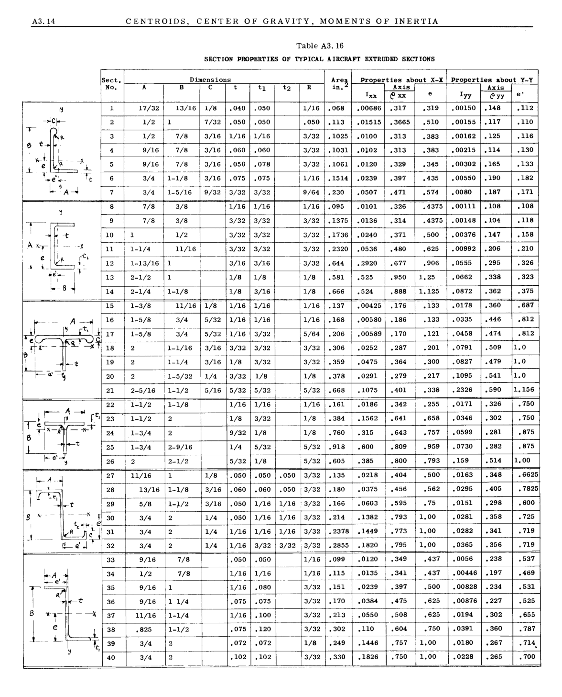

A3.14 CENTROIDS, CENTER OF GRAVITY, MOMENTS OF INERTIA

Table A3.16

SECTION PROPERTIES OF TYPICAL AIRCRAFT EXTRUDED SECTIONS

|Col1|Sect. No.|Dimensions|Col4|Col5|Col6|Col7|Col8|Col9|Are~ in.|Prooerties about X-X eAxxxis Ixx e|Col12|Col13|Properties about y-y r----=---=- Axis I yy eyy e'|Col15|Col16|
|---|---|---|---|---|---|---|---|---|---|---|---|---|---|---|---|
||Sect. No.|~~A~~|B|C|~~t~~|tl|t2|~~R~~|~~R~~|~~R~~|~~R~~|~~R~~|~~R~~|~~R~~|~~R~~|
||Sect. No.|~~A~~|B|C|~~t~~|tl|t2|~~R~~|~~R~~|~~R~~|~~exx~~|~~exx~~|~~exx~~|_eyy_|e'|
|!~ -.-:Ci"- r :t~ 90- e t y.-J k-_--J,_ ~ e ~ _L_ l_e'~_ -It L~A-.I|1|17/32|13/16|1/8|.040|.050||1/16|.068|.00686|.317|.319|.00150|.148|.112|
|!~ -.-:Ci"- r :t~ 90- e t y.-J k-_--J,_ ~ e ~ _L_ l_e'~_ -It L~A-.I|2|1/2|1|7/32|.050|.050||.050|.113|.01515|.3665|.510|.00155|.117|.110|
|!~ -.-:Ci"- r :t~ 90- e t y.-J k-_--J,_ ~ e ~ _L_ l_e'~_ -It L~A-.I|3|1/2|7/8|3/16|1/16|1/16||3/32|.1025|.0100|.313|.383|.00162|.125|.116|
|!~ -.-:Ci"- r :t~ 90- e t y.-J k-_--J,_ ~ e ~ _L_ l_e'~_ -It L~A-.I|4|9/16|7/8|3/16|.060|.060||3/32|.1031|.0102|.313|.383|.00215|.114|.130|
|!~ -.-:Ci"- r :t~ 90- e t y.-J k-_--J,_ ~ e ~ _L_ l_e'~_ -It L~A-.I|5 |9/16 |7/8 --~~ ~~1-~~1/8 - ---.._- 1-5/16|3/16  -- 3/16 - 9/32|.050 |.078 |13/32 |13/32 |.1061 |.0120 |.329 |.345 |.00302 |.165 |.133 |
|!~ -.-:Ci"- r :t~ 90- e t y.-J k-_--J,_ ~ e ~ _L_ l_e'~_ -It L~A-.I|6|3/4|3/4|3/4|.075|~~.075~~|i 1/16|i 1/16|~~.1514~~|~~.0239~~|~~.397~~|.435|~~.00550~~|~~.190~~|~~.182~~|
|!~ -.-:Ci"- r :t~ 90- e t y.-J k-_--J,_ ~ e ~ _L_ l_e'~_ -It L~A-.I|7|_.- 3/4|_.- 3/4|_.- 3/4|3/32|3/32||9/64|.230|.0507|.471|.574|.0080|.187|.171|
|'j'l( i I ' t A~.- I -- _-x_ e I I'- _,--t\_ 1._ '_ ie'~ 1 1 ~- 84|8|7/8|3/8||1/16|1/16||1/16|.095|.0101|.326|.4375|.00111|.108 |.108 |
|'j'l( i I ' t A~.- I -- _-x_ e I I'- _,--t\_ 1._ '_ ie'~ 1 1 ~- 84|9|7/8|3/8||3/32|3/32||3/32|.1375|.0136|.314|.4375|.00148|~~.104~~|~~.118~~|
|'j'l( i I ' t A~.- I -- _-x_ e I I'- _,--t\_ 1._ '_ ie'~ 1 1 ~- 84|10|1|1/2||3/32|3/32||3/32|.1736|.0240|.371|.500|.00376|.147|.158|
|'j'l( i I ' t A~.- I -- _-x_ e I I'- _,--t\_ 1._ '_ ie'~ 1 1 ~- 84|11|1-1/4|11/16||3/32|3/32||3/32|.2320|.0536|.480|.625|.00992|.206|.210|
|'j'l( i I ' t A~.- I -- _-x_ e I I'- _,--t\_ 1._ '_ ie'~ 1 1 ~- 84|12|1-13/16|1||3/16|3/16||3/32|.644|.2920|.677|.906|.0555|.295|.326|
|'j'l( i I ' t A~.- I -- _-x_ e I I'- _,--t\_ 1._ '_ ie'~ 1 1 ~- 84|13|2-1/2|1||1/8|1/8||1/8|.581|.525|.950|1.25|.0662|.338|.323|
|'j'l( i I ' t A~.- I -- _-x_ e I I'- _,--t\_ 1._ '_ ie'~ 1 1 ~- 84|14|2-1/4|1-1/8||1/8|3/16||1/8|.666|.524|.888|1.125|.0872|.362|.375|
|~I- -- I~_ A_ .t1J ey--,~~~C~~ rrl- - !L_)( ~ I, ~ _.:I-t ,-""-->Is |15|1-3/8|11/16|1/8|1/16|1/16||1/16|.137|.00425|.176|.133|.0178|.360|.687|
|~I- -- I~_ A_ .t1J ey--,~~~C~~ rrl- - !L_)( ~ I, ~ _.:I-t ,-""-->Is |16|1-5/8|3/4 I-- ---- 3/4|5/32 - - 5/32|1/16 1----- 1/16|1/16||1/16 |.168|.00580|.186|.133|.0335|.446|.812|
|~I- -- I~_ A_ .t1J ey--,~~~C~~ rrl- - !L_)( ~ I, ~ _.:I-t ,-""-->Is |17 |~~--~~ 1-5/8|~~--~~ 1-5/8|~~--~~ 1-5/8|~~--~~ 1-5/8|3/32||~~--~~ 5/64|.206|.00589|.170|.121|.0458|.474|.812|
|~I- -- I~_ A_ .t1J ey--,~~~C~~ rrl- - !L_)( ~ I, ~ _.:I-t ,-""-->Is |18|2|1-1/16|3/16|3/32|3/32|~~1---~~|3/32|.306|.0252|.287|.201|.0791|.509|1.0|
|~I- -- I~_ A_ .t1J ey--,~~~C~~ rrl- - !L_)( ~ I, ~ _.:I-t ,-""-->Is |19 |2 |1-1/4 |3/16 |1/8 |3/32 ||3/32 |.359 |.0475 |.364 |.300 , |.0827 |.479 |1.0 |
|~I- -- I~_ A_ .t1J ey--,~~~C~~ rrl- - !L_)( ~ I, ~ _.:I-t ,-""-->Is |20 |2|~~1-5/32~~ ~~1/4~~|~~1-5/32~~ ~~1/4~~|~~3/32~~|~~1/8~~||~~1/8~~|~~.378~~|~~.0291~~|~~.279~~  .217 I|~~.279~~  .217 I|~~.1095~~|~~• 541~~|~~1.0~~|
|~I- -- I~_ A_ .t1J ey--,~~~C~~ rrl- - !L_)( ~ I, ~ _.:I-t ,-""-->Is |21 |2-5/16|1-1/2|5/16|5/32|5/32||, 5/32|.668|.1075|.401|.338|• 2326|.590|1.156|
|I _A_ ----- ~~leF~~ e" :-T( ~*T I ' -L---I- e' ~ |22 |1-1/2|1-1/8||1/16|1/16||1/16|.161|.0186|.342 0255|.342 0255|.0171|.326|.750 |
|I _A_ ----- ~~leF~~ e" :-T( ~*T I ' -L---I- e' ~ |23|1-1/2|2||1/8|3/32||1/8|.384|.1562|.641|.658|.0346|• 302|~~.750~~|
|I _A_ ----- ~~leF~~ e" :-T( ~*T I ' -L---I- e' ~ |24|1-3/4|2||9/32|1/8||1/8|.760|.315|.643|.757|.0599|.281|.875|
|I _A_ ----- ~~leF~~ e" :-T( ~*T I ' -L---I- e' ~ |25|1-3/4|2-9/16||1/4|5/32|: 5/32|: 5/32|.918|.600|.809|.959|.0730|.282|.875|
|I _A_ ----- ~~leF~~ e" :-T( ~*T I ' -L---I- e' ~ |26|2|2-1/2||5/32|1/8|i 5/32|i 5/32|.605|.385|.800|.793|.159|.514|1.00|
|!--11, 27 , 28 ,1r.:t;" I _.~ ~~I~~ II---t ! 29 8 ~- - -- --)\~~ , ~~30 - t...,..-_ e_ :~;J 31 ~t_ !Le' .j 32|27|11/16|1|1/8 |.050 |.050 |.050 |3/32|.135 |.0218 |.404 |.500 |.0163 |.348 |.6625 |
|!--11, 27 , 28 ,1r.:t;" I _.~ ~~I~~ II---t ! 29 8 ~- - -- --)\~~ , ~~30 - t...,..-_ e_ :~;J 31 ~t_ !Le' .j 32|28  |13/16|1-1/8|~~3/16~~|~~.060~~|~~.060~~|~~.050~~ ! 3/32|~~.050~~ ! 3/32|~~.180~~|~~.0375~~|~~.456~~|.562|~~.0295~~|~~.405~~|~~.7825~~|
|!--11, 27 , 28 ,1r.:t;" I _.~ ~~I~~ II---t ! 29 8 ~- - -- --)\~~ , ~~30 - t...,..-_ e_ :~;J 31 ~t_ !Le' .j 32|28  |5/8|1-;1/2|3/16|.050|1/16|1/16 3/32|1/16 3/32|.166|.0603|.595|.75|.0151|.298|.600|
|!--11, 27 , 28 ,1r.:t;" I _.~ ~~I~~ II---t ! 29 8 ~- - -- --)\~~ , ~~30 - t...,..-_ e_ :~;J 31 ~t_ !Le' .j 32|30 |3/4|2|1/4|.050|1/16|1/16|3/32|.214|.1382|.793|1.00|.0281|.358|.725|
|!--11, 27 , 28 ,1r.:t;" I _.~ ~~I~~ II---t ! 29 8 ~- - -- --)\~~ , ~~30 - t...,..-_ e_ :~;J 31 ~t_ !Le' .j 32|31|3/4|2|1/4|1/16|1/16|1/16|3/32|.2378|.1449|.773|1.00|.0282|.341|.719|
|!--11, 27 , 28 ,1r.:t;" I _.~ ~~I~~ II---t ! 29 8 ~- - -- --)\~~ , ~~30 - t...,..-_ e_ :~;J 31 ~t_ !Le' .j 32|32|3/4|2|1/4|1/16|3/32|3/32|3/32|.2855|.1820|.795|1.00|.0365|.356|.719|
|_LA_ ~ ~e''''' I~ I ~ I~-t B *rl -->; J _e_ L6==J. -- - ~ ~,|33|9/16|7/8||.050|.050||1/16|.099|.0120|.349|.437|.0056|.238|.537|
|_LA_ ~ ~e''''' I~ I ~ I~-t B *rl -->; J _e_ L6==J. -- - ~ ~,|34|1/2|7/8||1/16 |1/16 _.--- .080|--|1/16  -- 3/32|.115 I------ .151|.0135|.341|.437|.00446|.197|.469|
|_LA_ ~ ~e''''' I~ I ~ I~-t B *rl -->; J _e_ L6==J. -- - ~ ~,|35|9/16|1||~~-~~ 1/16 |~~-~~ 1/16 |~~-~~ 1/16 |~~-~~ 1/16 |~~-~~ 1/16 |.0239|.397|.500|.00828|.234|.531|
|_LA_ ~ ~e''''' I~ I ~ I~-t B *rl -->; J _e_ L6==J. -- - ~ ~,|36|9/16|1 1/4||~~-~~ .075|.075||3/32|.170|.0384|.475|.625|.00876|.227|.525|
|_LA_ ~ ~e''''' I~ I ~ I~-t B *rl -->; J _e_ L6==J. -- - ~ ~,|37|11/16|1-1/4||1/16|.100||3/32|.213|.0550|.508|.625|.0194|.302|.655|
|_LA_ ~ ~e''''' I~ I ~ I~-t B *rl -->; J _e_ L6==J. -- - ~ ~,|38|.825|1-1/2||.075|.120||3/32|.302|.110|.604|.750|.0391|.360|.787|
|_LA_ ~ ~e''''' I~ I ~ I~-t B *rl -->; J _e_ L6==J. -- - ~ ~,|39|3/4 |3/4 ||.072|.072||1/8|.249|.1446|.757|1.00|.0180|.267|.714,|
|_LA_ ~ ~e''''' I~ I ~ I~-t B *rl -->; J _e_ L6==J. -- - ~ ~,|40|40|40||.102|.102||3/32 |.330|.1826|.750|1.00|.0228|.265|.700|
|||-|-|||||~~-~~||||||||

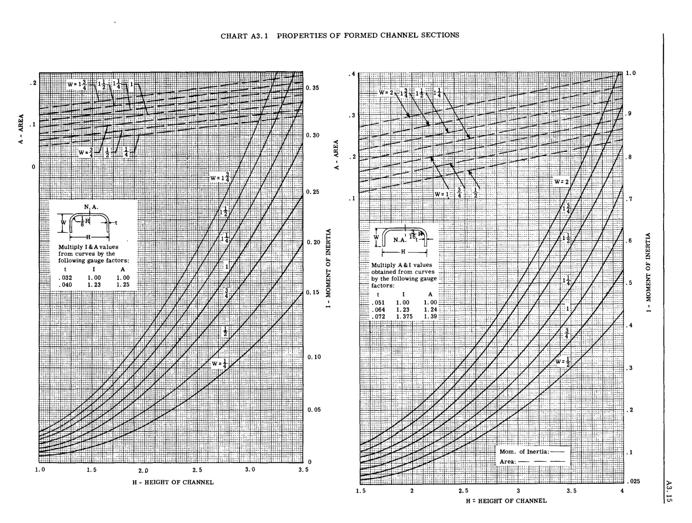

CHART A3.1 PROPERTIES OF FORMED CHANNEL SECTIONS

.. 4 1:L+~j n-:;-1

r":,i TTT'

'tifF'

jm:1L

tt+

,t

.iE,bF

I"

.8

:en
H'

{~~~H ~r::r:"""""'- -, -, _1_ T- lEI:::: _4Nt_

+co

<

; .1

I

<

1.0 1.5

_2.D_

0.30 <

.3

""
e;j .2

I

...:
J. ",.j,"".;1. f~ 0.25 .1

~

0.15 ::;i

0.05

EfutE±:

'~'I

,:::h,

1::-1

~:

1.5

,.~_" ..,.;C ...,.:iIIH
.. tI:' .•

,;,: :':T=: _~

i::t:

+,

+ll'H·

i· :'tt-: t ~

t;

:!::t",',U"j

:j:::::::11

:-:~~:.1:.:...u

L:';J+;.;:

W=2

~~'~~ S'"

'7t:i

~~! .~=+= ..

      - :t 3
::tW= lc.1:"4

i--:::-:.

~3 1 -U~"'i~~ m"~ .~,~
='---W 'It ::.1="
~- L N.A. t = .. - --= tr 1::=:."

H

=

:::=:: MultIply r- A&I ------J values ~~_ ~

ii'S
. ii.

~

"-1

If -:t-_:'

""
"-1 :s
-:t-_:' 0 ~

~~---'-I ~
.5 ""

::;i

R=:j ~

I.  - ..

'e

~

m'

I.  - ..

'e

~
0

:s
!i:

H

=

:::=:: MultIply r- A&I ------J values ~~_ _ ~

:':~L:
'-:-::' : ~:=:-=

ii'S
. ii.

:':~L:

fl : ~:=:-=

H

............-L-.,. **obtained from** **curves** ~ 'I t+
== by the folloWIng gauge ~ =
_::.' factors: ." -==
p t I A::,:...
.051 1. 00 1. 00:;::

.8 . 064 1. 23 1. 24 "'

I

t:-::-, ..

~ :-r;

1"'

L'; ..

::;i

~

p t I A::,:...
.051 1. 00 1. 00:;::

.8 . 064 1. 23 1. 24 "'

I +t+: .072 1. 375 }.~=:;::

. r:'ll

I"·l=::

~:..r~t : i ;

;.l-<j'-<4±k~

1;:

-1-1'

I

 
.4

.3

.2

n:-~

Mom. of Inertia:

dh **Area:**

::tJ:t:tt:;:tt'clL:

-+-~:

'i::

~

- ~-I-I·.

..• :n:

,~:;-i;

_{nil_
:.:4

,1

: 3'

4"

..\v=it:·,

-;::L"t

n::::t:

it

--<'-·-It

~

+ti-:J~'

;1-t-'

w

....

'"

'1:"

o

3.5

2.5 3.0

~m:EtE!EJ +!~ TIl . 1

-13fT

.025

4

;;-;-;!n;':l~;;:n..;r

1::I;,:,j""

2.5 3 3.5

H : HEIGHT OF CHANNEL

H - HEIGHT OF CHANNEL

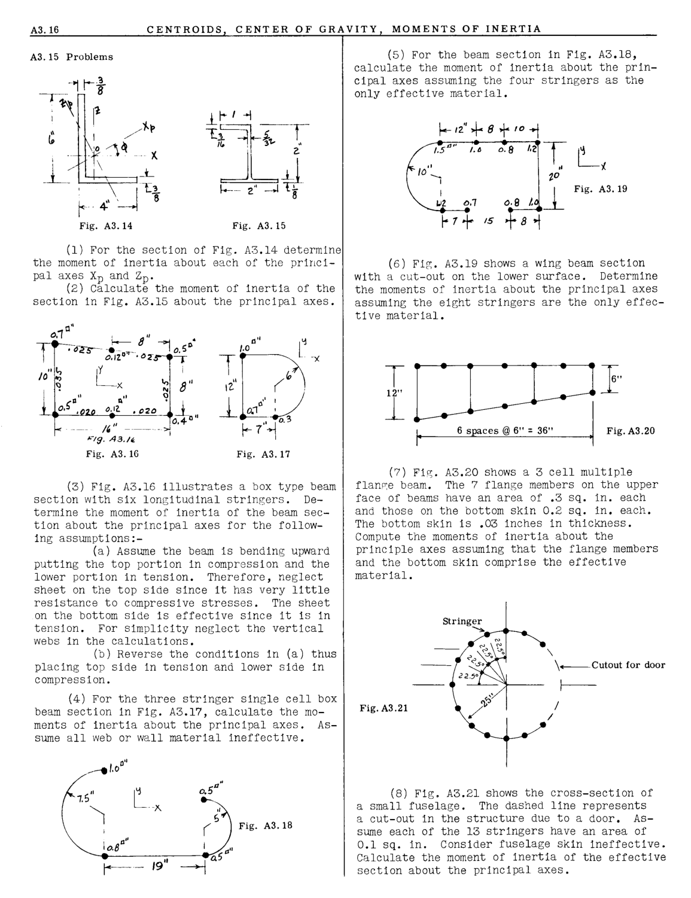

A3.16 CENTROIDS CENTER OF GRAVITY MOMENTS OF INERTIA

## A3.15 Problems

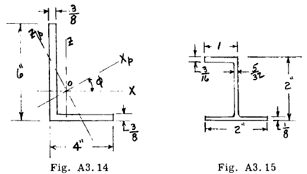

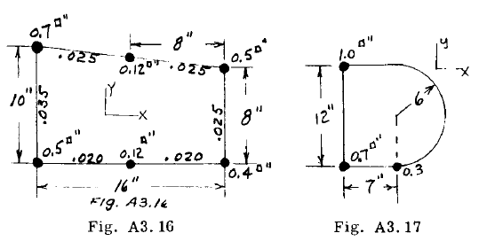

Fig. A3.14 Fig. A3.15

(1) For the section of Fig. A3.14 determine
the moment of inertia about each of the principal axes Xp and Zp.
(2) Calculate the moment of inertia of the
section in Fig. A3.15 about the principal axes.

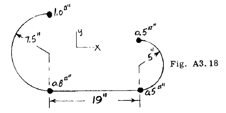

_ng._ _A3.N._

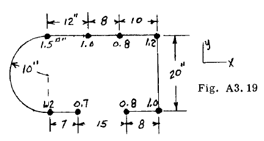

Fig. A3.16 Fig. A3.17

(3) Fig. A3.16 illustrates a box type beam
section with six longitudinal stringers. Determine the moment of inertia of the beam section about the principal axes for the following assumptions:(a) Assume the beam is bending upward
putting the top portion in compression and the
lower portion in tension. Therefore, neglect
sheet on the top side since it has very little
resistance to compressive stresses. The sheet
on the bottom side is effective since it is in
tension. For simplicity neglect the vertical
webs in the calculations.
(b) Reverse the conditions in (a) thus
placing top side in tension and lower side in
compression.

(4) For the three stringer single cell box
beam section in Fig. A3.17, calculate the moments of inertia about the principal axes. Assume all web or wall material ineffective.

0"
_....-./.0_

1. 5"

(5) For the beam section in Fig. A3.18,
calculate the moment of inertia about the principal axes assuming the four stringers as the
only effective material.

~d' + 8 + _(0-1_

_/05"'''_ _/.e_ _0·8_ /,2 T L

_10''-_ _'2_ _0"_ "/..
1

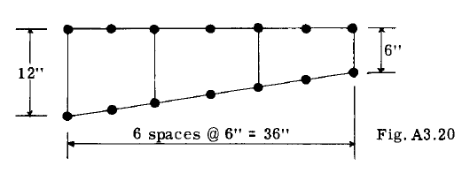

(8) Fig. A3.21 shows the cross-section of
a small fuselage. The dashed line represents
a cut-out in the structure due to a door. Assume each of the 13 stringers have an area of
0.1 sq. in. Consider fuselage skin ineffective.
Calculate the moment of inertia of the effective
section about the principal axes.

_,",2._ I _D,"_ _0.8_ /. ~

/5 + 8 1

Fig. A3.19

(6) Fig. A3.19 shows a wing beam section
with a cut-out on the lower surface. Determine
the moments of inertia about the principal axes
assuming the eight stringers are the only effective material.

Trrrll;.,
12,,~L
1- r 6 '1"""' @ 6" ~ 36" .1 Fig. A3.20

(7) Fig. A3.20 shows a 3 cell multiple

flan~e beam. The 7 flange members on the upper
face of beams have an area of .3 sq. in. each
and those on the bottom skin 0.2 sq. in. each.
The bottom skin is .03 inches in thickness.
Compute the moments of inertia about the
principle axes assuming that the flange members
and the bottom skin comprise the effective
material.

\

\ Cutout for door

f-

Fig. A3.21

/
_I_

l

I

_a"_
1 0 .8

!) "
( Fig. A3.18

