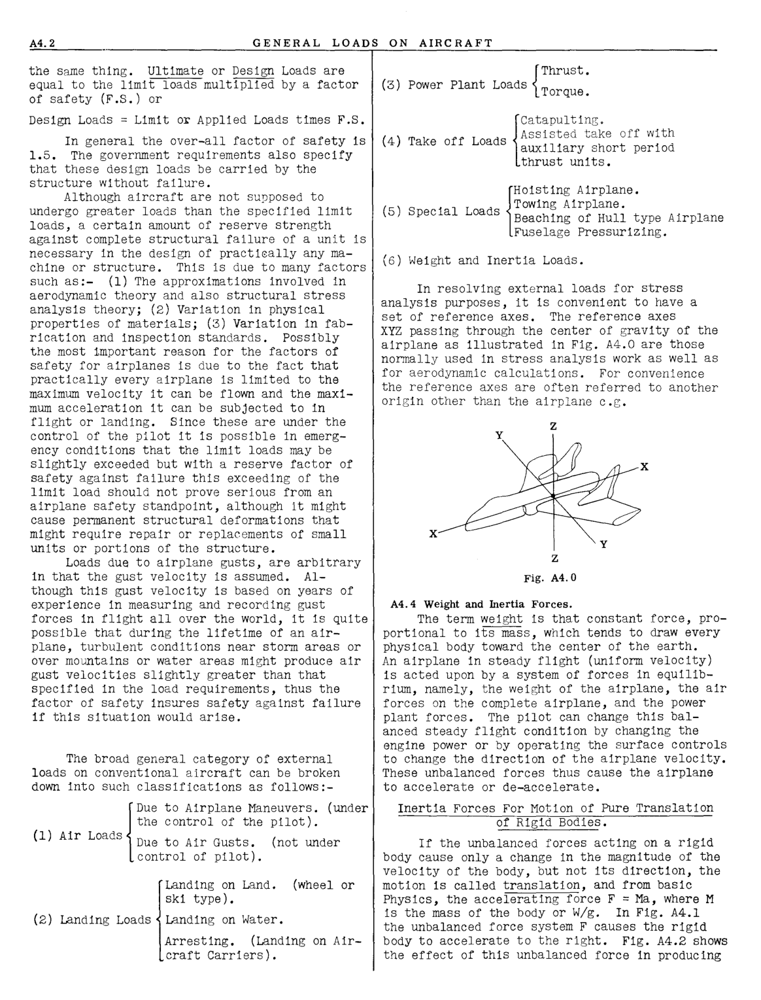
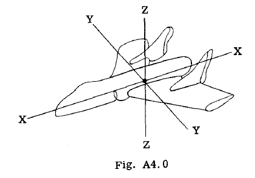

## A4.2 Limit or Applied Loads. Design Loads.
Because an airplane is designed to carry
out a definite job, there result many types of
aircraft relative to size, configuration and
performance. For example, a commercial transport like the Douglas DC-8 is designed to do a
job of transporting a certain number of pass

engers safely, efficiently and comfortably over
various distances between airports. On the
other hand the Air Force Fighter type of aircraft has a job of shooting down enemy aircraft
or protecting slower friendly aircraft. To do
this job efficiently requires a far different
configuration as compared to the DC-8 transport.
Furthermore the Fighter type airplane must be
maneuvered far more sharply to do its required
job as compared to the DC-8 in doing its required job.
In general the magnitUde of the air forces
on an airplane depend on the velocity of the
airplane and the rate at which this velocity is
changed in magnitude and direction (acceleration).
The magnitude of the flight acceleration factor
may be governed by the capacity of the human
body to withstand these acceleration inertia
forces without injury which is the situation in
a fighter type of airplane. On the other hand
the maneuvering accelerations for the DC-8 are
not dictated by what the human body can Withstand, but are determined by what is necessary
to safely transport passengers from one airport
to another.
Designing the airplane structure for loads
greater than the airplane suffers in the performance of its reqUired job, obviously will add
considerable weight to the airplane and decrease
its performance or over-all efficiency relative
to the job it is designed to do.
To particularly insure safety in the airtransportation, along With uniformity and ef
ficienc~ of design, the government aeronautical
agencies (civil and military) have definite requirements for the various types of aircraft
relative to the magnitude of loads to be used in
the structural design of aircraft. In referring
in general to these specified aircraft loads two
terms are used as follows:
Limit or Applied Loads.
The terms limit and applied refer to the
same loads With the civil agencies (C.A.A.)
using the term limit and the military agencies
using the term applied.
Limit loads are the maximum loads anticipated on the airplane during its lifetime of
service.
The airplane structure shall be capable of
supporting the limit loads Without suffering
detrimental permanent deformations. At all loads
up to the limit loads the deformation of the
structure shall be such as not to interfere With
the safe operation of the airplane.

Ultimate or Design Loads.
These two terms are used in general to mean

A4.1

A4.2 GENERAL LOADS ON AIRCRAFT

the same thing. Ultimate or Design Loads are
equal to the limit loads multiplied by a factor
of safety (F.S.) or

Design Loads = Limit or Applied Loads times F.S.

In general the over-all factor of safety is
1.5. The government requirements also specify
that these design loads be carried by the
structure without failure.
Although aircraft are not supposed to
undergo greater loads than the specified limit
loads, a certain amount of reserve strength
against complete structural failure of a unit is
necessary in the design of practi8ally any machine or structure. This is due to many factors
such as:- (1) The approximations involved in
aerodynamic theory and also structural stress
analysis theory; (2) Variation in physical
properties of materials; (3) Variation in fabrication and inspection standards. Possibly
the most important reason for the factors of
safety for airplanes is due to the fact that
practically every airplane is limited to the
maximum velocity it can be flown and the maximum acceleration it can be subjected to in
flight or landing. Since these are under the
control of the pilot it is possible in emergency conditions that the limit loads may be
slightly exceeded but with a reserve factor of
safety against failure this exceeding of the
limit load should not prove serious from an
airplane safety standpoint, although it might
cause permanent structural deformations that
might require repair or replacements of small
units or portions of the structure.
Loads due to airplane gusts, are arbitrary
in that the gust velocity is assumed. Although thiS gust velocity is based on years of
experience in measuring and recording gust
forces in flight allover the world, it is qUite
possible that during the lifetime of an airplane, turbulent conditions near storm areas or
over mountains or water areas might produce air
gust velocities slightly greater than that
specified in the load requirements, thus the
factor of safety insures safety against failure
if this situation would arise.

The broad general category of external
loads on conventional aircraft can be broken
down into such classifications as follows:

Due to Airplane Maneuvers. (under
the control of the pilot).
(1) Air Loads Due to Air Gusts. (not under

(control of pilot).

Thrust.
(3) Power Plant Loads Torque.

(6) Weight and Inertia Loads.

In resolving external loads for stress
analysis purposes, it is convenient to have a
set of reference axes. The reference axes
XYZ passing through the center of gravity of the
airplane as illustrated in Fig. A4.0 are those
normally used in stress analysis work as well as
for aerodynamic calCUlations. For convenience
the reference axes are often referred to another
origin other than the airplane c.g.

z

y

x

y

Z

Fig. A4.0
