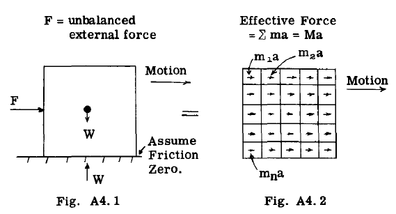
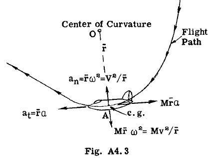

## A4.4 Weight and Inertia Forces.

The term weight is that constant force, proportional to its mass, which tends to draw every
physical body toward the center of the earth.
An airplane in steady flight (uniform velocity)
is acted upon by a system of forces in equilibrium, namely, the weight of the airplane, the air
forces on the complete airplane, and the power
plant forces. The pilot can change this balanced steady flight condition by changing the
engine power or by operating the surface controls
to change the direction of the airplane velocity.
These unbalanced forces thus cause the airplane
to accelerate or de-accelerate.

### Inertia Forces For Motion of Pure Translation of Rigid Bodies.

If the unbalanced forces acting on a rigid
body cause only a change in the magnitude of the
velocity of the body, but not its direction, the
motion is called translation, and from basic
Physics, the accelerating force F = Ma, where M
is the mass of the body or W/g. In Fig. A4.1
the unbalanced force system F causes the rigid
body to accelerate to the right. Fig. A4.2 shows
the effect of this unbalanced force in producing
a force on each mass particle of $m_1 a, m_2 a,$ etc.,
thus the total effective force is $\sum ma = Ma.$ If
these effective forces are reversed they are referred to as inertia forces. The external
forces and the inertia forces therefore form a
force system in equilibrium.

From basic Physics, we have the following
relationships for a motion of pure translation
if the acceleration is constant:-

$$
\begin{align*}
v - v_0 = at \\
s = v_0 t + \frac{1}{2} at\\
v^2 - v_0^2 = 2as\\
\end{align*}
$$

where,

s = distance moved in time t.

$v_0$ = initial velocity

v =final velocity after time t.

### Inertia Forces on Rotating Rigid Bodies.

A common airplane maneuver is a motion
along a curved path in a plane parallel to the
XZ plane of the airplane, and generally referred
to as the pitching plane. A pUll up from steady
flight or a pUllout from a dive causes an airplane to follow a curved path. Fig. A4.3 shows
an airplane following a curved path. If at
point A the velocity is increasing along its
path, the airplane is being sUbjected to two
accelerations, namely, at, tangential to the
curve at point A and equal in magnitude to
$a_t = \bar{r} a, and a_n = \bar{r} \omega ^2$ an acceleration normal to
the flight path at A and directed toward the
center of rotation (o). From Newton's Law the
effective forces due to these accelerations
are:-

$$
F_n = M \bar{r} \omega ^2 = Mv^2 /r   -   - (4)
F_t = M \bar{r} a   - - -   -- -   -   - (5 )
$$

Where 

$\omega$ = angular velocity at the point A.

a = angular acceleration at point A.

r = radius of curvature of flight path at point A.

The inertia forces are equal and opposite
to these effective forces as indicated in Fig.
A4.3. These inertia forces can then be considered as part of the total force system on the
airplane which is in equilibrium.

If the velocity of the airplane along the
path is constant, then $a_t$ = zero and thus the
inertia force $F_t = 0,$ leaving only the normal
inertia force Fn.
If the angular acceleration is constant,
the following relationships hold.

$$
\begin{align*}
\omega - \omega _0 = at - - - - - - - - - - - (6)\\
\theta = \omega _0 t + \frac{1}{2}at^2 (7)\\
\omega ^2 - \omega _0 ^2  = 2a \theta         - - - - - - (8)
\end{align*}
$$

where 
$\theta$ = angle of rotation in time t.

$\omega _0$ = initial angular velocity in rad/sec.:

$\omega$ = angular velocity after time t.

In Fig. A4.3 the moment To of the inertia
forces about the center of rotation (o) equals
$M \bar{r} a(\bar{r})= M \bar{r} ^2a.$ The term $M \bar{r} ^2$ 2 is the mass moment
of inertia of the airplane about point (o).
Since an airplane has considerable pitching
moment of inertia about its own center of gravity
axis, it should be included. Thus by the
parallel axis

$$
T_o = I_o a + I_{c.g.} a - - - - - - - - (9)
$$

where $I_o = M \bar{r}$ and $I_{c.g.}$ = moment of inertia of
airplane about Y axis through c.g. of airplane.

###  Inertia Forces For Pitching Rotation of Airplane. about Y Axis Through c.g. airplane.

In flight, an air gust may strike the horizontal tail producing a tail force which has a
moment about the airplane c.g. In some landing
conditions the ground or water forces do not
pass through the airplane c.g., thus producing
a moment about the airplane c.g. These moments
cause the airplane to rotate about the Y axis
through the c.g.

Therefore for this effect alone the center
of rotation in Fig. A4.3 is not at (o) but at
the c.g. of airplane, or $\bar{r} = 0.$ Thus Fn and Ft
equal zero and thus the only inertia force for
the pure rotation is $I_{c.g.} a$, (a couple) and
thus the moment of this inertia couple about the
$c.g. = T_{c.g.} = I_{c.g.} a.$
 

As explained before if the inertia forces
are included with all other applied forces on
the airplane, then the airplane is in static
equilibrium and the problem is handled by the
static equations for equilibrium.
