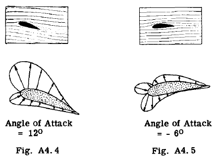
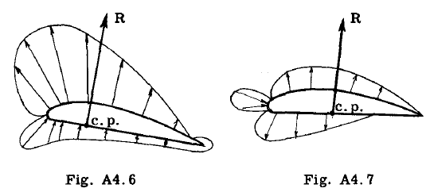
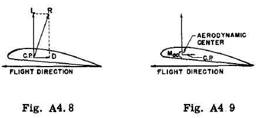

## A4.5 Air Forces on Wing.

The wing of an airplane carries the major
portion of the air forces. In level steady
flight the vertical upward force of the air on
the wing, practically equals the weight of the
airplane. The term airfoil is used when referring to the shape of the cross-section of a
wing. Figs. A4.4 and A4.5 illustrate the 
pressure intensity diagram due to an airstream
flowing around an airfoil shape for both
a positive and negative angle of attack. The
shape and intensity of this diagram is influenced
by many factors, such as the shape of
the airfoil itself, as the thiokness to chord
ratio, the camber of the top and bottom surfaces
etc. A normal wing is attached to a
fuselage and it may support external power
plants, wing tip tanks etc. Furthermore the
normal wing is usually tapered in planform
and thickness and may possess leading and
trailing slots and flaps to produce high lift
or control effects. The airflow around the
wing is affected by such factors as listed
above and thus wind tunnel tests are usually
necessary to obtain a true picture of the air
forces on a wing relative to their chordwise
spanwise distribution.

### Resultant Air Force. Center of Pressure.

It is convenient when dealing With the
balancing or equilibrium of the airplane as a
whole to deal with the reSUltant of the total
air forces on the wing. For example, consider
the two air pressure intensity diagrams in Figs.
A4.6 and A4.7. These distributed force systems
can be replaced by their reSUltant (R), whiCh
of course must be known in magnitUde, direction
and location. The location is specified by a
term called the center of pressure which is the
point where the resultant R intersects the airfoil chord line. As the angle of attack is
changed the reSUltant air force changes in magnitUde, direction and center of pressure
location.

### Lift and Drag Components of ReSUltant Air Force.

Instead of dealing with the reSUltant force
R, it is convenient for both aerodynamic and
stress analysis considerations to replace the
resultant by its two components perpendicular
and parallel to the airstream. Fig. A4.8 illustrates this resolution into lift and drag
components.

### Aerodynamic Center (a.c.).

Since an airplane flies at many different angles of attack,
it means that the center of pressure changes for
the many flight design conditions. It so happens, that there is one point on the airfoil
that the moment due to the Lift and Drag forces
is constant for any angle of attack. This
point is called the aerodynamic center (a.c.)
and its approximate location is at the 25 percent
of chord measured from the leading edge. Thus
the resultant R can be replaced by a lift and
drag force at the aerodynamic center plus a wing
moment Ma.c. as illustrated in Fig. A4.9.
