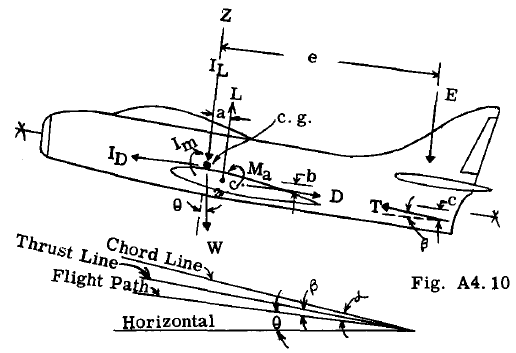

## A4.6 Forces on Airplane in Flight.

Fig. A4.l0 illustrates in general the main
forces on the airplane in an accelerated flight
condition.

T = engine thrust.
L = total wing lift plus fuselage lift.
D = total airplane drag.
Ma = moment of Land D with reference to wing a.c. (aerodynamic center)
W = weight of airplane.
IL = inertia force normal to flight path.
ID = inertia force parallel to flight path.
Im = rotation inertia moment.
E = tail load normal to flight path.

For a horizontal constant velocity flight
condition, the inertia forces IL, ID, and Im
would be zero. For an accelerated flight condition involving translation but not angular
acceleration about its own c.g. axis, the
inertia moment Im would be zero, but IL and ID
would have values.

### Equations of Equilibrium For Steady Flight.

From Fig. A4.l0 we can write:-

$$
~Fx = [0,] D + W sin G-T cos 13 = 0
~Fz* = 0, L - Wcos G+T sin f3 - E = 0
ZMy = 0, - Ma - La - Db + Tc cos f3 + Ee = 0
$$

- \* The bar through letter Z has no significance. Same meaning without bar.

### Equations of Equilibrium in Accelerated Flight.

$$
~F x = 0, D + W sin G - T cos J3 ID = 0
~F = 0, L-W cos G + T sin ~ - [I] = [ 0]
g L [- E]
ZM = 0, - Ma - La - Db + Tc cos f3 + Ee + I = 0
y m
$$

Signs used: 
Forces - Plus is up and toward tail.
Moment - Clockwise is positive.
Distances from c.g. to force Plus is up and toward tail.

