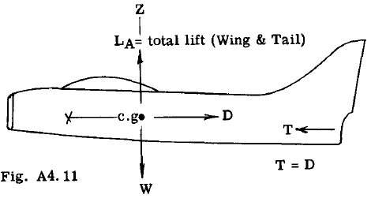
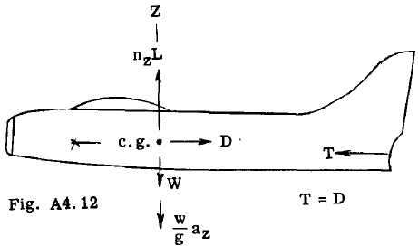
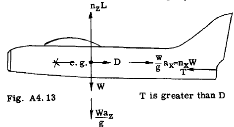

## A4.7 Load Factors.

The term load factor normally given the
symbol (n) can~defined as the numerical multiplying factor by which the forces on the airplane in steady flight are multiplied to obtain
a static system of forces equivalent to the dynamic force system acting during the acceleration of the airplane. Fig. A4.l1 illustrates

forces in steady horizontal flight. L represents the total airplane lift (wing plus tail).
Therefore L = W. Now assume the airplane is accelerated upward along the Z axis. Fig. A4.12
shows the additional inertia force $wa_z/g$ acting
downward, or opposite to the direction of
acceleration. The total airplane lift L for the

unaccelerated condition in Fig. A4.11 must be
multiplied by a load factor $n_z$ to produce static
equilibrium in the g direction.

Thus,

$$
\begin{align*}
n_z L - W \frac{W}{g} a_z = 0\\
\text{Since } L = W\\
\text{Hence } n_z = 1 + a_z / g
\end{align*}
$$

An airplane can of course be accelerated along
the X axis as well as the g axis. Thus in
Fig. A4.l3 the magnitude of the engine thrust T
is greater than the airplane Drag D, which

causes the airplane to accelerate forward. It is
convenient to express the inertia force in the X
direction in terms of the load factor nx and the
weight W  of the airplane, hence

$$
n_X W = \frac{W}{g} a_x  (See Fig. A14.13)\\
\sum F_X = 0, \text{ whence } T-D-n_X W = 0\\
\text{Hence } n_X = \frac{T-D}{W}
$$

Therefore the loads on the airplane can be discussed in terms of load factors. The applied or
limit load factors are the maximum load factors
that might occur during the service of the particular airplane. These loads as discussed in
Art. A4.2 must be taken by the airplane structure without appreciable permanent deformation.

The design load factors are equal to the
limit load factors multiplied by the factor of
safety, and these design loads must be carried
by the structure without rupture or collapse, or
in other words, complete failure.

