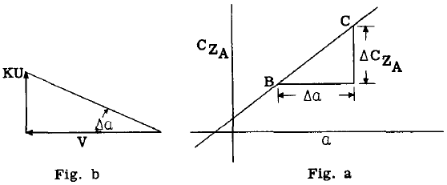
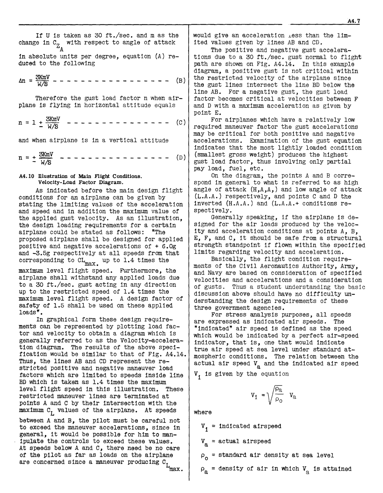

## A4.9 Gust Load Factors.
When a sharp edge gust strikes the airplane
in a direction normal to the thrust line (X
axis), a sudden change takes place in the wing
angle of attack with no sudden change in airplane
speed. The normal force coefficient (C Z ) can
A
be assumed to vary linearly With the angle of
attack. Thus in Fig. (a), let point (B) represent th~ normal airplane force coefficient C
z
A
necessary to maintain level flight With a
velocity V and point (C) the value of C after
z
A
a sharp edged gust KU has caused a sudden change

~a in the angle of attack without change in V.
The total increase in the airplane load in the Z
direction can therefore be expressed by the
ratio C at B.
z
A
From Fig. (b) for small angles, ~a = KU/V
and from Fig. (a), ~CZ = m ~a, where m = the

for small angles, ~a

= KU/V
= the

slope of the

(a), ~CZ = m ~a, where m

A
airplane normal force curve

per radian).

KU~

V

Fig. b

_a_

Fig. a

The load factor increment due to the gust
KU can then be expressed

~CZ

A =
c;:

(KUm) (pV"S)= KUVS m _

V 2W 575 W

(A)

A
Where

U = gust velocity in ft./sec.

K*= gust correction factor depending on
wing loading (Curves for K are provided
by Civil Aeronautics Authorities).

V = indicated air speed in miles per hour.

S = wing area in sq. ft.

W = gross weight of airplane.

 NACA Technical Note 2964 (June 1953), proposes that the
alleviation factor K should be replaced by a gust factor,
Kg = 0.88 Mg/5. 3 + Mg). In this expression Mg is the
airplane mass ratio or mass parameter, 2 W/apcgs, in
which c is the mean geometric chord in feet and g the acceleration due to gravity.

If U is taken as 30 ft./sec. and m as the
change in C with respect to angle of attack
z
A
in absolute units per degree, equation (A) reduced to the following

3KmV
lin = W/S - - - - - - - (B)

Therefore the gust load factor n when airplane is flying in horizontal attitude equals

3KmV
n = 1 + - -- W/S - - - - - - - - - - - - - - - (C)

and when airplane is in a vertical attitude

n = + ~ - - - - - - - - - - - - - - - - (D)
    - W/S