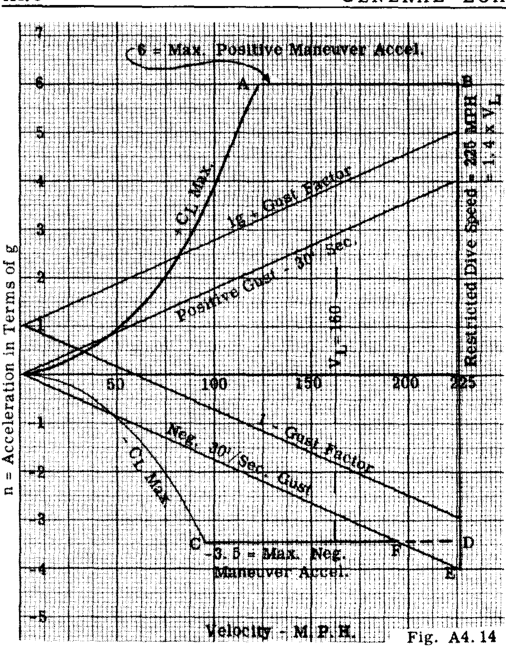

## A4.10 Illustration of Main Flight Conditions. Velocity-Load Factor Diagram.

As indicated before the main design flight
conditions for an airplane can be given by
stating the limiting values of the acceleration
and speed and in addition the maximum value of
the applied gust velocity. As an illustration,
the design loading requirements for a certain
airplane could be stated as follows: "The
proposed airplane shall be designed for applied
positive and negative accelerations of + 6.0g
and -3.5g respectively at all speeds from that
corresponding to CLmax. up to 1.4 times the
maximum level flight speed. Furthermore, the
airplane shall withstand any applied loads due
to a 30 ft./sec. gust acting in any direction
up to the restricted speed of 1.4 times the
maximum level flight speed. A design factor of
safety of 1.5 shall be used on these applied
loads".

In graphical form these design requirements can be represented by plotting load factor and velocity to obtain a diagram which is
generally referred to as the Velocity-acceleration diagram. The results of the above specification would be similar to that of Fig. A4.l4.
Thus, the lines AB and CD represent the restricted positive and negative maneuver load
factors which are limited to speeds inside line
BD which is taken as 1.4 times the maximum
level flight speed in this illustration. These
restricted maneuver lines are terminated at
points A and C by their intersection with the
maximum CL values of the airplane. At speeds
between A and B, the pilot must be careful not
to exceed the maneuver accelerations, since in
general, it would be possible for him to manipulate the controls to exceed these values.
At speeds below A and C, there need be no care
of the pilot as far as loads on the airplane
are concerned since a maneuver producing CLmax.
would give an acceleration ~ess than the limited values given by lines AB and CD.

The positive and negative gust accelerations due to a 30 ft./sec. gust normal to flight
path are shown on Fig. A4.l4. In this example
diagram, a positive gust is not critical within
the restricted velocity of the airplane since
the gust lines intersect the line BD below the
line AB. For a negative gust, the gust load
factor becomes critical at velocities between F
and D with a maximum acceleration as given by
point E.

For airplanes which have a relatively low
required maneuver factor the gust accelerations
may be critical for both positive and negative
accelerations. Examination of the gust equation
indicates that the most lightly loaded condition
(smallest gross weight) produces the highest
gust load factor, thus involving only partial
pay load, fuel, etc.

On the diagram, the points A and B correspond in general to what is referred to as high
angle of attack (H,A,A,) and low angle of attack
(L.A.A.) respectively, and points C and D the
inverted (H.A.A.) and (L.A.A.+ conditions) respectively.

Generally speaking, if the airplane is designed for the air loads produced by the velocity and acceleration conditions at points A, B,
E, F, and C, it should be safe from a structural
strength standpoint if flown within the specified
limits regarding velocity and acceleration.

Basically, the flight condition requirements of the Civil Aeronautics Authority, Army,
and Navy are based on consideration of specified
velocities and accelerations and a consideration
of gusts. Thus a student understanding the basic
discussion above should have no difficulty understanding the design requirements of these
three government agencies.

For stress analysis purposes, all speeds
are expressed as indicated air speeds. The
"indicated" air speed is defined as the speed
Which would be indicated by a perfect air-speed
indicator, that is, one that would indicate
true air speed at sea level under standard atmospheric conditions. The relation between the
actual air speed Va and the indicated air speed
Vi is given by the equation

$$
Vi = \sqrt{\rho _a / \rho _o} V_a
$$

where

Vi = indicated airspeed

Va = actual airspeed

Po = standard air denSity at sea level

Pa = density of air in which Va is attained

