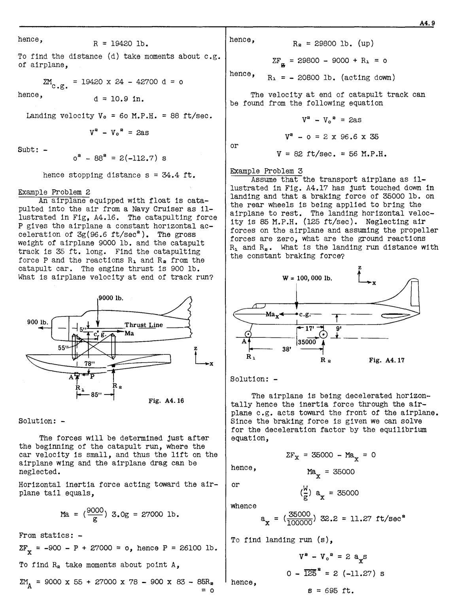
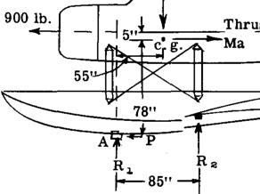
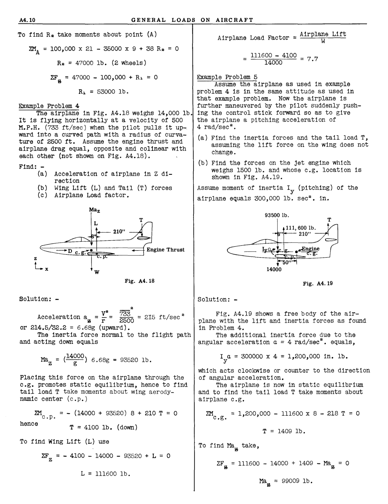
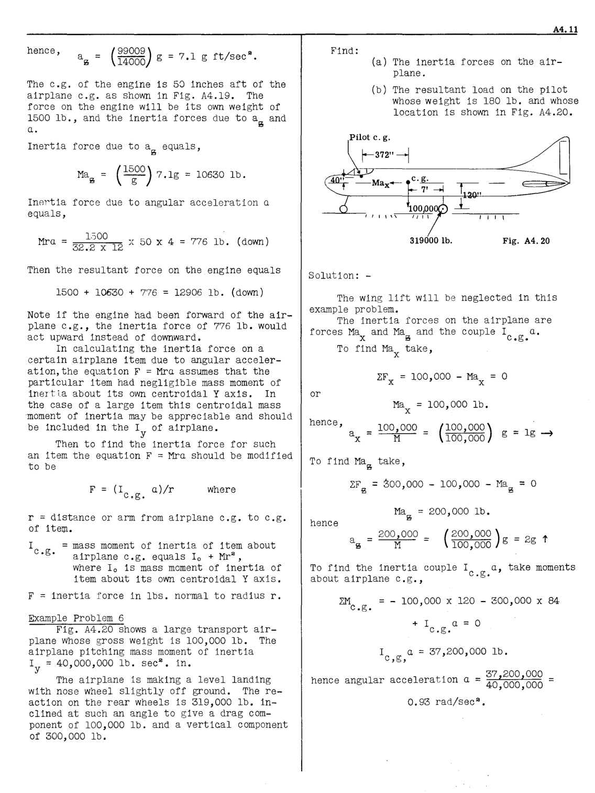
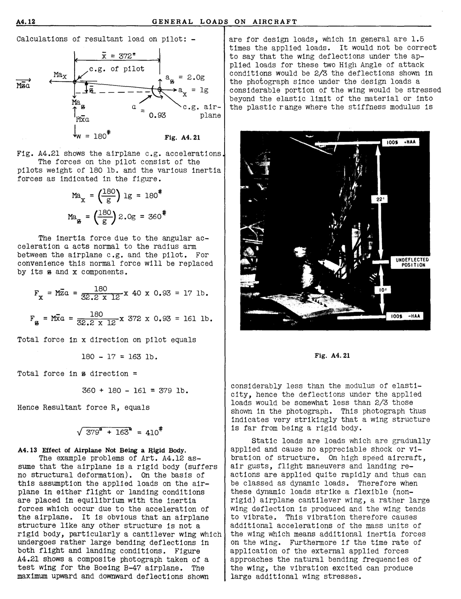

## A4.12 Example Problems Involving Accelerated Motion of Rigid Airplane.
As previously explained, it is general
practice to place the airplane under accelerated
conditions of motion into a condition of static
equilibrium by adding the inertia forces to the
applied force system acting on the airplane. It
is usually assumed that the airplane is a rigid
body. Several example problems will be presented to illustrate this general procedure.

Example Problem 1
Fig. A4.15 illustrates an airplane landing
on a Navy aircraft carrier and being arrested by
a cable pUll T on the airplane arresting hook.
If the airplane - weight is 12,000 lbs. and the
airplane is given a constant acceleration of 3.5g
(112.7 ft/sec [2] ), find the hook pUll T, the wheel
reaction R, and the distance (d) between the line
of action of the hook pUll and the airplane e.g.
If the landing velocity is 60 M.P.H. What is the
stopping distance.

W = 12000 lb.

R

Fig. A4.15

Solution: 

On contact of the airplane with the arresting cable, the airplane is decelerated to the
right relative to Fig. A4.15. The motion is pure
translation horizontally. The inertia force is

Ma = ~ g a = (12000) 3 5g g' = 42000 lb    

The inertia force acts opposite to the direction
of acceleration, hence to the left as shown in
Fig. A4.15.
The unknown forces T and R can now be solved
for by using the static equations of equilibrium.

~FX = -42000 + T cos 10° 0

hence,

T = 42700 lb.

-12000 + R - 42700 x sin 10n

o

A4.9

hence, R = 19420 lb.

To find the distance (d) take moments about c.g.
of airplane,

hence,
Rs = 29800 lb. (up)

~F~ = 29800 - 9000 + R1 = 0

hence, R1 = _ 20800 lb. (acting down)
L:M 19420 x 24 - 42700 d = 0
c.g.
hence, The velocity at end of catapult

19420 x 24 - 42700 d = 0

d = 10.9 in.

The velocity at end of catapult track can
be found from the following equation

Landing velocity Vo = 60 M.P.H. = 88 ft/sec.

V S                       - 0 = 2 x 96.6 x 35

SUbt: - or
v = 82 ft/sec. = 56 M.P.H.

hence stopping distance s = 34.4 ft.

Example Problem 2
An airplane equipped with float is catapulted into the air from a Navy Cruiser as illustrated in Fig, A4.16. The catapulting force
P gives the airplane a constant horIzontal acceleration of 3g(96.6 ft/sec S ). The gross
weight of airplane 9000 lb. and the catapult
track is 35 ft. long. Find the catapulting
force P and the reactions R1 and Rs from the
catapult car. The engine thrust is 900 lb.
What is airplane velocity at end of track run?

9000 lb.

Fig. A4.16

Solution: 

The forces will be determined just after
the beginning of the catapult run, where the
car velocity is small, and thus the lift on the
airplane wing and the airplane drag can be
neglected.

Horizontal inertia force acting toward the airplane tail equals,

Example Problem 3
Assume that the transport airplane as illustrated in Fig. A4.17 has just touched down in
landing and that a braking force of 35000 lb. on
the rear Wheels is being applied to bring the
airplane to rest. The landing horizontal velocity is 85 M.P.H. (125 ft/sec). Neglecting air
forces on the airplane and assuming the propeller
forces are zero, what are the ground reactions
R1 and Rs • What is the landing run distance With
the constant braking force?

W = 100,000 lb.

The airplane is being decelerated horizontally hence the inertia force through the airplane c.g. acts toward the front of the airplane.
Since the braking force is given we can solVe

for the deceleration factor by the eqUilibrium
equation,

~FX = 35000 - Max = [0]

hence,
Ma = 35000
x

or
W
(-) a = 35000
g x

Solution: 

 r

9'
-1- _

Fig. A4.17

whence
Ma = (9000) 3.0g 27000 lb. 35000 / s
g ax = (100000) 32.2 = 11.27 ft sec

From statics: 

4F = -900 - P + 27000 = 0, hence P = 26100 lb.
x

To find Rs take moments about point A,

ZM = 9000 x 55 + 27000 x 78 - 900 x 83 - 85R s
A = 0

s
o - 125 = 2 (-11.27) s
hence,
8 = 695 ft.

To find landing run (s),

V S

- V o [s] = 2 axs

A4.10 GENERAL LOADS ON AIRCRAFT

To find R s take moments about point (A)

ZM 100,000 x 21  - 35000 x 9 + 38 Rs 0
A =

Rs = 47000 lb. (2 wheels)

ZF~ = 47000 - 100,000 + R~ = 0

R~ = 53000 lb.

Example Problem 4
The airplane in Fig. A4.l8 weighs 14,000 lb.
It is flying horizontally at a velocity of 500
M.P.H. (733 ft/sec) when the pilot pulls it upward into a curved path with a radius of curvature of 2500 ft. Assume the engine thrust and
airplane drag equal, opposite and colinear With
each other (not shown on Fig. A4.l8).

Find: (a) Acceleration of airplane in Z direction
(b) Wing Lift (L) and Tail (T) forces
(c) Airplane Load factor.

T

Fig. A4.18

Solution: 

s
V [s] 733 2
Acceleration a~   - r - 2500 = 215 ft/sec

or 214.5/32.2 = 6.68g (upward).
The inertia force normal to the flight path
and acting down equals

Ma (14~00) 6.68g = 93520 lb.
z =

Placing this force on the airplane through the
e.g. promotes static equilibrium, hence to find
tail load T take moments about wing aerodynamic center (c.p.)

Airplane Load Factor = AirPl~e Lift

111600 - 4100
**=** **14000** **7.7**

Example Problem 5
Assume the airplane as used in example
problem 4 is in the same attitude as used in
that example prOblem. Now the airplane is
further maneuvered by the pilot suddenly pUShing the control stiCk forward so as to give
the airplane a Pitching acceleration of
4 rad/sec [2 ] 

(a) Find the inertia forces and the tail load T,
assuming the lift force on the wing does not
change.

(b) Find the forces on the jet engine which
weighs 1500 lb. and whose c.g. location is
shown in Fig. A4.19.
Assume moment of inertia Iy (pitching) of the
airplane equals 300,000 lb. sec [2 ] - in.

93500 lb.
T

14000

Fig. A4.19

Solution: 

Fig. A4.l9 shows a free body of the airplane with the lift and inertia forces as found
in Problem 4.
The additional inertia force due to the
2
angular acceleration _a_ = 4 rad/sec - equals,

I _a_ = 300000 x 4 = 1,200,000 in. lb.
y

which acts clockwise or counter to the direction
of angular acceleration.
The airplane is now in static equilibrium
and to find the tail load T take moments about
airplane c.g.

ZM =- (14000 + 93520) 8 + 210 T = 0 ZM = 1,200,000 - 111600 x 8 - 218 T
c.p. C• g•

o

hence

T = 4100 lb. (down)

To find Wing Lift (L) use

ZF = - 4100 - 14000 - 93520 + L = 0
z

L = 111600 lb.

To find Ma~ take,

ZF~ = 111600

T = 1409 lb.

14000 + 1409 - Ma 0
~

Ma = 99009 lb.
~

hence, ag = ( 14000 [99009)] g = 7.1 g ft/sec . .. Find:

_**A4.11**_

(a) The inertia forces on the airplane.

(b) The resultant load on the pilot
whose weight is 180 lb. and whose
location is shown in Fig. A4.20.

The c.g. of the engine is 58 inches aft of the
airplane c.g. as shown in Fig. A4.19. The
force on the engine will be its own weight of
1500 lb., and the inertia forces due to ag and
_a._

Inertia force due to ag equals,

Mag = (15 00) 7.1g = 10630 lb.
g

Inertia force due to angular acceleration _a_
equals,

~40-'i'.+..d'~"r-J~-:-:~_--1_----.----- Pilot e.g. ~ ~ ~

I. ~n"
 I I I 

Mra = 32.2 ~oo x 12 x 50 x 4 = 776 lb. ( down ) 319000 lb. Fig. A4.20

Then the resultant force on the engine equals Solution: 

1500 + 10630 + 7'76 = 12906 lb. (down)

Note if the engine had been forward of the airplane c.g., the inertia force of 776 lb. would
act upward instead of downward.
In calculating the inertia force on a
certain airplane item due to angular acceleration,the equation F = Mra assumes that the
particular item had negligible mass moment of
inert i.a about its own centroidal Y axis. In
the caSe of a large item this centroidal mass
moment of inertia may be appreciable and should
be included in the I of airplane.
y
Then to find the inertia force for such
an item the equation F = Mra should be modified
to be

F = (I _a)/r_ where
c.g.

r = distance or arm from airplane c.g. to c.g.
of item.

200,000

M

The wing lift will be neglected in this
example problem.
The inertia forces on the airplane are
forces Ma and Ma and the couple I _a._
x g c.g.
To find Max take,

ZF 100,000       - Ma 0
x = x

or

Ma 100,000 lb.
x
hence,
a = 100,000 (100,000) g = Ig ~
x M 100,000

To find Mag take,

ZF = ~ 300,000     - 100,000 - Ma~ = °

hence

Ma = 200,000 lb.
g

( [200,000 ) g] [ =] [ 2g] [ t]
100,000

To find the inertia couple I _a,_ take moments
about airplane c.g., c.g.

I
c.g.

= mass moment of inertia of item about
airplane c.g. equals 1 0 + Mr",
where 1 0 is mass moment of inertia of
item about its own centroidal Y axis.

F = inertia force in Ibs. normal to radius r.

Example Problem 6
Fig. A4.20 shows a large transport airplane Whose gross weight is 100,000 lb. The
airplane pitching mass moment of inertia
Iy = 40,000,000 lb. sec". in.
The airplane is making a level landing
With nose wheel slightly off ground. The reaction on the rear Wheels is 319,000 lb. inclined at such an angle to give a drag component of 100,000 lb. and a vertical component
of 300,000 lb.

ZM
c.g.

100,000 x 120 300,000 x 84

+ I _a_ = 0
c.g.

I _a_ = 37,200,000 lb.
c,g,

                            37,200,000
hence angular accelera,lon t [.] _a-_ _40_ 000 000,,

0.93 rad/sec".

**A4.12** **GENERAL** **LOADS** **ON** **AIRCRAFT**

Calculations of resultant load on pilot: 
          - "
x = 372

0.93

are for design loads, which in general are 1.5
times the applied loads. It would not be correct
to say that the wing deflections under the applied loads for these two High Angle of attack
conditions would be 2/3 the deflections shown in
the photograph since under the design loads a
considerable portion of the wing would be stressed
beyond the elastic limit of the material or into
the plastic range where the stiffness modulus is

180*

Fig. **A4.21**

Fig. A4.21 shows the airplane c.g. accelerations
The forces on the pilot consist of the
pilots weight of 180 lb. and the various inertia
forces as indicated in the figure.

Max = e~O) Ig = 180#

Ma~ = e~o~ 2.0g = 360#

The inertia force due to the angular acceleration _a_ acts normal to the radius arm
between the airplane c.g. and the pilot. For
convenience this normal force will be replaced
by its ~ and x components.

180
= 32.2 x 12 x 40 x 0.93 =

17 lb.

       - 180
F~ = Mxa = 32.2 x 12 x 372 x 0.93 = 161 lb.

Total force in x direction on pilot equals

180 - 17 = 163 lb. Fig. **A4.21**

Total force in ~ direction =

360 + 180 - 161 = 379 lb.

Hence Resultant force R, equals

