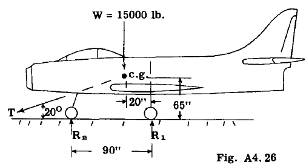
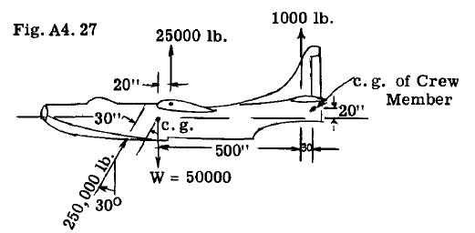
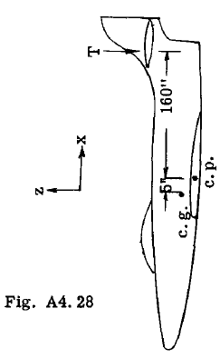
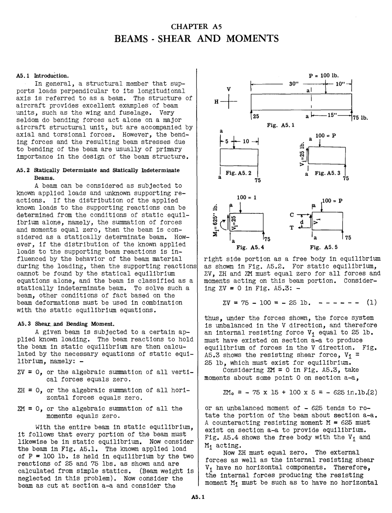

## A4.15 PROBLEMS.

(1). The airplane in Fig. A4.26 is being
launched from the deck of an aircraft carrier by
the cable pUll T which gives the airplane a forward acceleration of 3.25g. The gross weight of
the airplane is 15,000 lb.

(a) Find the tension load T in the launching
cable, and the wheel reactions R 1 and
R...

(b) If the flying speed is 75 M.P.H., what
launching distance is required and the
launching time t?

(2). Assume the airplane of Fig. A4.26 is
landing at 75 M.P.H. on a runway and brakes are
applied to the rear wheels equal to 04 of the
vertical rear wheel reaction. What is the hori

w = 15000 lb.

_I_ __

Fig. A4.26

zontal deceleration and the stopping distance
for the airplane?

(3). The flying patrol boat in Fig. A4.27
makes a water landing with the resultant bottom
water pressure of 250,000 lb. as shown in the
figure. Assume lift and tail loads as shown.
The pitching moment of inertia of the airplane
is 10 million lb. sec." in. Determine the airplane pitching acceleration. What is the total
load on the crew member who weighs 200 lb. and
is located in a seat at the rear end of the
hUll?

Fig. A4. 27

25000 lb.

1000 lb.

20" --I L . g. of Crew
----r.....::'....----..:::::.=.--e;;-?IG " Member
-""",,~~ -x---- 20
500"~

(4). The jet-plane in Fig. A4.28 is diving at
a speed of 600 M.P.H. when pilot starts a 8g
pull-out. Weight of airplane is 16,000 lb.
Assume that engine thrust and total airplane
drag are equal, opposite and colinear.

(a) Find radius of flight path at start of
pUll-out.

(b) Find inertia force in Z direction.

(c) Find lift L and tail load T.

;:,

'"

.....

Fig. A4.28

