# CHAPTER A5 BEAMS - SHEAR AND MOMENTS

## A5.1 Introduction.

In general, a structural member that supports loads perpendicular to its longitudional
axis is referred to as a beam. The structure of
aircraft provides excellent examples of beam
units, such as the wing and fuselage. Very
seldom do bending forces act alone on a major
aircraft structural unit, but are accompanied by
axial and torsional forces. However, the bending forces and the resulting beam stresses due
to bending of the beam are usually of primary
importance in the design of the beam structure.

## A5.2 Statically Determinate and Statically Indeterminate Beams.

A beam can be considered as subjected to
known applied loads and unknown supporting reactions. If the distribution of the applied
known loads to the supporting reactions can be
determined from the conditions of static equilibrium alone, namely, the summation of forces
and moments equal zero, then the beam is considered as a statically determinate beam. However, if the distribution of the known applied
loads to the supporting beam reactions is influenced by the behavior of the beam material
during the loading, then the supporting reactions
cannot be found by the statical equilibrium
equations alone, and the beam is classified as a
statically indeterminate beam. To solve such a
beam, other conditions of fact based on the
beam deformations must be used in combination
With the static equilibrium equations.

## A5.3 Shear and Bending Moment.

A given beam is subjected to a certain applied known loading. The beam reactions to hold
the beam in static equilibrium are then calculated by the necessary equations of static equilibrium, namely: 

$\sum V = 0$ , or the algebraic summation of all vertical forces equals zero.

$\sum H = 0$ , or the algebraic summation of all horizontal forces equals zero.

$\sum M = 0$ , or the algebraic summation of all the moments equals zero.

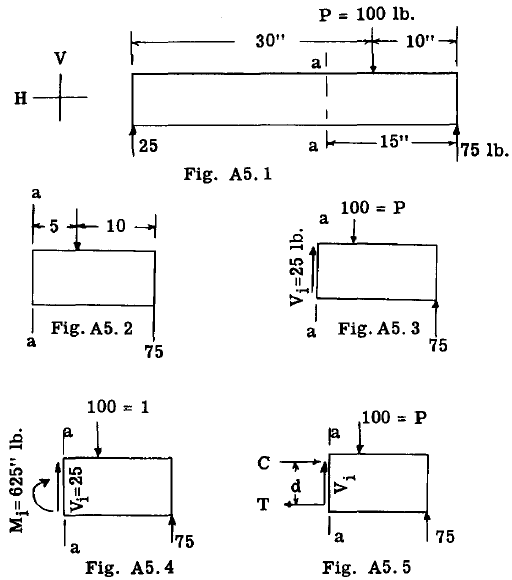

With the entire beam in static equilibrium,
it follows that every portion of the beam must
likewise be in static equilibrium. Now consider
the beam in Fig. A5.1. The known applied load
of P = 100 lb. is held in equilibrium by the two
reactions of 25 and 75 Ibs. as shown and are
calcUlated from simple statics. (Beam weight is
neglected in this problem). Now consider the
beam as cut at section a-a and consider the
right side portion as a free body in equilibrium
as shown in Fig. A5.2. For static equilibrium,
$\sum V, \sum H and \sum M $ must equal zero for all forces and
moments acting on this beam portion. Considering $\sum V = 0$ in Fig. A5.3: 

$$
\sum V = 75 - 100 = - 25 lb. (1)
$$

thus, under the forces shown, the force system
is unbalanced in the V direction, and therefore
an internal resisting force Vi equal to 25 lb.
must have existed on section a-a to produce
equilibrium of forces in the V direction. Fig.
A5.3 shows the resisting shear force, Vi =
25 Ib, which must exist for equilibrium.
Considering $\sum M  = 0$ in Fig. A5.3, take
moments about some point O on section a-a,

$$
\sum M_o =- 75 x 15 + 100 x 5 =- 625 in.lb.(2)
$$

or an unbalanced moment of - 625 tends to rotate the portion of the beam about section a-a.
A counteracting resisting moment M = 625 must
exist on section a-a to provide equilibrium.
Fig. A5.4 shows the free body with the Vi and
Mi acting.

Now $\sum H$ must equal zero. The external
forces as well as the internal resisting shear
Vi have no horizontal components. Therefore,
the internal forces producing the resisting
moment Mi must be such as to have no horizontal
unbalanced force, which means that the resisting
moment Mi in the form of a couple, as shown in
Fig. A5.5, or Mi = Cd or Td and T must equal C
to make $\sum H =0$ .
The tendency of the loads and reactions
acting on a beam to shear or move one portion of
a beam up or down relative to the adjacent portion of the beam is called the External Vertical
Shear, or commonly referred to as the beam Vertical Shear and is represented by the term V.

From equation (1), the Vertical Shear at
any section of a beam can be defined as the algebraic sum bf all the forces and reactions
acting to one side of the section at which the
shear is desired. If the portion of the beam to
the left of the section tends to move up relative to the right portion, the sign of the
Vertical Shear is taken as positive shear and
negative if the tendency is opposite. Or in
other words, if the algebraic sum of the forces
is up on the left or down on the right side,
then the Vertical Shear is positive, and negative for down on the left and up on the right.

From equation (2), the Bending Moment at
any section of a beam can be defined as the algebraic sum of the moments of all the forces
acting to either side of the section about the
section. If this bending moment tends to produce compression (Shortening) of the upper fibers and tension (stretching) of the lower fibers
of the beam, the bending moment is classed as a
positive bending moment, and negative for the
reverse condition.

## A5.4 Shear and Moment Diagrams.

In aircraft design, a large proportion of
the beams are tapered in depth and section, and
also carry a variable distributed load. Thus,
to design or check the various sections of such
beams, it is necessary to have a complete picture as to the value of the vertical shear and
bending moment at all sections along the beam.
If these values are plotted as ordinates from a
base line, the resulting curves are referred to
as Shear and Moment diagrams. A few example
Shear and Moment diagrams will be plotted, to
refresh the' students knowledge regarding these
diagrams.

### Example Problem 1

Draw a shear and bending moment diagram for
the beam shown in Fig. A5.6. Neglect the weight
of the beam.

In general, the first step is to determine
the reactions.

To find RB, take moments about point A.

$$
\sum M_A =- 4 \times 500 + 1000 \times 5 + 300 \times 13 - 10 R_B = 0
$$

hence RB = 690 lb.

$$
\sum V = - 500 + R_A - 1000 - 300 + 690 = 0
$$

hence RA = 1110 lb.

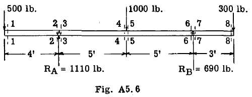

#### Calculations for Shear Diagram: 

We start at the left end of the beam.
Considering a section just to the right of the
500 lb. load, or section 1-1, and considering
the portion to the left of the section, the
Vertical Shear at 1-1 =,ZV =..;; 500 (negative,
down on left.)

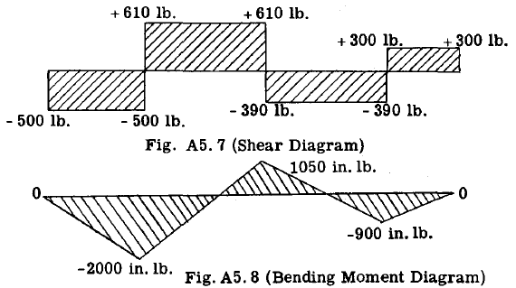

Next, consider section 2-2, just to left of reaction RA.

$\sum V = -500$ , or same as at section l-l.

Next, consider section 3-3, just to right of reaction RA.

$\sum V = -500 + 1110 = 610$ (positive, up on left side of section).

Next, consider section 4-4, just to left of 1000 load.

$\sum V = -500 + 1110 = 610$ (same as at section 3-3).

Section 5-5, to right of 1000 load:

$\sum V = -500 + 1110 -1000 = -390$ (down on left).

check this shear at section 5-5 by using the portion of the beam to the right of 5-5 as a free body.

$\sum V = -300 + 690 = 390$ , which checks (sign of shear is minus, because \sum V is up on right).
section 6-6, use the portion to right as afree body:

$\sum V = -300 + 690 = 390$  (minus shear).

section 7-7:

$\sum V = -300$ (positive shear, down on right).

Section 8-8:

$ \sum V =- 300$ (positive shear).

Fig. A5.7 shows the plotted values on the shear
diagram.

Calculation of the Moment Diagram.
Start at section 1-1, and consider the
forces to the left only:

$ \sum M =- 500 \times 0 = 0 $

Since sections 2-2 and 3-3 are only a differential distance apart, assume a section just above
RA and consider the forces on the left side only:

$\sum M = - 500 \times 4 = - 2000$ in. lb. (Negative
moment, because of tension in the top fibers).
Consider the section under the 1000 in. lb. load~

$\sum M to left =- 500 \times 9 + 1110 \times 5 = 1050$ in.
lb. (positive moment, compressing the top
fibers).

Check by considering the forces to the right:

$\sum M right = 300 \times 8 - 690 \times 5 =- 1050$ in. lb.

Next, consider a section over RB:

$\sum M right = 300 \times 3 = 900$ in. lb. (Negative
moment, tension in top fibers).

At Section 8-8:

$\sum M right = 300 \times 0 = 0$

Fig. A5.8 shows the plotted values.

From the above results it may be noticed
that when the bending moment is obtained from
the forces that lie to the left of any section,
the bending moment is positive when it is clockwise. If obtained from the forces to the right,
it is positive, when counter-clockwise. The
student should sketch in the approximate shape
of the deflected structure and determine the
signs from whether tension or compression eXists
in the upper and lower fibers.

### Example Problem 2
Calculate and draw the shear and moment
diagrams for the beam and loading as shown in
Fig. A5.9.
First, determine the reactions, RA and RB: 

$\sum M_A = 36 \times 10 \times 18 + 120 \times 9 - 36 R_B = 0.$
hence RB = 210 lb.

$\sum V =- 120 - 36 \times 10 + 210 + RA = 0.$
hence RA = 270 lb.

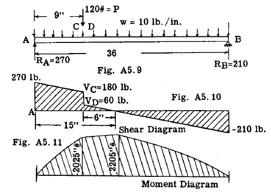

The vertical shear just to the right of the
reaction at A is equal to 270 up, or positive.
This is plotted as line AE in Fig. A5.10. The
vertical shear at section C just to the left of
the load and considering the forces to the left
of the section =270 - 9 x 10 =180 lb. up, or
positive. The vertical shear for any section
between A and C at a distance x from A is:

Vx = 270 - lOx, and hence, the shear decreases at aconstant rate of 10 Ib./in. from 270
at A to 180 at C.
The vertical shear at section D, just to
the right of load is,

VD = ZVleft = 270 - 10 x 9 - 120 = 60 up,
or positive.

The vertical shear between points D and B, when
x is the distance of any section between D and
B from A:

$$
VDB =270 - 120 - lOx - (1)
$$

At point B, x =36:
hence VB =270 - 120 - 10 x 36 =- 210 lb.,
which checks the reaction RB'
Since the Vertical Shear decreases at a
rate of 10 Ib/in. from D to B, it will be 6"
from D to a point where the shear is zero, since
the shear at D is 60 lb.
This point could alsG be located by equating
equation (1) to zero and solving for x as
follows:

0 =270 - 120 - lOx, or x =11500 =15" from A

If the shear diagram has passed through
zero under the concentrated load, then the
method of equating the shear equation to zero
and solving for x could not be used, thus in
general, it is best to draw a shear diagram to
find when shear is zero. Fig. A5.10 shows the
plotted shear diagram.

#### Moment Diagram: 

At section A just to the right of reaction
RA the bending moment, considering the forces to
the left, is zero, since the arm of RA is zero.
The bending moment at any section between
A and C, at a distance x from the left reaction
RA, is,

Mx = RA x - wx^2/2 (2)

In equation (2),  x can not be greater than 
The equation for the bending moment between
D and B (x greater than 9) is

$$
Mx =RAx - P (X-9) - wx [2]/2
=270 x - 120 (x-9) _ 1~2
=1080 + 150 x - 5x 2
$$

At section C, x = 9", substitute in equation (4)

Mc = 1080 + 150 x 9 - 5 X 9 [2] = 2025 in. lb.
(positive, compression in top fibers).

At the point of zero shear, x = 15" 
M = 1080 + 150 x 15 - 5 x 15 [2] = 2205

Thus, by sUbstituting in equation (2) and
(4) the moment diagram as plotted in Fig. A5.11
is obtained.

## A5.5 Section of Maximum Bending Moment.

The general expression for the bending moment on the beam of example problem 2 is from
equation (3);

Now, the value of x that will make MX a
maximum or minimum is the value that will make
the first derivative of M x with respect to x
equal to zero, or

(5 )

Therefore, the value of x that will make M x a
maximum or minimum may be found from the equation

RA         - P - wx :: 0

Thus, the area of the shear diagram between any
two points equals the change in bending moment
between these two points.
To illustrate this relationship, consider
the shear diagram in example problem 2 (Fig.
A5.10). The change in bending moment between
the left reaction RA and the load is equal to
the area of the shear diagram between these two
points, or

270 + 180
2 x 9 :: 2025 in. lb. Since the bending

moment at the left support is zero, this change
therefore equals the true moment at a section
under the load P.
Adding to this the area of the small triangle between point D and the point of zero
60
shear, or 1f x 6 = 180, we obtain 2205 in. lb.

as the maximum moment. This can be checked by
taking the area of the shear diagram between
the point of zero shear and point B =

2~0 x 21 :: 2205 in. lb.

Example Problem 3.
Fig. A5.12 illustrates a landing gear oleo
strut ADEO braced by struts BD and CEo A landing ground load of 15000 lb. is applied through
the wheel axle as shown. Let it be required to
find the axial load in all members and the shear
and bendIng moment diagram for the oleo strut.

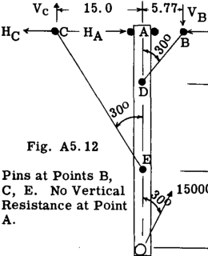

HBT

But, observation of this equation indicates
that the term Ra - P - wx is the shear for the
section at a distance x from the left reaction.
Therefore, where the shear is zero, the bending
moment is maximum. Thus, the shear diagram
which shows where the shear is zero is a convenient medium for locating the points of maximum bending moment.

mum bending moment. e, E. No Vertical

## A5.6 Relation Between Shear and Bending Moment.

10"
---t

16"

___ L

15000 lb. 1

16"

**"0"**

Equation (5) can also be written ~ :: V,

since the right hand portion of equation (5) is
equal to the shear.

Hence, dM :: Vdx - - - - - - - - - - - - (6) SOLUTION: 

Which means that the difference dM between
the bending moments at two sections that are a
distance dx apart, is equal to the area Vdx
under the shear curve between the two sections.
Thus, for two sections x 1 and x2,

To find Vc take moments about point B,
2MB =- 15000 x 0.5 x 42 + 15000 x 0.866 x 5.77
+ 20.77 Vc :: O.
hence, Vc :: 11550 lb.

The axial load in member CEtherefore equals

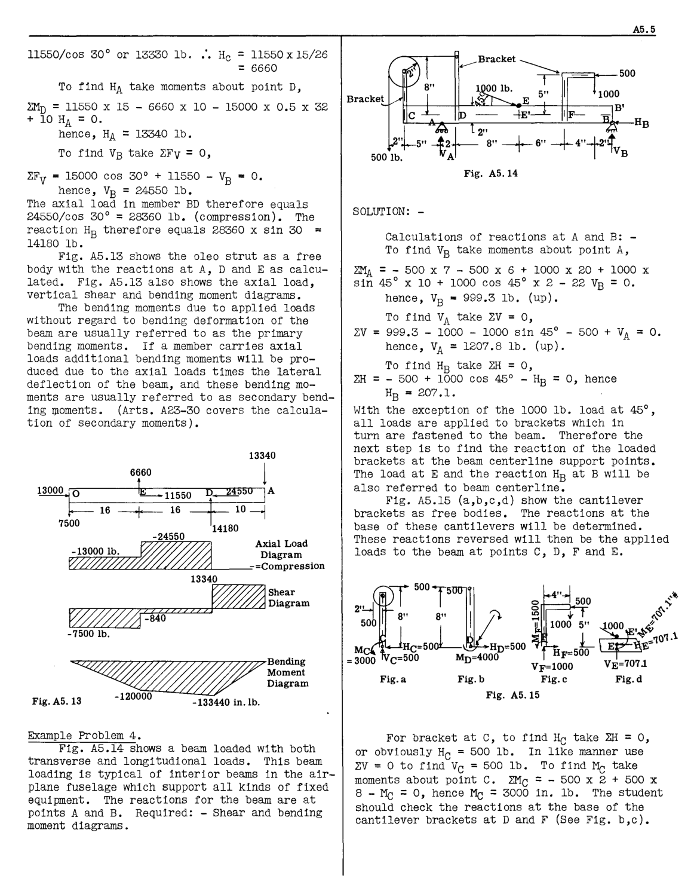

11550/ cos 30 ° or 13330 lb. :. He = 11550 x 15/26

= 6660

To find HA take moments about point D,

ZMD = 11550 x 15 - 6660 x 10 - 15000 x 0.5 x 32
+ 10 HA = O.
hence, HA = 13340 lb.

To find VB take ~FV = 0,

~FV = 15000 cos 30° + 11550 - VB = O.

hence, VB = 24550 lb.
The axial load in member BD therefore equals
24550/cos 30° = 28360 lb. (compression). The
reaction HB therefore equals 28360 x sin 30 =
14180 lb.
Fig. A5.13 shows the oleo strut as a free
body With the reactions at A, D and E as calculated. Fig. A5.13 also shows the axial load,
vertical shear and bending moment diagrams.
The bending moments due to applied loads
Without regard to bending deformation of the
beam are usually referred to as the primary
bending moments. If a member carries axial
loads additional bending moments will be produced due to the axial loads times the lateral
deflection of the beam, and these bending moments are usually referred to as secondary bending moments. (Arts. A23-30 covers the calculation of secondary moments).

Axial Load

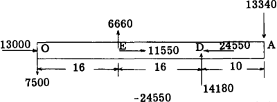
-13000 lb. Diagram
_W_ /00/& ~~~~~ '--_-=-=Compression

13340
~"""",,_~';::am
~-840

-7500 lb.

Bending
Moment
~Oiagram

Fig. A5. 13 -120000 -133440 in. lb.

Example Problem 4.
Fig. A5.14 shows a beam loaded with both
transverse and longitudional loads. This beam
loading is typical of interior beams in the airplane fuselage which support all kinds of fixed
equipment. The reactions for the beam are at
points A and B. Required: - Shear and bending
moment diagrams.

A5.5

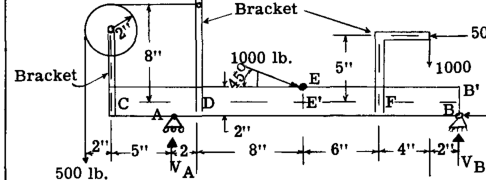

Fig. A5.14

SOLillION: 

Calculations of reactions at A and B:    To find VB take moments about point A,

ZMA =- 500 x 7 - 500 x 6 + 1000 x 20 + 1000 x
sin 45° x 10 + 1000 cos 45° x 2 - 22 VB = O.

hence, VB = 999.3 lb. (up).

To find VA take ~V = 0,

~V = 999.3 - 1000 - 1000 sin 45° 500 + VA = O.
hence, VA = 1207.8 lb. (up).

To find HB take ~ = 0,

~H =- 500 + 1000 cos 45° - H B = 0, hence
HB = 207.l.
With the exception of the 1000 lb. load at 45°,
all loads are applied to brackets which in
turn are fastened to the beam. Therefore the
next step is to find the reaction of the loaded
brackets at the beam centerline support points.
The load at E and the reaction HB at B will be
also referred to beam centerline.
Fig. A5.15 (a,b,c,d) show the cantilever
brackets as free bodies. The reactions at the

base of these cantilevers will be determined.
These reactions reversed will then be the applied
loads to the beam at points C, D, F and E.

2";fJ 500 [T5] _r}'"_

~ 8" 8" I 5" ~OO, ~<I..<::>
/'J)
M HC=50 L 1 HO=500 H -500 L E \\"E'" ~'10'1.1
= 3000 C=500 MO=4000 FVF=1000 _VE=7071_

Fig. a Fig. b Fig. c Fig. d

Fig. A5.15

For bracket at e, to find He take ~ = 0,
or obviously He = 500 lb. In like manner use

~V = 0 to find 500 lb. To find Me take
Ve =
moments about point C. ZMC =- 500 x 2 + 500 x
8 - Me = 0, hence Me = 3000 in. lb. The student
should check the reactions at the base of the
cantilever brackets at D and F (See Fig. b,c).

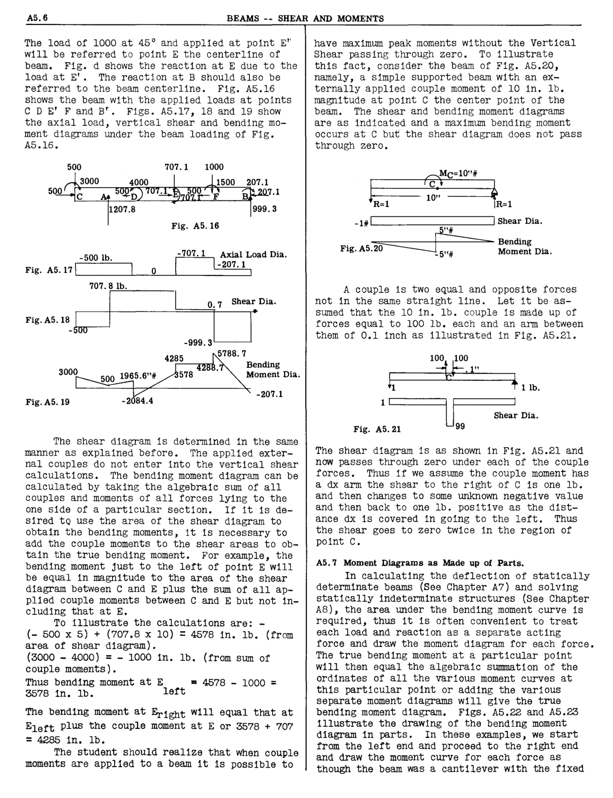

A5.6 BEAMS -- SHEAR AND MOMENTS

The load of 1000 at 45° and applied at point E"
will be referred to point E the centerline of
beam. Fig. d shows the reaction at E due to the
load at E'. The reaction at B should also be
referred to the beam centerline. Fig. A5.16
shows the beam with the applied loads at points
C D E' F and B'. Figs. A5.17, 18 and 19 show
the axial load, vertical shear and bending moment diagrams under the beam loading of Fig.
A5.16.

Fig. A5.16

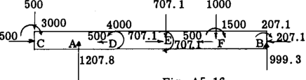

-500 lb. -707.1 Axial Load Dia.

Fig. A5. l7IL L-.Q.0 _11 __ -='-:=20::::7=:':=:J1

707. 8,-,l=b,,-. _

O. 7 Shear Dia.

Fl'.A5.18.d I

.999.J-r

4285 5788.7
Bending
Moment Dia.

-207.1

Fig.A5.19

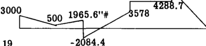

The shear diagram is determined in the same
manner as explained before. The applied external couples do not enter into the vertical shear
calculations. The bending moment diagram can be
calculated by taking the algebraic sum of all
couples and moments of all forces lying to the
one side of a particular section. If it is desired to use the area of the shear diagram to
obtain the bending moments, it is necessary to
add the couple moments to the shear areas to obtain the true bending moment. For example, the
bending moment just to the left of point E will
be equal in magnitude to the area of the shear
diagram between C and E plus the sum of all applied couple moments between C and E but not including that at E.
To illustrate the calculations are:   (- 500 x 5) + (707.8 x 10) = 4578 in. lb. (from
area of shear diagram).
(3000 - 4000) =- 1000 in. lb. (from sum of
couple moments).
Thus bending moment at E .. 4578 - 1000 =
3578 in. lb. left

The bending moment at Eright will equal that at
Eleft plus the couple moment at E or 3578 + 707
:: 4285 in. lb.
The student should realize that when couple
moments are applied to a beam it is possible to

The shear diagram is as shown in Fig. A5.21 and
now passes through zero under each of the couple
forces. Thus if we assume the couple moment has
a dx arm the shear to the right of C is one lb.
and then changes to some unknown negative value
and then back to one lb. positive as the distance dx is covered ih going to the left. Thus
the shear goes to zero twice in the region of
point C.

## A5.7 Moment Diagrams as Made up of Parts.
In calculating the deflection of statically
determinate beams (See Chapter A7) and solving
statically indeterminate structures (See Chapter
A8), the area under the bending moment curve is
required, thus it is often convenient to treat
each load and reaction as a separate acting
force and draw the moment diagram for each force.
The true bending moment at a particular point
will then equal the algebraic summation of the
ordinates of all the various moment curves at
this particular point or adding the various
separate moment diagrams will give the true
bending moment diagram. Figs. A5.22 and A5.23
illustrate the drawing of the bending moment
diagram in parts. In these examples, we start
from the left end and proceed to the right end
and draw the moment curve for each force as
though the beam was a cantilever with the fixed

have maximum peak moments without the Vertical
Shear passing through zero. To illustrate
this fact, consider the beam of Fig. A5.20,
namely, a simple supported beam with an externally applied couple moment of 10 in. lb.
magnitude at point C the center point of the
beam. The shear and bending moment diagrams
are as indicated and a maximum bending moment
occurs at C but the shear diagram does not pass
through zero.

MC=10"#

."I~ISh,,",Dia.

. Bending
Flg. A5.20 -5"# Moment Dia.

A couple is two equal and opposite forces
not in the same straight line. Let it be assumed that the 10 in. lb. couple is made up of
forces equal to 100 lb. each and an arm between
them of 0.1 inch as illustrated in Fig. A5.21.

____ 1¥..:..~.A.1'_' _
1-1 ------'-----t 1 lb.

1CI ======u

Fig. A5.21 99

Shear Dia.

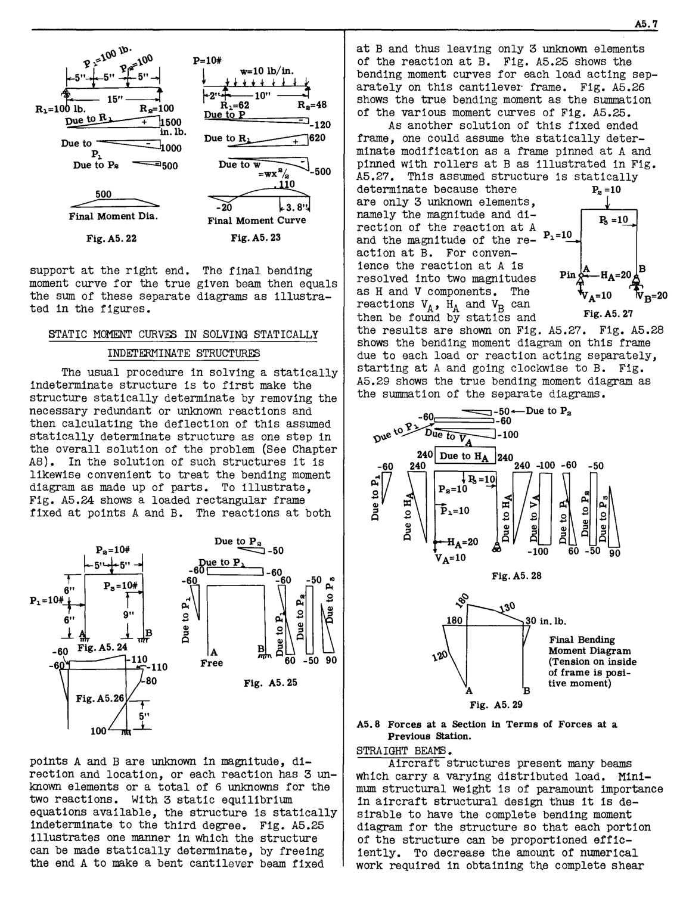

A5.7

at B and thus leaving only 3 unknown elements
of the reaction at B. Fig. A5.25 shows the
bending moment curves for each load acting separately on this cantilever' frame. Fig. A5.26
shows the true bending moment as the summation
of the various moment curves of Fig. A5.25.
As another solution of this fixed ended
frame, one could assume the statically determinate modification as a frame pinned at A and
pinned with rollers at B as illustrated in Fig.
A5.27. This assumed structure is statically
determinate because there Pe =10
are only 3 unknown elements,
namely the magnitude and di- P" =10
rection of the reaction at A
and the magnitude of the re- P~=10
action at B. For convenience the reaction at A is
resolved into two magnitudes
as H and V components. The B=20
reactions VA' H A and VB can
then be found by statics and

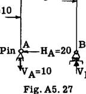
the results are shown on Fig. A5.27. Fig. A5.2B
shows the bending moment diagram on this frame
due to each load or reaction acting separately,
starting at A and going clockwise to B. Fig.
A5.29 shows the true bending moment diagram as
the summation of the separate diagrams.

-60, -=:J, __ ~~-Due to Pe

,",~e \ojJ:--Du~ -100

_v_ _A_

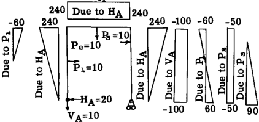

Fig. A5. 28

Final Bending
Moment Diagram
(Tension on inside
of frame is positive moment)

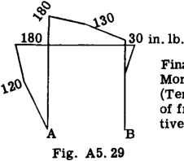

## A5.8 Forces at a Section in Terms of Forces at a Previous Station.

STRAIGHT BEAMS.

Aircraft structures present many beams
which carry a varying distributed load. Minimum structural weight is of paramount importance
in aircraft structural design thus it is desirable to have the complete bending moment
diagram for the structure so that each portion
of the structure can be proportioned efficiently. To decrease the amount of numerical
work required in obtaining the complete shear

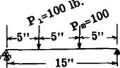

R~=10 lb. Re=100
D~1500

in. lb.

Due to --=:::::::::::::-==== **-** -::--, 000

P~
Due to Pe -=::El500

500

............... ............

Final Moment Dia.

Fig. A5. 22

support at the right end.
moment curve for the true
the sum of these separate
ted in the figures.

P=lO*

I .w=10 lb/in.
L-J:-Lu - «...LLt

r-2''f--10'' -.:r

R~=62 Re=48

D~:!:!:ue!:..lo:to~P=====:::J  - J- 120

Duet~620

Due to w=wx -

Final Moment Curve

Fig. A5. 23

The final bending
given beam then equals
diagrams as illustra

STATIC MOMENT CURVES IN SOLVING STATICALLY

INDETERMINATE STRUCTURES

The usual procedure in solving a statically
indeterminate structure is to first make the
structure statically determinate by removing the
necessary redundant or unknown reactions and
then calculating the deflection of this assumed
statically determinate structure as one step in
the overall solution of the problem (See Chapter
AS). In the solution of such structures it is
likewise convenient to treat the bending moment
diagram as made up of parts. To illustrate,
Fig. A5.24 shows a loaded rectangular frame
fixed at points A and B. The reactions at both

Pe=lO*
f-5' 5,,-1
r

P,,=lO*

Due to P e

-=:::::::::J -50

Due to P~
-601 1-60

i1nli~O~

Free 60 -50 90

Fig. A5.25

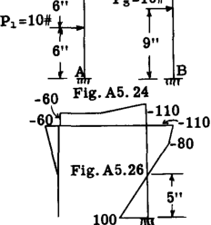

points A and B are unknown in magnitude, direction and location, or each reaction has 3 unknown elements or a total of 6 unknowns for the
two reactions. With 3 static equilibrium
equations available, the structure is statically
indeterminate to the third degree. Fig. A5.25
illustrates one manner in which the structure
can be made statically determinate, by freeing
the end A to make a bent cantilever beam fixed

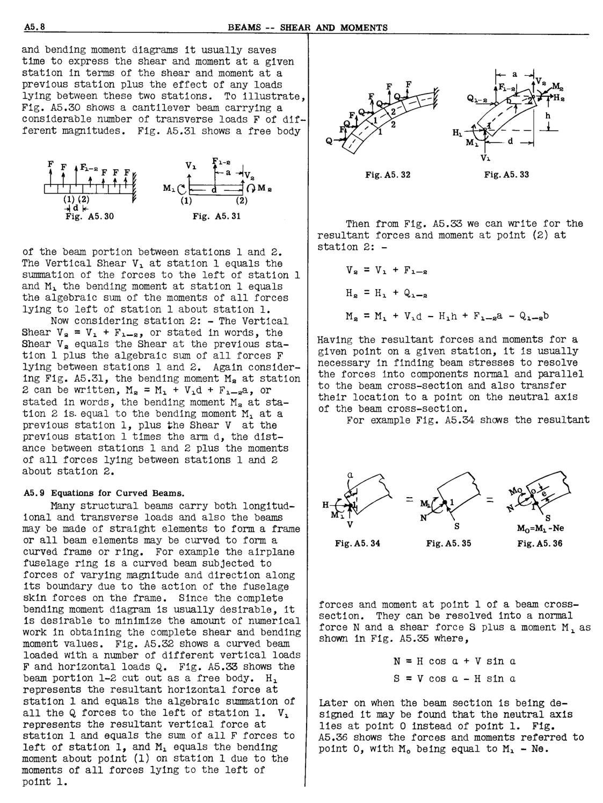

A5.8 BEAMS -- SHEAR AND MOMENTS

and bending moment diagrams it usually saves
time to express the shear and moment at a given
station in terms of the shear and moment at a
previous station plus the effect of any loads
lying between these two stations. To illustrate,
Fig. A5.30 shows a cantilever beam carrying a
considerable number of transverse loads F of different magnitudes. Fig. A5.31 shows a free body

Q

V F~-"
~~ t- [a] ~v
M~c~nM"

(1) (2)

Fig. A5.31

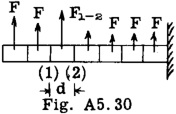

of the beam portion between stations 1 and 2.
The Vertical Shear V~ at station 1 equals the
summation of the forces to the left of station 1
and M~ the bending moment at station 1 equals
the algebraic sum of the moments of all forces
lying to left of station 1 about station 1.
Now considering station 2:   - The Vertical
Shear Va = V~ + F~_", or stated in words, the
Shear V" equals the Shear at the previous station 1 plus the algebraic sum of all forces F
lying between stations 1 and 2. Again considering Fig. A5.31, the bending moment M" at station
2 can be written, M" = M~ + V~d + F~_"a, or
stated in words, the bending moment Ma at station 2 is. equal to the bending moment M~ at a
previous station 1, plus the Shear V at the
previous station 1 times the arm d, the distance between stations 1 and 2 plus the moments
of all forces lying between stations 1 and 2
about station 2.

## A5.9 Equations for Curved Beams.

Many structural beams carry both longitudional and transverse loads and also the beams
may be made of straight elements to form a frame
or all beam elements may be curved to form a
curved frame or ring. For example the airplane
fuselage ring is a curved beam subjected to
forces of varying magnitude and direction along
its boundary due to the action of the fuselage
skin forces on the frame. Since the complete
bending moment diagram is usually desirable, it
is desirable to minimize the amount of numerical
work in obtaining the complete shear and bending
moment values. Fig. A5.32 shows a curved beam
loaded with a number of different vertical loads
F and horizontal loads _Q._ Fig. A5.33 shows the
beam portion 1-2 cut out as a free body. H~
represents the resultant horizontal force at
station 1 and equals the algebraic summation of
all the _Q_ forces to the left of station 1. V~
represents the resultant vertical force at
station 1 and equals the sum of all F forces to
left of station 1, and M~ equals the bending
moment about point (1) on station 1 due to the
moments of all forces lying to the left of
point 1.

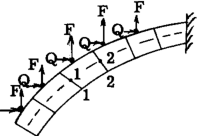

Fig. A5. 32

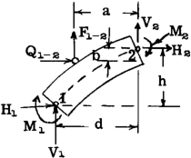

Fig. A5. 33

Then from Fig. A5.33 we can write for the
resultant forces and moment at point (2) at
station 2: 

V" = V~ + F~-"

Having the resultant forces and moments for a
given point on a given station, it is usually
necessary in finding beam stresses to resolve
the forces into components normal and parallel
to the beam cross-section and also transfer
their location to a point on the neutral axis
of the beam cross-section.
For example Fig. A5.34 shows the resultant

~
S

Mo=M~-Ne

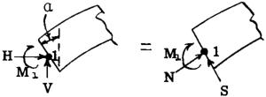

Fig.A5.34

Fig.A5.35

Fig.A5.36

forces and moment at point 1 of a beam crosssection. They can be resolved into a normal
force N and a shear force S plus a moment M ~ as
shown in Fig. A5.35 where,

N = H cos _a_ + V sin _a_

S = V cos _a_       - H sin _a_

Later on when the beam section is being designed lies at it point may ° be found instead that of point the neutral 1. Fig. axis
A5.36 shows the forces and moments referred to
point 0, With M o being equal to M~ - Ne.

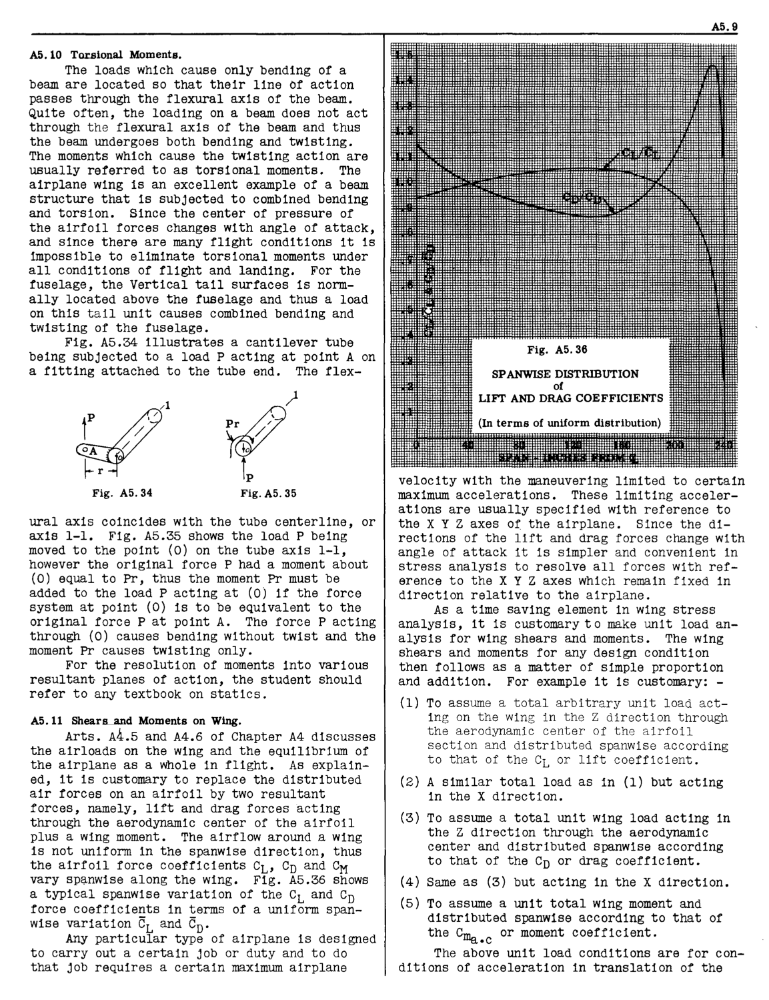

## A5.10 Torsional Moments.
The loads which cause only bending of a
beam are located so that their line Of action
passes through the flexural axis of the beam.
Quite often, the loading on a beam does not act
through the flexural axis of the beam and thus
the beam undergoes both bending and twisting.
The moments which cause the twisting action are
usually referred to as torsional moments. The
airplane wing is an excellent example of a beam
structure that is subjected to combined bending
and torsion. Since the center of pressure of
the airfoil forces changes with angle of attack,
and since there are many flight conditions it is
impossible to eliminate torsional moments under
all conditions of flight and landing. For the
fuselage, the Vertical tail surfaces is normally located above the fuselage and thus a load
on this tail unit causes combined bending and
twisting of the fuselage.
Fig. A5.34 illustrates a cantilever tube
being subjected to a load P acting at point A on
a fitting attached to the tube end. The flex
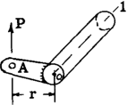

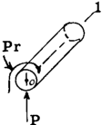

Fig. _A5.34_ Fig. _A5._ 35

ural axis coincides with the tUbe centerline, or
axis 1-1. Fig. A5.35 shows the load P being
moved to the point (0) on the tube axis 1-1,
however the original force P had a moment about
(0) equal to Pr, thus the moment Pr must be
added to the load P acting at (0) if the force
system at point (0) is to be equivalent to the
original force P at point A. The force P acting
through (0) causes bending without twist and the
moment Pr causes twisting only.
For the resolution of moments into various
resultann planes of action, the student should
refer to any textbook on statics.

## A5.11 Shear and Moments on Wing.
Arts. A4.5 and A4.6 of Chapter A4 discusses
the airloads on the wing and the equilibrium of
the airplane as a whole in flight. As explained, it is customary to replace the distributed
air forces on an airfoil by two resultant
forces, namely, lift and drag forces acting
through the aerodynamic center of the airfoil
plus a wing moment. The airflow around a wing
is not uniform in the spanwise direction, thus
the airfoil force coefficients CL, CD and CM
vary spanwise along the wing. Fig. A5.36 shows
a typical spanwise variation of the CL and CD
force coefficients in terms of a uniform spanwise variation C L and CD'

Any particular type of airplane is designed
to carry out a certain job or duty and to do
that job requires a certain maximum airplane

_A5.9_

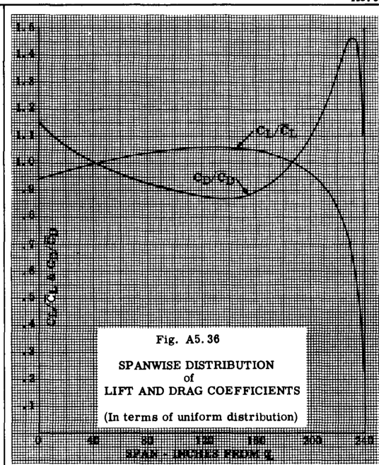

velocity With the maneuvering limited to certain
maximum accelerations. These limiting accelerations are usually specified With reference to
the X Y Z axes of the airplane. Since the directions of the lift and drag forces change With
angle of attack it is simpler and convenient in
stress analysis to resolve all forces With reference to the X Y Z axes which remain fixed in
direction relative to the airplane.
As a time saving element in wing stress
analysis, it is customary to make unit load analysis for wing shears and moments. The wing
shears and moments for any design condition
then follows as a matter of simple proportion
and addition. For example it is customary: 
(1) To assume a total arbitrary unit load acting on the wing in the Z direction through
the aerodynamic center of the airfoil
section and distributed spanwise according
to that of the CL or lift coefficient.

(2) A similar total load as in (1) but acting
in the X direction.

(3) To assume a total unit wing load acting in
the Z direction through the aerodynamic
center and distributed spanwise according
to that of the CD or drag coefficient.

(4) Same as (3) but acting in the X direction.

(5) To assume a unit total wing moment and
distributed spanwise according to that of
the C m_ ~·c or moment coefficient.
The above unit load conditions are for conditions of acceleration in translation of the

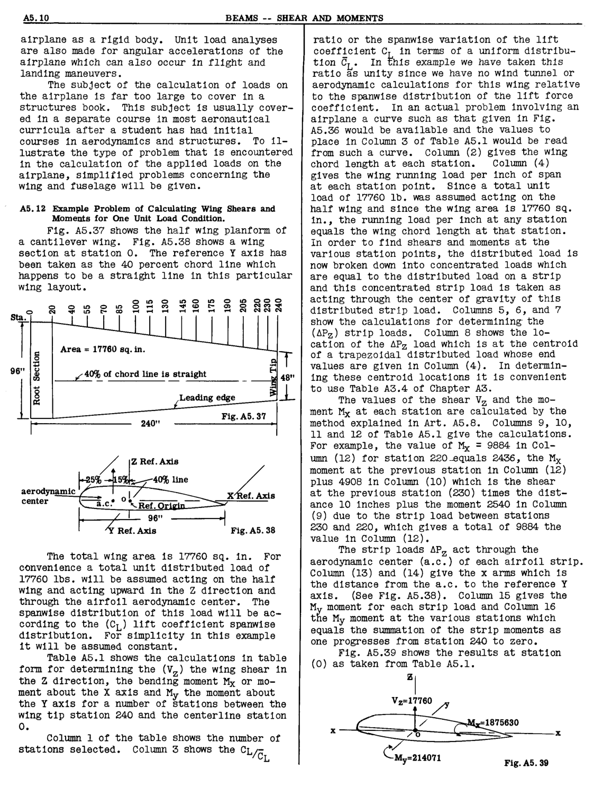

AS. 10 BEAMS -- SHEAR AND MOMENTS

airplane as a rigid body. Unit load analyses
are also made for angular accelerations of the
airplane which can also occur in flight and
landing maneuvers.
The subject of the calculation of loads on
the airplane is far too large to cover in a
structures book. This subject is usually covered in a separate course in most aeronautical
curricula after a student has had initial
courses in aerodynamics and structures. To illustrate the type of problem that is encountered
in the calculation of the applied loads on the
airplane, simplified problems concerning the
wing and fuselage will be given.

## A5.12 Example Problem of Calculating Wing Shears and Moments for One Unit Load Condition.
Fig. A5.37 shows the half wing planform of
a cantilever wing. Fig. A5.38 shows a wing
section at station O. The reference Y axis has
been taken as the 40 percent chord line which
happens to be a straight line in this particular
wing layout.

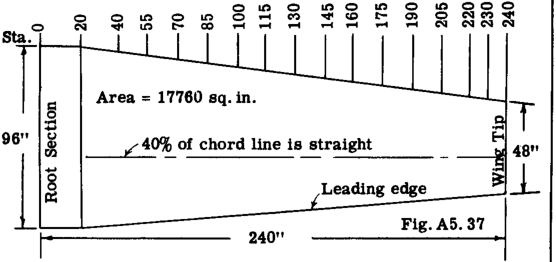

~ IZ Ref. Axis

ratio or the spanwise variation of the lift
coeff!cient CL in terms of a uniform distribution CL• In this example we have taken this
ratio as unity since we have no wind tunnel or
aerodynamic calculations for this wing relative
to the spanwise distribution of the lift force
coefficient. In an actual problem involving an
airplane a curve such as that given in Fig.
A5.36 would be available and the values to
place in Column 3 of Table A5.1 would be read
from such a curve. Column (2) gives the wing
chord length at each station. Column (4)
gives the wing running load per inch of span
at each station point. Since a total unit
load of 17760 lb. was assumed acting on the
half wing and since the wing area is 17760 sq.
in., the running load per inch at any station
equals the wing chord length at that station.
In order to find shears and moments at the
various station points, the distributed load is
now broken down into concentrated loads which
are equal to the distributed load on a strip
and this concentrated strip load is taken as
acting through the center of gravity of this
distributed strip load. Columns 5, 6, and 7
show the calculations for determining" the

(~pz) strip loads. Column 8 shows the location of the ~Pz load which is at the centroid
of a trapezoidal distributed load whose end
values are given in Column (4). In determining these centroid locations it is convenient
to use Table A3.4 of Chapter A3.
The values of the shear Vz and the moment Mx at each station are calculated by the
method explained in Art. A5.8. Columns 9, 10,
11 and 12 of Table A5.1 give the calculations.
For example, the value of Mx = 9884 in Column (12) for station 220-equals 2436, the Mx
moment at the previous station in Column (12)
plUS 4908 in Column (10) which is the shear
at the previous station (230) times the distance 10 inches plus the moment 2540 in Column
(9) due to the strip load between stations
230 and 220, which gives a total of 9884 the
value in Column (12).
The strip loads ~Pz act through the
aerodynamic center (a.c.) of each airfoil strip.
Column (13) and (14) give the x arms which is
the distance from the a.c. to the reference Y
axis. (See Fig. A5.38). Column 15 gives the
M moment for each strip load and Column 16
the My moment at the various stations which
equals the summation of the strip moments as
one progresses from station 240 to zero.
Fig. A5.39 shows the results at station
(0) as taken from Table A5.1.

i51

~S% s%l--....-r40% line
aerodYll!!,mic I
center --a.c.- 0 -"Ref. I / 96"

I _I?_ Ref. Axis

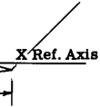

Fig. AS. 38

The total wing area is 17760 sq. in. For
convenience a total unit distributed load of
17760 Ibs. will be assumed acting on the half
wing and acting upward in the Z direction and
through the airfoil aerodynamic center. The
spanwise distribution of this load will be according to the (C L) lift coefficient spanwise
distribution. For simplicity in this example
it will be assumed constant.
Table A5.1 shows the calculations in table
form for determining the (V z ) the wing shear in
the Z direction, the bending moment Mx or moment about the X axis and My the moment about
the Y axis for a number of stations between the
wing tip station 240 and the centerline station
O.
Column 1 of the table shows the number of
stations selected. Column 3 shows the CL/
CL

x

V z =17760/
sJ¢iy;~_o--_x

C [My] =214071 Fig. AS. 39

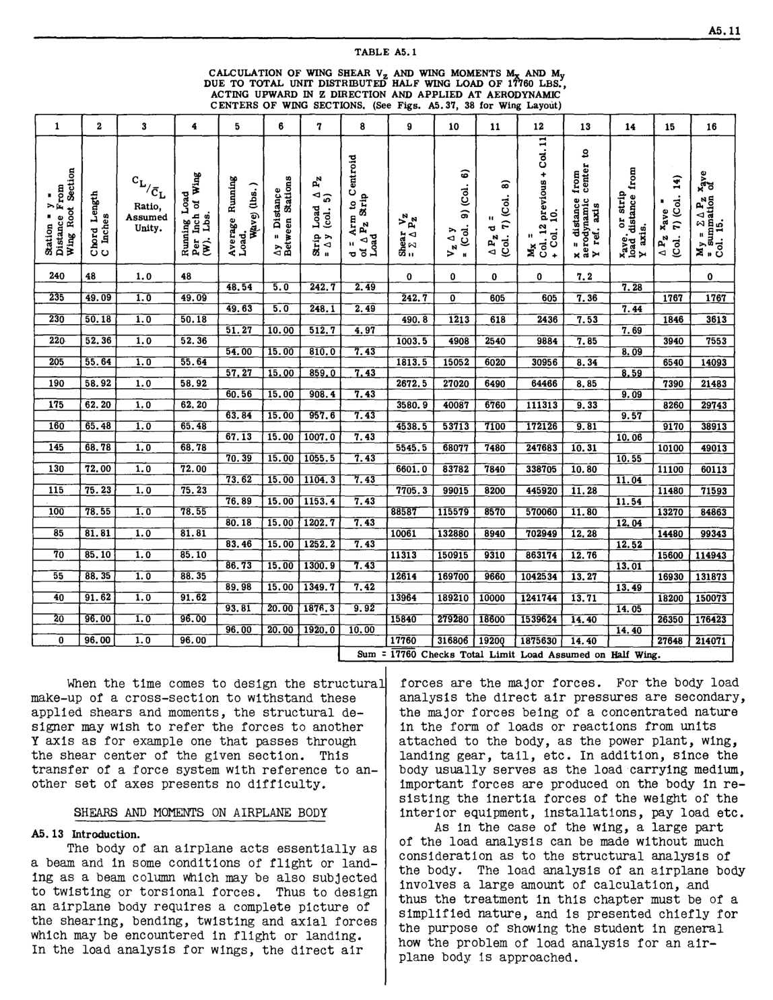

A5.11

TABLE A5.1

CALCULATION OF WING SHEAR Vz AND WING MOMENTS M" AND My
DUE TO TOTAL UNIT DISTRIDUTED HALF WING LOAD OF 17760 LBS.,
ACTING UPWARD IN Z DIRECTION AND APPLIED AT AERODYNAMIC
CENTERS OF WING SECTIONS. (See Figs. A5.37, 38 for Wing Layout)

When the time comes to deSign the structural
make-up of a cross-section to withstand these
applied shears and moments, the structural designer may Wish to refer the forces to another
Y axis as for example one that passes through
the shear center of the given section. This
transfer of a force system With reference to another set of axes presents no difficulty.

SHEARS AND MOMENTS ON AIRPLANE BODY

## A5.13 Introduction.
The body of an airplane acts essentially as
a beam and in some conditions of flight or landing as a beam column which may be also subjected
to twisting or torsional forces. Thus to design
an airplane body requires a complete picture of
the shearing, bending, twisting and axial forces
which may be encountered in flight or landing.
In the load analysis for wings, the direct air

forces are the major forces. For the body load
analysis the direct air pressures are secondary,
the major forces being of a concentrated nature
in the form of loads or reactions from units
attached to the body, as the power plant, wing,
landing gear, tail, etc. In addition, since the
body usually serves as the load carrying medium,
important forces are produced on the body in resisting the inertia forces of the weight of the
interior equipment, installations, pay load etc.
As in the case of the wing, a large part
of the load analysis can be made without much
consideration as to the structural analysis of
the body. The load analysis of an airplane body
involves a large amount of calculation, and
thus the treatment in this chapter must be of a
simplified nature, and is presented chiefly for
the purpose of showing the student in general
how the problem of load analysis for an airplane body is approached.

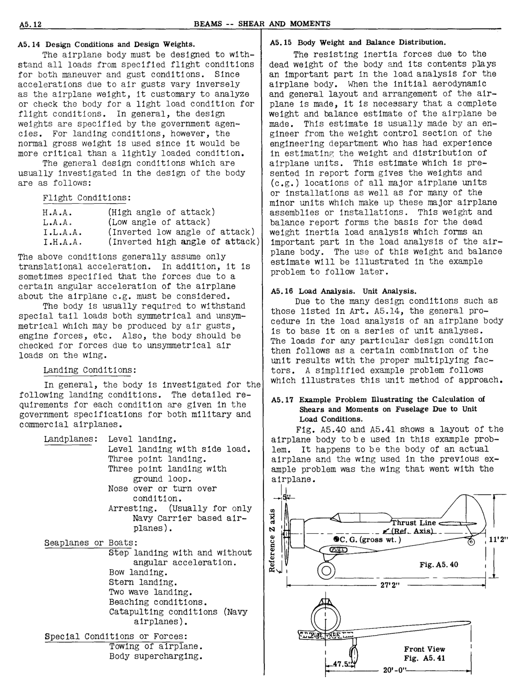

_A5.12_ BEAMS -- SHEAR AND MOMENTS

## A5.14 Design Conditions and Design Weights.
The airplane body must be designed to withstand all loads from specified flight conditions
for both maneuver and gust conditions. Since
accelerations due to air gusts vary inversely
as the airplane weight, it customary to analyze
or check the body for a light load condition for
flight conditions. In general, the design
weights are specified by the government agencies. For landing conditions, however, the
normal gross weight is used since it would be
more critical than a lightly loaded condition.
The general design conditions which are
usually investigated in the design of the body
are as follows:

Flight Conditions:

## A5.15 Body Weight and Balance Distribution.
The resisting inertia forces due to the
dead weight of the body and its contents plays
an important part in the load analysis for the
airplane body. When the initIal aerodynamic
and general layout and arrangement of the airplane is made, it is neceBsary that a complete
weight and balance estimate of the airplane be
made. This estimate is usually made by an engineer from the weight control section of the
engineering department who has had experience
in estimatinp, the weight and distribution of
airplane units. This estimate which is presented in report form gives the weights and
(e.g.) locations of all major airplane units
or installations as well as for many of the
minor units which make up these major airplane
assemblies or installations. This weight and
balance report forms the basis for the dead
weight inertia load analysis which forms an
important part in the load analysis of the airplane body. The use of this weight and balance
estimate will be illustrated in the example
problem to follow later.

## A5.16 Load Analysis. Unit Analysis.
Due to the many design conditions such as
those listed in Art. A5.14, the general procedure in the load analysis of an airplane body
is to base it on a series of unit analyses.
The loads for any particular design condition
then follows as a certain combination of the
unit results with the proper multiplying factors. A simplified example problem follows
which illustrates this unit method of approach.

## A5.17 Example Problem Illustrating the Calculation of Shears and Moments on Fuselage Due to Unit Load Conditions.
Fig. A5.40 and A5.41 shows a layout of the
airplane body to b e used in this example problem. It happens to be the body of an actual
airplane and the wing used in the previous example problem was the wing that went with the
airplane.

-+!~

N'

H.A.A.
L.A.A.
LL.A.A.
I.H.A.A.

(High angle of attack)
(Low angle of attack)
(Inverted low angle of attack)
(Inverted high angle of attack)

The above conditions generally assume only
translational acceleration. In addition, it is
sometimes specified that the forces due to a
certain angular acceleration of the airplane
about the airplane e.g. must be considered.
The body is usually required to withstand
special tail loads both symmetrical and unsymmetrical which may be produced by air gusts,
engine forces, etc. Also, the body should be
checked for forces due to unsymmetrical air
loads on the wing.

Landing Conditions:

In general, the body is investigated for the
following landing conditions. The detailed reqUirements for each condition are given in the
government specifications for both military and
commercial airplanes.

Landplanes: Level landing.
Level landing With side load.
Three point landing.
Three point landing with
ground loop.
Nose over or turn over
condition.
Arresting. (Usually for only
Navy Carrier based airplanes)             
Seaplanes or Boats:
Step landing With and Without

angular acceleration.
Bow landing.
Stern landing.
Two wave landing.
Beaching conditions.
Catapulting conditions (Navy
airplanes).

SpecIal Conditions or Forces:
Towing of airplane.
Body supercharging.

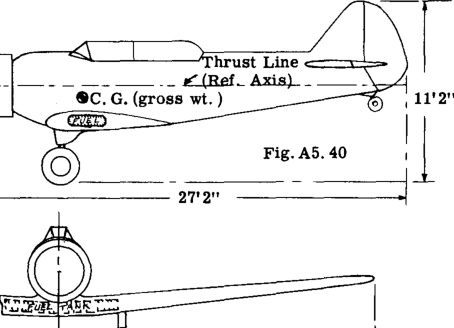

I I

~47., '

QI
C.l
c:

~ II

~J,

Front Fig. _A5.41_ View I I

20' -0"'------_.

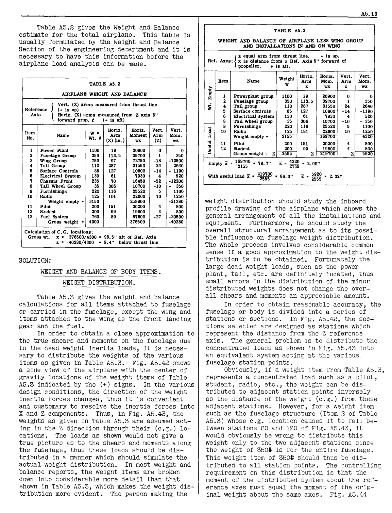

Table A5.2 gives the Weight and Balance
estimate for the total airplane. This table is
usually formulated by the Weight and Balance
Section of the engineering department and it is
necessary to have this information before the
airplane load analysis can be made.

SOLUTION:

WEIGHT AND BALANCE OF BODY ITEMS.

WEIGHT DISTRIBUTION.

Table A5.3 gives the weight and balance
calculations for all items attached to fuselage
or carried in the fuselage, except the wing and
items attached to the wing as the front landing
gear and the fuel.
In order to obtain a close approximation to
the true shears and moments on the fuselage due
to the dead weight inertia loads, it is necessary to distribute the weights of the various
items as given in Table A5.3. Fig. A5.42 shows
a side view of the airplane with the center of
gravity locations of the weight items of Table
A5.3 indicated by the (+) signs. In the various
design conditions, the direction of the weight
inertia forces changes, thus it is convenient
and customary to resolve the inertia forces into
X and Z components. ThUS, in Fig. A5.43, the
weights as given in Table A5.3 are assumed acting in the Z direction through their (e.g.) locations. The loads as shown would not give a
true picture as to the shears and moments along
the fuselage, thus these loads should be distributed in a manner which should simulate the
actual weight distribution. In most weight and
balance reports, the weight items are broken
down into considerable more detail than that
shown in Table A5.3, which makes the weight distribution more eVident. The person making the

weight distribution should study the inboard
profile drawing of the airplane Which shows the
general arrangement of all the installations and
equipment. Furthermore, he should stUdy the
overall structural arrangement as to its possible influence on fuselage weight distribution.
The whole process involves considerable common
sense if a good apprOXimation to the weight distribution is to be obtained. Fortunately the
large dead weight loads, such as the power
plant, tail, etc. are definitely located, thus
small errors in the distribution of the minor
distributed weights does not change the overall shears and moments an appreciable amount.
In order to obtain reasonable accuracy, the
fuselage or body is divided into a series of
stations or sections. In Fig. A5.42, the sections selected are designed as stations which
represent the distance from the Z reference
axis. The general problem is to distribute the
concentrated loads as shown in Fig. A5.43 into
an equivalent system acting at the various
fuselage station points.
Obviously, if a weight item from Table A5.3,
represents a concentrated load such as a pilot,
stUdent, radio, etc., the weight can be distributed to adjacent station points inversely
as the distance of the weight (e.g.) from these
adjacent stations. However, for a weight item
such as the fuselage structure (Item 2 of Table
A5.3) whose e.g. location causes it to fall between stations 80 and 120 of Fig. A5.43, it
would obViously be wrong to distribute this
weight only to the two adjacent stations since
the weight of 350# is for the entire fuselage.
This weight item of 350# should thus be distributed to all station points. The controlling
requirement on this distribution is that the
moment of the distributed system about the reference axes must equal the moment of the original weight about the same axes. Fig. A5.44

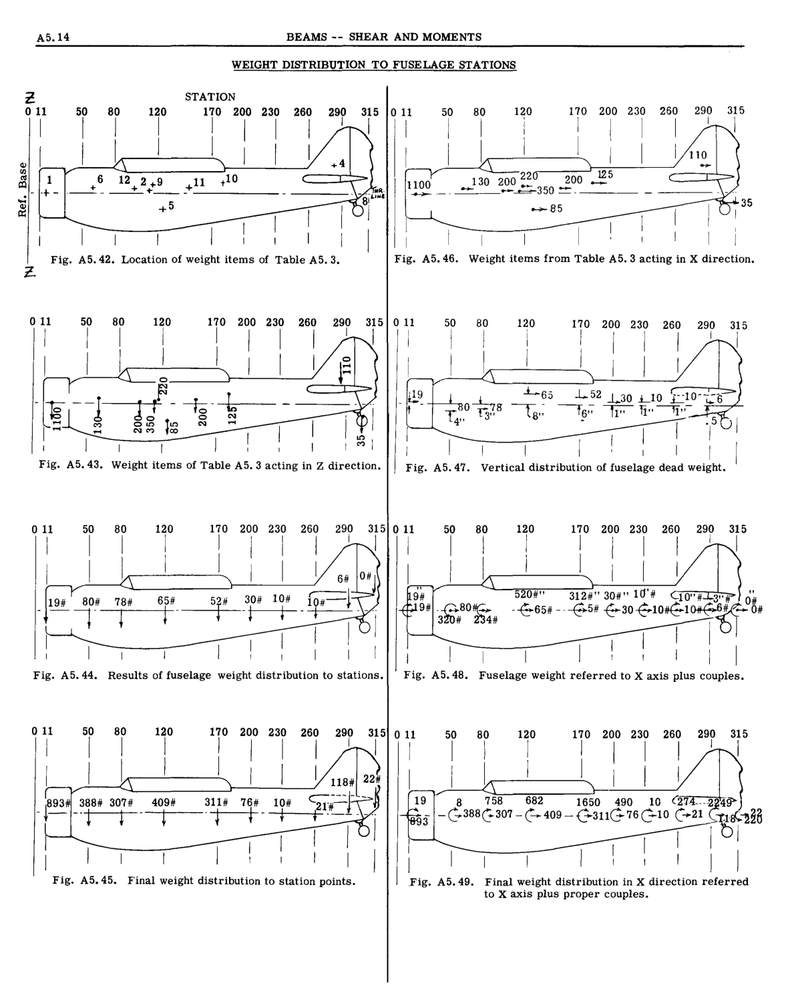

A5.14 BEAMS -- SHEAR AND MOMENTS

WEIGHT DISTRIBUTION TO FUSELAGE STATIONS

2 STATION

o 11 50 80 120 170 200 230

 - - -+ - ._- - --+- +-- -+----
~ +5

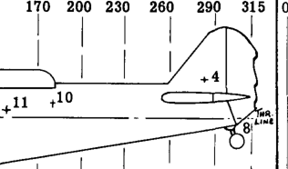

Fig. A5.42. Location of weight items of Table A5. 3.

o 11 50 80 120 170 200 230 290
I I I I 'I I
I I I I I I I

 - ~ -~l----J
-fg-k ""

...-f...-f ...-f **M** N **Oan** **en** lit> **co** ...
I I

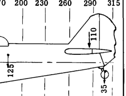

Fig. A5.43. Weight items of Table A5. 3 acting in Z direction.

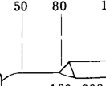

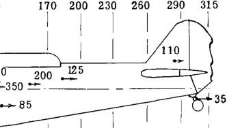

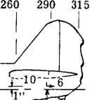

... 6

L4" 8     -     - 5 U I
I I I I
I I I II! I I I I

Fig. A5. 47. Vertical distribution of fuselage dead weight.

011

I

I

I
I

noo 200 ~O 200....!5

I

I

Fig. A5.46. Weight items from Table A5. 3 acting in X direction.

011

I
I

50 80 120 170 200 230 290

I I
I I I i I I I

I 1.,.--1_-'-...1 I I

il [9] L 65 ~52 -1-30 LI0 .£..:10-<:6
t - ... 0 h(ff ~,; ----r 6,-; rp.- fJ.,,~,,

011 120 170 200 230 290 50 80

290 315
I,

I I I I I I I I

I I
I I I I I

"
9#
- 19# 80# 78# 65# -+ 30# 9# _.&80_
-l·---r--t· -! 3 # _W_ 4#

|290 I 120 170 200 230 260 I I I I I 50 80 I I|Col2|
|---|---|
|I I I I I .,.--1_-'-...1 I 1 I I I I I |I I I I I .,.--1_-'-...1 I 1 I I I I I |
|#|~~520#"~~ ~~312#" 30#" 10'#~~ ~~10"#~~ ~~3~~ --e-65# -.~5# t-30~10~1~i    ~~_ .&80_~~_W_ 3 # 4#|

I

Fig. A5.44. Results of fuselage weight distribution to stations.

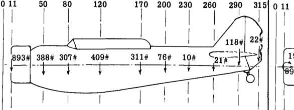

I I I I

I I ! I I I I

Fig. A5.48. Fuselage weight referred to X axis plus couples.

I I I! I I I

Fig. A5.45. Final weight distribution to station points. Fig. A5.49. Final weight distribution in X direction referred
to X axis plus proper couples.

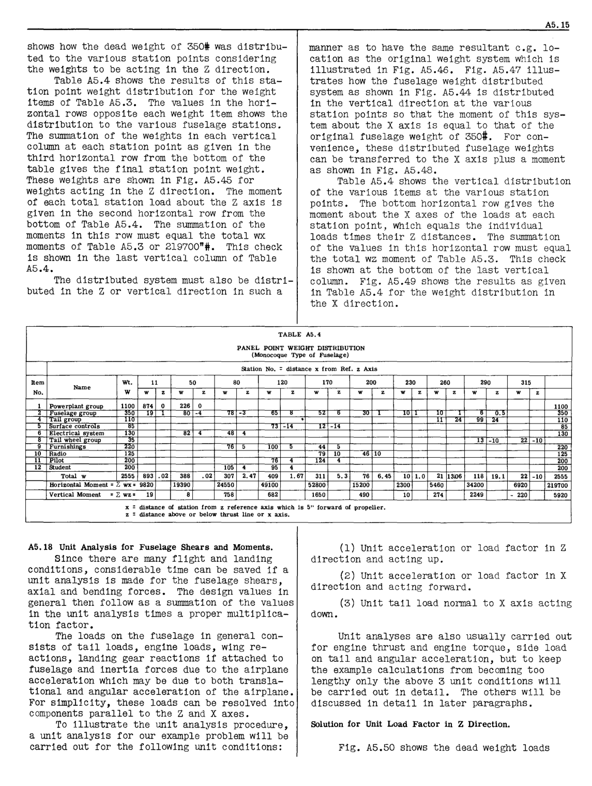

## A5.18 Unit Analysis for Fuselage Shears and Moments.
Since there are many flight and landing
conditions, considerable time can be saved if a
unit analysis is made for the fuselage shears,
axial and bending forces. The design values in
general then follow as a summation of the values
in the unit analysis times a proper multiplication factor.
The loads on the fuselage in general consists of tail loads, engine loads, wing reactions, landing gear reactions if attached to
fuselage and inertia forces due to the airplane
acceleration which may be due to both translational and angular acceleration of the airplane.
For simpl1city, these loads can be resolved into
components parallel to the Z and X axes.
To illustrate the unit analysis procedure,
a unit analysis for our example problem will be
carried out for the following unit conditions:

(1) Unit acceleration or load factor in Z
direction and acting up.

(2) Unit acceleration or load factor in X
direction and acting forward.

(3) Unit tail load normal to X axis acting
down.

Unit analyses are also usually carried out
for engine thrust and engine torque, side load
on tail and angular acceleration, but to keep
the example calculations from becoming too
lengthy only the above 3 unit conditions will
be carried out in detail. The others will be
discussed in detail in later paragraphs.

Solution for Unit Load Factor in Z Direction.

Fig. A5.50 shows the dead weight loads

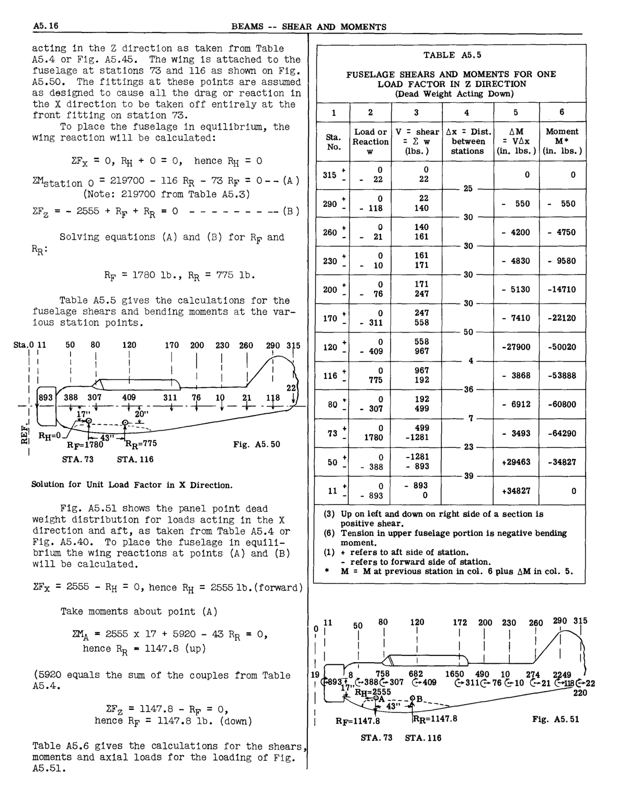

_A5.16_ BEAMS -- SHEAR AND MOMENTS

I

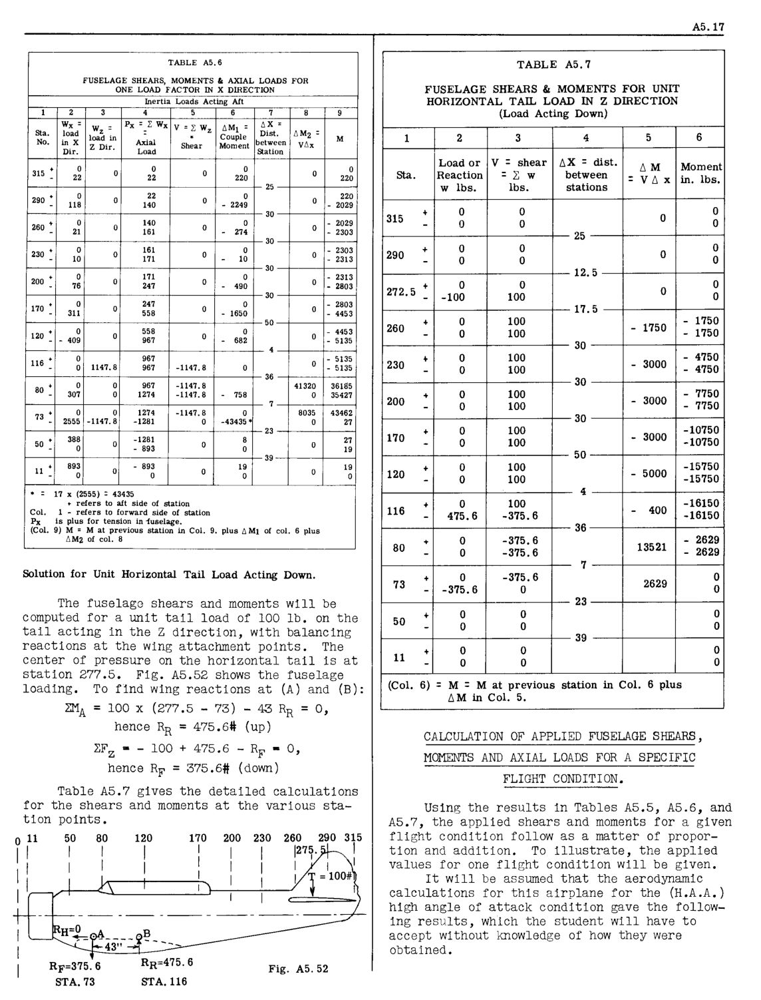

Solution for Unit Horizontal Tail Load Acting Down.

The fuselaga shears and moments will be
computed for a unit tail load of 100 lb. on the
tail acting in the Z direction, with balancing
reactions at the wing attachment points. The
center of pressure on the horizontal tail is at
station 277.5. Fig. A5.52 shows the fuselage
loading. To find wing reactions at (A) and (B):

ZM A = 100 x (277.5    - 73) - 43 RR = 0,
hence RR = 475.6# (up)

~Fz      - - 100 + 475.6      - RF - 0,
hence RF = 375.6# (down)

A5.17

|TABLE A5.7 FUSELAGE SHEARS & MOMENTS FOR UNIT HORIZONTAL TAIL LOAD IN Z DIRECTION (Load Acting Down)|Col2|Col3|Col4|Col5|Col6|
|---|---|---|---|---|---|
|1|2|3|4|5|6|
|sta.|Load or Reaction w lbs.|V = shear = ~ w lbs.|lIX = dist. between stations|LIM = VlIx|Moment in. lbs.|
|315 + -|0 0|0 0|25 12.5 17.5 30 30 30 50 4 36 7 23 39 |0|0 0|
|290 + -|0 0|0 0|0 0|0|0 0|
|272.5 + -|0 -100|0 100|0 100|0|0 0|
|260 + -|0 0|100 100|100 100|- 1750|- 1750 - 1750|
|230 + -|0 0|100 100|100 100|- 3000|- 4750 - 4750|
|200 + -|0 0|100 100|100 100|- 3000|- 7750 - 7750|
|170 + ~~-~~|0 0|100 100|100 100|- 3000|-10750 -10750|
|+ 120 -|0 0 |100 100 |100 100 |- 5000 |-15750 -15750 |
|116 + -|0 475.6|~~100~~ -375.6|~~100~~ -375.6|400 -|~~-16150~~ -16150|
|+ 80 -|0 0|-375.6 -375.6|-375.6 -375.6|13521|- 2629 - 2629|
|73 + -|0 -375.6|-375.6 0|-375.6 0|2629|0 0|
|+ 50 -|0 0|0 0|0 0||0 0|
|11 + - |0 0 |0 0 |0 0 ||0 0 |
|(Col. 6) = M = M at previous station in Col. 6 plus 1I M in Col. 5.|(Col. 6) = M = M at previous station in Col. 6 plus 1I M in Col. 5.|(Col. 6) = M = M at previous station in Col. 6 plus 1I M in Col. 5.|(Col. 6) = M = M at previous station in Col. 6 plus 1I M in Col. 5.|(Col. 6) = M = M at previous station in Col. 6 plus 1I M in Col. 5.|(Col. 6) = M = M at previous station in Col. 6 plus 1I M in Col. 5.|

CALCULATION OF APPLIED FUSELAGE SHEARS,

MOMENTS AND AXIAL LOADS FOR A SPECIFIC

FLIGHT CONDITION.

Using the reSUlts in Tables A5.5, A5.6, and
A5.7, the applied shears and moments for a given
flight condition follow as a matter of proportion and addition. To illustrate, the applied
values for one flight condition will be given.
It will be assumed that the aerodynamic
calculations for this airplane for the (H.A.A.)
high angle of attack condition gave the following reSUlts, which the student will have to
accept without knowledge of how they were
obtained.

Table A5.7 gives the detailed calculations
for the shears and moments at the various station points.

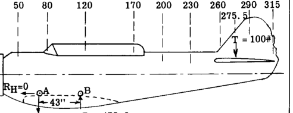

RF=375.6 RR=475.6

STA.73 STA.116

Fig. A5.52

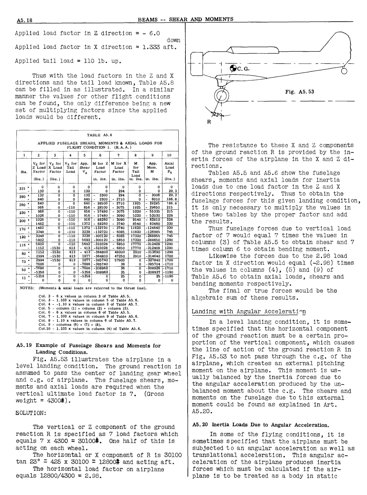

~~A5.18~~ BEAMS -- SHEAR AND MOMENTS

Applied load factor in Z direction = - 6.0
down
Applied load factor in X direction = 1.333 aft.

Applied tail load = 110 lb. up.

Thus with the load factors in the Z and X

|Thus with the load factors in the Z and X directions and the tail load known, Table A5.8 can be filled in as illustrated. In a similar manner the values for other flight conditions can be found, the only difference being a new set of multiplying factors since the applied loads would be different.

NOTES: **(Moments** **&** **axial** **loads** **are** **referred** **to the** **thrust** **line).**

**Col.** **2 - 6 x** **values** **in** **column** **3 of** **Table** **A5.5.**
**Col.** **3 -** **1.** **333 x** **values** **in** **column** **5** **of** **Table** **A5.6.**

**Col.** **4 -** **-1.10** **x** **values** **in** **column** **3 of Table' AS.** **7.**
**Col.** **5 -** **column** **(1)** **..** **column** **(2)** **..** **column** **(3).**
**Col.** **6**       - 6 **x** **values** **in** **column** **6** **of** **Table** **A5.5.**

**Col.** **7 -** **1.** **333 x** **values** **in** **column** **9** **of** **Table** **AS.6.**

**Col.** **8 -** **1.10** **x** **values** **in** **column** **6 of** **Table** **A5.7.**
Col. 9 - columns (6) • (7) • (8).
**Col.IO -** **1.** **333 x** **values** **in** **column** **(4)** **of** **Table** **A5.6.**
###### L

## A5.19 Example of Fuselage Shears and Moments for Landing Conditions.
Fig. A5.53 illustrates the airplane in a
level landing condition. The ground reaction is
assumed to pass the center of landing gear wheel
and e.g. of airplane. The fuselage shears, moments and axial loads are reqUired when the
vertical ultimate load factor is 7. (Gross
weight = 4300#).

SOLUTION:

The vertical or Z component of the ground
reaction R is specified as 7 load factors which
equals 7 x 4300 = 30100.. One half of this is
acting on each wheel.
The horizontal or X component of R is 30100
tan 23° = 425 x 30100 = 12800# and acting aft.
The horizontal load factor on airplane
equals 12800/4300 = 2.98.

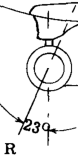

Fig. A5.53

-------

The resistance to these X and Z components
of the ground reaction R is prOVided by the inertia forces of the airplane in the X and Z directions.
Tables A5.5 and A5.6 show the fuselage
shears, moments and axial loads for inertia
loads due to one load factor in the Z and X
directions respectively. Thus to obtain the
fuselage forces for this given landing condition,
it is only necessary to mUltiply the values in
these two tables by the proper factor and add
the results.
Thus fuselage forces due to vertical load
factor of 7 would equal 7 times the values in
columns (3) of Table A5.5 to obtain shear and 7
times column 6 to obtain bending moment.
Likewise the forces due to the 2.98 load
factor in X direction would equal (-2.98) times
the values in columns (4), (5) and (9) of
Table A5.6 to obtain axial loads, shears and
bending moments respectively.
The final or true forces would be the
algebraic sum of these results.

Landing with Angular Accelerati~g

In a level landing condition, it is sometimes specified that the horizontal component
of the ground reaction must be a certain proportion of the vertical component, which causes
the line of action of the ground reaction R in
Fig. A5.53 to not pass through the c.g. of the
airplane, which creates an external pitching
moment on the airplane. This moment is usually balanced by the inertia forces due to
the angular acceleration produced by the unbalanced moment about the C.g. The shears and
moments on the fuselage due to t his external
moment could be found as explained in Art.
A5.20.

## A5.20 Inertia Loads Due to Angular Acceleration.

In some of the flying conditions, it is
sometimes specified that the airplane must be
subjected to an angUlar acceleration as well as
translational acceleration. This angular ac
cele~ation of the airplane produces inertia
forces which must be calculated if the airplane is to be treated as a body in static

-1--- -
I ~C.G.

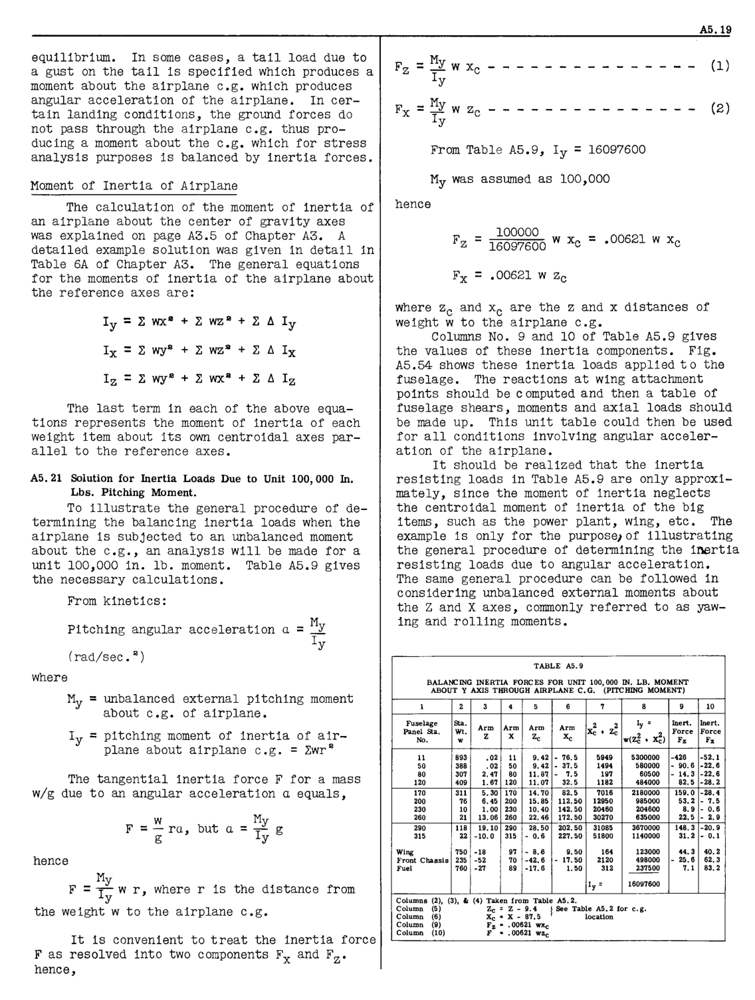

equilibrium. In some cases, a tail load due to
a gust on the tail is specified which produces a
moment about the airplane e.g. which produces
angular acceleration of the airplane. In certain landing conditions, the ground forces do
not pass through the airplane e.g. thus producing a moment about the e.g. which for stress
analysis purposes is balanced by inertia forces.

Moment of Inertia of Airplane

The calculation of the moment of inertia of
an airplane about the center of gravity axes
was explained on page A3.5 of Chapter A3. A
detailed example solution was given in detail in
Table 6A of Chapter A3. The general equations
for the moments of inertia of the airplane about
the reference axes are:

I y = _Z_ wx [8] + _Z_ WZ8 + _Z_ ~ I y

Ix = _Z_ wy8 + _Z_ wz [2] + _Z_ ~ Ix

I z = _Z_ wy8 + _Z_ wx [8] + _Z_ ~ I z

The last term in each of the above equations represents the moment of inertia of each
weight item about its own centroidal axes parallel to the reference axes.

## A5.21 Solution for Inertia Loads Due to Unit 100,000 In. Lbs. Pitching Moment.
To illustrate the general procedure of determining the balancing inertia loads when the
airplane is subjected to an unbalanced moment
about the e.g., an analysis will be made for a
unit 100,000 in. lb. moment. Table A5.9 gives
the necessary calculations.

From kinetics:

Pitching angular acceleration _a_ = My

I
y
(rad/sec. [2 ] )

where

= unbalanced external pitching moment
about e.g. of airplane.

Iy = pitching moment of inertia of airplane about airplane e.g. = Zwr [2]

The tangential inertia force F for a mass
_wig_ due to an angular acceleration _a_ equals,

w My
F =- g' ra but _a_ =- I y g

hence

My
F = r w r, where r is the distance from
y
the weight w to the airplane e.g.

It is convenient to treat the inertia force
F as resolved into two components Fx and Fz •
hence,

Fz = My w Xc
I
y

F x = My w zc - - - - - - - - - - - - - - I
y

From Table A5.9, Iy = 16097600

My was assumed as 100,000

hence

= 100000 =
Fz 16097600 w Xc .00621 w Xc

Fx = .00621 w Zc

A5.19

(1)

(2)

where zc and Xc are the z and x distances of
weight w to the airplane e.g.
Columns No. 9 and 10 of Table A5.9 gives
the values of these inertia components. Fig.
A5.54 shows these inertia loads applied to the
fuselage. The reactions at wing attachment
points should be computed and then a table of
fuselage shears, moments and axial loads should
be made up. This unit table could then be used
for all conditions involving angular acceleration of the airplane.
It should be realized that the inertia
resisting loads in Table A5.9 are only approximately, since the moment of inertia neglects
the centroidal moment of inertia of the big
items, such as the power plant, wing, etc. The
example is only for the purpose)of illustrating
the general procedure of determining the inertia
resisting loads due to angular acceleration.
The same general procedure can be followed in
considering unbalanced external moments about
the Z and X axes, commonly referred to as yawing and rolling moments.

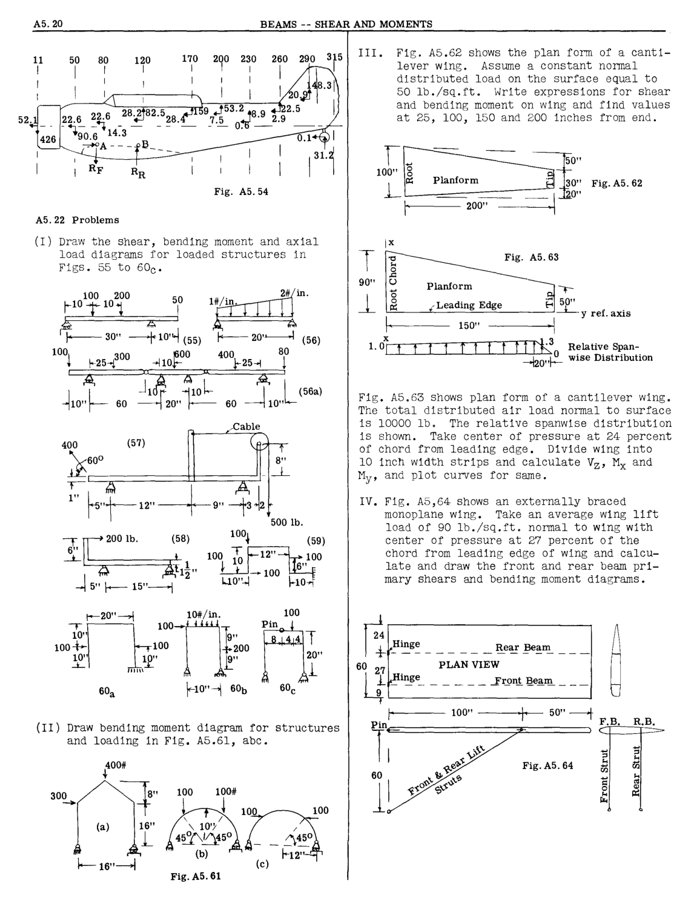

BEAMS -- SHEAR AND MOMENTS

III. Fig. A5.62 shows the plan form of a cantilever wing. Assume a constant normal
distributed load on the surface equal to
50 lb./sq.ft. Write expressions for shear
and bending moment on wing and find values
at 25, 100, 150 and 200 inches from end.

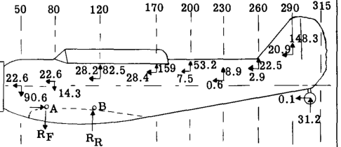

52.

A5.20

426

I

I

A5.22 Problems

100" f.. g ~O"

Fig. A5.54

L L [IX:_--"p=la:::n=fo=-r-m----] .~ 30" Fig. A5. 62
I 1-<-.  - - - - [--] 200" [ _\20"] .

1-<-. - - - - 200" .

(I) Draw the shear, bending moment and axial
load diagrams for loaded structures in
Figs. 55 to 60c ' T

90"

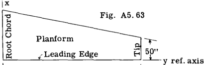

150"

400 (57)

~60o

~c:=;;:=:======±t====:;:::'J- ~
r"r [12] "-+'" --t3~
;::- 500 lb.
t ~ ;00 lb. (58) 100. (59)
~b **+** 100 To 100
~ kIt" ~ -100 6"
-15" f-.- 15"----1 L...J.0''--1

20

"

1
1001

100

 - n
###### n 44

20

"
hl::o-i~l.~t;oo

- n

44 T

~'/l"I\~" ]~."

1"

60a r-lO"-1 60b

60c

(II) Draw bending moment diagram for structures
and loading in Fig. A5.61, abc.

t [400] #

x
1. 01 t 1 f f t t f~ Relative Span~O"~ wise Distribution

Fig. A5.63 shows plan form of a cantilever wing.
The total distributed air load normal to surface
is 10000 lb. The relative spanwise distribution
is shown. Take center of pressure at 24 percent
of chord from leading edge. Divide wing into
10 inch width strips and calculate Vz, Mx and
My. and plot curves for same.

IV. Fig. A5,64 shows an externally braced
monoplane wing. Take an average wing lift
load of 90 lb./sq.ft. normal to wing with
center of pressure at 27 percent of the
chord from leading edge of wing and calculate and draw the front and rear beam primary shears and bending moment diagrams.

r1 ~~~~~------~~~~~---~~
60 27 PLAN VIEW
I 1 k!Iinge Front Beam
4 '------ --J

/. 100" 'I' 50" ----1Pin eFt' B:::.~R=I.=B==. =
II

Fig. A5. 64

11

30~M8"

(a) 16"
_L_

1--16"~

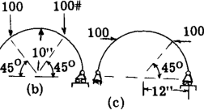

Fig. A5. **61**

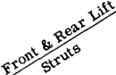
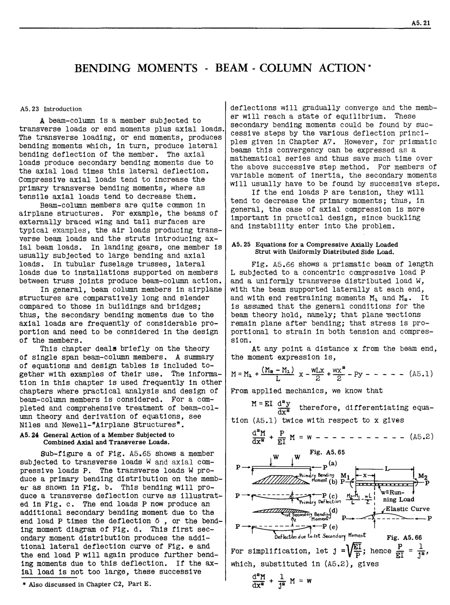

A5.21

# BENDING MOMENTS - BEAM - COLUMN ACTION*

## A5.23 Introduction

A beam-column is a member subjected to
transverse loads or end moments plus axial loads.
The transverse loading, or end moments, produces
bending moments which, in turn, produce lateral
bending deflection of the member. The axial
loads produce secondary bending moments due to
the axial load times this lateral deflection.
Compressive axial loads tend to increase the
primary transverse bending moments, where as
tensile axial loads tend to decrease them.
Beam-column members are qUite common in
airplane structures. For example, the beams of
externally braced wing and tail surfaces are
typical examples, the air loads producing transverse beam loads and the struts introducing axial beam loads. In landing gears, one member is
usually subjected to large bending and axial
loads. In tubular fuselage trusses, lateral
loads due to installations supported on members
between truss joints produce beam-column action.
In general, beam column members in airplane
structures are comparatively long and slender
compared to those in buildings and bridges;
thUS, the secondary bending moments due to the
axial loads are frequently of considerable proportion and need to be considered in the design
of the members.
This chapter deale briefly on the theory
of single span beam-column members. A summary
of equations and design tables is included together With examples of their use. The information in this chapter is used frequently in other
chapters where practical analysis and design of
beam-column members is considered. For a completed and comprehensive treatment of beam-column theory and derivation of equations, see
Niles and Newell-"Airplane structures".

## A5.24 General Action of a Member Subjected to Combined Axial and Transverse Loads.

Sub-figure a of Fig. A5.65 shows a member
subjected to transverse loads Wand axial compressive loads P. The transverse loads W produce a primary bending distribution on the member as shOwn in Fig. b. This bending will produce a transverse deflection curve as illustrated in Fig. c. The end loads P now produce an
additional secondary bending moment due to the
end load P times the deflection 0, or the bending moment diagram of Fig. d. This first secondary moment distribution produces the additional lateral deflection curve of Fig. e and
the end load P will again produce further bending moments due to this deflection. If the axial load is not too large, these successive

 Also discussed in Chapter C2, Part E.

deflections will gradually converge and the member will reach a state of equilibrium. These
secondary bending moments could be found by successive steps by the various deflection principles given in Chapter A7. However, for prismatic
beams this convergency can be expressed as a
mathematical series and thus save much time over
the above successive step method. For members of
variable moment of inertia, the secondary moments
will usually have to be found by successive steps.
If the end loads P are tension, they will
tend to decrease the primary moments; thUS, in
general, the case of axial compression is more
important in practical design, since buckling
and instability enter into the problem.

## A5.25 Equations for a Compressive Axially Loaded Strut with Uniformly Distributed Side Load.

Fig. A5.66 shows a prismatic beam of length
L subjected to a concentric compressive load P
and a uniformly transverse distributed load W,
With the beam supported laterally at each end,
and with end restraining moments M 1 and M 2 • It
is assumed that the general conditions for the
beam theory hold, namely; that plane ~ections
remain plane after bending; that stress is proportional to strain in both tension and compression.
At any point a distance x from the beam end,
the moment expression is,

(M 2     - M 1 ) wLx wx [2]
M == M 1 + L x - ""2 +""2 - py - - - - - (A5 .1 )

From applied mechanics, we know that

M -    - EI d dx [2] y 2 therefore, differentiating equa
tion (A5.1) twice with respect to x gives

d    - 2 M + - P M == w - - - - - - - - (A5.2)
dx [2] EI

w w Fig. A5.65

P ---. t ~J..'J. !! 'l- Benc!ins p(a) Ml F:3X I-- L-------j I M2
ernont (b) p~\" ' •, f,                      - r- [p]

p-r<-:::.-------J.-=..::-'I-P(c) 112-~ w~RunI ~r;"'!'J Derledie~ L _-T_ I mng Load

......-z7Z7~ . ~d) ~ElaStiC Curve
P-~-P(e) st 6a ec.on Cl!J t\om""t Benda., p- -- ------ 1 -p
_,_ Def/~til", due t~15t S"CDndQ'y Moment Fig. A5.66
'lIEf. P 1
For simplification, let j =Vl'; hence EI j2'

which, substituted in (A5.2), gives

d [2] M 1
dx2 + j2 M == W

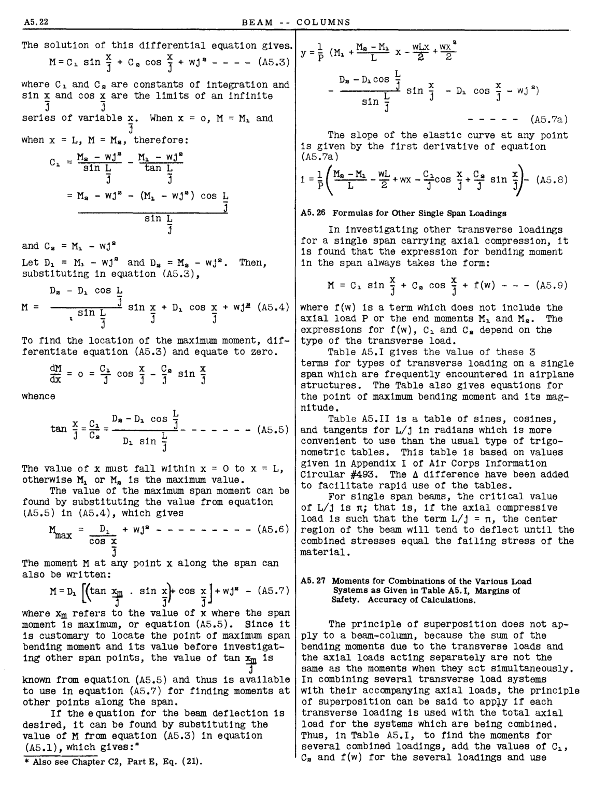

A5.22 BEAM - - COLUMNS

The solution of this differential equation gives. 1 M M wLx wx [2]
Y = P (M 1 + ra ~ 1 X - "2 +"""'2
M=C 1 sin j + Cra cos j + wjra   - - - - (A5.3)

where C 1 and Cra are constants of integration and
sin x and cos x are the limits of an infinite

j j
series of variable x. When x = 0, M = M 1 and
j
when x = L, M = M ra, therefore:

C   - M ra   - wjra M 1   - wjra

1       - sin L tan L
j j

= M ra    - wjra    - (M 1    - wjra) cos L

j

~~sin~~ L

j

L
D ra - D 1 cos j

L
sin j

x
sin j

and Cra = M 1 - wjra

Let D 1 = M1 - wjra and D ra = M ra - wjra.
sUbstituting in equation (A5.3),

D ra  - D 1 cos L

Then,

M

---::-:;-::--;;---,,-j sin x
sin L j
j

+ D 1 cos X + wj& (A5.4)

j

To find the location of the maximum moment, differentiate equation (A5.3) and equate to zero.

1M dx- _ [o ]   - _ C j [1] cos X j-j Cra sin ~ j

whence

L
tan ~ =C 1 :; D [ra] - D [1] cos j
j Cra D i L
1 S n '3

-  - - - - (A5.5)

(A5.7a)

The slope of the elastic curve at any point
is given by the first derivative of equation
(A5.7a)

1 (Mra  - ~ wL C 1 x C ra ~ )
i = P --L- - 2" +WX - TCOS j + j sin _jJ-_ (A5.8)

## A5.26 Formulas for Other Single Span Loadings

In investigating other transverse loadings
for a single span carrying axial compression, it
is found that the expression for bending moment
in the span always takes the form:

x x
M = C 1 sin j + Cra cos j + f(w) - - - (A5.9)

where f(w) is a term which does not include the
axial load P or the end moments M 1 and M ra . The
expressions for f(w), C 1 and Cra depend on the
type of the transverse load.
Table A5.I gives the value of these 3
terms for types of transverse loading on a single
span Which are frequently encountered in airplane
structures. The Table also gives equations for
the point of maximum bending moment and its magnitUde.
Table A5.II is a table of sines, cosines,
and tangents for L/j in radians which is more
convenient to use than the usual type of trigonometric tables. This table is based on values
given in Appendix I of Air Corps Information
Circular #493. The ~ difference have been added
to facilitate rapid use of the tables.
For single span beams, the critical value
of L/j is n; that is, if the axial compressive
load is such that the term L/j = n, the center
region of the beam will tend to deflect until the
combined stresses equal the failing stress of the
material.

## A5.27 Moments for Combinations of the Various Load Systems as Given in Table A5.I, Margins of Safety. Accuracy of Calculations.

The principle of superposition does not apply to a beam-column, because the sum of the
bending moments due to the transverse loads and
the axial loads acting separately are not the
same as the moments when they act simultaneously.
In combining several transverse load systems
With their accompanying axial loads, the principle
of superposition can be said to app~y if each
transverse loading is used with the total axial
load for the systems Which are being combined.
ThUS, in Table A5.I, to find the moments for
several combined loadings, add the values of C 1,
Cra and f(w) for the several lo~dings and use

The value of X must fall within x = 0 to x = L,
otherwise M 1 or M ra is the maximum value.
The value of the maximum span moment can be
found by substituting the value from equation

tA5.5) in (A5.4), which gives

~ = ~ + wjra - - - - - - - - - (A5.6)

cos x

j
The moment M at any point x along the span can
also be written:

M=D 1 r(tan !In . sin~} cos ~J + wjra  - (A5. 7)
l j j j
where xm refers to the value of x where the span
moment is maximum, or equation (A5.5). Since it
is customary to locate the point of maximum span
bending moment and its value before investigat
ing' other span points, the value of tan !In is

j
known from equation (A5.5) and thus is available
to use in equation (A5.7) for finding moments at
other points along the span.
If the equation for the beam deflection is
desired, it can be found by substituting the
value of M from equation (A5.3) in equation
(A5.1), which gives:*
 Also see Chapter C2, Part E, Eq. (21).

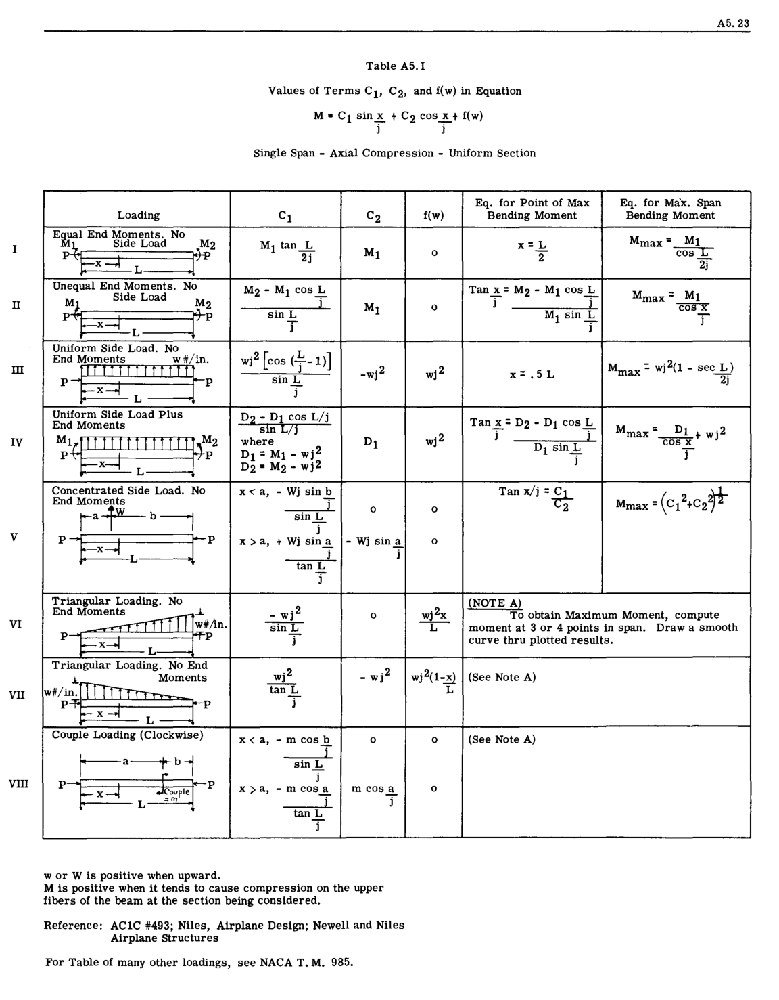

Table A5. I

Values of Terms _C_ _v_ C2, and f(w) in Equation

M· Cl sin~ + C2 cos~+ f(w)
j j

Single Span - Axial Compression - Uniform Section

A5.23

I

II

ill

IV

v

VI

VII

Vill

|Loading|Col2|Col3|f(w)|Eq. for Point of Max Bending Moment|Eq. for Max. Span Bending Moment|
|---|---|---|---|---|---|
|~~Equal End Moments. No~~ ~-k Side Load M2 'f;::x~ L ~~.r~~ |M 1 tan-h. 2j||o|x=L2"||
|~~Unequal End Moments. No~~ M Side Load M p1;x::::j L ---r-~  |~~sin L~~ T||o|Tan~ = M2 - Ml cos..!:.. j j M1 sin..!:. j|Mmax = Ml cosx T|
|~~Uniform Side Load. No~~ End Moments w#/in. P~~iPLU~~ t ~ t t t t f~~l-p~~|wj2 [cos (-r-1)] sink j|||x: .5 L||
|Uniform Side Load Plus End Moments ~1#=d f ~f t f f t tf~2|D2 - Dl cos L/j sm tIJ where Dl =Ml - wj2 D2· M2 - wj2|||Tan~: D2 - Dl cos.!=.. j j D1 sin..!:. i|Mmax=~+wj2 cos x i|
|Concentrated Side Load. No End Moments r-a-r-bi Pt=§ L fP |x< a, x> a, - Wj sin b T ~~sin L~~ j + Wi sin a J ~~tan L~~ T|o - Wi sin aT|o o|Tan xlj =g~||
|~~Triangular Loading. No~~ End Moments ----.---rT" J. ~TTII w#/in. p-;:::' l-=x==:--l~~==ffP L--- ||o||(NOTE A) To obtain Maximum Moment, compute moment at 3 or 4 points in span. Draw a smooth curve thru plotted results.|(NOTE A) To obtain Maximum Moment, compute moment at 3 or 4 points in span. Draw a smooth curve thru plotted results.|
|~~Triangular Loading. No End~~ 1. Moments w#/~~ |||wj2(l-E L|(See Note A)|(See Note A)|
|~~Couple Loading (Clockwise)~~|x < a, x> a, - m cos bT ~~sin L~~T - m cos aT ~~tan L~~ i|o m cos a i|o o|(See Note A)|(See Note A)|

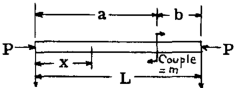

w or W is positive when upward.
M is positive when it tends to cause compression on the upper
fibers of the beam at the section being considered.

Reference: ACIC #493; Niles, Airplane Design; Newell and Niles
Airplane structures

For Table of many other loadings, see NACA T. M. 985.

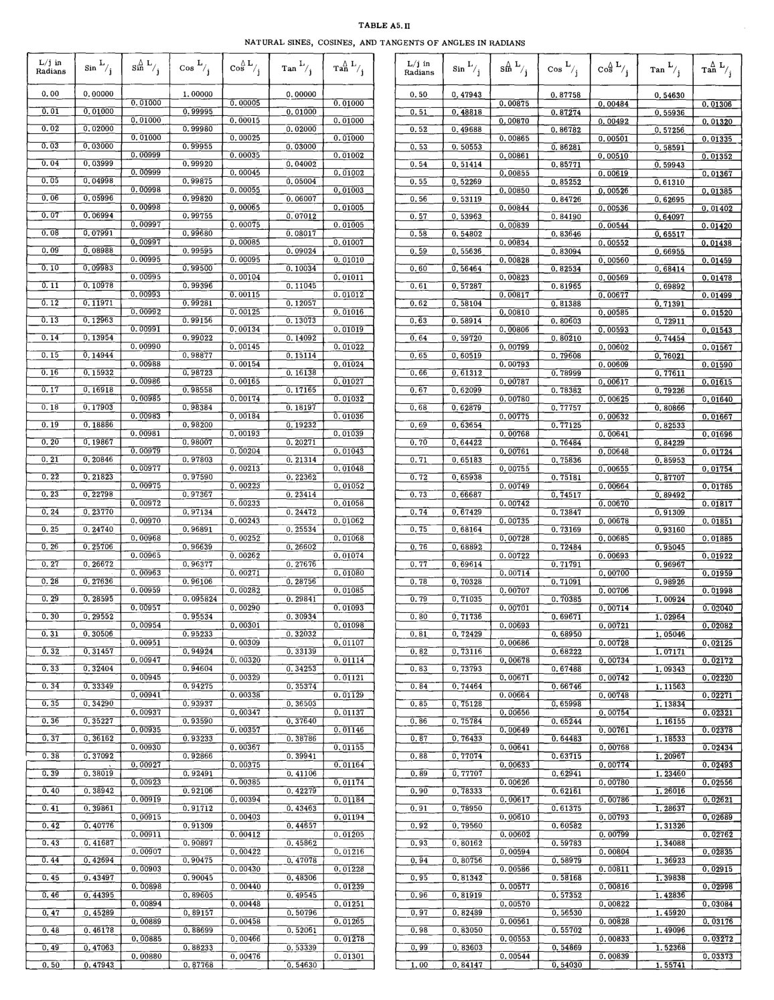

TABLE A5.n

NATURAL SINES, COSINES, AND TANGENTS OF ANGLES IN RADIANS

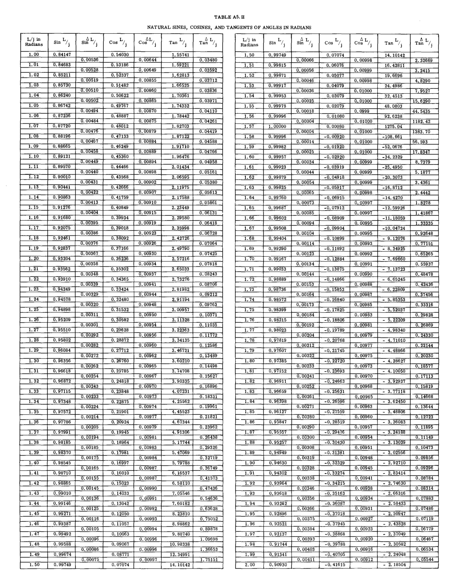

TABLE A5.II

NATURAL SINES, COSINES, AND TANGENTS OF ANGLES IN RADIANS

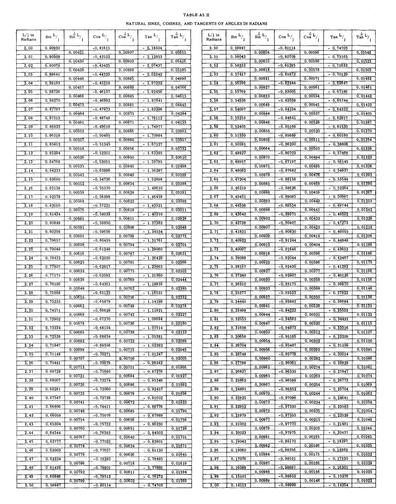

TABLE A5.II

NATURAL SINES, COSINES, AND TANGENTS OF ANGLES IN RADIANS

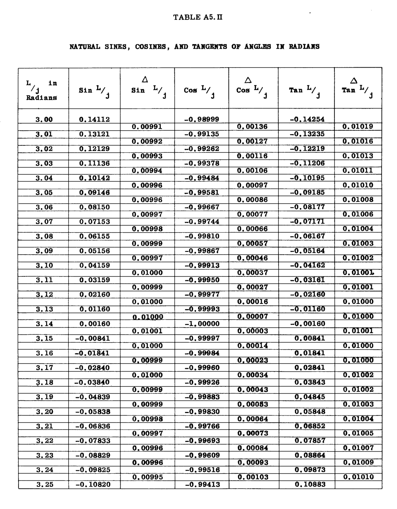

TABLE A5.n

NATUBAL SINES, COS Ins, AIm TAl(GEl(TS OF ANGLES IX BADUJ(S

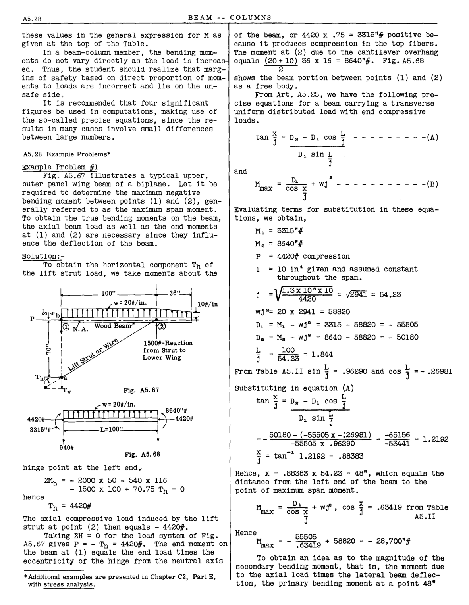

these values in the general expression for M as
given at the top of the Table.
In a beam-column member, the bending moments do not vary directly as the load is increa
ed. Thus, the student should realize that margins of safety based on direct proportion of moments to loads are incorrect and lie on the unsafe side.
It is recommended that four significant
figures be used in computations, making use of
the so-called precise equations, since the results in many cases involve small differences
between large numbers.

## A5.28 Example Problems*

Example Problem #1
Fig. A5.67 illustrates a typical upper,
outer panel wing beam of a biplane. Let it be
required to determine the maximum negative
bending moment between points (1) and (2), generally referred to as the maximum span moment.
To obtain the true bending moments on the beam,
the axial beam load as well as the end moments
at (1) and (2) are necessary since they influence the deflection of the beam.

Solution:To obtain the horizontal component Th of
the lift strut load, we take moments about the

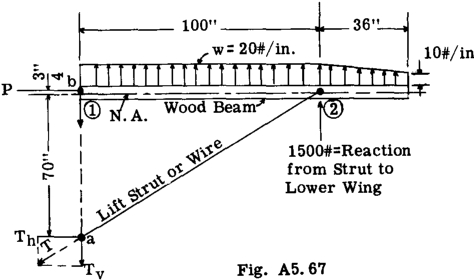

.--w= 20#/in.

II' 8640"#
4420#-fi 1tT t tTtt rr tIll tIt }1=4420#

3315"#--'"' t L=100:":'''---~1 /

940#
Fig. A5.68

hinge point at the lert end - .

2M b = - 2000 x 50 - 540 x 116

      - 1500 x 100 + 70.75 Th = 0

hence

Th = 4420#

The axial compressive load induced by the lift
strut at point (2) then equals - 4420#.

Taking ~H = 0 for the load system of Fig.
A5.67 gives P = - Th = 4420#. The end moment on
the beam at (1) equals the end load times the
eccentricity of the hinge from the neutral axis

*Additional examples are presented in Chapter C2, Part E,
with stress analysis.

of the beam, or 4420 x .75 = 3315"# positive because it produces compression in the top fibers.
The moment at (2) due to the cantilever overhang
equals (20 + 10) 36 x 16 = 8640"#. Fig. A5.68
2
shows the beam portion between points (1) and (2)
as a free body.
From Art. A5.25, we have the following precise equations for a beam carrying a transverse
uniform distributed load With end compressive
loads.

x L
tan J = D"   - D~ cos J - - - - - - - - -(A)

D~ sin L

J

and

M -iIIaX = ~ cos x + Wj"  - - - - - - - - - - -(B)

}

Evaluating terms for substitution in these equations, we obtain,

M~ 3315"#

M" 8640"#

p = 4420# compression

I = 10 in [6] given and assumed constant
throughout the span.

j = V-.3XJ~;X 10 = v'2941 = 54.23

wj"= 20 x 2941 = 58820

D~ = M~ - wj" 3315 - 58820

D" = M" - Wj" 8640 - 58820 =

- 55505

- 50180

!: = ~ = 1.844
j 54.23

From Table A5.II sin J = .96290 and cos J =- .26981

Substituting in equation (A)
x L
tan } = D"   - D~ cos}

L
D~ sin J

50180 - (-55505 x - :26981)
-55505 x .96290

= tan-" 1.2192 = .88383
j

-65156 = 1.2192
=5344I

Hence, x = .88383 x 54.23 = 48", which equals the
distance from the left end of the beam to the
point of maximum span moment.

~ ~ x
cos x + wJ, cos J = .63419 from Table

} A5.I1

Hence

~

55505:63419 + 58820 - - 28,700 #_ "

To obtain an idea as to the magnitude of the
secondary bending moment, that i8, the moment due
to the axial load times the lateral beam deflection, the primary bending moment at a point 48"

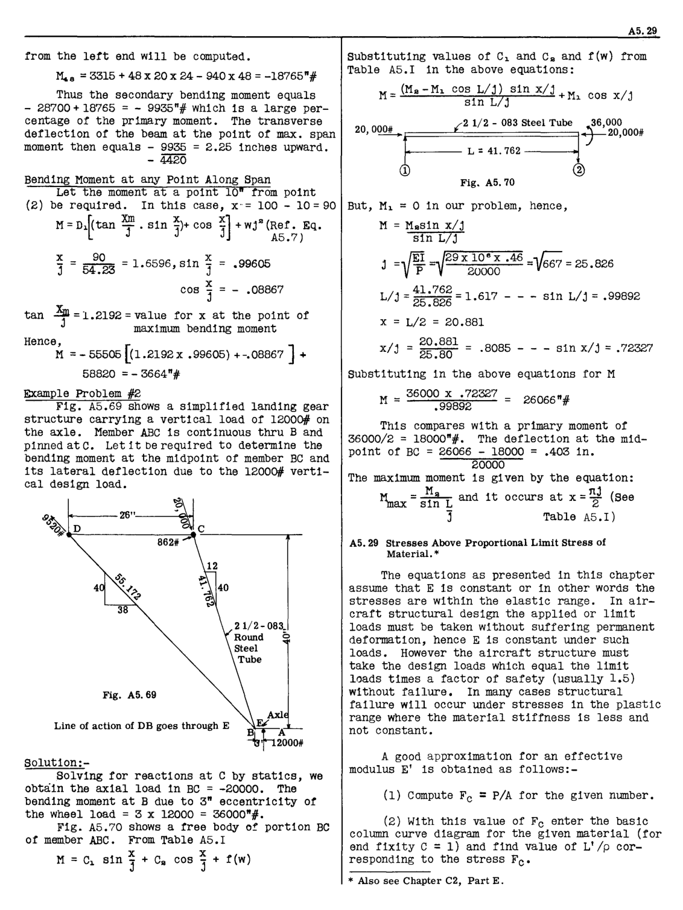

from the left end will be computed.

M.a = 3315 + 48 x 20 x 24 - 940 x 48 = -18765"#

Thus the secondary bending moment equals

- 28700 + 18765 = - 9935"# which is a large percentage of the primary moment. The transverse
deflection of the beam at the point of max. span
moment then equals - 9935 = 2.25 inches upward.

          - 4420

Bending Moment at any Point Along Span
Let the moment at a point 10" from point
(2) be required. In this case, x"= 100 - 10 = 90

M= nJ(tan x: . sin j)+ cos j] +wj" (Ref. Eq.
L A5.7)

x 90 x
J = 54:23 = 1.6596, sin J .99605

cos ~              - .08867
j
tan ~ = 1.2192 = value for x at the point of

maximum bending moment
Hence,
M =- 55505 [<1.2192 x .99605) +-.08867 ] +

58820 =- 3664"#

Example Problem #2

Fig. A5.69 shows a simplified landing gear
structure carrying a vertical load of 12000# on
the axle. Member ABC is continuous thru Band
pinned at C. Let it be required to determine the
bending moment at the midpoint of member BC and
its lateral deflection due to the 12000# vertical design load.

~---Z6"~C

-=-------..--862#

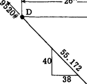

Fig. A5.69

Line of action of DB goes through E

Solution:
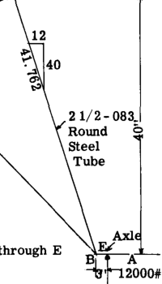

Solving for reactions at C by statiCS, we
obtain the axial load in BC = -20000. The
bending moment at B due to 3" eccentricity _ot_
the wheel load = 3 x 12000 = 36000"#.
Fig. A5.70 shows a free body of portion BC
of member ABC. From Table A5. I

M = C~ sin j + C .. cos j + f(w)

A5.29

Substituting values of C~ and C .. and f(W) from
Table A5. I in the above equations:

M= (M ..  - M~ cos L/j) sin x/j +M cos x/j
sin L!j ~

20 000 ['"],,2 1/2 - 083 Steel Tube 1~02000,000'"
'~I - _-j_ 1t
->----- L = 41. 762 **..**

®

Fig. A5.70

But, M~ = 0 in our problem, hence,

M = M .. sin x/j
sin L/j

8
j = .. @. = .. /29 x 10 x .46 =1/667 =25 826
VlP V 20000     

L/j =41.762=1617 25.826   -   - - - sin L/j = .99892

x = L/2 = 20.881

x/j   - 20.881 - .8085 - - -- 25.80   - sin x/j = .72327

SUbstituting in the above equations for M

M = 36000 x .72327 = 26066"#
.99892

This compares with a primary moment of
36000/2 = 18000"#. The deflection at the midpoint of BC = 26066 - 18000 = .403 in.
20000
The maximum moment is given by the equation:

~ax = s~n L and it occurs at x = ~j (See

J Table A5.I)

## A5.29 Stresses Above Proportional Limit Stress of Material.     

The equations as presented in this chapter
assume that E is constant or in other words the
stresses are within the elastic range. In aircraft structural design the applied or limit
loads must be taken without suffering permanent
deformation, hence E is constant under such
loads. However the aircraft structure must
take the design loads which equal the limit
loads times a factor of safety (usually 1.5)
without failure. In many cases structural
failure will occur under stresses in the plastic
range where the material stiffness is less and
not constant.

A good approximation for an effective
modulus E' is obtained as follows:

(1) Compute Fc = piA for the given number.

(2) With this value of Fe enter the basic
column curve diagram for the given material (for
end fixity C = 1) and find value of L'/p corresponding to the stress Fc '

Also see Chapter C2, Part E.

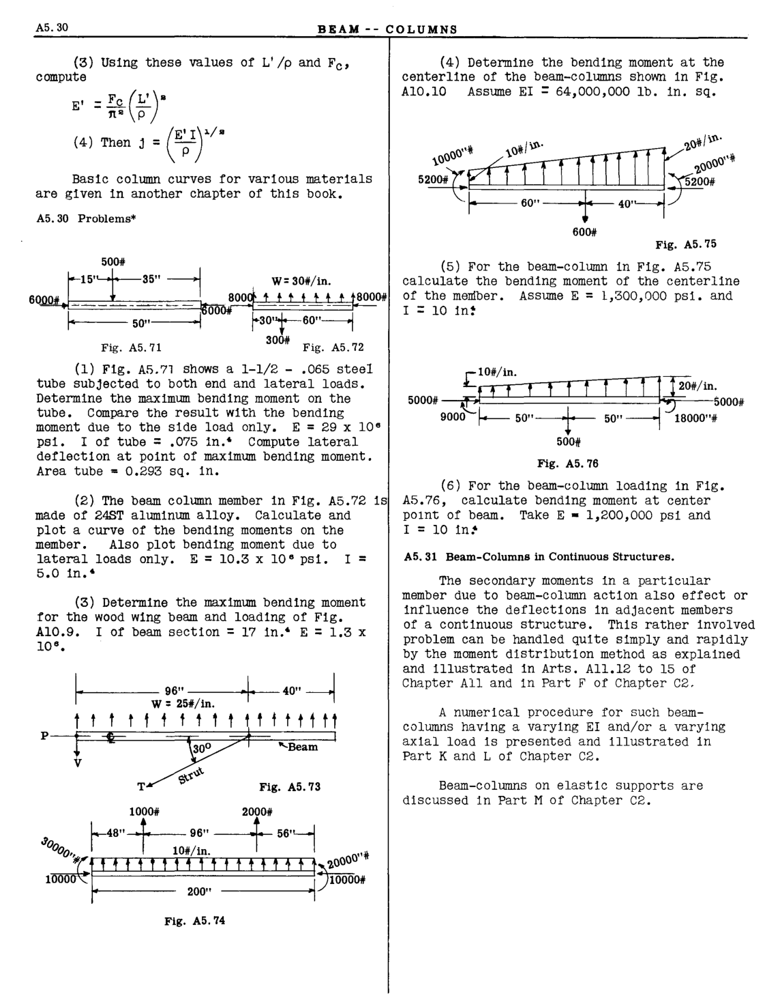

(3) Using these values of L' /p and Fc,
compute
E' =
!iL(L')a n [a] p

(4) Then j = (E~I)4/a

Basic column curves for various materials
are given in another chapter of this book.

## A5.30 Problems*

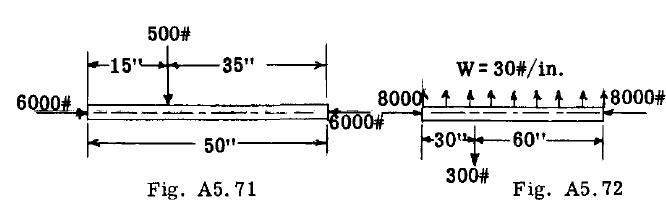

(1) Fig. A5.71 shows a 1-1/2  - .065 steel
tube subjected to both end and lateral loads.
Determine the maximum bending moment on the
tUbe. Compare the result with the bending
moment due to the side load only. E = 29 X 10^6
psi. I of tube = .075 in.^4 Compute lateral
deflection at point of maximum bending moment.
Area tube = 0.293 sq. in.

(2) The beam column member in Fig. A5.72 is
made of 24ST aluminum alloy. Calculate and
plot a curve of the bending moments on the
member. Also plot bending moment due to
lateral loads only. E = 10.3 x 10^6 psi. I =
5.0 in.^4

(3) Determine the maximum bending moment
for the wood wing beam and loading of Fig.
A10.9. I of beam section = 17 in.^4 E = 1.3 x 10^6. 

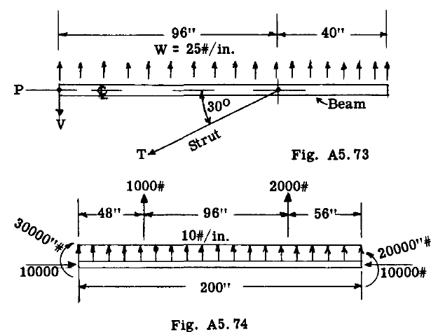

(4) Determine the bending moment at the
centerline of the beam-columns shown in Fig.
A10.10 Assume EI = 64,000,000 lb. in. sq.

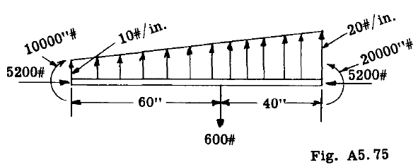

(5) For the beam-column in Fig. A5.75
calculate the bending moment of the centerline
of the member. Assume E = 1,300,000 psi. and
I = 10 in^4

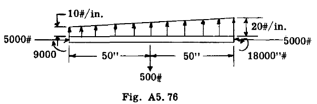

(6) For the beam-column loading in Fig.
A5.76, calculate bending moment at center
point of beam. Take E - 1,200,000 psi and
I = 10 in.^4

## A5.31 Beam-Columns in Continuous Structures.

The secondary moments in a particular
member due to beam-column action also effect or
influence the deflections in adjacent members
of a continuous structure. This rather involved
problem can be handled qUite simply and rapidly
by the moment distribution method as explained
and illustrated in Arts. A11.12 to 15 of
Chapter All and in Part F of Chapter C2.

A numerical procedure for such beamcolumns having a varying EI and/or a varying
axial load is presented and illustrated in
Part K and L of Chapter C2.

Beam-columns on elastic supports are
discussed in Part M of Chapter C2.

