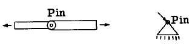
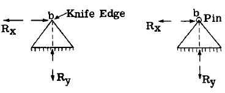

## A2.4 Symbols for Reacting Fitting Units as Used in Problem Solution.

In solving a structure for reactions,
member stresses, etc., one must know what force
characteristics are unknown and it is common
practice to use simple symbols to indicate what
fitting support or attachment units are to be
used or are assumed to be used in the final
design. The following sketch symbols are commonly used for coplanar force systems.

A small circle at the end of a member or on
a triangle represents a single pin connection
and fixes the point of application of forces
acting between this unit and a connecting member
or structure.

The above graphical symbols represent a
reaction in which translation of the attachment point (b) is prevented but rotation of the
attached structure about (b) can take place.
Thus the reaction is unknown in direction and
magnitude but the point of application is known,
namely through point (b). Instead of using
direction as an unknown, it is more convenient
to replace the resultant reaction by two components at right angles to each other as indicated in the sketches.

The above fitting units using rollers fix
the direction of the reaction as normal to the
roller bed since the fitting unit cannot resist
a horizontal force through point (b). Hence
the direction and point of application of the
reaction are established and only magnitude is
unknown.

The graphical symbol above is used to
represent a rigid support which is attached
rigidly to a connectin~ structure. The reaction is completely unknown since all 3 force
characteristics are unlmown, namely, magnitude,
direction and point of application. It is convenient to replace the reaction R by two force
components referred to some point (b) plus the
unknown moment M which the resultant reaction R
caused about point (b) as indicated in the
above sketch. This discussion applies to a
coplanar structure with all forces in the same
plane. For a space structure the reaction
would have 3 further unknowns, namely, $R_z$, $M_x$
and $M_y$.

