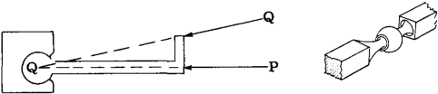
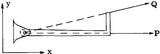
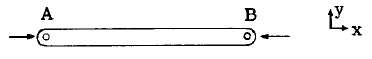
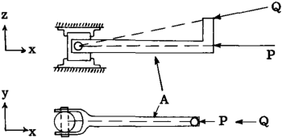
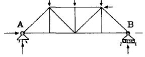
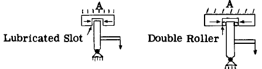
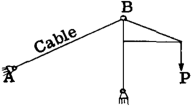

## A2. 3 Structural Fitting Units for Establishing the Force Characteristics of Direction and Point of Application.

空間における力を完全に定義するには6つの方程式が必要であり、力が1つの平面に限定される場合は3つの方程式で済む。一般に構造物は既知の力によって荷重を受け、これらの力は内部応力分布という何らかの方法で構造物を通じて伝達され、その後他の外力によって反力を生じさせる。この反力は、構造物上の既知の力を平衡状態に保つものとして一般的に反力と呼ばれる。様々な種類の力系に対して利用可能な静的平衡方程式は限られているため、構造技術者は未知の力の方向や作用点、あるいはその両方を確立する「フィッティング単位」の使用に頼る。これにより決定すべき未知数の数を減らすことができる。以下の図は、方向と作用点の力特性を確立するために用いられるフィッティング単位の種類やその他の一般的な方法を示している。

### Ball and Socket Fitting

棒に作用するPやQのような空間力または共線力を
考慮する場合、棒の回転が妨げられるならば、
それらの力の作用線は必ず球の中心を通らねばならない。
したがって、この種の継手を通じて構造物に作用する
力の方向と作用線を確立または制御するために、
球面関節が用いられる。この関節には回転抵抗がないため、
いかなる平面においても
力モーメントを作用させることはできない。

### Single Pin Fitting

xy平面内で作用するPやQのような任意の力について、
その力の作用線は必ずピン中心を通らなければならない。
なぜなら、この嵌合ユニットはピン中心を通るz軸周りのモーメントに
抵抗できないからである。したがって、xy平面内で作用する力については、図に示すようにピン接合によってその作用方向と作用線が決定される。一方、単一のピン接合はピン軸に垂直な軸周りのモーメントに抵抗できるため、平面外力の作用方向と作用線は単一のピン接合ユニットによって決定されない。

棒ABの両端に単一のピン継手がある場合、
端Bに作用するxy平面上の任意の力Pは、
その作用方向と作用線が端継手AとBのピン中心を結ぶ直線と一致しなければならない。
なぜなら、これらの継手はz軸周りのモーメントに抵抗できないからである。

### Double Pin - Universal Joint Fittings

単一ピン接合ユニットはピン軸に垂直な軸周りのモーメントに抵抗できるため、図示のような二重ピン接合が頻繁に用いられる。この接合ユニットはy軸またはz軸周りのモーメントには抵抗できず、したがってPやQのような作用力は、図に示すように接合ユニットの中心を通る作用線と方向を持つ必要がある。ただし、この嵌合ユニットはx軸周りのモーメント、すなわちユニバーサルタイプの嵌合ユニットはねじりモーメントに抵抗できる。

### Rollers

構造物が支持点で移動できるようにするため、ローラーの概念を用いた継手ユニットがよく用いられる。例えば、
上図のトラスは端点(A)でピン継手により支持され、
さらにこの継手部はトラスの端点(A)における水平方向の移動を
一切防止する。しかし、
反対側の端点(B)はローラーの組込み構造で支持されており、
トラスの端点(B)における水平方向の移動に対して
水平方向の抵抗力を一切与えない。
ローラーは反力点(B)の方向をローラーベッドに対して垂直に固定する。
固定ユニットがトラス接合部にピンで接続されているため、反力の作用点も既知である。したがってローラーピン式固定では、未知の力特性は大きさのみとなる。一方、(A)の固定ユニットでは、ピンによりトラスへの反力の作用点は既知だが、方向と大きさは未知である。

### Lubricated Slot or Double Roller Type of Fitting

力や反力の方向を定めるために用いられる
もう一つの一般的な嵌合方式が
第1列の下段の図に示されている。
接合部(A)における反力は
(A)の支持部が垂直抵抗を与えないよう設計されているため
水平方向でなければならない。

### Cables - Tie Rods

ケーブルやタイロッドは曲げ抵抗が無視できるため、
クレーン構造上の接合部Bにおけるケーブルからの反力は、
ケーブル軸と同一線上に位置しなければならない。
したがってケーブルは、トラス上の点Bにおける反力の
作用方向と作用点の力学的特性を決定する。
