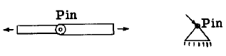
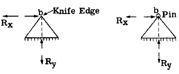
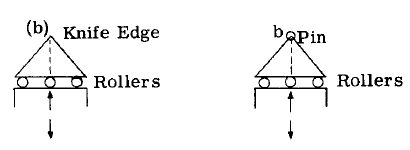
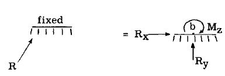

## A2.4 Symbols for Reacting Fitting Units as Used in Problem Solution.

反応構造の解析において、部材応力などを求める際には、未知の力特性が何かを把握する必要があり、最終設計で使用される、または使用が想定される支持・取付ユニットを示すために、単純な記号を用いるのが一般的である。同一平面上の力系に対しては、以下の概略記号が一般的に用いられる。

部材端部または三角形上に配置された小円は単一ピン接続を表し、このユニットと接続部材・構造体間で作用する力の作用点を固定する。

上記の図形記号は、取り付け点(b)の並進運動は阻止されるが、(b)を中心とする取り付け構造の回転は可能な反力を表す。したがって反力の方向と大きさは未知であるが、作用点は既知である。すなわち点(b)を通る。方向を未知数とする代わりに、図示のように結果反力を互いに直交する二つの分力に置き換える方がより便利である。

上記のローラーを用いた取付ユニットは、取付ユニットが点(b)を通る水平力に抵抗できないため、反力の方向をローラーベッドの法線方向として固定する。したがって反力の方向と作用点は確定し、未知なのは大きさのみとなる。

上記の図形記号は、接続構造体に剛体に固定された剛性支持体を表すために用いられる。反力は、3つの力特性（すなわち、大きさ、方向、作用点）がすべて未知であるため、完全に不明である。反力Rを、ある点(b)を基準とする2つの力成分と、結果として生じる反力Rが点(b)に対して引き起こす未知のモーメントM（上記のスケッチで示されている）に置き換えることが便利である。この議論は、すべての力が同一平面内にある共面構造に適用される。空間構造の場合、反力にはさらに3つの未知数、すなわち $R_z$ 、 $M_x$ 、 $M_y$ が生じる。

