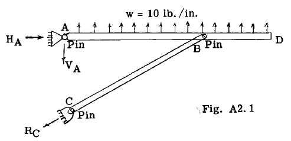
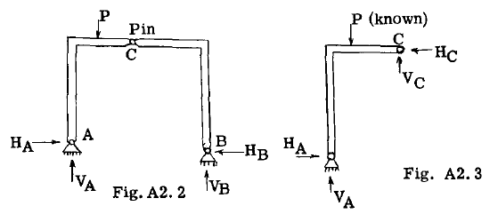
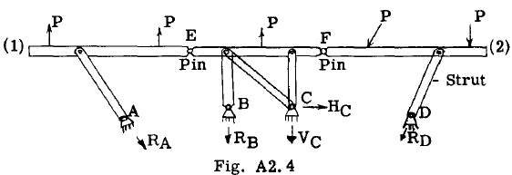
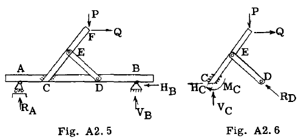
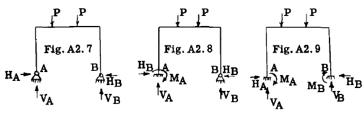
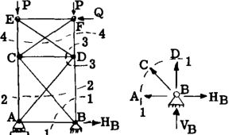

## A2.6 Examples of Statically Determinate and Statically Indeterminate Structures.

構造解析の第一段階は、提示された構造が静的に決定されているかどうかを判断することである。もしそうであれば、部材の寸法や材料の種類を知らなくても反力と内部応力を求めることができる。静的に決定されていない場合、追加の方程式を得るために弾性理論を適用しなければならない。弾性理論については、第A7章から第A12章までで詳細に扱われている。

構造物が静定であるかどうかの判定問題に学生が慣れるよう、いくつかの例題を提示する。

### Example Problem 1.

図A2.1に示す構造において、既知の力または荷重は部材ABD上の1インチあたり10 lb.の分布荷重である。点Aおよび点Cにおける反力は未知である。点Cにおける反力は未知の特性が1つだけである。すなわち、その大きさが未知である。なぜなら、 $R_C$ の作用点は点Cのピン中心を通るものであり、部材CBのB端にピンが存在するため、 $R_C$ の方向は線分CBに平行でなければならないからである。点Aにおける反力は方向と大きさがともに未知であるが、その作用点は点Aのピン中心を通らなければならない。したがって、未知数はA点で未知数が2つ、C点で未知数が1つ、合計3つとなる。同一平面上の力系に対して3つの平衡式が利用可能なため、この構造は静的に決定されている。反作用力の方向を求める際、A点で未知数として角度を用いる代わりに、通常は反作用力を互いに直交する分力（図中の $H_A$ と $V_A$ ）に置き換える方がより便利である。したがって構造体の未知数は3つの大きさに置き換わる。

### Example Problem 2.

図A2.2は既知の荷重系Pを支える構造フレームを示す。反力点AとBのピンにより各反力の作用点は既知であるが、その大きさと方向は未知である。これにより、同一平面上の力系に対して利用可能な平衡式が3つしかないにもかかわらず、未知数は合計4つとなる。一見すると構造は静定度不足と結論づけられそうだが、この構造にはC点に内部ピンが存在することに留意すべきである。このピンは回転抵抗を持たないため、この点における曲げモーメントはゼロとなる。構造全体が平衡状態にあるならば、各部分も同様に平衡状態にあるはずであり、任意の部分を切り取って自由物体として扱い、平衡方程式を適用できる。図A2.3はC点左側のフレームを自由物体として示している。C点を中心とするモーメントを求め、これをゼロと等しくすると、未知数 $H_A$  、 $V_A$ 、 $V_B$ 、 $H_B$  を決定するための4つ目の式が得られる。C点を中心とするモーメント式には未知数 $V_C$ と $H_C$ は含まれない。これらはC点に対するモーメントがゼロであるため（アーム長がゼロであるため）。例題1と同様に、A点とB点の反力は未知数特性として角度（方向）を用いる代わりにH成分とV成分で置き換えられている。この構造は静的に決定されている。

### Example Problem 3.

図A2.4は、既知の荷重系Pを支持する直線部材1-2と、反力点ABCDに取り付けられた5本のストラットで支持される状態を示す。

反力点A、B、Dでは、反力の方向と作用点は既知であるが、各支持点に示されたベクトルが示すように、その大きさは未知である。点Cでは、2本のストラットが接合部Cに入るため反力の方向が不明である。大きさも不明だが、反力はCを通過しなければならないため作用点は既知である。したがって未知数は5つ、すなわち $R_A$  、 $R_B$  、 $R_D$  、 $V_C$  、  $H_C$  となる。同一平面上の力系では3つの平衡式が利用可能であるため、最初の結論として(5-3) = 2次元の静定度を持つ構造体であると推測される。しかし構造体を観察すると点Eと点Fに内部ピンが存在し、これら2点における曲げモーメントはゼロとなるため、平衡式3つに加えてさらに2つの式を利用できる。したがって、ピンEの左側とピンFの右側に構造物の自由物体図を描き、各ピンを中心とするモーメントをゼロと等式化すると、上記の5つの未知数以外の未知数を含まない2つの式が得られ。したがって、この構造は静的に決定可能である。

### Example Problem 4.

図A2.5は、梁ABが上部構造CEDを支持し、そのCEDが既知の荷重PとQを受ける様子を示す。問題は、この構造が静的に決定されているかどうかである。構造全体の外部未知反力は点Aと点Bにある。点Aではローラー作用のため、反力の大きさが唯一の未知特性であり、方向と作用点は既知である。点Bでは、大きさと方向が未知だが作用点は既知であるため、未知数は3つ（ $R_A$ 、 $V_B$ 、 $H_B$ ）となる。3つの平衡式を用いることでこれらの反力を求められ、したがって構造は外部反力に関して静的に決定されている。次に、外部反力を求めた後、内部応力を静力学的に求めてみようと試みる。明らかに内部応力はC点とD点の内部反力の影響を受けるため、図A2.6に示すように上部構造の自由物体図を描き、C点とD点に存在した内部力を外部反力として扱う。実際の構造では、部材は点Cで溶接や複数ボルト接合などにより剛接合されている。これは、力の特性（大きさ、方向、作用点）の全てが未知であることを意味する。つまり、点Cには3つの未知数が存在する。便宜上、これら未知数を図A2.6に示すように3成分で表す。すなわち、 $H_C$ 、 $V_C$ 、 $M_C$  である。図A2.6の接合部Dでは、反力に関する未知数は  $R_D$ のみである。図A2.6に示すように、3つの成分、すなわち  $H_C$  、 $V_C$ 、 $M_C$ で表す。図A2.6の接合部Dでは、部材DEの両端にあるピンが反力 $R_D$ の方向と作用点を決定するため、反力に関する未知数は大きさ $R_D$ のみである。したがって、図A2.6の構造体には4つの未知数があるが、平衡方程式は3つしか存在しない。このため、構造体はすべての内部応力に関して静的に不定である。学生は、点AC、BD、FE間の内部応力は静的に確定していることに注意すべきである。したがって、静的に不定な部分は構造三角形CEDCである。

### Example Problem 5

図A2.7、A2.8、A2.9は、同じ既知の荷重体系Pを受ける同一構造を示しているが、点Aと点Bにおける支持条件が異なる。問題は、各構造が静定でないか否か、また静定でない場合、その程度、すなわちPを支持しているが、点Aと点Bの支持条件が異なる。問題は、各構造が静的に不定であるかどうか、そしてもしそうなら、どの程度、すなわち静力学の方程式に加えて未知数がいくつ存在するかという点である。力が同一平面上にあるため、構造全体としての平衡状態を記述する静力学の方程式は3つしか得られない。

図A2.7の構造体では、A点およびB点における反力の大きさと方向が未知である（作用点は既知）。したがって、4つの未知数（利用可能な静力学方程式は3つ）が存在するため、この構造体は第一種の静定度不十分な構造体となる。図A2.8では、点Aの反力は剛体反力であるため、反力の大きさ・方向・作用点の3特性全てが未知である。点Bではピン支点のため未知数は大きさ・方向の2つであり、静力学の方程式が3つしかない状態で未知数が合計5つとなる。したがって構造は二次的に静定でない。図A2.9の構造では、A点とB点の両支持点が剛体である。したがって、各支持点において力の3特性すべてが未知となり、合計6個の未知数が生じる。これにより構造は三次静定度不確定となる。

### Example Problem 6

図A2.10は、点Aと点Bで支持され、既知の荷重系P、Qを支持する2ベイトラスを示す。トラスのすべての部材は、各接合点で共通のピンによって両端で接続されている。点Aと点Bの反力は、図示のように継手を通して作用する。問題は、この構造が静的に決定されているかどうかである。A点とB点の外部反力に対して、この構造は静定である。なぜなら、この支持方式ではA点で未知数が1つ、B点で未知数が2つ（図A2.10に示す $V_A$ 、 $V_B$ 、 $H_B$ ）しか生じず、静的平衡の方程式が3つ利用可能だからである。

次に、A点とB点の反力値を求めた後、部材内部応力を求められるか検討する。図A2.10の断面1-1で示すように接合部Bを切り取り、図A2.11に示す自由物体図を描く。トラスの部材は両端にピン支点を持つため、これらの部材にかかる荷重は軸方向でなければならない。したがって作用方向と作用線は既知であり、未知なのは大きさのみである。図A2.11では、 $H_B$ と  $V_B$ は既知だが、AB、CB、DBの大きさは未知である。
したがって、3つの未知数に対して、同一平面上の合力系に対する平衡式は2つしかない。図A2.10のトラスを断面2-2で切断し、図A2.12に示すように下部領域の自由物体図を作成すると、4つの未知数（すなわちCA、DA、CB、DBの軸方向荷重）が生じるが、同一平面上の力系に対して利用可能な平衡式は3つしかない。

仮に何らかの方法でCA、DA、CB、DBの応力を求められたとしよう。次に接合点Dを自由体として扱うか、あるいは上部パネルを断面4-4で切断し、下部構造を自由体として扱うことができる。上記と同様の論理から、利用可能な平衡方程式の数よりも未知数が1つ多いことが示され、したがって内部部材応力に関して二次的に静定度不足のトラス構造となる。

物理的には、この構造体は荷重下での安定性に必要な部材数より2本多い。各トラスパネルの対角部材を1本省略しても構造体は安定を保ち、断面サイズや材質を考慮せずとも静的平衡方程式から全部材の軸方向応力を求められる。各パネルに2本目の対角部材を追加すると、部材応力を求める前に全トラス部材の寸法と材質を把握する必要が生じる。追加方程式はトラスの歪みを考慮した解析から導出されるためである。例えば上部パネルの対角部材1本を省略した場合を考えてみよう。この場合、上部パネル部材の応力は静力学的に求まるが、下部パネルは二重斜材システムのため依然として1次元の静定度不足となる。したがって、トラスの歪みを考慮した追加の方程式が1つ必要となる。（静定度不足トラスの解法については第A8章で扱う。）
