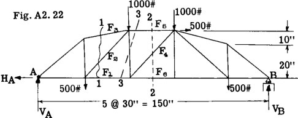
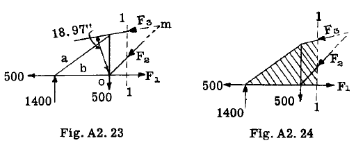
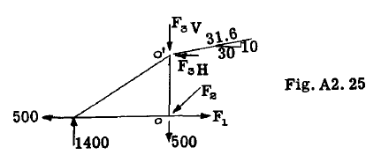
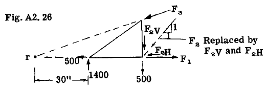

## A2.10 Method of Moments.

同一平面上にある非共線力系に対しては、
3つの静力学方程式が利用可能である。
これら3つの方程式は、3つの異なる点を中心とした
モーメント方程式として扱うことができる。図A2.22は
典型的なトラスを示す。部材 $F_1, F_2, F_3, F_4, F_5 \text{ and } F_6$ にかかる荷重を求めることを要求する。

解法の第一段階は、点Aと点Bにおける反力を求めることである。点Bはローラー支持であるため、点Bの反力において未知の要素は大きさのみである。点Aでは反力の大きさと方向が未知であり、これにより静力学の方程式3つに対して未知数が3つとなる。便宜上、点Aの未知反力は未知の水平成分Hと垂直成分Vに置き換えられている。

点Aを原点とするモーメントを考慮すると、

$$
\begin{align*}
\sum M_A = 500 \times 30 + 1000 \times 60 + 1000 \times 90 + 500\times 30 + 500 \times 120 - 150 V_B = 0 \\
\text{Hence } V_B = 1600 \text{ lb}.\\
\text{Take } \sum V = 0\\
\sum V = V_A - 1000-1000-500-500 + 1600 = 0\\ 
\text{therefore } V_A = 1400 \text{ lb}.\\
\text{Take } \sum H = 0\\
\sum H = 500 - H_A = 0,\\
\text{ therefore } H_A = 500 \text{ lb}.
\end{align*}
$$

すべての未知数の代数的な符号は正となり、
したがって図A2.22に示す想定方向が正しいことが判明した。

結果を $\sum M_B = 0$ を満たすことで確認する

$$
\begin{align*}
\sum M_B = 1400 \times 150 + 500 \times 30 - 500 \times 120 - 500 \times 30 - 1000 \times 90 - 1000 \times 60 = 0 \text{ (Check)}
\end{align*}
$$

部材 $F_1, F_2 \text{ および } F_3$ の応力を求めるため、
トラスに断面 1-1 を切断した（図 A2.22）。
図 A2.23 は、この断面の左側にあるトラス部分の
自由体図を示す。

トラス全体は平衡状態にある。
したがって、どの部分も平衡状態にあるはずである。
図A2.23において、トラス全体に存在していた部材 $F_1, F_2, F_3$ の内部応力は、
現在では、他の荷重や反力と組み合わせて、
断面1-1の左側にあるトラス部分を平衡状態に保つための
外部力として扱われる。図A2.23において部材aとbは切断されていないため、
これらの部材にかかる荷重は内部応力として残り、
図示されたトラス部分の状態に影響を与えない。
したがって、図A2.24に示すように、
セクション1-1の左側にあるトラス部分は
F", F", Faの値に影響を与えずに
剛体ブロックと見なすことができる。モーメント法は、その名が示す通り、
特定の部材における荷重を求めるために
ある点を中心とするモーメントを計算する
操作を含む。未知数が3つあるため、
選択したモーメント中心点において
2つの未知応力のモーメントが
いずれもゼロとなるように
モーメント中心点を選定する必要がある。
これにより、モーメントの式に
入力すべき未知の力または応力は
1つだけとなる。例えば、図A2.24における荷重 $F_3$ を求めるには、力 $F_1$ と $F_2$ の交点、すなわち点Oを中心にモーメントを計算する。

$$
\begin{align*}
\text{Thus } \sum M_O = 1400 \times 30 - 18.97 F_3 = 0\\
\text{Hence } F_3 = 42000/18.97 = 2215 \text{ lb. compression (or acting as assumed)}
\end{align*}
$$

モーメント中心0から力Faの作用半径を求めるには多少の計算を要するため、一般的には未知の力を作用線上の点においてH成分とV成分に分解する方が簡便である。この際、一方の成分がモーメント中心を通るようにし、もう一方の成分の作用半径は通常、視認によって決定できる。

したがって図A2.25において、力 $F_3$ は点O'においてその成分 $F_{3V}$ と $F_{3H}$ に分解される。次に、以前と同様に点Oを中心とするモーメントを計算する：

$$
\begin{align*}
\sum M_O = 1400 \times 30 - 20 F_{3H} = 0\\
\text{whence, } F_{3H} = 2100 \text{ lb. and therefore}\\
F_3 = 2100 (31.6/30) = 2215 \text{ lb. as previously obtained.}
\end{align*}
$$

荷重 $F_1$ は、点 m を中心とするモーメントを計算することで求めることができる。点 m は、力 $F_2$ と $F_3$ の交点である（図 A2.23 参照）。
$$
\begin{align*}
\sum M_m = 1400 \times 60 + 500 \times 30 - 500 \times 30 - 30 F_1 = 0\\
\text{whence, } F_1 = 2800 \text{ lb. (Tension as assumed)}
\end{align*}
$$

モーメント方程式を用いて力 $F_2$ を求めるには、
点 (r) を原点とするモーメントを計算する。点 (r) は力 $F_1$ と $F_3$ の交点である（図 A2.26 参照）。
点(r)から力Feの作用線までの垂直距離の
計算を省略するため、図A2.26に示すように、
点Oにおける作用線上のFeを水平分力Hと
垂直分力Vに分解する。

$$
\begin{align*}
\sum M_r =- 1400 \times 30 + 500 \times 60 + 60 F_{2V} = 0\\
\text{whence, } F_{2V} = 12000/60 = 200 \text{ lb}.\\
\text{Therefore } F_2 = 200 \times \sqrt{2} = 282 \text{ lb. compression}
\end{align*}
$$