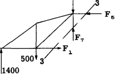
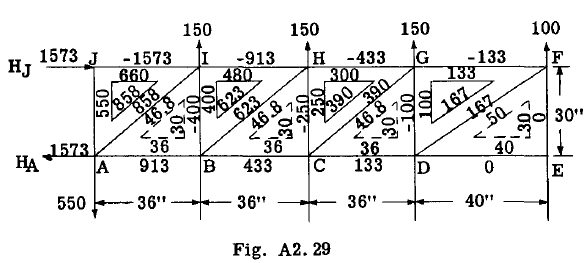
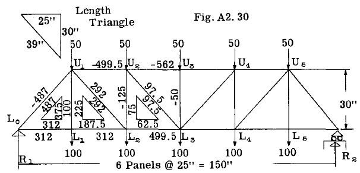

## A2.11 Method of Shears

図A2.22において部材 $F_4$ の応力を求めるため、断面2-2を切断し、図A2.27に示すように左側部分を自由体とする。

モーメント法では部材 $F_4$ を解くのに不十分である。なぜなら他の二つの未知数 $F_5$ と $F_6$ の交点が無限遠にあるためである。したがって、3つの切断部材のうち2つが平行な条件下では、トラスのウェブ部材を解く方法として、一般にせん断法と呼ばれる手法が用いられる。これは、2つの平行な未知の弦部材に垂直なすべての力の和がゼロにならなければならないという条件に基づく。平行な弦部材は、その作用線に垂直な方向には成分を持たないため、上記の平衡式には含まれない。

図A2.27を参照

$$
\begin{align*}
\sum V = 1400 - 500 - 1000 - F_4 (l/\sqrt{2})= 0\\
\text{whence } F_4 = - 141 \text{ lb. (tension or opposite to that assumed in the figure.)}
\end{align*}
$$

部材 $F_7$ の応力を求めるため、図 A2.22 の断面 3-3 を切り取り、左側の部分の自由体図を図 A2.26 に描く。 $F_1$ と $F_5$ は水平であるため、部材 $F_7$ はこの断面 3-3 におけるトラスのせん断力を担わねばならない。したがって、この手法はせん断法と呼ばれる。

$$
\begin{align*}
\sum V = 1400 - 500 - 1000 + F_7 = 0\\
\text{whence } F_7 = 100 \text{ lb. (compression as assumed)}
\end{align*}
$$

注：学生はこの例題を、モーメント法とせん断法を用いて解くべきである。ただし、これらの説明例で使用されている左側部分ではなく、切断面より右側のトラス部分を自由体として扱うこと。トラスの部材応力を最も効率的に求めるためには、通常、上記の三つの方法のうち複数を併用する。各方法には特定のケースや部材に対して利点があるためである。重要なのは、いずれも断面法に基づく手法であり、平行弦トラスなど多くの場合、平衡方程式を記述せずとも応力をほぼ正確に計算できる点である。平行弦トラスには一般的に以下の関係が成立する：

(1) パネル対角部材の応力垂直成分は、パネルに作用する垂直せん断力（パネル片側への外力の代数和）に等しい。これは弦部材が水平であるため垂直成分がゼロとなるためである。

(2) トラスの垂直部材は、一般に、対角部材の垂直成分と、垂直部材の端部接合部に作用する外荷重の合計に抵抗する。

(3) 弦部材にかかる荷重は斜材の水平成分に起因し、一般にこれらの水平成分の合計に等しい。

平行弦トラスの部材応力計算の簡便性を示すため、図A2.29の片持ちトラス（支持反力点AとJ）を考察する。

まず、各パネル内の破線三角形で示す長さ三角形を計算する。各パネル内のその他の三角形は荷重三角形または指標三角形と呼ばれ、その辺の長さは長さ三角形に正比例する。

各パネルのせん断荷重は、まず各指標三角形の垂直辺に記入する。したがって、パネルEFGDでは、パネルを垂直に断面した右側への力を考慮すると、せん断荷重は100ポンドであり、これは指標三角形の垂直辺に記録される。

自由端から2番目のパネルでは、せん断荷重は $100 + 150 = 250$  、3番目のパネルでは
 $100 + 150 + 150 = 400 \text{lb}$ となり、同様に
4番目のパネルでは550となる。

対角線部材および水平部材にかかる荷重は、長さ三角形の対角線と水平辺の長さに正比例する。従って対角線部材 $DF$ の荷重は $100 (50/30) = 167$、部材 $CG$ は $250 (46.8/30) = 390$ となる。 $DF$ の水平荷重成分は $100 (40/30) = 133$、 $CG$ は $250 (36/30) = 300$ である。これらの値は図A2.29に示すように、各トラスパネルの指標三角形上に示されている。トラス部材の荷重解析は、まず接合点Eから開始する。

$$
\text{Using } \sum V = 0 \text{ gives } EF = 0 \text{ by observation,}
$$

これは接合点Eに外部垂直荷重が存在しないためである。同様に、　$\sum H = 0$ についても同様の論理により、　$DE$ の荷重は 0 である。対角線 FD の荷重は、パネルのインデックストライアングルの対角線上の値、すなわち 167 lb に等しい。観察から、これは引張力である。なぜなら、右側のパネルのせん断は上向きであり、対角線 FD の垂直成分は平衡のために下方へ引っ張る必要があるからである。

接合部Fについて。 $\sum H = - FG - FD_H = 0$ これは対角線DFの水平荷重成分がFGの荷重に等しいことを意味し、すなわち指標三角形の水平辺の値、すなわち-133 lbに等しい。DFの水平成分が接合部Fを引っ張るため負の値となり、したがって平衡のためFGは接合部に対して押し返す必要がある。

関節Dを考慮すると：-

$$
\begin{align*}
\sum V = DF_V + DG = 0. \text{ But } DF_V = 100 \text{ (vertical side of index triangle)}\\
\therefore DG = - 100\\
\sum H = DE + DF_H - DC = 0,  \text{ but } DE = 0  \text{ and } DF_H = 133 \text{ (from index triangle)}\\
\therefore DC = 133
\end{align*}
$$

接合部Gを考慮すると：

$\sum H=- GH + GF - GC_H = 0$ 。しかし、第2パネルの指標三角形から $GF =- 133$、　$GC_H= 300$ である。
したがって $GH =- 433 \text{ lb}$ となる。この方法で進めると、図 A2.29 に示すように全部材の応力を求めることができる。全ての平衡式は頭の中で解くことができ、計算はスライド定規で行えば、全部材荷重をトラス図に直接記入できる。

図A2.29の結果を観察すると、トラスの垂直部材にかかる荷重は指標荷重三角形の垂直辺の値に等しく、トラスの対角部材にかかる荷重は指標三角形の対角辺の値に等しい。また一般に、上部および下部の水平トラス部材にかかる荷重は指標三角形の水平辺の値の合計に等しい。

A点とJ点における反力は、上記の一般的な手順が接合点AとJに到達した時点で求まる。作業の検証として、トラス全体を扱って反力を決定すべきである。

図A2.30は、対称荷重を受ける単純支持プラットトラスの部材応力の解法を示す。全てのパネルが同一の幅と高さを持つため、図示のように長さ三角形は1つだけ描かれる。対称性により、パネルの指標三角形はトラス中心線の一側のみに描かれる。まず、各パネルの垂直せん断力は各指標三角形の垂直辺に記入される。トラスと荷重の対称性から、外部荷重の半分が一方のパネルに作用することが分かる。

A点とJ点における反力は、上記の一般的な手順が接合点AおよびJに到達した時点で求まる。作業の確認として、トラス全体を一体として扱って反力を決定すべきである。

図A2.30は、対称荷重を受ける単純支持プラットトラスの部材応力の解法を示す。

すべてのパネルが同一の幅と高さを持つため、図に示すように長さの三角形が1つだけ描かれる。対称性により、パネルの指標三角形はトラス中心線の一側のみに描かれる。すべてのパネルが同じ幅と高さを持つため、図示のように長さの三角形は1つだけ描かれる。対称性により、パネルの指標三角形はトラス中心線の片側のみに描かれる。まず、各パネルの垂直方向せん断力は、各指標三角形の垂直辺に記入される。トラスと荷重の対称性から、接点 $U_3$ と $L_3$ の外部荷重の半分は反力 $R_1$ で、残りの半分は反力 $R_2$ で支持されることがわかる。つまり中央パネルのせん断力 = $(100 + 50) 1/2 = 75$ 。パネル $U_1 U_2 L_1 L_2$ の垂直せん断力は 75 に $U_2$ および $L_2$ の外部荷重を加えた値、すなわち合計 225 となる。同様に端パネルのせん断力 $= 225 + 50 + 100 = 375$ となる。これらの値が分かれば、指標三角形の他の2辺は各パネルの長さ三角形の辺に正比例し、結果は図A2.30の通りとなる。

この時点からの一般的な手順は、対角線部材の荷重を求め、次に垂直部材の荷重を求め、最後に水平弦部材の荷重を求めることである。

対角線部材の荷重は、指標三角形の斜辺上の値に等しい。引張か圧縮かの荷重方向は、トラスを仮想断面で切り取り、対角線の垂直成分によって平衡される外部せん断荷重の方向を確認することで決定される。

垂直部材にかかる荷重は接合点法によって決定され、接合点の順序は、当該接合点における方程式 $\sum V = 0$ において垂直部材の応力のみが未知数となるように選択される。

Thus for joint $U_3, \sum V = - 50 - U_3 L_3 = 0 \text{ or } U_3 L_3 =- 50.$

For joint $U_2, \sum V = - 50 - U_2 L_{3V} - U_2 L_2 = 0, \text{ but } U_2 L_{3V} = 75$, the vertical component of $U_2 L_3$
from index triangle. $\therefore U_2 L_2 = - 50 - 75 = - 125$. For joint $L_1, \sum V = - 100 + L_1 U_1 = 0, \text{ hence } L_1 U_1 = 100$.

水平弦材はトラスの斜材の水平成分による荷重を接合部で受けるため、 $L_O$ から開始しこれらの水平成分を加算することで弦応力を求めてよい。従って、
$L_O L_1 = 312$ （基底三角形より） $L_1 L_2 = 312$（接点 $L_1$ における水平荷重の総和が0となることから）。接点 $U_1$ では、斜材の水平成分は
 $=312 + 187.5 =499.5$ なる。したがって、
$U_1 U_2 = - 499.5$ の荷重が作用する。同様に節点 $L_2$ では、　$L_2 L_3 = 312 + 187.5 = 499.5$。節点 $U_2$ では、水平方向の
$U_1 U_2$ および $U_2 U_3$ の成分は $499.5 + 62.5 = 562$
これは部材 $U_2 U_3$ における -562 で均衡されなければならない。

反力 $R_2$ は、端パネルにおける指標三角形の垂直側辺の値、すなわち 375 に等しい。これはトラス全体を用いて、　$R_2$ を軸としてモーメントを計算することで検証すべきである。

トラスが非対称に荷重を受ける場合、まず反力を決定すべきである。その後、端パネルから順に指標三角形を描画できる。これによりパネルせん断力が容易に計算可能となるためである。