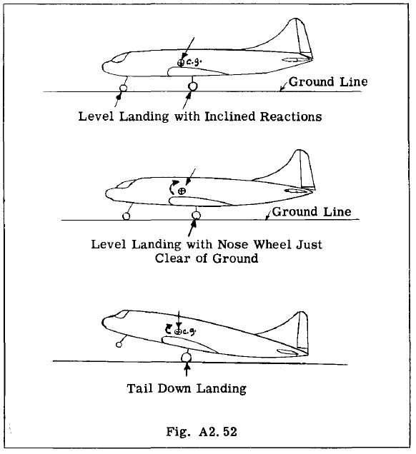
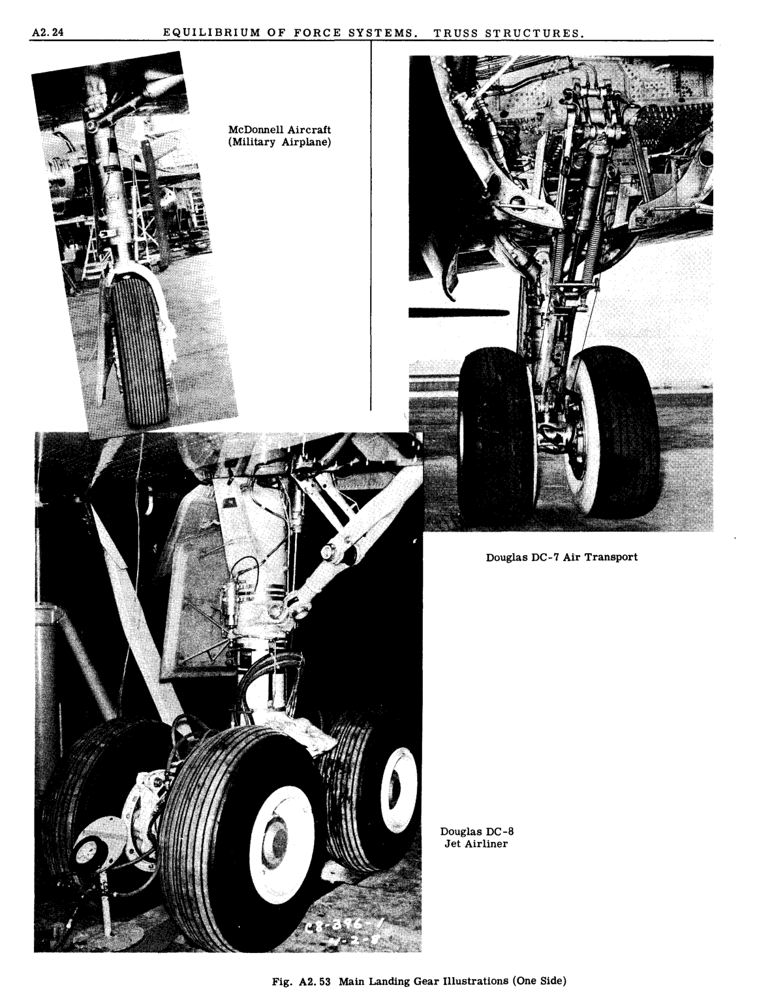
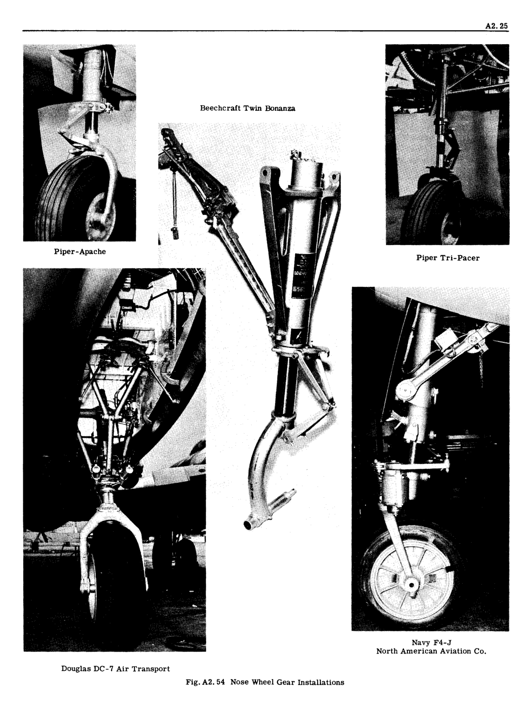

## A2.13 Landing Gear Structure

航空機は陸上および空中を移動する乗り物であるため、地上での操作手段、すなわち車輪とブレーキを備える必要がある。さらに、着陸時や起伏のある地面をタキシングする際に生じる衝撃力を制御する手段も必要となる。この要件を満たすには、タイヤが吸収するエネルギーに加えて、着陸装置に特別なエネルギー吸収ユニットを装備しなければならない。したがって着陸装置には、いわゆるショックストラット（一般にオレオストラットと呼ばれる）が含まれる。これは二つの伸縮式シリンダーで構成される部材である。ストラットが圧縮されると、気密シリンダー内の油がオリフィスを通って一方のシリンダーから他方へ押し出され、着陸衝撃によるエネルギーは、この油をオリフィスに押し通す際に行われる仕事によって吸収される。このオリフィスは、オレオストラットの変位または移動距離全体にわたり実質的に均一な抵抗を提供するよう設計可能である。

航空機は接地瞬間に様々な姿勢であっても安全に着陸できる。図A2.52は、着陸装置の設計において政府航空機関が規定する航空機の3つの姿勢を示している。これらの対称的な無制動荷重に加え、制動状態、片輪着陸状態、車輪への横荷重などの特殊荷重も要求される。言い換えれば、着陸装置は航空機の通常運用で遭遇する様々な着陸条件下において、相当数の異なる荷重を受ける可能性がある。

図A2.53は代表的な主脚ユニットの写真を示し、図A2.54は前輪脚ユニットの写真を示す。

現代航空機の着陸装置の設計成功は、航空機の構造レイアウトと強度設計において遭遇する最も困難な課題の一つである。一般的に、空力効率のためには装置を主翼、ナセル、または胴体内部に格納する必要があり、したがって信頼性が高く安全な格納・降下機構システムが不可欠である。車輪には制動装置が必要であり、前輪は操舵可能でなければならない。着陸装置は比較的大きな荷重にさらされ、その大きさは航空機の総重量の数倍に達する。これらの大きな荷重は支持翼や胴体構造に伝達されなければならない。着陸装置の重量は航空機重量の約6％に達する可能性があるため、高い強度重量比が着陸装置設計の最重要要件であることは明らかである。非効率な構造配置や保守的な応力解析は航空機に多くの不要な重量を追加し、それによって積載量または有用荷重を減少させる可能性がある。

