## A2.15 Problems

(1) 構造物番号1から10について、外部反力および内部応力に関して構造物が静的に決定されているかどうかを判定せよ。

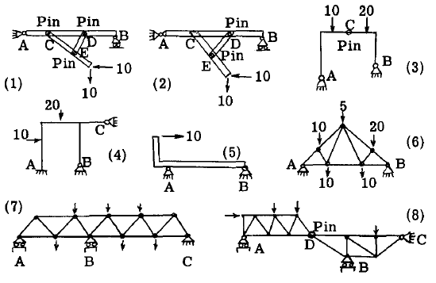

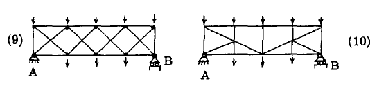

(2) 図11から図15に示す構造物にかかる反力の水平成分と垂直成分を求めよ。
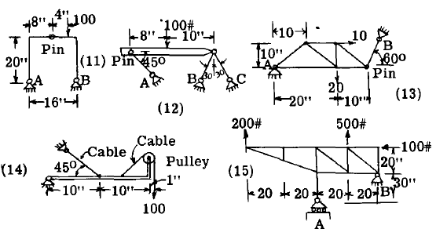

(3) 図16から図18に示すトラス構造の部材における軸方向荷重を求めよ。

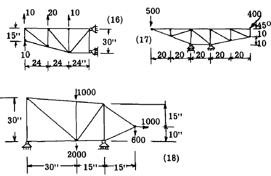

(4) 図19の構造物の部材における軸方向荷重を求めよ。部材はA、B、Cの支持点でピン支承されている。

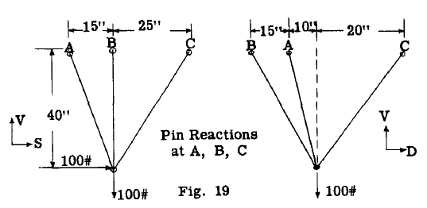

(5) 図20は、エンジンへの組立用にプロペラを吊り上げるための三脚フレームを示す。
フレーム内の荷重を、ホイストに1000ポンドの荷重がかかった場合について求めよ。

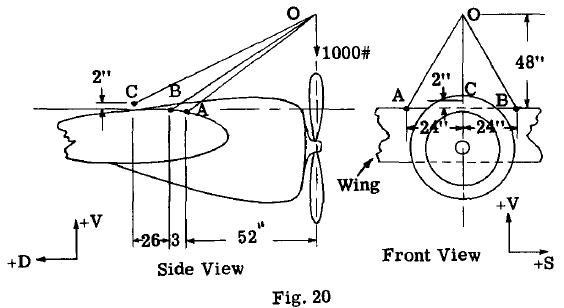

(6) 図21は外部ブレース付き単葉機の翼構造を示す。以下の荷重条件における揚力トラスおよび抗力トラスの全部材の軸方向荷重を求めよ。

前梁揚力荷重 = 30 lb./in. (上向き)
後梁揚力荷重 = 24 lb./in. (上向き)
翼抗力荷重 = 8 lb./in. (後方作用)
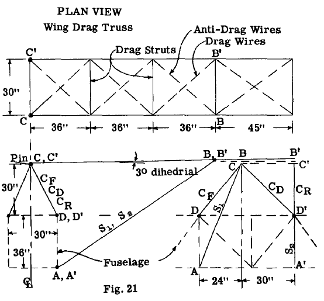

(7) 図22はブレース付き単葉翼を示す。
与えられた空気荷重のもとで、
抗力トラス部材の軸方向荷重を求める。
抗力反力トラスは点Aで支持されている。

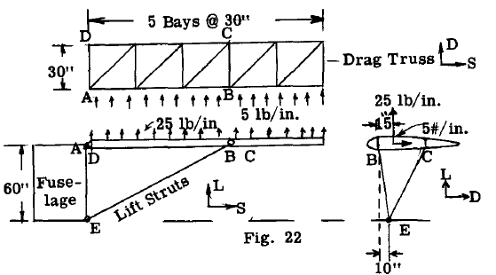

(8) 図23に示す
着陸装置構造における
点Aおよび点Bの支点配置は、
D軸およびV軸周りの
V、D、S反力およびモーメントに
抵抗を提供する。
与えられた車輪荷重において、
点Aおよび点Bの反力ならびに
部材CDにかかる荷重を求めよ。

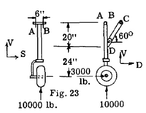

(9) 図24の
着陸装置において、
ブレース部材
BCとBFは
二つの力部材である。
E点における
継手は
V、D、S反力に対して
抵抗力を提供するが、
V軸周りのモーメント抵抗のみを提供する。
与えられた車輪荷重下で、
E点における反力と部材BFおよびBCの荷重を求めよ。

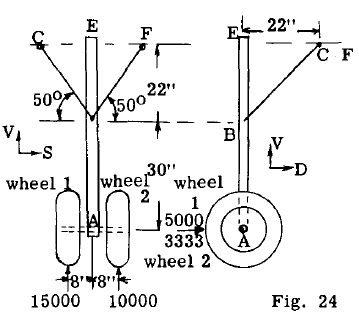

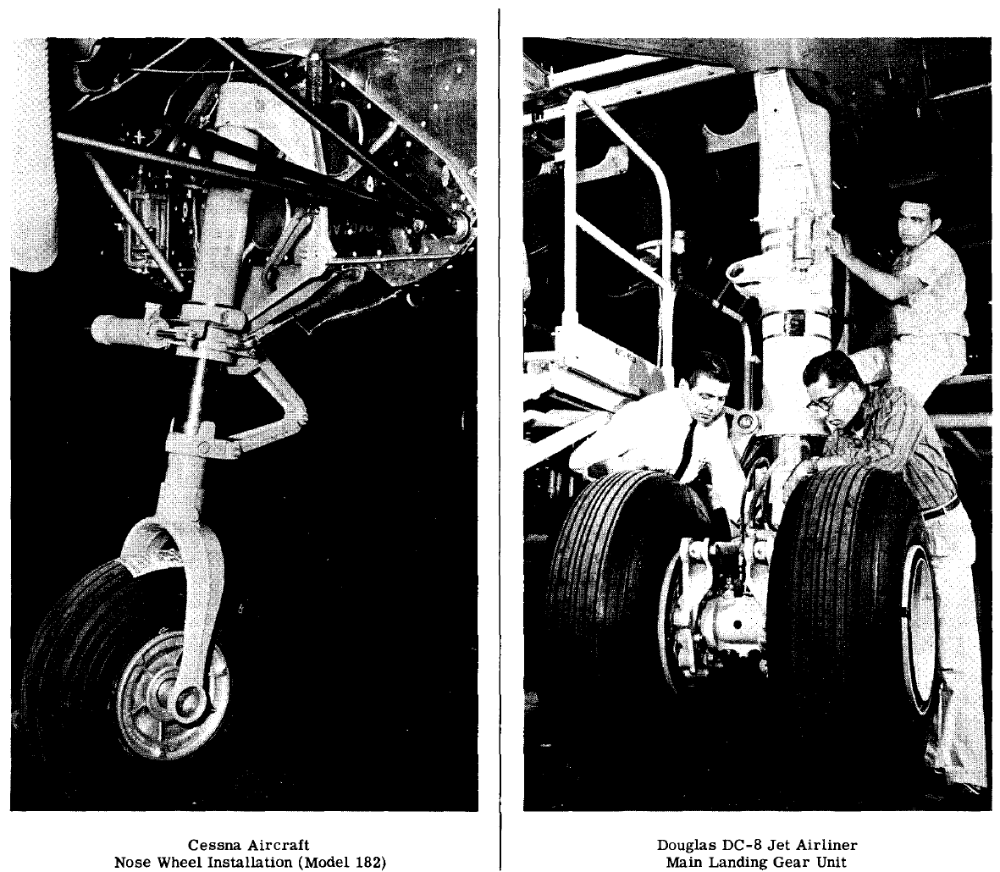