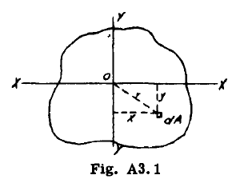

## A3.4 Moaent of Inertia of an Area

ある領域に適用される場合、慣性モーメントという用語は物理的な意味を持たないが、多くの工学的問題や計算に用いられる量を表す。しかし、領域全体に作用する均一に変化する力の総回転モーメントを決定する上で、領域自体の影響を示す因子と見なすことができる。

図A3.1を、3つの座標軸ox、oy、ozに帰属する任意の平面領域とする。ここでoxとoyは領域の平面である。

dAを、図示された座標x、y、rを持つ微小面積と定義する。

すると

$$
I_x =\int y^2 dA, I_y =\int x^2 dA, I_z =\int r^2 dA
$$

ここで $I_x, I_y$ および $I_z$ は、それぞれ軸 xx、yy、zz に対する面積の慣性モーメントである。

