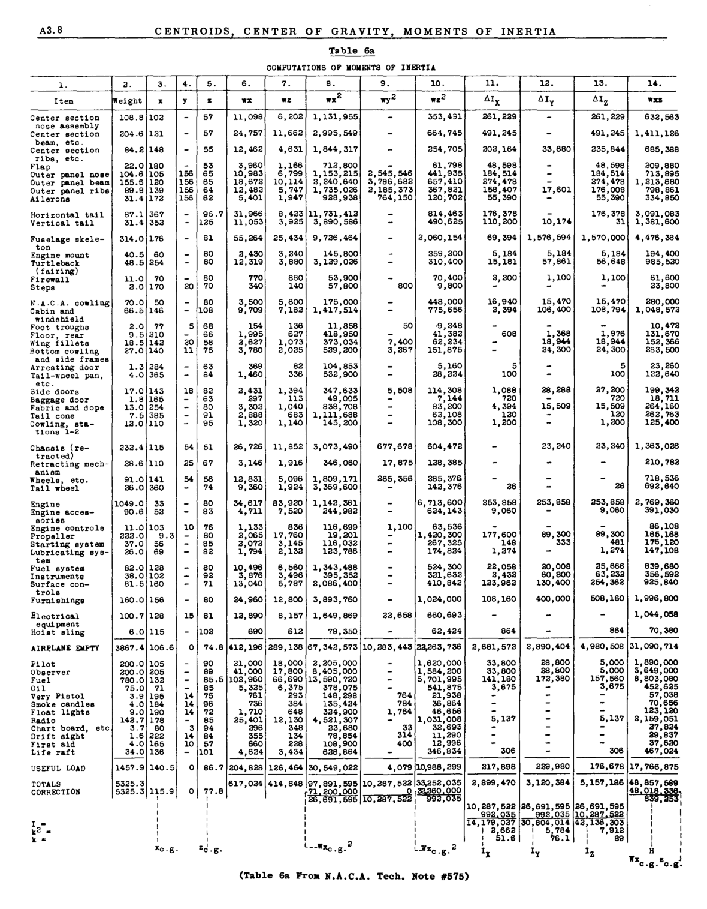

## A3.7 Parallel Axis Theorem

図A3.2において、 $I_y$ を重心軸 $y-y$ に対する面積の慣性モーメントとし、軸 $y_1 y_1$ に対する慣性モーメントを求める。 $y_1 y_1$ は $yy$ 軸と平行である。距離 $x + d$ だけ $y_1 y_1$ から離れた微小面積 $dA$ を考える。

すると、 $I_{y_1} = \int (d + x)^2 dA =  \int x^2 dA + 2d \int x dA + d^2 \int dA$

最初の項 $\int x^2 dA$ は、物体の重心軸 y-y に対する慣性モーメントを表し、記号 $\bar{I}$ で表す。第二項はゼロである。なぜなら、物体の重心軸が yy であるため $\int x dA$ はゼロとなるからである。最後の項、$d^2 \int dA = Ad^2$、すなわち物体の面積に軸yyと $y_1 y_1$ の間の距離の二乗を掛けたものとなる。

したがって一般に、

$$
I = \bar{I} + Ad^2
$$

この式は、ある面積の慣性モーメントが、その面積の平面内の任意の軸に対して、平行な重心軸に対する面積の慣性モーメントに、面積と二つの軸間の距離の二乗の積を加えたものに等しいことを示している。

### Parallel Axis Theorem For Masses. 

体積の代わりに物体の質量を考慮する場合、平行軸定理は次のように記述できる：

$$
I = \bar{I} + Md^2, \text{where M refers to the mass of the body}
$$

## A3.7a Mass Moments of Inertia

粒子の質量と、その粒子が直線または平面から離れている距離の二乗の積は、その直線または平面に対する粒子の質量の慣性モーメントと呼ばれる。したがって、 $I = \sum Mr^2$ となる。

この和が定積分で表せる場合、式は $I = \int r^2 dM$ と書ける。

### Moments of Inertia of Airplanes. 

飛行中および着陸時のいずれにおいても、航空機は角加速度を受ける可能性がある。加速度の大きさと、それに抵抗する質量慣性力の分布および大きさを決定するためには、特定の航空機の応力解析を行う際に、航空機の三座標軸に対する慣性モーメントが一般的に必要となる。
航空機の重心を通る座標軸X、Y、Zに対する質量慣性モーメントは以下のように表される：

$$
\begin{align*}
I_Z \sum wy^2 + \sum wz^2 + \sum \Delta I_x\\
I_y \sum wx^2 + \sum wz^2 + \sum \Delta I_y\\
I_z \sum wx^2 + \sum wy^2 + \sum \Delta I_z\\
\end{align*} 
$$

ここで、 $I_x, I_y$ , および $I_z$ は一般に航空機の横転慣性モーメント、縦転慣性モーメント、およびヨー慣性モーメントと呼ばれる。

w = 航空機内の物品の重量
x, y, z は航空機の重心を通る各軸からの距離および重量 w を表す。各式における最終項は、各物品の自身の X, Y, Z 重心軸に対する慣性モーメントの和である。

wがポンド単位、距離がインチ単位で表される場合、慣性モーメントはポンド・インチ²単位で表され、これをスラグフィート²に変換するには $1/32.16 \times 144$ を乗じる。

### Example Problem 1. 

図A3.3に示す航空機の総重量重心位置を決定せよ。
航空機の重量は10の項目または重量グループに分解されており、
各々の位置は記号「+」で示されている。

#### Solution. 

航空機の重心位置は、二つの直交する軸を基準に決定される。本例では、水平距離の基準軸としてプロペラ中心線を通る垂直軸を、垂直距離の基準軸として推力線をそれぞれ選択する。解くべき一般式は以下の通りである：

$$
\begin{align*}
\bar{x} = \frac{\sum wx}{\sum w} = \text{distance to airplane e.g. from ref. axis Z-Z}\\
\bar{y} = \frac{\sum wy}{\sum w} =  \text{distance to airplane e.g. from ref. axis X-X}\\
\end{align*} 
$$

Table 4 gives the necessary calculations,
whenee

$$
\begin{align*}
\bar{x} = 417180/3150 = 133.3"  \text{aft of CL propeller}\\
\bar{y}= 5480/3150 = -1.74" \text{(below thrust line)}
\end{align*} 
$$

### Example Problem 2. 
図A3.4に示す領域について、水平重心軸に対する慣性モーメントを求めよ。

#### Solution. 

まず水平基準軸に対する慣性モーメントを求める。本解法では、この任意軸を図示の通り底面を通るx'x'軸とした。この慣性モーメントを得れば、重心軸への変換が可能となる。表5は軸x'x'に対する慣性モーメントの詳細計算を示す。簡略化のため断面をA、B、C、D、Eの5部分に分割した。
 $I_{cx}$ は対象部分の重心軸xに対する慣性モーメントである。
軸x『x』から重心水平軸までの距離 $= y = \frac{\sum Av}{\sum A} = \frac{17.97}{6.182} = 2.91"$

By parallel axis theorem, we transfer the
moment of inertia from axis x'x' to centroidal
axis xx.

$$
I_{xx} = I_{x'x'} - A\bar{y}^2= 79.47 - 6.18 \times 2.91^2 = 27.2 \text{ in.}
$$

Radius of Gyration, $P_{xx} = \sqrt{\frac{I_{xx}}{A}} = \sqrt{\frac{27.2}{6.18}} = 2.1"$

### Exampre Problem #3.

Determine the moment of inertia of the stringer cross seotion shown in
Fig. A3.5 about the horizontal centroidal axis.

#### Solution.
A horizontal reference axis x'x' is
assumed as shown. The moment of inertia is
first calculated about this axis and then
transferred to the centroidal axis xx. See
Table 6.

$$
\begin{align*}
\bar{y} = \frac{\sum Av}{\sum A} = \frac{.009}{.1933} = .0465"\\
I_{XX} = I_{X'X'} - A\bar{y}^2 = .05787 - .1933 \times (.0465)^2 = .05745 \text{ in.}\\
\text{Radius of gyration } \rho_{X-X} = \sqrt{\frac{.05745}{.1933}} = .55"\\
\end{align*} 
$$

Detailed explanation of Table 6:-

Portion 1 + 1'

$$
I_{cx} = \frac{1}{12} bd^3 = \frac{.04 \times \bar{.75}^3}{12} \times 2 = .00271 \text{ in.}
$$

Portion 2 (ref. table 1)

$$
y = .375 + \frac{4}{3 \pi} \frac{R^2 + Rr + r^2}{R+r} =  .375 + \frac{4}{3 \pi} \frac{\bar{.5}^2 + .5 \times .54 + .54^2}{.5+.54} = .375 + .331 = .706"
$$

By approx. method see Table 1.

$$
y = .375 + \frac{2}{\pi} r_1 = .375 + \frac{2}{\pi} \times (.52) = .706"
$$

$$
I_{CX} = .1098 \times (R^2 + r^2) t (R + r) - \frac{.283 R^2 + r^2 t}{R+r} = .1098(.2916+ .25) \times .04 \times 1.04- \frac{.283 \times .2916 \times .25 \times .04}{1.04} = .002475- .000793= .001682 \text{ in.}
$$

Approx. 

$$
I_{CX} = .3tr_1^3 = .3 \times .04 \times \bar{.52}^3 = .001688 \text{ in.}
$$

Portion 3 + 3' (ref. Table 1)

$$
y= .375+ \frac{4}{3 \pi} \times \frac{(.0841+ .0725 + .0625)}{.54} = .375 + .172 = .547"
$$

approx. 

$$
y= .375 + 2/\pi r_1 = .375 + .172=547"
$$

$$
I_{CX} = [.1098(.0841+ .0625) + .04 \times .54 - \frac{.283 \times .0841 \times .0625 \times .04}{.54}] = .002375
$$

approx. 

$$
I_{CX} = .3 \times .04 \times \bar{.27}^3 = .002365  \text{ in.}
$$

### Problem #4. 

Determine the moment of inertia of
the flywheel in Fig. A3.5a about axis of rotation.
The material is aluminum alloy casting (weight =
.1 lb. per cu. inch.)

#### Solution: 

The spokes may be treated as slender
round rods and the rim and hub as hollow cylinders. (Refer to Table 2)

##### Rim,

$$
\begin{align*}
\text{weight } W = \pi(R^2 - r^2) \times 3 \times .1 = \pi(5^2-4^2) .3=8.48 \text{ lb.}\\
I = .5W(R^2+r^2)=.5 \times 8.48 (5^2+4^2) =
173.7 \text{ lb. }in.^2
\end{align*} 
$$

##### Hub,

$$
\begin{align*}
W = \pi(1^2 - .5^2) \times  3 \times .1 = .707 \\#\\
I = .5 \times .707 (1^2 + .5^2) = .44 \text{ lb.} in.^2
\end{align*} 
$$

##### Spokes,

$$
\begin{align*}
\text{Length of spoke} = 3"\\
\text{Weight of spoke} = 3 \times \pi \times .25^2 \times .1 = .588 \\#\\
I \text{ of one spoke } = WL^2/12 + W\bar{r}^2 = .588 \times 2.5^2 = 4.10 \text{ lb.} in^2\\
I \text{ for 4 spokes } = 4 \times 4.10 = 16.40
\end{align*} 
$$

Total I of wheel $= 16.40 + .44 + 173.7 = 190.54$
lb. $in^2$

$I = 190.54/32.16 \times 144 = .0411$ slug $ft.^2$

### Example Problem #5. Moment of Inertia of an Airplane.

航空機の慣性モーメントを総重量重心を通る座標軸について計算するには、航空機の重量とその分布の内訳が必要であり、これは航空機の重量・バランス見積もりで入手可能である。表6aは航空機の慣性モーメントの完全な計算を示している。この表はN.A.O.A.技術ノート\\#575「設計データからの航空機慣性モーメント推定」から転載したものである。

#### Explanation of Table

図A3.5bは、選択された基準面と基準軸を示す。これらの軸に対する慣性モーメントを決定した後、平行軸定理を用いて、航空機の重心を通る平行軸の値を求める。

表6aの列(1)は、航空機のユニットまたは項目の内訳を示す。

列(2)は各項目の重量を示す。

列(3)、(4)、(5)は各項目の重心から基準面または基準軸までの距離を示す。

列(6)と(7)はY『軸およびX』軸に対する項目重量の第一モーメントを示す。

列(8)、(9)、(10)には、基準軸に対する項目重量の
慣性モーメントが示されている。

列(11)、(12)、(13)には、各項目が基準軸と平行な
自身の重心軸に対する慣性モーメントが示されている。胴体骨格、主翼パネル、エンジンなどの部品は、
重心軸に対する慣性モーメントの値が比較的大きい。

列(3)と(5)の最後の値は、
基準面から航空機の重心までの距離を示す。

$$
xc.g. = Z-w=x617.024 (col. 6) =115.9 in.
Zw 5325.3 (col. 2)
Zc og. = Zwz= 414.848 (col. 7) = 7708 in.
ZW 5325.3
$$

列(8)、(9)、(10)の最終値は、平行軸定理を用いて以下の通り求めた：

zwx 2 about c.g. of airplane =97,891,595-5325.3
x 115.9 2 = 26,691,5950
Zwz 2= 33,252,035 - 5325 .3 x 77.8 2 = 992, 035

列(11)、(12)、(13)の末尾から3番目の値は、
航空機の重心を通るx、y、z軸に対する
慣性モーメントを示す。これらの値は
以下の方法で得られる：
$$
ly = Zwx 2 + Zwz 2 + Z~Iy = 26,691,595 + 999,035 +
3,120,384 = 30,804,014 lb. in~
Ix = Zwy2 + ZW\32 + Z~Ix =10,287,522 + 992,023 +
2,899,470 = 14,179,027 Ib o in.2
I z = Zwy 2+ Zwz" + Z~Iz =10,287,522 + 26,691,595 +
5,157,186 = 42,136,303 lb. in. 2
$$

主慣性軸を決定するためには、基準軸周りの質量の慣性積が必要である。列(14)は基準軸周りの値を示す。慣性積を航空機の歯車軸に移すには、平行軸定理を用いる。したがって

$$
zwxz c .g. =ZWXZ(Ref. axes) -Zwxz =48,857,5895325.3x1l5.9x77.8=839,253 lb. in. [2]
$$

To reduce all values to slug ft^2 mUltiply

$$
1
x
144

1

32.17

Hence Ix = 3061, Iy = 6680, I z = 9096, I xz = 181
$$

座標重心軸に関する慣性特性を持つため、主軸に対する慣性モーメントは面積について説明した方法と同様に決定される（A3.13 参照）。

The angle $\phi$ between the X and Z axes and the
principal axes is given by,

$$
tan 2 \phi = 2I xz = 2 x 181 =.05998 hence \phi =
Iz - Ix 9096-3061
1 [0] 43"
$$

主慣性モーメントは次の式で与えられる。

$$
Ixp = I:z cos 2 0 + I z sin20 - Ixz sin 2 0. (see
Art. A3.11)
Iyp = Iy
I z = Ix sin2 0 + I z cos2 0 + Ixz sin 2 0
substituting
Ixp = 3061 x (0.9996)2 + 9096 x (0.0300)2 -181x
.0599 = 3056
Izp =3061x (0.0300)2 + 9096 x (0.9996)2 +181x
.0599 = 9102
Iyp = 6680
$$

## A3.7b Problems

(1) 図A3.6に示す梁断面について、水平断面重心軸に対する慣性モーメントを求めよ。

(2) 図A3.7に示す断面について、断面重心Z軸およびX軸に対する慣性モーメントを計算せよ。

(3) 図A3.8に示す断面について、水平重心軸に対する慣性モーメントを求めよ。

(4) 図A3.9の梁断面において、四隅部材のみが有効な材料であると仮定する。垂直軸および水平軸に対する重心慣性モーメントを計算せよ。