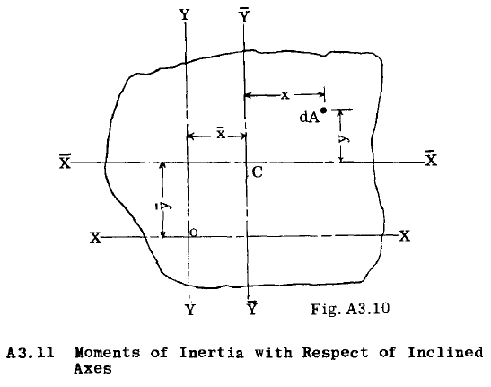

## A3.l0 Parallel Axis Theorem

この定理は、「任意の共面な二つの直交軸に対する面積の慣性積は、平行な重心軸の対に対する面積の慣性積に、与えられた軸の対から全面積の重心までの距離と面積の積を加えたものに等しい」と述べている。あるいは、方程式で表すと、

$$
I_{xy} = \bar{I_{xy}} + A\bar{x}\bar{y}-    - - - - - - - - -(2)
$$

This equation is readily derivable by referring to Fig. A3.10. $\bar{Y}\bar{Y}$ and $\bar{X}\bar{X}$ are centroidal
axes for a given area. YY and XX are parallel
axes passing through point O.

The product of inertia about axes YY and XX
is 

$$
Ixy = _I(x_ + x)(y ~ y) dA
= IxydA + xy _I_ dA + x _I_ y dA + y _I_ xdA
$$

The last two integrals are each equal to
zero, since lydA and IXdA refer to centroidal
axes. Hence, Ixy = IxydA + xy _IdA,_ which can be
written in the form of equation (2).

