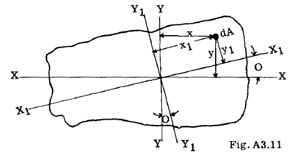

## A3.11 Moments of Inertia with Respect of Inclined Axes

非対称な梁断面は航空機構造において非常に一般的である。なぜなら翼断面形状は一般的に非対称だからである。したがって、このような断面に対する一般的な手順は、まずある直交軸系に対する慣性モーメントを求め、その後他の傾斜軸へ変換することである。図A3.11において、軸 $X_1 X_1$ に対する面積の慣性モーメントは、

$$
Ix _=jy_ 1 "dA= 1 j(ycos0-xsin0)"dA
_=_ _cos"0j_ y"dA+sin"0jx [2] dA-2Sin0 cos 0
_j_ xydA
= Ix cos" 0 + I y sin" 0 - 2 Ixy sin 0 cos 0 (3)
$$

同様に、以下の式を導出できる：

$$
I Y1 =I x sin"0 + Iycos"0 + 2 I XY sin 0 cos
$$

式(3)と式(4)を加算することにより、我々は次の式を得る。

$$
I x1 +
IY1 = Ix + Iy- - - - - - - - - - - - - - - - -(5)
$$

ある領域の慣性モーメントの和は、共通の交点を通るすべての直交軸の組に対して、一定である。

