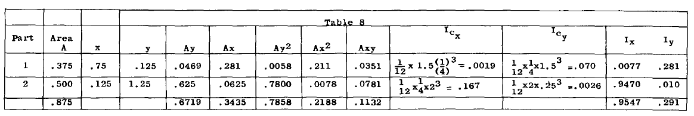
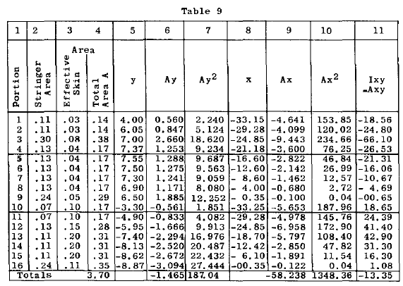

## A3.13 Principal Axes.

非対称曲げ問題においては、面積のモーメントは主軸と呼ばれる特定の軸に対して頻繁に使用される。
面積の主軸とは、その面積の慣性モーメントが、面積の重心を通る他のどの軸よりも大きいか小さい軸である。
慣性積がゼロとなる軸は主軸である。対称軸については慣性積がゼロとなるため、対称軸は主軸であることが導かれる。
一組の直交重心軸と主軸との間の角度は式(6)によって与えられる。

### Example Problem 4.

図A3.12に示す角の慣性モーメントを、重心を通る主軸について求めよ。
s
Solution:
図A3.12に示すように基準軸XとYを設定し、まずこれらの軸に対する慣性モーメントを計算する。表8に計算結果を示す。角は二つの部分(1)と(2)に分割される。

~Icx and Icy = moment of inertia of each portion
about their own X and Y centroidal axes.

Location of centroidal axes;

$$
y = ZAy .6719 = .767"
li .875

x = ZAx .3435 = .392"
ZA .875
$$

Transfer moment of inertia and product of inertia from reference X and Y axes to parallel
centroidal axes;

$$
Ix = Ix    - A~?' = .955 - .875 x .767 2 = .440

Iy = Iy - Ai. 2 = .291 - .875 x .392 2 = .157

I XY = ZA xy - _AY:.y_ = .1132 - .875 x .767 x .392 = - .150
$$

Calculate angle between centroidal X and Y axes
and principal axes through centroidal as follows:-

$$
tan 2 0 = ~ = 2(-.150 = -.30 = 1.06
Iy - Ix .157-.440 -.283
2 0 = 46 [0]      - 40' 0 = 23 [0]      - 20'
$$

Calculate moments of inertia about centroidal
principal axes as follows;

$$
Ixp = Ix cos 2 0 + I y sin 2 0 - 2I xy sin 0 cos 0

2 2
= .44x .918 + .157x .3965 -2(-.150)x
.3965 x .918 =.504 in~

Iyp = Ix sin 2 0 + I y cos 2 0 + 2I xy sin 0 cos 0

= .44x .3965+ .157x .918 2 +2(-.150) x
.3965 x .918= .092 in. [4]
$$

### Example Problem 5.

図A3.13は典型的な分散フランジ-2セル-翼梁断面を示す。上面と下面はZ形鋼とバルブアングルで補強されている。主軸に対する断面の慣性モーメントを求めよ。
Solution;
断面の特性は、抵抗軸応力を発生させ得る有効材料に依存する。有効材料の問題は後述の章で扱う。
表9は、仮定された直交基準軸XXおよびYY（図A3.13参照）に対する慣性モーメントの計算値を示す。断面は列1に列挙された16本のストリンガーに分割されている。上面では、0.032インチ厚のスキン30枚分の幅がストリンガーと作用すると仮定され、0.04インチ厚のスキンでは25枚分の幅が作用すると仮定される（列3参照）。下面では、隣接ストリンガーまでの半分のスキン幅が各ストリンガーと作用すると仮定されるか、またはスキン全体が有効である。第4列は各ストリンガーの有効面積を示し、ストリンガーと有効スキンの重心点に集中しているものとみなされる。すべての距離（xおよびy、第5列および第8列）は、大型図面から縮尺変換されている。

Location of centroidal axes with respect to ref.
axes, 

$$
y = ZAy = - 1.465 = - .396"
li 3.70

x=ZAx=- 58.238 15.74"

ZA 3.70

I x =187.04-3.70x .396 2 =186.5 in. 4

2 4
I y = 1348.36     - 3. 70x 15.74 = .431. 7 in.

I XY = -13.35     - (3.70 x .396 x 15.74) = 36.41in. [4]

tan 2 0 = ~ = 2 (-36.41) = -.29696

Iy-I X 431.7-186.5
20=16 [0] -32.5', 0=8 [0] -16.25'

Ixp=Yx cos 2 0+l y sin 2 0-2 I XY sin0cos0
= 186.46 x .9896 [2] + 431. 7 x .1438 [2] -2
t36.41x .9896x (-.1438)J = 181.2 in. [4]

I yp =Ix sin2 0 + Iy cOS 2 0 + 2 Ixy sin 0
cos 0=186.46 x .143822 + 431. 7 x .9896 2 +
2 -36.41x,9896x(-.1438) =437in. 4
$$

