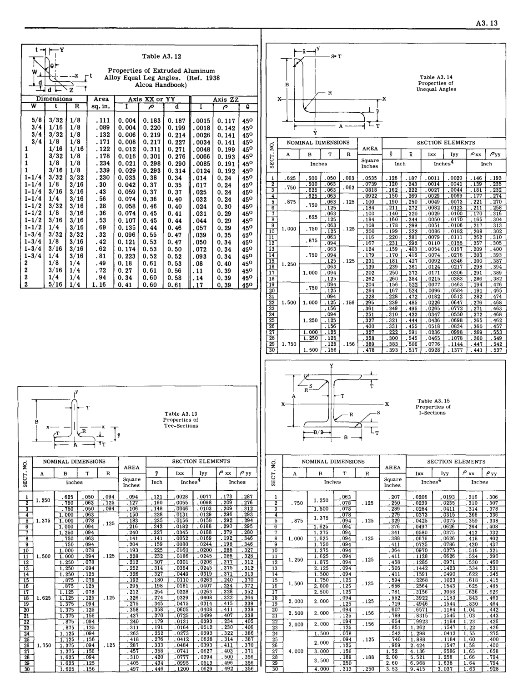
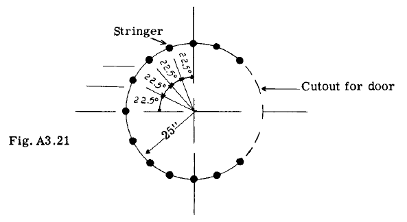

## A3.14 Section Properties of Typical Aircraft Structural Sections.

表A3.10からA3.15および図A3.1は、航空機に共通するいくつかの構造用形状の断面特性を示す。これらの表は、本書の後の章で使用される。

### A3.15 Problems

(1) 図A3.14の断面について、各主軸XpおよびZpに対する慣性モーメントを求めよ。

(2) 図A3.15の断面について、主軸に対する慣性モーメントを計算せよ。

(3) 図A3.16は、6本の縦方向ストリンガーを有する箱形梁断面を示す。以下の仮定のもとで、主軸に対する梁断面の二次モーメントを求めよ：

(a) 梁が上方に曲げられ、上部板が圧縮、下部板が引張を受けると仮定する。したがって、上部板は圧縮応力に対する抵抗が極めて小さいため無視する。下部板は引張を受けるため有効である。簡略化のため、計算では垂直ウェブを無視する。

(b) (a)の条件を反転し、上面を引張、下面を圧縮とする。

(4) 図A3.17に示す3本ストリンガー単室箱形梁断面について、主軸に対する断面二次モーメントを計算せよ。全てのウェブ（壁）材料は効果がないと仮定する。

(5) 図A3.18の梁断面について、4本のストリンガーのみを有効材料と仮定し、主軸に対する慣性モーメントを計算せよ。

(6) 図A3.19は下面に切り欠きを有する翼梁断面を示す。8本のストリンガーのみを有効材料と仮定し、主軸に対する慣性モーメントを求めよ。

(7) 図A3.20は3セル複合フランジ梁を示す。梁上面の7つのフランジ部材は各0.3平方インチ、下面外板のフランジ部材は各0.2平方インチの面積を有する。
下面板の厚さは0.03インチである。
フランジ部材と下面板が有効材料を構成すると仮定し、主軸に対する慣性モーメントを計算せよ。

(8) 図A3.21は小型胴体の断面を示す。破線はドアによる構造の切り欠きを表す。13本のストリンガー各々の面積を0.1平方インチと仮定する。胴体外板は効果がないとみなす。主軸に対する有効断面の慣性モーメントを計算せよ。