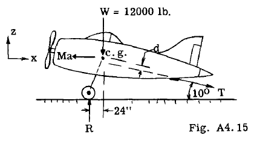
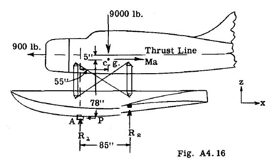
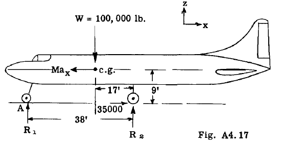
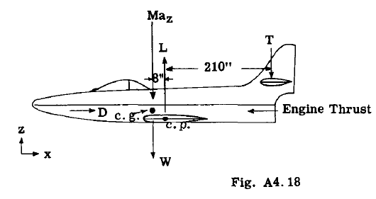
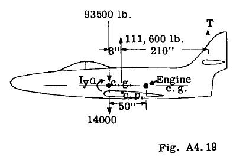
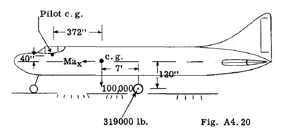

## A4.12 Example Problems Involving Accelerated Motion of Rigid Airplane.

前述の通り、航空機を加速運動状態から静的平衡状態に移行させる一般的な手法は、航空機に加わる外力系に慣性力を加えることである。通常、航空機は剛体であると仮定される。この一般的な手順を説明するため、いくつかの例題を提示する。

### Example Problem 1

図A4.15は、海軍空母に着艦し、航空機制動フックに張られたケーブルの引張力Tによって制動される航空機を示している。
航空機の重量が12,000ポンド（約5.45トン）で、航空機に3.5g（112.7 ft/sec^2）の定加速度が与えられた場合、フック引張力T、車輪反力R、およびフック引張力の作用線と航空機eとの間の距離(d)を求めよ。
(112.7 ft/sec^2)が与えられた場合、フック引張力T、車輪反力R、およびフック引張力の作用線と航空機間の距離(d)を求めよ。
例：着陸速度が60マイル/時（約96.5 km/h）の場合、停止距離はいくらか。

#### Solution: 

航空機が制動ケーブルに接触すると、図A4.15に対して右方向に減速する。この運動は純粋な水平方向の並進運動である。慣性力は

$$
Ma = ~ g a = (12000) 3 5g g' = 42000 lb    
$$

慣性力は加速度の方向と反対に作用する。
したがって図A4.15に示すように左方向となる。
未知の力TとRは、静止平衡の式を用いて
解くことができる。

$$
~FX = -42000 + T cos 10° 0
hence,
T = 42700 lb.
-12000 + R - 42700 x sin 10n
hence, R = 19420 lb.
$$

To find the distance (d) take moments about c.g.
of airplane,

$$
L:Mc.g.
19420 x 24 - 42700 d = 0
hence,
~F~ = 29800 - 9000 + R1 = 0
hence, R1 = _ 20800 lb. (acting down)
L:M 19420 x 24 - 42700 d = 0
c.g.
hence, The velocity at end of catapult
19420 x 24 - 42700 d = 0
d = 10.9 in.
Landing velocity Vo = 60 M.P.H. = 88 ft/sec.
V S                       - 0 = 2 x 96.6 x 35
SUbt: - or
v = 82 ft/sec. = 56 M.P.H.
hence stopping distance s = 34.4 ft.
$$

D

### Example Problem 2

図A4.16に示すように、フロートを装備した航空機が海軍巡洋艦からカタパルトで発射される。カタパルト力Pは航空機に3g（96.6 ft/sec²）の一定水平加速度を与える。航空機の総重量は9000 lb、カタパルト軌道の長さは35 ftである。カタパルト装置からの発射力Pと、カタパルト台車からの反力R1、R2を求めよ。エンジンの推力は900ポンドである。
滑走距離終了時の航空機の速度はいくらか？

#### Solution: 

カタパルト走行開始直後、
車両速度が小さい段階で力を決定する。
この時点では、
航空機翼にかかる揚力と航空機の抗力は
無視できる。

航空機尾部に向かって作用する水平方向の慣性力は、

$$
From statics: -
4Fx =-900 - P + 27000 =0, hence P =26100 lb.
To find Rs take moments about point A,
ZM = 9000 x 55 + 27000 x 78 - 900 x 83 - 85Rs
A = 0
hence, Rs = 29800 lb. (up)
~F~ = 29800 - 9000 + R1 = 0
hence, R1 = _ 20800 lb. (acting down)
$$

カタパルト軌道終端における速度は
以下の式から求めることができる

$$
V^2
VS
- 0 = 2 x 96.6 x 35
SUbt: - or
v = 82 ft/sec. = 56 M.P.H.
$$

### Example Problem 3

図A4.17に示す輸送機が着陸直後であり、後輪に35000ポンドの制動力を加えて停止させていると仮定する。着陸時の水平速度は85マイル/時（125フィート/秒）である。航空機にかかる空気抵抗を無視し、プロペラ力がゼロであると仮定した場合、
接地反力R1と接地反力Rsはそれぞれいくらか？
一定の制動力をかけた場合の着陸走行距離は？

#### Solution: -

航空機は水平方向に減速しているため、航空機の重心を通る慣性力は機体の前方へ向かう。
制動力が与えられているため、平衡方程式を用いて減速係数を解くことができる。

$$
~FX = 35000 - Max = [0]
hence,
Ma = 35000
x
or
W
(-) a = 35000
g x
whence
Ma = (9000) 3.0g 27000 lb. 35000 / s
g ax = (100000) 32.2 = 11.27 ft sec
From statics: 
4F = -900 - P + 27000 = 0, hence P = 26100 lb.
x
To find Rs take moments about point A,
ZM = 9000 x 55 + 27000 x 78 - 900 x 83 - 85R s
A = 0
o - 125 = 2 (-11.27) s
hence,
8 = 695 ft.
To find landing run (s),
- V o [s] = 2 axs
To find R s take moments about point (A)
ZM 100,000 x 21  - 35000 x 9 + 38 Rs 0
A =
Rs = 47000 lb. (2 wheels)
ZF~ = 47000 - 100,000 + R~ = 0
R~ = 53000 lb.
$$

### Example Problem 4

図A4.18の航空機の重量は14,000ポンドである。
水平飛行中の速度は500マイル/時（733フィート/秒）であったが、操縦士が機首を引き上げて曲率半径2500フィートの曲線軌道へ移行させた。エンジン推力と航空機抗力は等しく、互いに反対方向かつ同一直線上にあると仮定する（図A4.18には示されていない）。

求めよ：(a) Z方向における航空機の加速度
(b) 翼抗力(L)と尾部抗力(T)
(c) 航空機の負荷係数

#### Solution: 

$$
s
V [s] 733 2
Acceleration a~   - r - 2500 = 215 ft/sec
or 214.5/32.2 = 6.68g (upward).
The inertia force normal to the flight path
and acting down equals
Ma (14~00) 6.68g = 93520 lb.
z =
$$

この力を例えば翼の空気力学中心（c.p.）を軸として
尾部荷重Tを求めるために、静的平衡を促進する

$$
Airplane Load Factor = AirPl~e Lift
111600 - 4100
**=** **14000** **7.7**
$$

### Example Problem 5

例題4で使用した航空機が、同例題と同様の姿勢にあると仮定する。パイロットが操縦桿を突然前方へ押し込み、航空機に4 rad/sec²のピッチ加速度を与える操縦を行った。

(a) 翼の揚力変化がないと仮定し、慣性力と尾部荷重Tを求める。

(b) 重量1500ポンドのジェットエンジンにかかる力を求めよ。その重心位置は図A4.19に示す通りである。

航空機の慣性モーメントIy（ピッチ方向）は300,000ポンド・秒²・インチと仮定する。

#### Solution: 

図A4.19は、問題4で求めた揚力と慣性力を伴う航空機の自由物体を示す。
角加速度a = 4 rad/secによる追加の慣性力は、

$$
I _a_ = 300000 x 4 = 1,200,000 in. lb.
$$

角加速度の方向に対して時計回りまたは反時計回りに作用する。
飛行機は現在静的平衡状態にあり、尾部荷重Tを求めるには
飛行機重心を中心とするモーメントを求める。
$$
ZM =- (14000 + 93520) 8 + 210 T = 0 ZM = 1,200,000 - 111600 x 8 - 218 T
c.p. C• g•
hence
T = 4100 lb. (down)
To find Wing Lift (L) use
ZF = - 4100 - 14000 - 93520 + L = 0
zL = 111600 lb.
hence,
$$

図A4.19に示すように、エンジンの重心は航空機の重心より58インチ後方に位置する。エンジンにかかる力は、自重1500ポンドと、agおよびaによる慣性力である。

agによる慣性力は、

$$
Mag = (15g00) 7.1g = 10630 lb.
$$

Inertia force due to angular acceleration a
equals,

$$
Mra ~oo ( ) = 32.2 x 12 x 50 x 4 = 776 lb. down
$$

Then the resultant force on the engine equals

$$
1500 + 10630 + 7'76 = 12906 lb. (down)
$$

エンジンが航空機の重心より前方にある場合、
776ポンドの慣性力は下方ではなく上方へ作用する。

角加速度による航空機部品への慣性力を計算する際、
式 F = Mra は当該部品の重心Y軸周りの
慣性モーメントが無視できることを前提とする。大型部品の場合、この重心面における
慣性モーメントは無視できない値となり、
航空機のI値に含めるべきである。

したがって、そのような部品の慣性力を求めるには、
式 F = Mra を以下のように修正する必要がある：

$$
F = (Ic.g. a)/r where
$$

c.g. = 航空機重心に対する物体の慣性モーメント
= 10 + Mr"
（10は物体自身の重心Y軸周りの慣性モーメント）

F = 半径rに垂直な方向の慣性力（単位：Ibs）

### Example Problem 6

図A4.20は総重量100,000ポンドの大型輸送機を示す。
同機のピッチング慣性モーメント
Iy = 40,000,000 lb·sec²·in
航空機は水平着陸中であり、
前輪がわずかに浮いている。後輪にかかる反力は319,000ポンドで、
100,000ポンドの抗力成分と300,000ポンドの垂直成分を与える角度で傾斜している。

求めよ：

(a) 航空機にかかる慣性力
(b) パイロットにかかる合力
（体重180ポンド、位置は図A4.20に示す）

#### Solution: -

この例題では翼の揚力は無視する。
航空機にかかる慣性力は力MaxとMa、およびモーメントIc.g. aである。
Maxを求めるには、

$$
ZFx = 100,000 - Max 0
or
Max 100,000 lb.
hence, 100,000 (100,000) a = g = Ig ~ x M 100,000
To find Mag take,
ZF =300,000 - 100,000 - Ma~ =°
Ma = 200,000 lb.
hence
To find the inertia couple I a, take moments
about airplane c.g., c.g.
I c,g, a = 37,200,000 lb.
t
. - 37,200,000
hence angular accelera,lon a- 40 ,000 ,000
0.93 rad/sec".
$$

Calculations of resultant load on pilot: -

図A4.21は航空機の重心加速度を示す。
操縦士にかかる力は、
操縦士の体重180ポンドと、
図に示す各種慣性力から構成される。

$$
Max = e~O) Ig = 180#
Ma~ = e~o~ 2.0g =360#
$$

角加速度aによる慣性力は、
航空機の重心と操縦席間の半径方向アームに
垂直に作用する。便宜上、この垂直力は
その〜成分とx成分に置き換える。

$$
F
F~ =Mxa =32.2 x 12 x 372 x 0.93 =161 lb.
$$

Total force in x direction on pilot equals

$$
180 - 17 = 163 lb. Fig. A4.21
$$

Total force in ~ direction =

$$
360 + 180 - 161 =379 lb.
$$

Hence Resultant force R, equals

$$
410
$$
