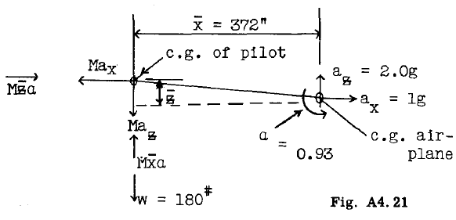
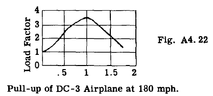
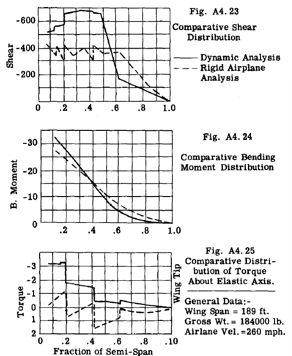

## A4.13 Effect of Airplane Not Being a Rigid Body.

例題A4.12では、航空機が剛体（構造変形を受けない）であると仮定している。この仮定に基づき、飛行中または着陸状態における航空機への外力は、航空機の加速度によって生じる慣性力と平衡状態に置かれる。航空機構造は他の構造物と同様に剛体ではなく、特に片持ち翼は飛行中・着陸状態のいずれにおいてもかなり大きな曲げたわみを受けることは明らかである。図A4.21はボーイングB-47試験翼の合成写真である。
示された最大上下たわみは設計荷重時のもので、
一般に適用荷重の1.5倍となる。
これら2つの高迎え角条件下における適用荷重時の翼たわみが、
写真に示されたたわみの2/3であると言うのは正しくない。
なぜなら設計荷重下では、
翼の相当部分が材料の弾性限界を超えた応力状態、
あるいは塑性領域に入るためである。
条件下における翼のたわみが写真の2/3になると言うのは正しくない。設計荷重下では、翼のかなりの部分が材料の弾性限界を超えて応力を受けるか、あるいは剛性係数が弾性係数よりかなり小さくなる塑性領域に入るため、適用荷重下でのたわみは写真の2/3よりやや小さくなるからである。この写真は、翼構造が
剛体とは程遠いことを
非常に印象的に示している。

静的荷重とは、徐々に作用し構造物に顕著な衝撃や振動を生じさせない荷重である。高速航空機においては、突風、飛行操作、着陸反力が極めて急速に作用するため、これらは動的荷重に分類される。したがって、これらの動的荷重が柔軟な（非剛性の）航空機の片持ち翼に作用すると、かなり大きな翼のたわみが生じ、翼は振動する傾向がある。この振動は翼の質量単位に追加的な加速度を与え、翼にさらなる慣性力を生じさせる。さらに、外部から加わる力の時間変化率が翼の固有曲げ振動数に近づくと、励起された振動が翼に大きな追加応力を発生させる可能性がある。

第二次世界大戦までは、構造設計において実質的に全ての航空機が剛体と仮定されていた。戦争中、航空機の破損は、剛体解析に基づく従来の設計手順では許容範囲または安全な応力と示されていた負荷条件下で発生した。これらの破損は、航空機が剛体ではないため、間違いなく動的過応力に起因するものであった。

さらに、航空機の設計進歩により翼は薄くなり、翼幅は比較的大きくなった。多くの場合、これらの翼には動力装置、爆弾、翼端燃料タンクなどの集中質量が搭載されている。したがって翼の柔軟性が増し、固有曲げ振動数が低下した。
この事実に加え、航空機の速度が大幅に増加したため、
突風荷重がより急速に作用するようになったこと、
あるいは荷重の特性がより動的になっていることから、
翼構造全体にかかる荷重効果は顕著であり、
翼の強度設計において無視することはできない。

### General Dynamic Effect of Air Forces on Wing Loads.

航空機にかかる臨界空気荷重は、
操縦士による操縦操作、あるいは横風突風への遭遇によって生じる。旅客輸送を任務とする輸送機は、
高い航空機加速度を伴う急激な操縦を想定して設計される必要はなく、
従って操縦荷重が作用する時間は、
高速から急上昇する戦闘機タイプに比べて
かなり長くなる。
図A4.22は、ダグラスDC-3航空機が相対速度180マイル/時で実施した急上昇操作の結果を示している。荷重係数と荷重作用時間の関係から、荷重係数3.25のピーク荷重が1秒経過時点で観測されたことがわかる。

著者はDC3の主翼の固有振動数を毎秒10～15サイクルと推定している。したがって、主翼のたわみ半周期に対する負荷時間が1秒であるのに対し、負荷時間は1/10または1/15であることから、動的過負荷は顕著ではないと考えられる。一般的に、輸送機の操縦負荷下における動的過負荷は、突風や着陸時などの他の条件に比べればそれほど大きくないと言える。

### Dynamic Effect of Air Gusts.

突風の速度が高く、
飛行機の速度が高いほど、
突風に遭遇したときに翼に負荷がかかる時間が短くなります。

NACA Technical Note 2424 は、
双発エンジンのマーティン輸送機による
飛行試験の結果を報告しています。
ひずみゲージは翼構造のさまざまな
位置に設置され、
さまざまな突風条件におけるひずみが測定されました。
通常の飛行機の加速度も記録されました。
その後、同様の航空機の通常加速度を得るために、ゆっくりとしたプルアップ操作が実施されました。翼の固有振動数は 3.8 cps、航空機の速度は 250 M.P.H. でした。この報告書で述べられている結論の 2 つは次のとおりです。(1) 突風下における単位正常加速度当たりの曲げひずみは、試験の全測定位置および飛行条件において、緩やかな引き上げ操作時の値より約20％高かった。
(2) 翼曲げひずみの動的成分は、主に基本翼曲げモードの励起に起因すると考えられる。

これらの結果は、突風は民間輸送機タイプにおいて
同じ機体法線加速度を与える操縦負荷よりも
翼に空気荷重をより急速に作用させることを示しており、
したがって突風条件下では翼への動的ひずみ効果が
より顕著になる。

図A4.23、24および25は、ビスプリンホフ*によって決定された、大型翼に対する気流突風の動的効果の結果を示す。これらの図の結果は、動的効果が翼の特定部分では翼荷重を著しく増加させる傾向があり、他の部分では減少させることを示している。

\*航空機構造物の動的荷重下における応力に関する調査報告書。マサチューセッツ工科大学出版物。

また、従来型の着陸装置を介して作用する着陸荷重や
飛行艇における水圧による荷重は、
動的荷重に分類されるほど急速に作用することが判明している。
このような荷重が大スパンの翼に作用すると、
構造物の安全設計において無視できない動的応力が生じる。
