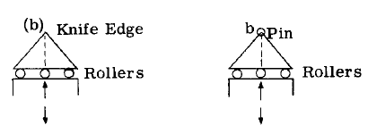
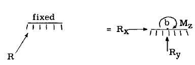

## A2.4 問題解決で使用される反力支持単位の記号

構造物の反力、部材応力などを求める際には、
未知の力特性を把握する必要があり、最終設計において
使用される、または使用が想定される支持・取付単位を
示すために、簡便な記号を用いるのが一般的である。
同一平面上の力系に対しては、以下の概略記号が
広く用いられている。

部材の端部または三角形上に設けられた小さな円は、単一のピン接続を表し、このユニットと接続部材または構造物との間に作用する力の作用点を固定する。

上記の図形記号は、
付着点(b)の並進運動が妨げられるが、
(b)を中心とする付着構造の回転は可能な
反力を表す。
したがって反作用力は方向と大きさが未知であるが、作用点は既知である。すなわち点(b)を通る。方向を未知数とする代わりに、結果的な反作用力を図示のように互いに直交する二つの成分に置き換える方がより便利である。

上記のローラーを用いた取付ユニットは、
取付ユニットが点(b)を通る水平力に抵抗できないため、
反力の方向をローラーベッドの法線方向として固定する。
したがって、反力の作用方向と作用点は確定し、
未知なのは大きさのみである。

上記の図形記号は、
接続構造体に剛体に固定された
剛性支持体を表すために用いられる。反力は、3つの力特性（すなわち、大きさ、方向、作用点）のすべてが未知であるため、完全に不明である。反力Rを、ある点(b)を基準とする2つの力成分と、結果として生じる反力Rが点(b)に対して引き起こす未知のモーメントM（上記のスケッチで示されている）に置き換えることが便利である。この議論は、全ての力が同一平面内にある共面構造に適用される。空間構造の場合、反力にはさらに3つの未知数、すなわち$R_z$、$M_x$、$M_y$が生じる。

